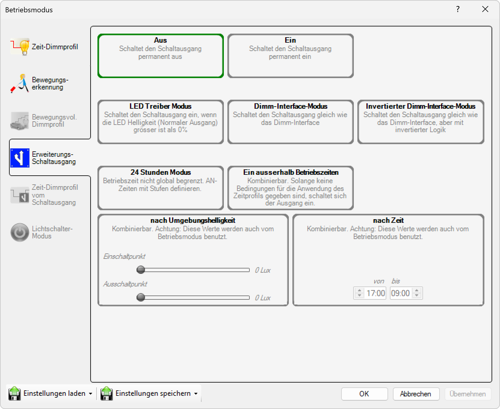

# Erweiterungs-Schaltausgang

**Erweiterungs-Schaltausgang**

Konfigurieren Sie zusätzliche Schaltausgänge für erweiterte Steuerungsfunktionen. Diese Funktion ermöglicht es, externe Geräte oder zusätzliche Beleuchtungskomponenten über separate Schaltausgänge zu steuern und dadurch die Funktionalität des Systems zu erweitern.

## Hauptbereiche

### 1. Erweiterungs-Schaltausgang

- Dieser Bereich ist aktuell aktiv, wie durch das hervorgehobene Symbol auf der linken Seite angezeigt
- Wird verwendet, um zusätzliche Schaltausgänge zu konfigurieren

### 2. Ausgangs-Konfiguration

- Der Hauptbereich zeigt die verfügbaren Schaltausgänge und deren Einstellungen an
- Ermöglicht die individuelle Konfiguration jedes Schaltausgangs

## Schaltausgang-Optionen

Für jeden verfügbaren Schaltausgang können Sie verschiedene Betriebsmodi und Parameter konfigurieren:

### Verfügbare Schaltausgänge
- **Ausgang 1**: Primärer Erweiterungsausgang mit vollständigen Konfigurationsoptionen
- **Ausgang 2**: Sekundärer Erweiterungsausgang (falls verfügbar)
- **Ausgang 3**: Tertiärer Erweiterungsausgang (falls verfügbar)
- **Ausgang 4**: Quaternärer Erweiterungsausgang (falls verfügbar)

## Erweiterungs-Schaltausgang-Einstellungen

Für jeden Schaltausgang können Sie folgende Parameter konfigurieren:

### Grundeinstellungen
- **Aktivierung**: Ein- oder Ausschalten des jeweiligen Schaltausgangs
- **Schaltmodus**: Wählen Sie zwischen verschiedenen Schaltmodi (Ein/Aus, Impulse, Dimmen)
- **Ausgangsspannung**: Konfiguration der Ausgangsspannung entsprechend dem angeschlossenen Gerät
- **Maximaler Strom**: Einstellung der maximalen Strombelastung für den Schaltausgang

### Steuerungsoptionen
- **Manuelle Steuerung**: Direkte Bedienung des Schaltausgangs über die Benutzeroberfläche
- **Zeitgesteuerte Aktivierung**: Automatische Schaltung zu bestimmten Zeiten
- **Ereignisbasierte Steuerung**: Schaltung basierend auf Bewegungserkennungen oder anderen Ereignissen
- **Gruppensteuerung**: Koordinierte Steuerung mehrerer Schaltausgänge

### Erweiterte Einstellungen
- **Verzögerungszeit**: Zeitverzögerung beim Ein- oder Ausschalten
- **Impulsdauer**: Länge der Schaltimpulse bei Impulsmodus
- **Rückkopplung**: Statusrückmeldung vom angeschlossenen Gerät
- **Fehlerbehandlung**: Verhalten bei Fehlern oder Ausfällen

## Anwendungsbereiche

### Externe Geräte
- **Zusätzliche Beleuchtung**: Steuerung externer Beleuchtungskomponenten
- **Signalgeräte**: Aktivierung von Warnsignalen oder Hinweisleuchten
- **Sicherheitssysteme**: Integration in Sicherheits- und Alarmsysteme
- **Türsteuerung**: Steuerung von automatischen Türen oder Toren

### Systemintegration
- **Gebäudeautomation**: Integration in übergeordnete Gebäudemanagementsysteme
- **Notstromversorgung**: Umschaltung auf Notstromversorgung bei Bedarf
- **Wartungsanzeigen**: Signalisierung von Wartungsbedarfen oder Systemstatus
- **Datenlogger**: Aktivierung von Datenaufzeichnungsgeräten

## Sicherheitshinweise

- **Elektrische Sicherheit**: Beachten Sie die maximalen Strom- und Spannungswerte
- **Kompatibilität**: Stellen Sie sicher, dass angeschlossene Geräte kompatibel sind
- **Schutzmaßnahmen**: Verwenden Sie entsprechende Sicherungen und Schutzschalter
- **Fachgerechte Installation**: Lassen Sie die Installation von qualifiziertem Fachpersonal durchführen

Diese Konfiguration erweitert die Funktionalität des Beleuchtungssystems erheblich und ermöglicht die Integration zusätzlicher Komponenten für umfassende Steuerungslösungen.

## Seitennavigation

- **Zeit-Dimmprofil**: Zeitbasiertes Dimmprofil (ausgegraut/inaktiv)
- **Bewegungserkennung**: Bewegungserkennungseinstellungen (ausgegraut/inaktiv)
- **Astro Uhr**: Astronomische Uhreneinstellungen (ausgegraut/inaktiv)
- **Bewegungsvoll. Dimmprofil**: Bewegungsgesteuertes Dimmprofil (ausgegraut/inaktiv)
- **Kalender**: Kalenderbasierte Zeitplanung

## Untere Bedienelemente

- **Einstellungen laden**: Einstellungen aus einer Datei oder einem Profil laden
- **Einstellungen speichern**: Aktuelle Einstellungen in einer Datei oder einem Profil speichern
- **OK**: Alle Änderungen bestätigen und anwenden
- **Abbrechen**: Abbrechen und Fenster ohne Speichern der Änderungen schließen
- **Übernehmen**: Änderungen anwenden ohne das Fenster zu schließen