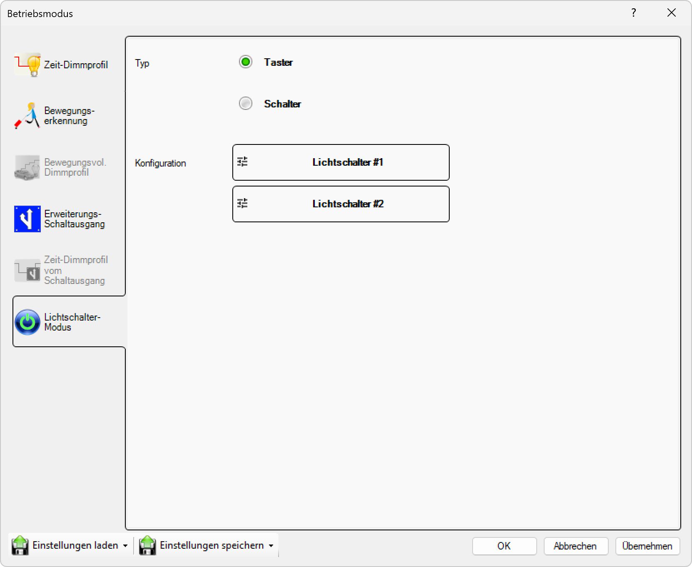

# Lichtschalter-Modus

**Lichtschalter-Modus**

Konfigurieren Sie die Beleuchtung für die Steuerung über externe Lichtschalter. Dieser Modus ermöglicht es, die Leuchten über herkömmliche Wandschalter oder andere externe Schaltelemente zu bedienen und dabei verschiedene Helligkeitsstufen und Schaltverhalten zu definieren.

## Hauptbereiche

### 1. Lichtschalter-Modus

- Dieser Bereich ist aktuell aktiv, wie durch das hervorgehobene Symbol auf der linken Seite angezeigt
- Wird verwendet, um externe Schaltersteuerung zu konfigurieren

### 2. Schalter-Konfiguration

- Der Hauptbereich zeigt die verfügbaren Schaltereinstellungen und deren Parameter an
- Ermöglicht die individuelle Konfiguration des Schalterverhaltens

## Schaltersteuerungs-Optionen

Für die Lichtschaltersteuerung können Sie verschiedene Betriebsmodi und Parameter konfigurieren:

### Verfügbare Schaltermodi
- **Ein/Aus-Modus**: Einfaches Ein- und Ausschalten der Beleuchtung
- **Dimm-Modus**: Helligkeitssteuerung über Schaltersequenzen
- **Szenen-Modus**: Aktivierung vordefinierter Beleuchtungsszenen
- **Sequenz-Modus**: Durchlaufen verschiedener Helligkeitsstufen bei wiederholtem Schalten

## Lichtschalter-Modus-Einstellungen

Für die Schaltersteuerung können Sie folgende Parameter konfigurieren:

### Grundeinstellungen
- **Schaltereingänge**: Konfiguration der verfügbaren Schaltereingänge
- **Schaltverhalten**: Definition des Verhaltens bei Schalterauslösung (Toggle, Impulse, Dauerschalter)
- **Helligkeitsstufen**: Festlegung der verfügbaren Helligkeitswerte (0-100%)
- **Reaktionszeit**: Einstellung der Reaktionsgeschwindigkeit auf Schalterbetätigung

### Erweiterte Einstellungen
- **Entprellzeit**: Filterung von Schalterprellungen und ungewollten Signalen
- **Langzeitverhalten**: Verhalten bei länger gedrücktem Schalter (Dimmen, Szenen)
- **Mehrfachschaltung**: Erkennung und Verarbeitung mehrfacher Schalterbetätigungen
- **Statusanzeige**: Rückmeldung des aktuellen Schaltzustands

### Szenen-Konfiguration
- **Szenen-Definition**: Erstellung und Verwaltung von Beleuchtungsszenen
- **Szenen-Auswahl**: Zuordnung von Szenen zu Schaltersequenzen
- **Szenen-Timing**: Übergangszeiten zwischen verschiedenen Szenen
- **Szenen-Speicherung**: Dauerhafte Speicherung von Szenen-Einstellungen

## Schalterfunktionen

### Einfache Schaltung
- **Ein/Aus**: Grundlegende Ein- und Ausschaltfunktion
- **Toggle-Funktion**: Umschalten zwischen Ein- und Aus-Zustand
- **Impulsfunktion**: Kurze Schaltimpulse für spezielle Anwendungen

### Erweiterte Schaltung
- **Dimm-Funktion**: Helligkeitssteuerung über Schaltersequenzen
- **Szenen-Steuerung**: Aktivierung vordefinierter Beleuchtungsszenen
- **Sequenz-Durchlauf**: Automatisches Durchlaufen verschiedener Helligkeitsstufen

### Timing-Funktionen
- **Verzögerung**: Zeitverzögerung bei Schalterbetätigung
- **Automatische Abschaltung**: Zeitgesteuerte Abschaltung nach Aktivierung
- **Nachlaufzeit**: Einstellbare Nachlaufzeit vor Abschaltung

## Anwendungsbereiche

### Innenbeleuchtung
- **Wohnräume**: Komfortable Beleuchtungssteuerung über Wandschalter
- **Büros**: Arbeitsplatzbeleuchtung mit verschiedenen Helligkeitsstufen
- **Flure**: Einfache Ein/Aus-Steuerung für Durchgangsbereiche
- **Treppenhäuser**: Sicherheitsbeleuchtung mit Zeitsteuerung

### Außenbeleuchtung
- **Eingangsbereiche**: Begrüßungsbeleuchtung mit Schaltersteuerung
- **Terrassen**: Stimmungsbeleuchtung mit Szenen-Funktion
- **Gartenbereiche**: Wegbeleuchtung mit manueller Steuerung
- **Sicherheitsbeleuchtung**: Notbeleuchtung mit Schalteraktivierung

### Spezialanwendungen
- **Notbeleuchtung**: Manuelle Aktivierung in Notsituationen
- **Wartungsmodus**: Vollhelligkeit für Wartungsarbeiten
- **Präsentationsmodus**: Angepasste Beleuchtung für Präsentationen
- **Reinigungsmodus**: Optimale Beleuchtung für Reinigungsarbeiten

## Kompatibilität

- **Standard-Schalter**: Kompatibel mit herkömmlichen Wandschaltern
- **Taster**: Unterstützung für Tasterschaltungen
- **Dimmer**: Integration mit externen Dimmern
- **Smart-Switches**: Kompatibilität mit intelligenten Schaltersystemen

Diese Konfiguration ermöglicht eine flexible und benutzerfreundliche Beleuchtungssteuerung über externe Schalter und bietet dabei erweiterte Funktionen für verschiedene Anwendungsszenarien.

## Seitennavigation

- **Zeit-Dimmprofil**: Zeitbasiertes Dimmprofil (ausgegraut/inaktiv)
- **Bewegungserkennung**: Bewegungserkennungseinstellungen (ausgegraut/inaktiv)
- **Astro Uhr**: Astronomische Uhreneinstellungen (ausgegraut/inaktiv)
- **Bewegungsvoll. Dimmprofil**: Bewegungsgesteuertes Dimmprofil (ausgegraut/inaktiv)
- **Kalender**: Kalenderbasierte Zeitplanung

## Untere Bedienelemente

- **Einstellungen laden**: Einstellungen aus einer Datei oder einem Profil laden
- **Einstellungen speichern**: Aktuelle Einstellungen in einer Datei oder einem Profil speichern
- **OK**: Alle Änderungen bestätigen und anwenden
- **Abbrechen**: Abbrechen und Fenster ohne Speichern der Änderungen schließen
- **Übernehmen**: Änderungen anwenden ohne das Fenster zu schließen