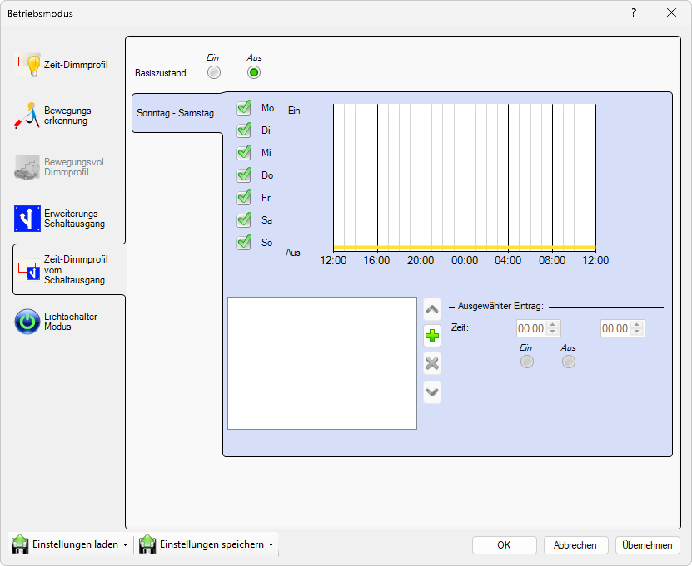

# Zeit-Dimm-Profil-Schaltausgang

**Zeit-Dimm-Profil-Schaltausgang**

Konfigurieren Sie zeitbasierte Dimmprofile für Schaltausgänge. Diese Funktion ermöglicht es, separate Schaltausgänge mit individuellen zeitbasierten Dimmprofilen zu steuern und dadurch eine komplexe und flexible Beleuchtungssteuerung zu realisieren.

## Hauptbereiche

### 1. Zeit-Dimm-Profil-Schaltausgang

- Dieser Bereich ist aktuell aktiv, wie durch das hervorgehobene Symbol auf der linken Seite angezeigt
- Wird verwendet, um zeitbasierte Dimmprofile für Schaltausgänge zu konfigurieren

### 2. Schaltausgang-Konfiguration

- Der Hauptbereich zeigt die verfügbaren Schaltausgänge und deren Dimmprofil-Einstellungen an
- Ermöglicht die individuelle Konfiguration jedes Schaltausgangs mit eigenem Zeitprofil

## Schaltausgang-Optionen

Für jeden verfügbaren Schaltausgang können Sie individuelle Zeit-Dimm-Profile konfigurieren:

### Verfügbare Schaltausgänge
- **Schaltausgang 1**: Primärer Ausgang mit vollständigen Zeit-Dimm-Profil-Optionen
- **Schaltausgang 2**: Sekundärer Ausgang mit individuellen Zeitprofilen
- **Schaltausgang 3**: Tertiärer Ausgang mit separaten Dimmeinstellungen
- **Schaltausgang 4**: Quaternärer Ausgang mit eigenständigen Zeitprofilen

## Zeit-Dimm-Profil-Schaltausgang-Einstellungen

Für jeden Schaltausgang können Sie folgende Parameter konfigurieren:

### Zeitbasierte Steuerung
- **Tagesprofil**: Definition verschiedener Helligkeitsstufen für verschiedene Tageszeiten
- **Wochenprofil**: Separate Profile für unterschiedliche Wochentage
- **Saisonprofil**: Anpassung der Profile an jahreszeitliche Veränderungen
- **Feiertagsprofil**: Spezielle Einstellungen für Feiertage und besondere Tage

### Dimm-Parameter
- **Helligkeitsstufen**: Definition der Helligkeitswerte für verschiedene Zeiträume (0-100%)
- **Übergangszeiten**: Sanfte Übergänge zwischen verschiedenen Helligkeitsstufen
- **Dimmgeschwindigkeit**: Einstellung der Geschwindigkeit für Helligkeitsänderungen
- **Mindesthelligkeit**: Minimale Helligkeitsstufe, die nicht unterschritten wird

### Erweiterte Einstellungen
- **Prioritätsstufen**: Hierarchische Steuerung bei mehreren aktiven Profilen
- **Notfallmodus**: Spezielle Einstellungen für Notfallsituationen
- **Wartungsmodus**: Vollhelligkeit für Wartungs- und Servicearbeiten
- **Energiesparmodus**: Optimierte Einstellungen für maximale Energieeffizienz

## Profil-Funktionen

### Zeitgesteuerte Aktivierung
- **Automatische Schaltung**: Selbstständige Aktivierung basierend auf Zeitprofilen
- **Vorprogrammierte Szenen**: Aktivierung vordefinierter Beleuchtungsszenen zu bestimmten Zeiten
- **Ereignisbasierte Schaltung**: Reaktion auf spezielle Ereignisse oder Termine

### Adaptive Steuerung
- **Helligkeitsanpassung**: Automatische Anpassung der Helligkeit basierend auf Tageszeit
- **Saisonale Anpassung**: Berücksichtigung der sich ändernden Tageslänge
- **Nutzungsoptimierung**: Anpassung der Profile basierend auf Nutzungsmustern

### Synchronisation
- **Multi-Kanal-Synchronisation**: Koordinierte Steuerung mehrerer Schaltausgänge
- **Zentrale Zeitbasis**: Gemeinsame Zeitreferenz für alle Schaltausgänge
- **Phasenverschiebung**: Zeitliche Versetzung zwischen verschiedenen Ausgängen

## Anwendungsbereiche

### Innenbeleuchtung
- **Bürogebäude**: Tageslichtabhängige Arbeitsplatzbeleuchtung
- **Wohnbereiche**: Stimmungsbeleuchtung für verschiedene Tageszeiten
- **Verkaufsflächen**: Präsentationsbeleuchtung mit zeitlichen Variationen
- **Industriehallen**: Arbeitsplatzbeleuchtung mit Schichtbetrieb

### Außenbeleuchtung
- **Straßenbeleuchtung**: Intelligente Steuerung basierend auf Tageszeit und Saison
- **Gebäudeanstrahlung**: Architekturbeleuchtung mit verschiedenen Szenarien
- **Parkplätze**: Sicherheitsbeleuchtung mit zeitlicher Anpassung
- **Gartenbereiche**: Landschaftsbeleuchtung mit stimmungsvollen Profilen

### Spezialanwendungen
- **Museen**: Präsentationsbeleuchtung mit Objektschutz
- **Veranstaltungsräume**: Flexible Beleuchtungsszenarien für verschiedene Events
- **Produktionsstätten**: Arbeitsplatzbeleuchtung entsprechend Schichtplänen
- **Krankenhäuser**: Patientengerechte Beleuchtung mit Tagesrhythmus

## Vorteile

- **Energieeffizienz**: Optimierte Beleuchtung nur bei Bedarf
- **Komfort**: Automatische Anpassung an Tagesabläufe
- **Flexibilität**: Individuelle Profile für verschiedene Anwendungen
- **Wartungsfreundlichkeit**: Zentrale Verwaltung aller Zeitprofile

Diese Konfiguration ermöglicht eine hochentwickelte zeitbasierte Beleuchtungssteuerung mit individuellen Dimmprofilen für jeden Schaltausgang und bietet maximale Flexibilität für komplexe Beleuchtungsanforderungen.

## Seitennavigation

- **Zeit-Dimmprofil**: Zeitbasiertes Dimmprofil (ausgegraut/inaktiv)
- **Bewegungserkennung**: Bewegungserkennungseinstellungen (ausgegraut/inaktiv)
- **Astro Uhr**: Astronomische Uhreneinstellungen (ausgegraut/inaktiv)
- **Bewegungsvoll. Dimmprofil**: Bewegungsgesteuertes Dimmprofil (ausgegraut/inaktiv)
- **Kalender**: Kalenderbasierte Zeitplanung

## Untere Bedienelemente

- **Einstellungen laden**: Einstellungen aus einer Datei oder einem Profil laden
- **Einstellungen speichern**: Aktuelle Einstellungen in einer Datei oder einem Profil speichern
- **OK**: Alle Änderungen bestätigen und anwenden
- **Abbrechen**: Abbrechen und Fenster ohne Speichern der Änderungen schließen
- **Übernehmen**: Änderungen anwenden ohne das Fenster zu schließen