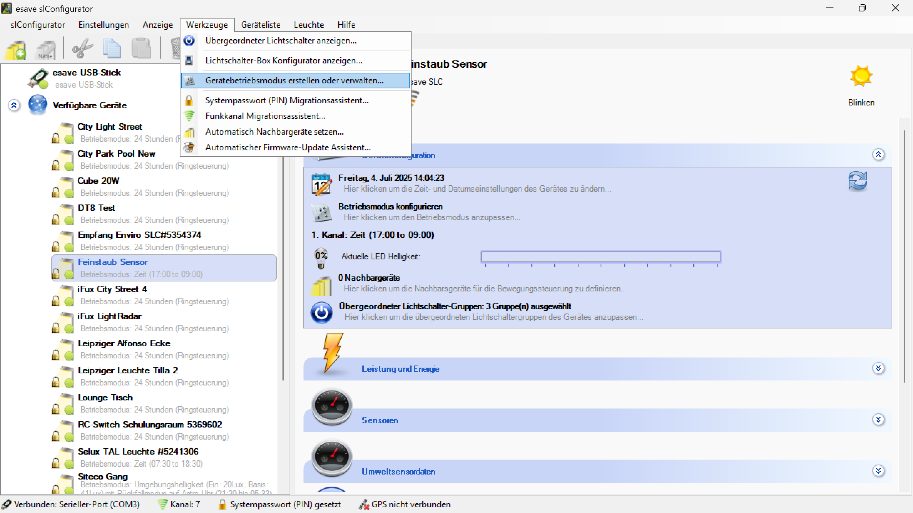

# Betriebsmodus Konfiguration offline erstellen und bearbeiten
  

Über den Menüpunkt Werkzeuge > Gerätebetriebsmodus erstellen oder verwalten… können Betriebsmodus Konfigurationen jederzeit auch ohne aktive Verbindung erstellt und als Datei abgespeichert werden (Offline- Modus).
Dies ermöglicht es, die Betriebsmodus- Konfiguration einzusehen oder neue Betriebsmodus- Konfiguration vorzunehmen, ohne dass sich eine Leuchte aktiv mit dem SL- Configurator verbunden ist.