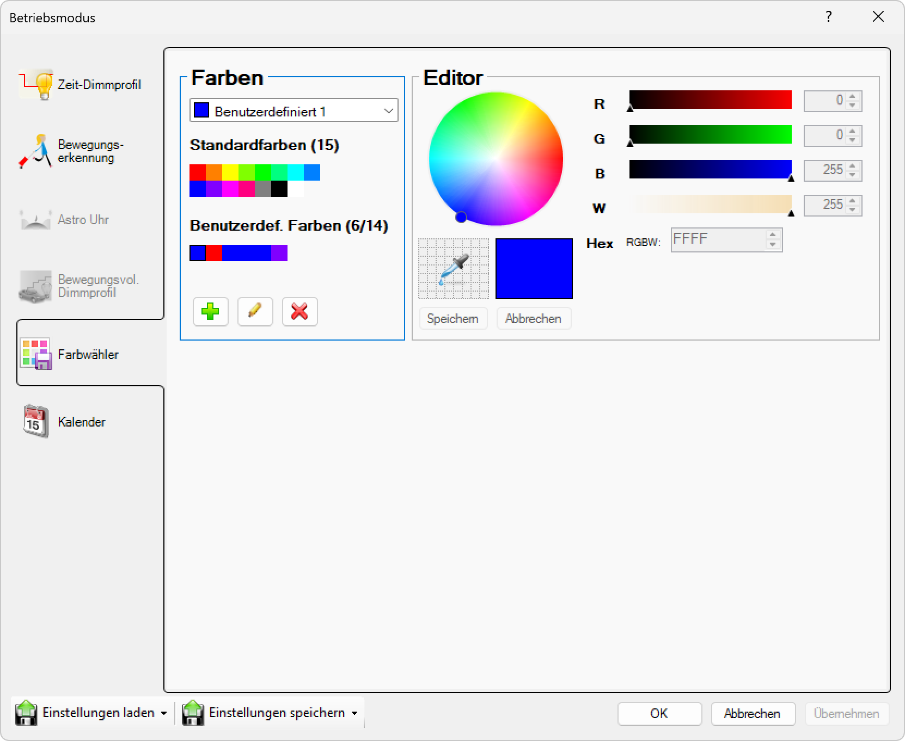

# Farbwähler
 
># ℹ  
>All the Colors.
Main Sections
1. Farben (Colors)
	•	Dropdown Menu: Selects a user-defined color palette (e.g., “Benutzerdefiniert 1”).
	•	Standardfarben (Standard Colors): Displays a set of 15 predefined colors for quick selection.
	•	Benutzerdef. Farben (User-Defined Colors): Shows up to 14 custom colors saved by the user.
Color Management Buttons
	•	Add (+): Adds a new color to the user-defined palette.
	•	Edit (Pencil): Edits the selected user-defined color.
	•	Delete (X): Removes the selected user-defined color.
2. Editor
	•	Color Wheel: Visually select a color by clicking or dragging within the color spectrum.
	•	RGBW Sliders:
	•	R (Red): Adjusts the red component (0-255).
	•	G (Green): Adjusts the green component (0-255).
	•	B (Blue): Adjusts the blue component (0-255).
	•	W (White): Adjusts the white component (0-255), useful for RGBW LEDs or lighting.
	•	Hex Field: Displays or allows entry of the color’s hexadecimal code.
	•	Color Preview: Shows a sample of the currently selected color.
	•	Eyedropper Tool: Allows picking a color from anywhere within the application window.
Editor Action Buttons
	•	Speichern (Save): Saves the current color selection to the user-defined palette.
	•	Abbrechen (Cancel): Cancels the current color editing action.
Side Navigation
	•	Zeit-Dimmprofil: Time-based dimming profile settings.
	•	Bewegungserkennung: Motion detection settings.
	•	Astro Uhr: Astronomical clock settings (currently grayed out/inactive).
	•	Bewegungsvoll. Dimmprofil: Motion-controlled dimming profile (currently grayed out/inactive).
	•	Farbwähler: Color picker section (currently active).
	•	Kalender: Calendar settings.
Bottom Bar
	•	Einstellungen laden: Load settings from a file or profile.
	•	Einstellungen speichern: Save current settings to a file or profile.
	•	OK: Confirm and apply all changes.
	•	Abbrechen: Cancel and close the window without saving changes.
	•	Übernehmen: Apply changes without closing the window (currently inactive).
Summary Table