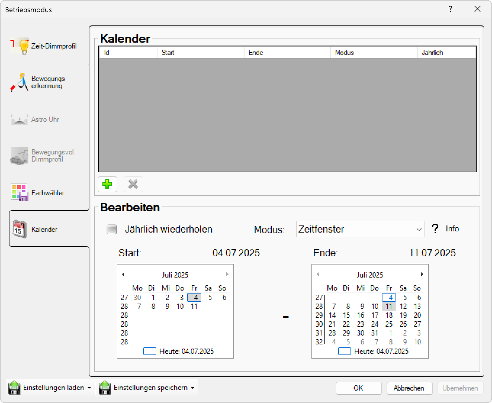

# Kalender

**Kalender**

Konfigurieren Sie kalenderbasierte Beleuchtungssteuerung für ereignisgesteuerte und terminspezifische Beleuchtungsszenarien. Diese Funktion ermöglicht es, die Beleuchtung an bestimmte Termine, Feiertage oder wiederkehrende Ereignisse anzupassen.

## Hauptbereiche

### 1. Kalender

- Dieser Bereich ist aktuell aktiv, wie durch das hervorgehobene Symbol auf der linken Seite angezeigt
- Wird verwendet, um kalenderbasierte Beleuchtungssteuerung zu konfigurieren

### 2. Kalender-Interface

- Der Hauptbereich zeigt die verfügbaren Kalender-Tools und Terminverwaltungsoptionen an
- Ermöglicht die Definition von ereignisbasierten Beleuchtungsszenarien

## Kalender-Optionen

Für die kalenderbasierte Steuerung stehen verschiedene Konfigurations- und Verwaltungsmöglichkeiten zur Verfügung:

### Verfügbare Kalendertypen
- **Terminkalender**: Individuelle Termine mit spezifischen Beleuchtungseinstellungen
- **Feiertagskalender**: Vordefinierte Feiertage mit besonderen Beleuchtungsszenarien
- **Ereigniskalender**: Wiederkehrende Ereignisse mit automatischer Beleuchtungsanpassung
- **Saisonkalender**: Jahreszeitliche Anpassungen der Beleuchtungsprofile

## Kalender-Einstellungen

Für die Kalenderkonfiguration können Sie folgende Parameter definieren:

### Termin-Management
- **Termintypen**: Definition verschiedener Terminarten (Arbeitszeit, Veranstaltung, Wartung)
- **Terminwiederholung**: Einstellung wiederkehrender Termine (täglich, wöchentlich, monatlich, jährlich)
- **Terminpriorität**: Hierarchische Ordnung bei überlappenden Terminen
- **Terminbenachrichtigung**: Automatische Erinnerungen vor wichtigen Terminen

### Beleuchtungsszenarien
- **Terminspezifische Profile**: Individuelle Beleuchtungseinstellungen für verschiedene Termine
- **Übergangszeiten**: Sanfte Übergänge zwischen verschiedenen Beleuchtungsszenarien
- **Notfallmodus**: Spezielle Beleuchtung für Notfälle und Sicherheitssituationen
- **Wartungsmodus**: Optimierte Beleuchtung für Wartungs- und Servicearbeiten

### Automatisierung
- **Vorzeitiger Start**: Beleuchtung beginnt vor dem eigentlichen Termin
- **Nachlaufzeit**: Beleuchtung bleibt nach Terminende noch aktiv
- **Pufferzeit**: Zeitpuffer zwischen verschiedenen Terminen
- **Konfliktauflösung**: Automatische Behandlung überlappender Termine

## Kalender-Funktionen

### Grundlegende Terminsteuerung
- **Einzeltermine**: Einmalige Termine mit spezifischen Beleuchtungseinstellungen
- **Terminserien**: Wiederkehrende Termine mit konsistenter Beleuchtung
- **Ganztägige Termine**: Beleuchtungsprofile für ganztägige Ereignisse
- **Termingruppen**: Zusammengehörige Termine mit koordinierter Beleuchtung

### Erweiterte Funktionen
- **Wetterintegration**: Anpassung der Beleuchtung basierend auf Wetterbedingungen
- **Occupancy-Erkennung**: Beleuchtungsanpassung basierend auf Anwesenheit
- **Energieoptimierung**: Automatische Energiesparfunktionen bei ungenutzten Zeiten
- **Fernsteuerung**: Manuelle Übersteuerung der Kalendereinstellungen

### Import/Export-Funktionen
- **Kalender-Import**: Laden von Kalenderdaten aus externen Quellen
- **Kalender-Export**: Speichern von Kalendereinstellungen für Backup oder Transfer
- **Synchronisation**: Abgleich mit externen Kalendersystemen
- **Vorlagen**: Verwendung vorgefertigter Kalendervorlagen

## Anwendungsbereiche

### Büro- und Geschäftsgebäude
- **Arbeitszeiten**: Automatische Beleuchtung entsprechend der Bürozeiten
- **Besprechungsräume**: Terminspezifische Beleuchtung für Meetings
- **Präsentationsräume**: Angepasste Beleuchtung für Präsentationen
- **Pausenbereiche**: Entspannungsbeleuchtung außerhalb der Arbeitszeiten

### Bildungseinrichtungen
- **Stundenplan**: Beleuchtungsanpassung nach Unterrichtszeiten
- **Prüfungszeiten**: Optimale Beleuchtung für Prüfungen
- **Veranstaltungen**: Spezielle Beleuchtung für Schulveranstaltungen
- **Ferienzeiten**: Reduzierte Beleuchtung während der Ferien

### Einzelhandel und Gastgewerbe
- **Öffnungszeiten**: Beleuchtung entsprechend der Geschäftszeiten
- **Sonderveranstaltungen**: Besondere Beleuchtung für Events und Aktionen
- **Saisonale Anpassung**: Beleuchtung passend zu Jahreszeiten und Feiertagen
- **Werbeaktionen**: Aufmerksamkeitsstarke Beleuchtung für Marketingkampagnen

### Veranstaltungsstätten
- **Event-Kalender**: Terminspezifische Beleuchtungsszenarien für Veranstaltungen
- **Aufbau-/Abbauzeiten**: Arbeitsbeleuchtung für Vorbereitung und Nachbereitung
- **Künstlergarderobe**: Spezielle Beleuchtung für Künstlerbereiche
- **Publikumsbereiche**: Sicherheitsbeleuchtung für Besucherbereiche

### Industrielle Anwendungen
- **Schichtbetrieb**: Beleuchtungsanpassung nach Schichtplänen
- **Wartungstermine**: Optimierte Beleuchtung für Wartungsarbeiten
- **Produktionszeiten**: Arbeitsplatzbeleuchtung entsprechend der Produktionsplanung
- **Sicherheitsinspektionen**: Spezielle Beleuchtung für Sicherheitsrundgänge

## Feiertags- und Ereignissteuerung

### Feiertage
- **Nationale Feiertage**: Automatische Anpassung für gesetzliche Feiertage
- **Regionale Feiertage**: Berücksichtigung regionaler Besonderheiten
- **Religiöse Feiertage**: Spezielle Beleuchtung für religiöse Anlässe
- **Betriebsfeiertage**: Individuelle Firmenfeiertage und Betriebsferien

### Besondere Ereignisse
- **Firmenveranstaltungen**: Beleuchtung für Firmenevents und Jubiläen
- **Messen und Ausstellungen**: Präsentationsbeleuchtung für Veranstaltungen
- **Konferenzen**: Professionelle Beleuchtung für Geschäftstermine
- **Sicherheitsereignisse**: Notfallbeleuchtung für Sicherheitssituationen

## Vorteile der Kalendersteuerung

### Automatisierung
- **Termingerechte Beleuchtung**: Automatische Aktivierung zu geplanten Zeiten
- **Konsistente Szenarien**: Zuverlässige Beleuchtung für wiederkehrende Termine
- **Reduzierter Aufwand**: Minimaler manueller Eingriff erforderlich
- **Planbare Kosten**: Vorhersagbare Energiekosten durch geplante Beleuchtung

### Effizienz
- **Energieoptimierung**: Beleuchtung nur bei tatsächlichem Bedarf
- **Ressourcenschonung**: Verlängerte Lebensdauer durch bedarfsgerechte Nutzung
- **Kostenreduzierung**: Niedrigere Betriebskosten durch optimierte Steuerung
- **Wartungsplanung**: Koordinierte Wartung mit Terminkalender

Diese Kalender-Funktion bietet eine professionelle terminbasierte Beleuchtungssteuerung für komplexe Anforderungen und ermöglicht eine effiziente und automatisierte Verwaltung verschiedener Beleuchtungsszenarien.

## Seitennavigation

- **Zeit-Dimmprofil**: Zeitbasiertes Dimmprofil (ausgegraut/inaktiv)
- **Bewegungserkennung**: Bewegungserkennungseinstellungen (ausgegraut/inaktiv)
- **Astro Uhr**: Astronomische Uhreneinstellungen (ausgegraut/inaktiv)
- **Bewegungsvoll. Dimmprofil**: Bewegungsgesteuertes Dimmprofil (ausgegraut/inaktiv)
- **Kalender**: Kalenderbasierte Zeitplanung (aktuell aktiv)

## Untere Bedienelemente

- **Einstellungen laden**: Einstellungen aus einer Datei oder einem Profil laden
- **Einstellungen speichern**: Aktuelle Einstellungen in einer Datei oder einem Profil speichern
- **OK**: Alle Änderungen bestätigen und anwenden
- **Abbrechen**: Abbrechen und Fenster ohne Speichern der Änderungen schließen
- **Übernehmen**: Änderungen anwenden ohne das Fenster zu schließen