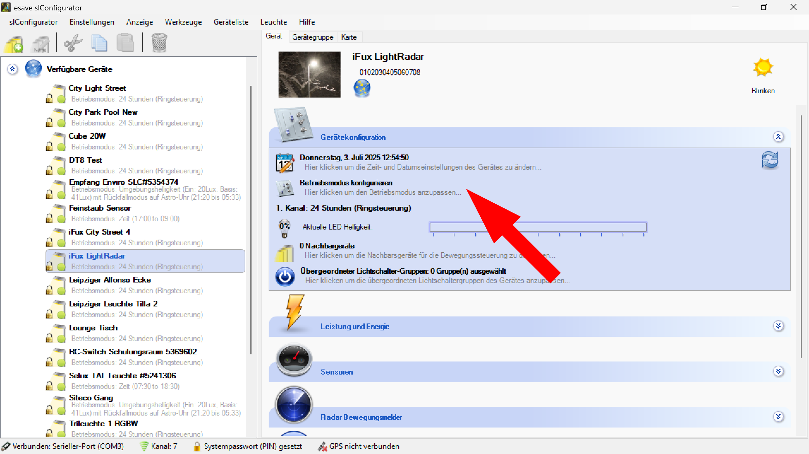
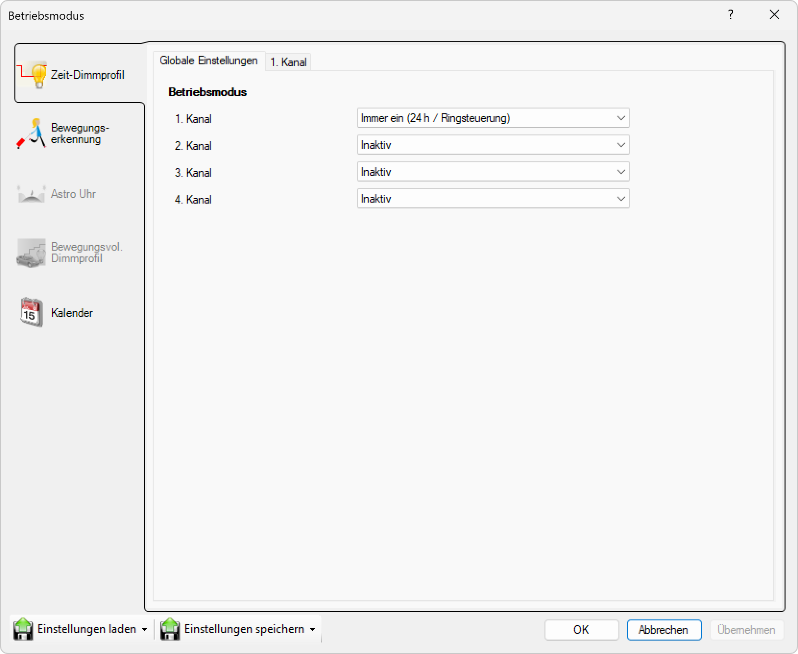
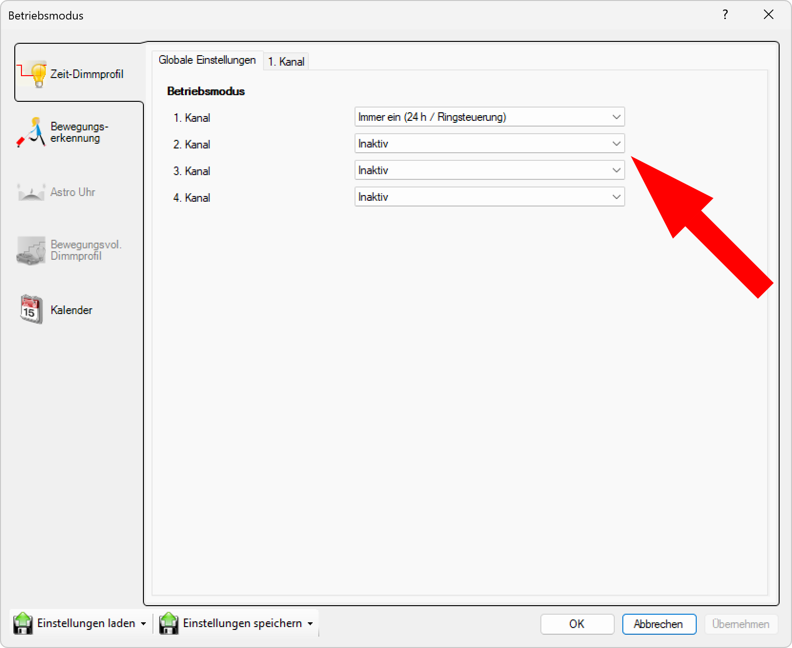

# Betriebsmodus

**Betriebsmodus - esave Lighting Controller Systemkonfiguration**

Konfigurieren Sie umfassende Betriebsparameter und Steuerungslogik für Ihre esave Lighting Controller mit professionellen Werkzeugen für Multi-Channel-Dimmung, Sensorintegration und intelligente Automatisierung. Diese zentrale Konfigurationsoberfläche ermöglicht die präzise Anpassung aller Beleuchtungsaspekte von einfachen Ein-/Aus-Funktionen bis hin zu komplexen adaptiven Steuerungsalgorithmen.

## Hauptbereiche

### 1. Gerätekonfiguration und Zugriff

Die Hauptkonfigurationsoberfläche zeigt alle konfigurierbaren Systemaspekte:
- **Geräteinformationen**: iFux LightRadar mit eindeutiger Geräte-ID
- **Aktueller Status**: Live-Anzeige des 1. Kanals (24 Stunden Ringsteuerung)
- **Betriebsmodus konfigurieren**: Direkter Zugriff auf umfassende Moduseinstellungen
- **Zusätzliche Systemparameter**: Nachbargeräte, Lichtschaltergruppen, LED-Helligkeit

### 2. Systemkonfigurationsbereiche

Das Interface bietet Zugang zu allen wichtigen Konfigurationsbereichen:
- **Gerätekonfiguration**: Hardware-Parameter und Grundeinstellungen
- **Leistung und Energie**: Energieverbrauch, Effizienzoptimierung
- **Sensoren**: Radar-, PIR- und Lichtsensoren
- **Radar Bewegungsmelder**: Erweiterte Bewegungsanalyse und -klassifizierung

### 3. Betriebsmodus-Dialog

Der umfassende Betriebsmodus-Dialog bietet strukturierten Zugang zu allen Steuerungsoptionen:
- **Zeit-Dimmprofil**: Zeitbasierte Dimmsteuerung mit programmierbaren Profilen
- **Bewegungserkennung**: Sensorbasierte Aktivierung und adaptive Steuerung
- **Astro Uhr**: Astronomiebasierte Tag-/Nacht-Zyklen
- **Bewegungsvolles Dimmprofil**: Intelligente Kombination von Zeit- und Bewegungssteuerung
- **Kalender**: Terminbasierte Sonderprogramme und Ereignissteuerung

## Multi-Channel-Konfiguration

### 4-Kanal-Betriebsmodus-Matrix

Die erweiterte Kanalkonfiguration ermöglicht individuelle Einstellungen pro Kanal:

**1. Kanal:** Immer ein (24 h / Ringsteuerung)
- **Betriebsmodus**: Dauerbetrieb mit kontinuierlicher 24-Stunden-Aktivierung
- **Steuerungstyp**: Ringsteuerung für gleichmäßige Lastverteilung
- **Anwendung**: Sicherheitsbeleuchtung oder Grundbeleuchtung
- **Status**: Aktiv und konfiguriert (hervorgehoben in Dropdown)

**2. Kanal:** Inaktiv
- **Status**: Verfügbar für Konfiguration, aktuell deaktiviert
- **Flexibilität**: Beliebiger Betriebsmodus aus Dropdown-Auswahl
- **Einsatzbereich**: Akzentbeleuchtung, Zusatzfunktionen
- **Erweiterbarkeit**: Aktivierbar bei Bedarf

**3. Kanal:** Inaktiv
- **Status**: Reservekanal für erweiterte Funktionen
- **Anwendung**: RGB-Steuerung, Effektbeleuchtung
- **Verfügbarkeit**: Optional aktivierbar
- **Skalierung**: Für komplexe Beleuchtungsszenarien

**4. Kanal:** Inaktiv
- **Status**: Maximaler Ausbau für höchste Flexibilität
- **Spezialfunktionen**: Protokoll-Bridging, externe Steuerung
- **Reservekapazität**: Für zukünftige Erweiterungen
- **Vollausbau**: Komplette 4-Kanal-Nutzung möglich

## Verfügbare Betriebsmodi

### Grundlegende Steuerungsmodi

**Inaktiv**
- **Funktion**: Kanal deaktiviert, minimaler Ressourcenverbrauch
- **Energieeffizienz**: Null-Verbrauch für ungenutzte Kanäle
- **Flexibilität**: Jederzeit aktivierbar für neue Anforderungen

**Immer ein (24 h / Ringsteuerung)**
- **Dauerbetrieb**: Kontinuierliche Beleuchtung ohne zeitliche Begrenzung
- **Ringsteuerung**: Intelligente Lastverteilung über 24-Stunden-Zyklen
- **Anwendung**: Sicherheitsbeleuchtung, Notbeleuchtung, kritische Bereiche
- **Energiemanagement**: Optimiert für Dauerbetrieb mit Lastbalancing

**Nach Zeit**
- **Zeitprogramme**: Feste Ein-/Aus-Zeiten basierend auf Uhrzeiten
- **Wochenprogramme**: Unterschiedliche Schaltzeiten für Wochentage/Wochenende
- **Saisonale Anpassung**: Automatische Sommer-/Winterzeit-Umstellung
- **Präzision**: Minutengenaue Zeitsteuerung

### Sensorbasierte Steuerungsmodi

**Nach Umgebungshelligkeit**
- **Lichtsensor-Integration**: Automatische Aktivierung basierend auf Umgebungslicht
- **Schwellenwerte**: Konfigurierbare Lux-Werte für Ein-/Aus-Schaltung
- **Hysterese**: Vermeidung von Flackern bei Grenzwerten
- **Wetteradaptivität**: Anpassung an wechselnde Lichtverhältnisse

**Nach Zeit und Umgebungshelligkeit**
- **Kombinierte Logik**: UND/ODER-Verknüpfung von Zeit- und Lichtkriterien
- **Intelligente Steuerung**: Optimale Kombination beider Faktoren
- **Energieoptimierung**: Aktivierung nur bei tatsächlichem Bedarf
- **Adaptive Algorithmen**: Selbstlernende Anpassung an Nutzungsmuster

### Spezialisierte Steuerungsmodi

**Tunnelbeleuchtung nach Umgebungshelligkeit**
- **Normenkonforme Steuerung**: Erfüllung von Tunnelbeleuchtungsstandards
- **Adaptive Helligkeit**: Stufenlose Anpassung an Außenlichtbedingungen
- **Sicherheitspriorität**: Garantierte Mindesthelligkeit für Verkehrssicherheit
- **Übergangsoptimierung**: Sanfte Helligkeitsübergänge bei Tunnelein-/-ausfahrt

**Nach Astro-Uhr**
- **Astronomische Berechnung**: Präzise Sonnenauf-/-untergangszeiten
- **GPS-Integration**: Automatische Standortermittlung für lokale Zeiten
- **Jahreszeitenanpassung**: Automatische Anpassung an saisonale Veränderungen
- **Zeitzonenkorrektur**: Berücksichtigung lokaler Zeitzonen

**Fallback-Modi mit Redundanz**
- **Nach Umgebungshelligkeit mit Fallback auf Astro-Uhr**: Primär sensorbasiert, sekundär zeitbasiert
- **Tunnelbeleuchtung mit Astro-Fallback**: Höchste Zuverlässigkeit für kritische Infrastruktur
- **Ausfallsicherheit**: Garantierte Funktion auch bei Sensordefekten
- **Redundante Steuerung**: Doppelte Absicherung für mission-critical Anwendungen

**Testmodus**
- **Diagnose-Funktionen**: Systematische Funktionsprüfung aller Kanäle
- **Manuelle Steuerung**: Vollständige Kontrolle für Wartung und Commissioning
- **Validierungsprozesse**: Überprüfung aller Systemfunktionen
- **Troubleshooting**: Isolierung und Diagnose von Problemen

## Erweiterte Betriebsmodus-Features

### Intelligente Steuerungslogik

**Adaptive Algorithmen:**
- **Maschinelles Lernen**: Selbstoptimierung basierend auf Nutzungsmustern
- **Prädikative Steuerung**: Vorhersage von Beleuchtungsbedarfen
- **Kontext-Awareness**: Berücksichtigung von Umgebungsfaktoren
- **Optimierungszyklen**: Kontinuierliche Verbesserung der Steuerungsparameter

**Multi-Sensor-Fusion:**
- **Radar-Integration**: Präzise Bewegungs- und Objekterkennung
- **PIR-Kombination**: Ergänzende Infrarot-Bewegungssensoren
- **Lichtsensor-Arrays**: Mehrpunkt-Helligkeitsmessung
- **Umweltsensoren**: Temperatur, Luftfeuchtigkeit, Luftdruck

### Netzwerk-Integration

**Kommunikationsprotokolle:**
- **DALI-2**: Vollständige Konformität mit neuesten Standards
- **MQTT**: IoT-Integration für Smart-Building-Systeme
- **HTTP/HTTPS**: RESTful API für Drittanbieter-Integration
- **Proprietäre Protokolle**: Optimierte esave-spezifische Kommunikation

**System-Integration:**
- **Gebäudeautomation**: Nahtlose BMS-Integration
- **Smart Grid**: Demand Response und Load Management
- **Sicherheitssysteme**: Integration in Überwachungs- und Alarmanlagen
- **Facility Management**: CAFM-System-Konnektivität

## Anwendungsszenarien

### Büro- und Gewerbeanwendungen

**Standard-Bürobeleuchtung:**
- **Kanal 1**: Grundbeleuchtung nach Arbeitszeiten
- **Kanal 2**: Arbeitsplatz-spezifische Beleuchtung mit Präsenzerkennung
- **Kanal 3**: Akzentbeleuchtung für Repräsentationsbereiche
- **Kanal 4**: Notbeleuchtung mit Batteriebackup

### Straßen- und Verkehrsbeleuchtung

**Intelligente Straßenbeleuchtung:**
- **Kanal 1**: Hauptbeleuchtung nach Astro-Uhr mit Dimmung
- **Kanal 2**: Verkehrsdichte-adaptive Zusatzbeleuchtung
- **Kanal 3**: Sicherheitsbeleuchtung für Gefahrenstellen
- **Kanal 4**: Wartungsbeleuchtung für Servicearbeiten

### Industrielle Anwendungen

**Fabrik- und Lagerbeleuchtung:**
- **Kanal 1**: Grundbeleuchtung nach Schichtplänen
- **Kanal 2**: Arbeitsplatz-spezifische Beleuchtung mit Bewegungserkennung
- **Kanal 3**: Sicherheitsbeleuchtung für Gefahrenbereiche
- **Kanal 4**: Notbeleuchtung für Evakuierungswege

### Tunnel- und Infrastrukturbeleuchtung

**Tunnelbeleuchtung-Spezialisierung:**
- **Kanal 1**: Grundbeleuchtung nach Tunnelstandards
- **Kanal 2**: Verstärkungsbeleuchtung bei schlechter Sicht
- **Kanal 3**: Notbeleuchtung für Notfälle
- **Kanal 4**: Wartungsbeleuchtung für Servicearbeiten

## Technische Spezifikationen

### System-Performance

- **Kanäle**: 4 unabhängige Steuerungskanäle
- **Dimm-Auflösung**: 16-Bit (65.536 Stufen) pro Kanal
- **Schaltgeschwindigkeit**: <1ms zwischen Kanälen
- **Zeitgenauigkeit**: ±1 Sekunde für zeitbasierte Funktionen
- **Sensor-Reaktionszeit**: <10ms für Bewegungserkennung

### Hardware-Anforderungen

- **Prozessor**: ARM Cortex-M4 oder höher
- **Arbeitsspeicher**: 512KB RAM für Multi-Channel-Betrieb
- **Flash-Speicher**: 2MB für Firmware und Konfigurationsdaten
- **Netzwerk**: Ethernet/WLAN für Kommunikation
- **Sensoren**: Radar, PIR, Lichtsensor (gerätespezifisch)

### Kompatibilität und Standards

- **DALI-2**: IEC 62386 vollständig konform
- **Building Automation**: EN 15232 Energieeffizienz-Klassen
- **Sicherheitsstandards**: IEC 61508 für funktionale Sicherheit
- **EMV**: EN 55015/EN 61547 elektromagnetische Verträglichkeit
- **Tunnelbeleuchtung**: CIE 88 Tunnelbeleuchtungsrichtlinien

## Vorteile der Betriebsmodus-Konfiguration

### Umfassende Flexibilität

- **Multi-Channel-Support**: Bis zu 4 unabhängige Steuerungskanäle
- **Vielfältige Betriebsmodi**: 11 verschiedene Steuerungsarten verfügbar
- **Adaptive Steuerung**: Intelligente Anpassung an Nutzungsrealität
- **Skalierbare Komplexität**: Von einfach bis hochkomplex konfigurierbar

### Professionelle Systemintegration

- **Standard-Konformität**: Erfüllung aller relevanten Industriestandards
- **Netzwerk-Integration**: Nahtlose Einbindung in bestehende Systeme
- **Protokoll-Flexibilität**: Unterstützung verschiedener Kommunikationsstandards
- **Zukunftssicherheit**: Erweiterbar für kommende Technologien

### Betriebseffizienz und Nachhaltigkeit

- **Energieoptimierung**: Intelligente Algorithmen für minimalen Verbrauch
- **Wartungsoptimierung**: Vorbeugende Wartung durch kontinuierliches Monitoring
- **Lebensdauer-Maximierung**: LED-schonende Betriebsparameter
- **Kosteneffizienz**: ROI-Optimierung durch intelligente Steuerungsalgorithmen

Diese Betriebsmodus-Konfiguration bietet eine hochprofessionelle und umfassende Lösung für die Steuerung von esave Lighting Controllern mit maximaler Flexibilität, Intelligenz und Integration in moderne Beleuchtungs- und Gebäudeautomationssysteme.
