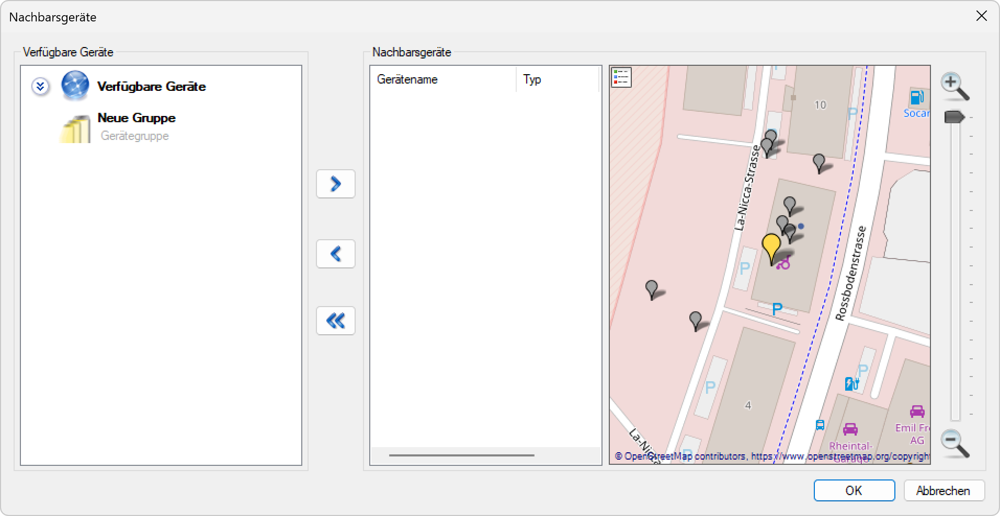

# Nachbargeräte

**Nachbargeräte**

Definieren Sie intelligente Nachbarschaftsverbindungen zwischen Beleuchtungsgeräten, um eine koordinierte Beleuchtungssteuerung zu ermöglichen. Diese Funktion stellt sicher, dass bei Bewegungserkennung nicht nur die auslösende Leuchte, sondern auch benachbarte Geräte entsprechend ihrem Dimmprofil aktiviert werden.

## Hauptbereiche

### 1. Geräteliste

- Die linke Seite zeigt alle verfügbaren Beleuchtungsgeräte in der Anlage
- Ermöglicht die Auswahl und Verwaltung einzelner Geräte
- Zeigt den aktuellen Status und die Konfiguration jedes Geräts

### 2. Grafische Darstellung

- Der rechte Bereich zeigt eine visuelle Karte der Beleuchtungsanlage
- Gelbe Markierung für das aktuell ausgewählte Gerät
- Blaue Darstellung für zugewiesene Nachbargeräte
- Interaktive Bearbeitung der Nachbarschaftsbeziehungen

## Nachbargeräte-Konfiguration

### Grundfunktionen

- **Geräteauswahl**: Wählen Sie das Hauptgerät aus der Geräteliste aus
- **Nachbarzuweisung**: Definieren Sie, welche Geräte als Nachbarn fungieren sollen
- **Reichweiten-Einstellung**: Bestimmen Sie den Aktivierungsbereich für Nachbargeräte
- **Visuelle Kontrolle**: Überprüfen Sie die Zuweisungen in der grafischen Darstellung

### Erweiterte Funktionen

- **Radius-Einstellung**: Verwenden Sie den blauen Kreis zur Definition des Nachbarschaftsbereichs
- **Scrollbalken-Kontrolle**: Passen Sie die Reichweite über den horizontalen Scrollbalken an
- **Automatische Zuordnung**: Nutzen Sie das Hilfstool unter "Werkzeuge > Automatisch Nachbargeräte setzen"
- **Batch-Konfiguration**: Konfigurieren Sie mehrere Geräte gleichzeitig

## Funktionsweise

### Bewegungsaktivierung

1. **Auslösung**: Ein Gerät erkennt eine Bewegung und wird aktiviert
2. **Nachbarbenachrichtigung**: Das System informiert alle definierten Nachbargeräte
3. **Koordinierte Aktivierung**: Nachbargeräte werden entsprechend ihrem Dimmprofil eingeschaltet
4. **Intelligente Steuerung**: Die Aktivierung folgt der Bewegungsrichtung und -geschwindigkeit

### Radius-Konfiguration

- **Kreisauswahl**: Wählen Sie ein Gerät in der grafischen Darstellung aus
- **Radius-Anpassung**: Verwenden Sie die Einstellungsschaltfläche oder den Scrollbalken
- **Automatische Zuordnung**: Alle Geräte innerhalb des Kreises werden als Nachbarn zugewiesen
- **Listenaktualisierung**: Die Nachbargeräte werden automatisch in der linken Liste angezeigt

## Anwendungsbereiche

### Straßenbeleuchtung

- **Verkehrssicherheit**: Beleuchtung folgt der Fahrtrichtung
- **Kontinuierliche Beleuchtung**: Lückenlose Ausleuchtung von Verkehrswegen
- **Vorausschauende Aktivierung**: Beleuchtung wird bereits vor Erreichen aktiviert
- **Energieoptimierung**: Nur relevante Bereiche werden beleuchtet

### Fußgängerwege

- **Sicherheitsbeleuchtung**: Beleuchtung begleitet Fußgänger auf dem Weg
- **Richtungssteuerung**: Beleuchtung folgt der Gehrichtung
- **Kreuzungsbeleuchtung**: Spezielle Behandlung von Weggabelungen
- **Komfortbeleuchtung**: Ausreichende Ausleuchtung für sicheres Gehen

### Parkplätze und Außenbereiche

- **Zonenbeleuchtung**: Aktivierung ganzer Parkplatzbereiche
- **Sicherheitszonen**: Erhöhte Beleuchtung in kritischen Bereichen
- **Wegeleitung**: Beleuchtung führt zu Ausgängen und wichtigen Bereichen
- **Überwachungsunterstützung**: Optimierte Beleuchtung für Sicherheitskameras

### Industrielle Anwendungen

- **Arbeitsplatzbeleuchtung**: Koordinierte Beleuchtung von Arbeitsbereichen
- **Transportwege**: Beleuchtung für Gabelstapler und Transportfahrzeuge
- **Sicherheitsbereiche**: Spezielle Beleuchtung für Gefahrenzonen
- **Notfallbeleuchtung**: Koordinierte Aktivierung bei Notfällen

## Vorteile der Nachbargeräte-Steuerung

### Sicherheit

- **Kontinuierliche Beleuchtung**: Keine dunklen Bereiche zwischen den Geräten
- **Vorausschauende Aktivierung**: Beleuchtung ist bereits da, bevor sie benötigt wird
- **Richtungsabhängige Steuerung**: Beleuchtung folgt der Bewegungsrichtung
- **Notfallsicherheit**: Zuverlässige Beleuchtung in kritischen Situationen

### Komfort

- **Natürliche Beleuchtung**: Sanfte Übergänge zwischen den Beleuchtungszonen
- **Benutzerfreundlichkeit**: Intuitive Beleuchtungssteuerung
- **Adaptive Reaktion**: Beleuchtung passt sich an Nutzungsmuster an
- **Störungsfreier Betrieb**: Minimale Unterbrechungen der Beleuchtung

### Energieeffizienz

- **Bedarfsgerechte Aktivierung**: Nur benötigte Bereiche werden beleuchtet
- **Zeitoptimierte Steuerung**: Beleuchtung nur bei tatsächlicher Nutzung
- **Intelligente Abschaltung**: Koordinierte Deaktivierung nach Bedarf
- **Energieeinsparungen**: Reduzierter Gesamtenergieverbrauch

## Konfigurationstools

### Automatische Nachbargeräte-Zuordnung

- **Werkzeuge-Menü**: Zugang über "Werkzeuge > Automatisch Nachbargeräte setzen"
- **Batch-Verarbeitung**: Gleichzeitige Konfiguration mehrerer Geräte
- **Intelligente Erkennung**: Automatische Erkennung optimaler Nachbarschaftsbeziehungen
- **Zeitersparnis**: Schnelle Konfiguration großer Anlagen

### Manuelle Konfiguration

- **Präzise Steuerung**: Individuelle Anpassung jeder Nachbarschaftsbeziehung
- **Spezielle Anforderungen**: Berücksichtigung besonderer Gegebenheiten
- **Feinabstimmung**: Optimierung für spezifische Anwendungsfälle
- **Flexibilität**: Anpassung an veränderte Anforderungen

## Wartung und Überwachung

### Systemüberwachung

- **Status-Monitoring**: Überwachung des Betriebszustands aller Nachbargeräte
- **Fehlerdiagnose**: Erkennung und Meldung von Kommunikationsproblemen
- **Leistungsanalyse**: Bewertung der Effizienz der Nachbargeräte-Steuerung
- **Optimierungsvorschläge**: Empfehlungen zur Verbesserung der Konfiguration

### Wartungsunterstützung

- **Ferndiagnose**: Überprüfung der Nachbargeräte-Verbindungen ohne Vor-Ort-Besuch
- **Konfigurationssicherung**: Backup der Nachbargeräte-Einstellungen
- **Update-Management**: Koordinierte Updates aller verbundenen Geräte
- **Dokumentation**: Vollständige Protokollierung aller Konfigurationsänderungen

Die Nachbargeräte-Funktion ermöglicht eine intelligente und koordinierte Beleuchtungssteuerung, die Sicherheit, Komfort und Energieeffizienz optimal kombiniert und für eine professionelle Beleuchtungslösung sorgt.