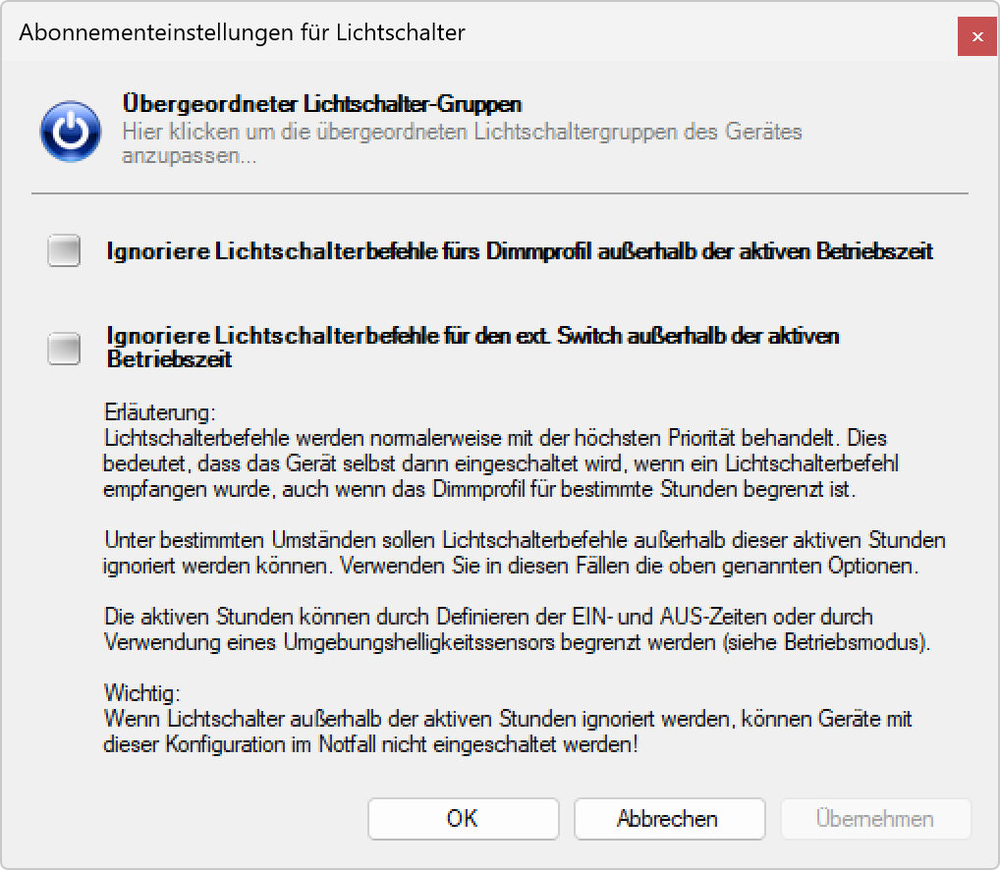

# Übergeordneter Lichtschalter

**Übergeordneter Lichtschalter**

Konfigurieren Sie hierarchische Lichtschalter-Systeme zur Übersteuerung des normalen Betriebsmodus. Diese Funktion ermöglicht es, Beleuchtungsgruppen zentral zu steuern und bei Bedarf den automatischen Betrieb zu übersteuern, um manuelle Kontrolle über die Beleuchtung zu erlangen.

## Hauptbereiche

### 1. Lichtschalter-Konfiguration

- Dieser Bereich zeigt die verfügbaren Lichtschalter-Gruppen und deren Zuweisungen
- Ermöglicht die Verwaltung hierarchischer Beleuchtungssteuerung
- Bietet Optionen zur Gruppierung und Steuerung von Beleuchtungsgeräten

### 2. Gruppen-Verwaltung

- Der Hauptbereich ermöglicht die Zuordnung von Leuchten zu Lichtschalter-Gruppen
- Unterstützt bis zu 64 verschiedene Lichtschalter-Gruppen
- Flexible Mehrfachzuordnung einzelner Leuchten zu verschiedenen Gruppen

## Übergeordneter Lichtschalter-Funktionen

### Grundfunktionen

- **Betriebsmodus-Übersteuerung**: Deaktivierung der automatischen Steuerung bei Aktivierung
- **Hierarchische Steuerung**: Höhere Priorität als normale Betriebsmodi
- **Gruppenverwaltung**: Verwaltung von bis zu 64 Lichtschalter-Gruppen
- **Mehrfachzuordnung**: Leuchten können mehreren Gruppen zugewiesen werden

### Erweiterte Funktionen

- **Zentrale Steuerung**: Gleichzeitige Steuerung mehrerer Beleuchtungsgruppen
- **Prioritätssystem**: Übergeordnete Schalter haben Vorrang vor lokalen Einstellungen
- **Flexible Aktivierung**: Verschiedene Aktivierungsmethoden verfügbar
- **Rückkehr-Automatik**: Automatische Rückkehr zum normalen Betrieb bei Deaktivierung

## Aktivierungsmethoden

### Hardware-Steuerung

- **Speziell programmierte Steuerung**: Dedizierte Hardware-Schalter für direkte Steuerung
- **Schaltknopf-Integration**: Physische Schalter für einfache Bedienung
- **Externe Steuergeräte**: Integration in bestehende Gebäudeautomationssysteme
- **Notfall-Schalter**: Spezielle Schalter für Notfallsituationen

### Software-Steuerung

- **SL-Control Webplattform**: Webbasierte Steuerung über Browser-Interface
- **SL-Gateway**: Zentrale Gateway-Steuerung für komplexe Installationen
- **SL-Configurator Software**: Direkte Steuerung über die Konfigurationssoftware
- **Mobile Apps**: Smartphone- und Tablet-basierte Steuerung

### Automatische Steuerung

- **Zeitgesteuerte Aktivierung**: Automatische Aktivierung zu bestimmten Zeiten
- **Ereignisbasierte Steuerung**: Aktivierung basierend auf spezifischen Ereignissen
- **Sensorbasierte Auslösung**: Aktivierung durch verschiedene Sensoren
- **Systemintegrierte Steuerung**: Integration in übergeordnete Managementsysteme

## Konfiguration und Verwaltung

### Gruppen-Zuordnung

1. **Gruppenauswahl**: Wählen Sie eine der 64 verfügbaren Lichtschalter-Gruppen
2. **Gerätezuordnung**: Weisen Sie Leuchten den entsprechenden Gruppen zu
3. **Mehrfachzuordnung**: Eine Leuchte kann mehreren Gruppen zugeordnet werden
4. **Prioritätsfestlegung**: Bestimmen Sie die Priorität bei überlappenden Gruppen

### Software-Konfiguration

- **Werkzeuge-Menü**: Zugang über "Werkzeuge > Übergeordneter Lichtschalter anzeigen..."
- **Konfigurationsfenster**: Dediziertes Fenster für Lichtschalter-Verwaltung
- **Aktivierung/Deaktivierung**: Direkte Steuerung der Lichtschalter-Gruppen
- **Status-Überwachung**: Echtzeitanzeige des aktuellen Schalter-Status

## Anwendungsbereiche

### Büro- und Geschäftsgebäude

- **Hauptschalter**: Zentrale Beleuchtungssteuerung für ganze Gebäudebereiche
- **Etagen-Steuerung**: Separate Steuerung für verschiedene Stockwerke
- **Abteilungs-Schalter**: Individuelle Steuerung für verschiedene Abteilungen
- **Notfall-Beleuchtung**: Spezielle Schalter für Notfallsituationen

### Industrielle Anwendungen

- **Produktionssteuerung**: Beleuchtungssteuerung für Produktionsbereiche
- **Schichtbetrieb**: Anpassung der Beleuchtung an Schichtzeiten
- **Sicherheitsbereiche**: Spezielle Beleuchtungssteuerung für kritische Zonen
- **Wartungsbeleuchtung**: Separate Beleuchtung für Wartungsarbeiten

### Öffentliche Gebäude

- **Veranstaltungssteuerung**: Beleuchtungssteuerung für Events und Veranstaltungen
- **Sicherheitsbeleuchtung**: Zentrale Steuerung der Sicherheitsbeleuchtung
- **Energie-Management**: Koordinierte Beleuchtungssteuerung zur Energieeinsparung
- **Notfall-Systeme**: Integration in Notfall- und Evakuierungssysteme

### Einzelhandel und Gastgewerbe

- **Öffnungszeiten**: Automatische Beleuchtungssteuerung entsprechend Geschäftszeiten
- **Verkaufsförderung**: Spezielle Beleuchtung für Aktionen und Präsentationen
- **Atmosphären-Steuerung**: Anpassung der Beleuchtung an verschiedene Stimmungen
- **Sicherheitsbeleuchtung**: Beleuchtung für Sicherheitspersonal und Überwachung

## Vorteile der übergeordneten Steuerung

### Betriebsvorteile

- **Zentrale Kontrolle**: Einheitliche Steuerung großer Beleuchtungsanlagen
- **Flexibilität**: Schnelle Anpassung an veränderte Anforderungen
- **Effizienz**: Reduzierter Aufwand für die Beleuchtungssteuerung
- **Zuverlässigkeit**: Robuste und bewährte Steuerungstechnologie

### Sicherheitsvorteile

- **Notfall-Steuerung**: Schnelle Aktivierung der Notfallbeleuchtung
- **Sicherheitszonen**: Spezielle Beleuchtung für kritische Bereiche
- **Evakuierung**: Koordinierte Beleuchtung für Evakuierungsszenarien
- **Überwachung**: Optimierte Beleuchtung für Sicherheitskameras

### Wirtschaftliche Vorteile

- **Energieeinsparung**: Koordinierte Abschaltung ungenutzter Bereiche
- **Wartungseffizienz**: Vereinfachte Wartung durch zentrale Steuerung
- **Kostenreduzierung**: Reduzierte Betriebskosten durch optimierte Steuerung
- **Investitionsschutz**: Längere Lebensdauer durch bedarfsgerechte Steuerung

## Technische Aspekte

### Systemarchitektur

- **Hierarchische Struktur**: Mehrstufige Steuerungsebenen
- **Kommunikationsprotokoll**: Zuverlässige Datenübertragung zwischen Komponenten
- **Redundanz**: Ausfallsichere Steuerung durch mehrfache Absicherung
- **Skalierbarkeit**: Erweiterbar für wachsende Installationen

### Integration

- **Gebäudeautomation**: Nahtlose Integration in bestehende Systeme
- **Protokoll-Unterstützung**: Unterstützung verschiedener Kommunikationsstandards
- **API-Schnittstellen**: Programmatische Steuerung durch externe Systeme
- **Cloud-Integration**: Fernsteuerung und -überwachung über Cloud-Services

## Wartung und Support

### Systemüberwachung

- **Status-Monitoring**: Kontinuierliche Überwachung aller Lichtschalter-Gruppen
- **Fehlerdiagnose**: Automatische Erkennung und Meldung von Problemen
- **Leistungsanalyse**: Bewertung der Systemeffizienz und -nutzung
- **Wartungsplanung**: Vorhersage von Wartungsbedarfen

### Support-Funktionen

- **Ferndiagnose**: Problemanalyse ohne Vor-Ort-Besuch
- **Update-Management**: Zentrale Verwaltung von Software-Updates
- **Konfigurationssicherung**: Backup aller Lichtschalter-Einstellungen
- **Dokumentation**: Vollständige Protokollierung aller Systemänderungen

Die übergeordnete Lichtschalter-Funktion bietet eine professionelle Lösung für die zentrale Beleuchtungssteuerung und ermöglicht eine flexible, sichere und effiziente Verwaltung komplexer Beleuchtungsanlagen.