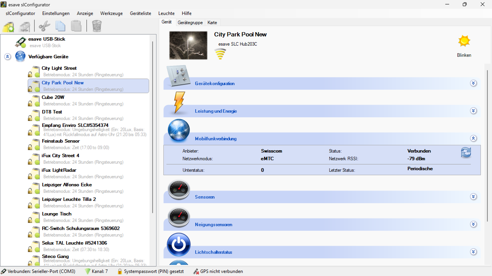

# Mobilfunkverbindung

**Mobilfunkverbindung**

Konfigurieren Sie die Mobilfunkverbindung für drahtlose Kommunikation zwischen Beleuchtungsgeräten über das Mobilfunknetz. Diese Funktion ermöglicht es, Geräte auch ohne direkte Mesh-Verbindung miteinander zu vernetzen und Daten auszutauschen.

## Hauptbereiche

### 1. Mobilfunk-Konfiguration

- Zentrale Einstellungen für die Mobilfunkverbindung des Geräts
- Konfiguration der Kommunikationsparameter und Verbindungsdetails
- Verwaltung von Sende- und Empfangsfunktionen

### 2. Nachrichtenverwaltung

- Definition und Verwaltung von Nachrichten für den Datenaustausch
- Konfiguration von Publish/Subscribe-Mechanismen
- Überwachung der Kommunikationsstatus

## Mobilfunk-Funktionen

### Grundlegende Kommunikationsmodi

- **Publizieren (Sender)**: Das Gerät sendet vordefinierte Nachrichten über das Mobilfunknetz
- **Abonnieren (Empfänger)**: Das Gerät empfängt vordefinierte Nachrichten über das Mobilfunknetz
- **Bidirektional**: Kombinierte Sende- und Empfangsfunktionen
- **Mesh-Ergänzung**: Erweiterung der lokalen Mesh-Verbindung über große Entfernungen

### Erweiterte Funktionen

- **Datenfilterung**: Selektive Übertragung relevanter Informationen
- **Prioritätsverwaltung**: Priorisierung kritischer Nachrichten
- **Verschlüsselung**: Sichere Datenübertragung über das Mobilfunknetz
- **Offline-Pufferung**: Zwischenspeicherung von Nachrichten bei Verbindungsunterbrechungen

## Konfigurationsoptionen

### Publish-Konfiguration (Sender)

- **Nachrichtentyp**: Auswahl der zu sendenden Datentypen
  - **AL (Ambient Light)**: Umgebungslichtdaten
  - **Bewegungsdaten**: Informationen über erkannte Bewegungen
  - **Energiedaten**: Leistungs- und Verbrauchsinformationen
  - **Statusdaten**: Betriebszustand und Gerätestatus
- **Sendeintervall**: Zeitabstände zwischen den Datenübertragungen
- **Nachrichtennummer**: Eindeutige Identifikation der Nachricht
- **Datenformat**: Struktur und Format der übertragenen Daten

### Subscribe-Konfiguration (Empfänger)

- **Nachrichtenauswahl**: Auswahl der zu empfangenden Nachrichtentypen
- **Quellenfilter**: Filterung nach spezifischen Sendern
- **Empfangsverhalten**: Reaktion auf empfangene Nachrichten
- **Datenverarbeitung**: Verarbeitung und Anwendung empfangener Daten

## Anwendungsszenarien

### Umgebungslicht-Synchronisation

- **Zentrale Lichtsensoren**: Ein Gerät mit Lichtsensor publiziert Umgebungslichtdaten
- **Verteilte Anwendung**: Andere Geräte ohne eigenen Sensor abonnieren diese Daten
- **Automatische Anpassung**: Alle Geräte passen ihre Beleuchtung an die gemeinsamen Umgebungslichtdaten an
- **Kostenersparnis**: Reduzierung der Anzahl benötigter Sensoren

### Bewegungserkennung-Vernetzung

- **Bewegungsdaten-Sharing**: Weitergabe von Bewegungsinformationen zwischen entfernten Geräten
- **Koordinierte Beleuchtung**: Synchronisierte Beleuchtungsaktivierung über große Bereiche
- **Intelligente Steuerung**: Vorausschauende Beleuchtungssteuerung basierend auf Bewegungsmustern
- **Sicherheitsanwendungen**: Erweiterte Sicherheitsbeleuchtung durch vernetzte Bewegungserkennung

### Energiemanagement

- **Zentrale Energieüberwachung**: Sammlung von Energiedaten aller Geräte
- **Lastverteilung**: Optimierung der Energieverteilung basierend auf Verbrauchsdaten
- **Effizienzsteigerung**: Koordinierte Energiesparmaßnahmen
- **Reporting**: Zentrale Erfassung für Energieberichte

## Technische Aspekte

### Mobilfunk-Technologien

- **2G/3G/4G/5G**: Unterstützung verschiedener Mobilfunkstandards
- **NB-IoT**: Optimiert für IoT-Anwendungen mit geringem Energieverbrauch
- **LTE-M**: Speziell für Machine-to-Machine-Kommunikation
- **LoRaWAN**: Alternative für weitreichende, energieeffiziente Kommunikation

### Kommunikationsprotokoll

- **MQTT**: Lightweight-Protokoll für IoT-Kommunikation
- **CoAP**: Constrained Application Protocol für ressourcenbeschränkte Geräte
- **HTTP/HTTPS**: Webbasierte Kommunikation für komplexere Anwendungen
- **Proprietäre Protokolle**: Herstellerspezifische Optimierungen

### Sicherheit

- **Ende-zu-Ende-Verschlüsselung**: Sichere Datenübertragung
- **Authentifizierung**: Verifizierung der Kommunikationspartner
- **Zugangskontrolle**: Beschränkung des Zugriffs auf autorisierte Geräte
- **Datenintegrität**: Schutz vor Datenmanipulation

## Vorteile der Mobilfunkverbindung

### Reichweite und Flexibilität

- **Große Entfernungen**: Kommunikation über beliebige Distanzen
- **Keine Infrastruktur**: Unabhängigkeit von lokaler Netzwerkinfrastruktur
- **Mobilität**: Unterstützung mobiler Beleuchtungsgeräte
- **Skalierbarkeit**: Einfache Erweiterung der Netzwerkgröße

### Zuverlässigkeit

- **Robuste Verbindung**: Stabile Kommunikation auch bei schwierigen Bedingungen
- **Redundanz**: Backup-Kommunikation bei Ausfall anderer Verbindungen
- **Professionelle Infrastruktur**: Nutzung der etablierten Mobilfunkinfrastruktur
- **Wartungsfreiheit**: Keine eigene Netzwerkinfrastruktur erforderlich

### Betriebsvorteile

- **Fernwartung**: Remote-Zugriff auf entfernte Geräte
- **Zentrale Überwachung**: Monitoring aller Geräte von einem zentralen Punkt
- **Schnelle Installation**: Einfache Inbetriebnahme ohne Verkabelung
- **Kosteneffizienz**: Reduzierte Installationskosten bei großen Entfernungen

## Konfigurationsbeispiele

### Beispiel 1: Umgebungslicht-Verteilung

1. **Sender-Konfiguration**:
   - Gerät A: Publizieren → AL (Ambient Light) → Nachrichtennummer: 001
   - Sendeintervall: 5 Minuten
   - Datenformat: Luxwerte + Zeitstempel

2. **Empfänger-Konfiguration**:
   - Geräte B, C, D: Abonnieren → AL-Nachricht 001
   - Anwendung: Automatische Dimmung basierend auf Umgebungslicht
   - Reaktionszeit: Sofortige Anpassung

### Beispiel 2: Bewegungserkennung-Netzwerk

1. **Verteilte Sender**:
   - Mehrere Geräte: Publizieren → Bewegungsdaten
   - Eindeutige Nachrichtennummern für jeden Sensor
   - Geo-Koordinaten zur Positionsbestimmung

2. **Zentrale Auswertung**:
   - Gateway-Gerät: Abonnieren → Alle Bewegungsnachrichten
   - Analyse von Bewegungsmustern
   - Koordinierte Beleuchtungssteuerung

## Wartung und Troubleshooting

### Überwachung

- **Verbindungsqualität**: Monitoring der Signalstärke und Verbindungsstabilität
- **Datenübertragung**: Überwachung der Nachrichtenübertragung
- **Fehlerprotokollierung**: Aufzeichnung von Kommunikationsproblemen
- **Leistungsanalyse**: Bewertung der Systemeffizienz

### Wartungsmaßnahmen

- **SIM-Karten-Management**: Verwaltung der Mobilfunkverträge
- **Firmware-Updates**: Aktualisierung der Kommunikationssoftware
- **Konfigurationssicherung**: Backup der Mobilfunk-Einstellungen
- **Leistungsoptimierung**: Anpassung der Übertragungsparameter

Die Mobilfunkverbindung bietet eine professionelle Lösung für die drahtlose Vernetzung von Beleuchtungsgeräten über große Entfernungen und ermöglicht eine flexible und zuverlässige Kommunikation unabhängig von lokaler Netzwerkinfrastruktur.