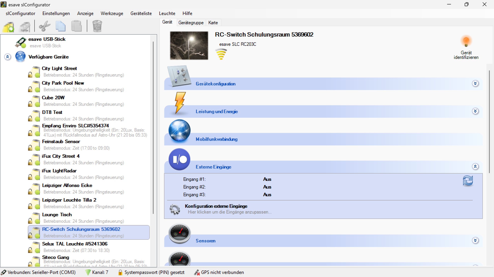

# Externe Eingänge

**Externe Eingänge**

Konfigurieren Sie externe Eingänge für die Integration von Sensoren, Schaltern und anderen Steuergeräten in Ihre Beleuchtungsanlage. Diese Funktion ermöglicht es, externe Signale zu verarbeiten und die Beleuchtungssteuerung entsprechend zu beeinflussen.

## Hauptbereiche

### 1. Eingangs-Konfiguration

- Zentrale Verwaltung aller verfügbaren externen Eingänge
- Konfiguration der Eingangseigenschaften und Signalverarbeitung
- Zuordnung von Eingängen zu Beleuchtungsfunktionen

### 2. Signal-Verarbeitung

- Einstellungen für die Interpretation eingehender Signale
- Filterung und Konditionierung von Eingangssignalen
- Reaktionsmuster für verschiedene Signaltypen

## Externe Eingangs-Funktionen

### Grundlegende Eingänge

- **Digitale Eingänge**: Verarbeitung von Ein/Aus-Signalen
- **Analoge Eingänge**: Verarbeitung kontinuierlicher Signalwerte
- **Impulseingänge**: Zählung von Impulsen und Frequenzmessung
- **Potenzialfreie Kontakte**: Integration von Schaltkontakten

### Erweiterte Eingänge

- **Sensorschnittstellen**: Direkte Integration verschiedener Sensortypen
- **Kommunikationsschnittstellen**: Serielle und Bus-Kommunikation
- **Protokoll-Eingänge**: Unterstützung verschiedener Kommunikationsprotokolle
- **Programmierbare Eingänge**: Flexible Konfiguration für spezielle Anforderungen

## Konfigurationsoptionen

### Eingangs-Parameter

- **Signaltyp**: Definition des erwarteten Signaltyps
  - **Schaltsignal**: Einfache Ein/Aus-Signale
  - **Analogwert**: Kontinuierliche Messwerte (0-10V, 4-20mA)
  - **Impulssignal**: Zählimpulse und Frequenzsignale
  - **Digitaler Bus**: Serielle Datenübertragung
- **Signalbereich**: Festlegung des gültigen Signalbereichs
- **Entprellung**: Filterung von Signalschwankungen
- **Invertierung**: Umkehrung der Signallogik

### Reaktions-Konfiguration

- **Triggerschwelle**: Schwellenwerte für Signalauslösung
- **Hysterese**: Vermeidung von Signalflackern
- **Verzögerung**: Zeitverzögerung für Signalverarbeitung
- **Signalvalidierung**: Plausibilitätsprüfung eingehender Signale

## Anwendungsszenarien

### Lichtschalter-Integration

- **Wandschalter**: Integration herkömmlicher Wandschalter
- **Taster**: Steuerung über Taster mit verschiedenen Funktionen
- **Dimmer**: Analoge Dimmsteuerung über externe Dimmer
- **Szenen-Schalter**: Aktivierung vordefinierter Beleuchtungsszenen

### Sensor-Integration

- **Bewegungsmelder**: Externe Bewegungsdetektoren
- **Lichtsensoren**: Umgebungslichtsensoren für Tageslichtregelung
- **Präsenzmelder**: Hochauflösende Anwesenheitserkennung
- **Temperatursensoren**: Thermische Steuerung der Beleuchtung

### Gebäudeautomation

- **BMS-Integration**: Anbindung an Gebäudemanagementsysteme
- **Zeitschaltsignale**: Externe Zeitsteuerung
- **Notsignale**: Integration in Notfall- und Sicherheitssysteme
- **Wartungssignale**: Signale für Wartungs- und Servicearbeiten

### Spezialanwendungen

- **Verkehrssteuerung**: Integration in Verkehrsmanagementsysteme
- **Industriesteuerung**: Anbindung an Produktionssteuerungen
- **Sicherheitssysteme**: Integration in Alarmanlagen
- **Energiemanagement**: Externe Energiemanagementsignale

## Technische Spezifikationen

### Eingangs-Typen

- **Digitale Eingänge**: 
  - Spannungsbereich: 0-30V DC
  - Schaltpegel: TTL/CMOS kompatibel
  - Maximaler Eingangsstrom: 20mA
- **Analoge Eingänge**:
  - Spannungsbereich: 0-10V DC
  - Strombereich: 4-20mA
  - Auflösung: 12-16 Bit
- **Impulseingänge**:
  - Frequenzbereich: 0.1Hz - 10kHz
  - Impulsdauer: mindestens 50µs
  - Zählerkapazität: 32-Bit

### Signalverarbeitung

- **Abtastrate**: Konfigurierbar von 1ms bis 1s
- **Filterung**: Digitale Tiefpass- und Hochpassfilter
- **Kalibrierung**: Automatische und manuelle Kalibrierung
- **Linearisierung**: Korrektur nichtlinearer Sensorkennlinien

## Konfigurationsbeispiele

### Beispiel 1: Wandschalter-Integration

1. **Hardware-Anschluss**:
   - Digitaler Eingang 1: Wandschalter (potenzialfreier Kontakt)
   - Signaltyp: Schaltsignal
   - Entprellung: 50ms

2. **Software-Konfiguration**:
   - Funktion: Beleuchtung Ein/Aus
   - Kanal: Hauptbeleuchtung
   - Reaktionszeit: Sofort

### Beispiel 2: Lichtsensor-Integration

1. **Hardware-Anschluss**:
   - Analoger Eingang 1: Lichtsensor (0-10V)
   - Signalbereich: 0-10V entspricht 0-100.000 Lux
   - Filterung: Glättung über 30 Sekunden

2. **Software-Konfiguration**:
   - Funktion: Tageslichtregelung
   - Schwellenwert: 500 Lux
   - Hysterese: 100 Lux
   - Reaktion: Dimmen der Beleuchtung

### Beispiel 3: BMS-Integration

1. **Hardware-Anschluss**:
   - Digitaler Bus-Eingang: Modbus RTU
   - Baudrate: 9600 bps
   - Slave-Adresse: 1

2. **Software-Konfiguration**:
   - Datenpunkte: Sollwerte für alle Kanäle
   - Aktualisierungsintervall: 5 Sekunden
   - Fehlerbehandlung: Fallback auf lokale Steuerung

## Vorteile der externen Eingänge

### Flexibilität

- **Vielseitige Integration**: Anbindung verschiedenster Geräte und Systeme
- **Skalierbarkeit**: Erweiterung der Eingänge nach Bedarf
- **Anpassbarkeit**: Flexible Konfiguration für spezielle Anforderungen
- **Kompatibilität**: Unterstützung verschiedener Signaltypen und Protokolle

### Funktionalität

- **Erweiterte Steuerung**: Komplexere Beleuchtungssteuerung durch externe Signale
- **Automatisierung**: Vollautomatische Beleuchtungsregelung
- **Systemintegration**: Nahtlose Integration in bestehende Systeme
- **Intelligente Reaktion**: Adaptive Beleuchtungssteuerung basierend auf Umgebungsbedingungen

### Wirtschaftlichkeit

- **Kosteneinsparung**: Nutzung vorhandener Infrastruktur
- **Effizienzsteigerung**: Optimierte Beleuchtungssteuerung
- **Wartungsreduzierung**: Weniger manuelle Eingriffe erforderlich
- **Zukunftssicherheit**: Erweiterbarkeit für zukünftige Anforderungen

## Wartung und Diagnose

### Überwachungsfunktionen

- **Signalmonitoring**: Kontinuierliche Überwachung aller Eingangssignale
- **Fehlerdiagnose**: Automatische Erkennung von Signalfehlern
- **Trendalarm**: Warnung bei langfristigen Signalveränderungen
- **Kalibrierungsprüfung**: Regelmäßige Überprüfung der Kalibrierung

### Wartungsmaßnahmen

- **Kalibrierung**: Regelmäßige Neukalibrierung der Eingänge
- **Signalvalidierung**: Überprüfung der Signalqualität
- **Kontaktpflege**: Wartung mechanischer Kontakte
- **Firmware-Updates**: Aktualisierung der Eingangssoftware

## Sicherheitsaspekte

### Signalsicherheit

- **Galvanische Trennung**: Schutz vor Überspannungen
- **Fehlererkennung**: Erkennung von Signalfehlern und Ausfällen
- **Fail-Safe-Verhalten**: Sicherer Zustand bei Signalausfall
- **Redundanz**: Backup-Signale für kritische Funktionen

### Systemsicherheit

- **Zugriffskontrolle**: Schutz vor unbefugter Konfiguration
- **Signalvalidierung**: Prüfung der Signalplausibilität
- **Protokollierung**: Aufzeichnung aller Signalaktivitäten
- **Notfallprozeduren**: Verhalten bei kritischen Situationen

Die externe Eingänge-Funktion bietet eine professionelle Lösung für die Integration verschiedenster Steuergeräte und Sensoren in Beleuchtungsanlagen und ermöglicht eine flexible, intelligente und automatisierte Beleuchtungssteuerung für komplexe Anwendungen.