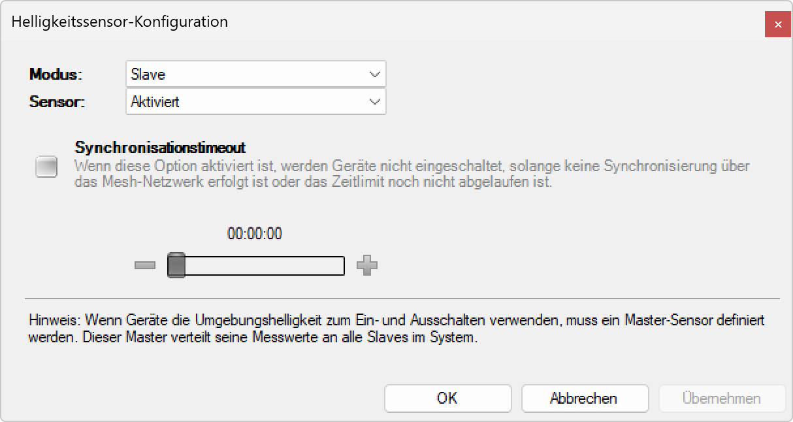

# Helligkeitssensor-Konfiguration

**Helligkeitssensor-Konfiguration**

Konfigurieren Sie die Helligkeitssensoren für eine optimale Tageslichtregelung und automatische Beleuchtungssteuerung. Diese Funktion ermöglicht es, die Beleuchtung intelligent an die natürlichen Lichtverhältnisse anzupassen und dadurch Energie zu sparen und den Komfort zu erhöhen.

## Hauptbereiche

### 1. Sensor-Modus-Konfiguration

- Auswahl zwischen Master- und Slave-Modus für jeden Helligkeitssensor
- Zentrale Steuerung der Sensorhierarchie in der Beleuchtungsanlage
- Koordination der Helligkeitsmessungen zwischen verschiedenen Sensoren

### 2. Sensor-Parameter

- Detaillierte Einstellungen für Empfindlichkeit und Reaktionsverhalten
- Kalibrierung und Feinabstimmung der Sensormessungen
- Anpassung an spezifische Umgebungsbedingungen

## Helligkeitssensor-Modi

### Master-Modus

- **Referenzsensor**: Ein Master-Sensor dient als Hauptreferenz für das gesamte System
- **Wertverteilung**: Der Master-Sensor verteilt seine Messwerte an alle Slave-Sensoren
- **Zentrale Steuerung**: Alle Slave-Sensoren orientieren sich an den Master-Werten
- **Systemkoordination**: Einheitliche Helligkeitsregelung für die gesamte Anlage

### Slave-Modus

- **Standardkonfiguration**: Helligkeitssensoren sind standardmäßig als Slave konfiguriert
- **Wertempfang**: Slave-Sensoren empfangen Referenzwerte vom Master-Sensor
- **Lokale Anpassung**: Möglichkeit zur lokalen Feinabstimmung basierend auf Master-Werten
- **Redundanz**: Automatische Umschaltung bei Master-Ausfall

## Konfigurationsoptionen

### Master-Sensor-Einstellungen

- **Sensorauswahl**: Bestimmung, welcher Sensor als Master fungiert
- **Messintervall**: Einstellung der Messfrequenz für Helligkeitswerte
- **Mittelwertbildung**: Glättung der Messwerte über einen definierten Zeitraum
- **Übertragungsprotokoll**: Konfiguration der Datenübertragung an Slave-Sensoren

### Slave-Sensor-Einstellungen

- **Master-Zuordnung**: Verknüpfung mit dem entsprechenden Master-Sensor
- **Lokale Korrektur**: Anpassungsfaktoren für standortspezifische Gegebenheiten
- **Verzögerungszeiten**: Reaktionszeit auf Master-Werteänderungen
- **Fallback-Verhalten**: Verhalten bei Verlust der Master-Verbindung

### Allgemeine Sensor-Parameter

- **Empfindlichkeit**: Einstellung der Lichtempfindlichkeit des Sensors
- **Schwellenwerte**: Definition von Helligkeitsschwellen für verschiedene Reaktionen
- **Hysterese**: Vermeidung von Pendeleffekten bei Grenzwerten
- **Kalibrierung**: Anpassung der Sensormessungen an Referenzwerte

## Anwendungsszenarien

### Großraumbüros

- **Zentrale Tageslichtregelung**: Ein Master-Sensor an optimaler Position
- **Zoneneinteilung**: Mehrere Slave-Sensoren für verschiedene Bürobereiche
- **Gleichmäßige Beleuchtung**: Koordinierte Helligkeitsregelung über alle Arbeitsplätze
- **Energieoptimierung**: Maximale Nutzung des verfügbaren Tageslichts

### Industrielle Anlagen

- **Produktionshallen**: Master-Sensor für große Hallenbereiche
- **Arbeitsplatzbeleuchtung**: Lokale Slave-Sensoren für spezifische Arbeitsbereiche
- **Sicherheitsbeleuchtung**: Redundante Sensoren für kritische Bereiche
- **Schichtbetrieb**: Anpassung an unterschiedliche Tageslichtbedingungen

### Einzelhandel

- **Verkaufsflächen**: Optimale Produktpräsentation durch Tageslichtregelung
- **Schaufenster**: Separate Sensoren für Außen- und Innenbeleuchtung
- **Lagerbereich**: Energiesparende Beleuchtung mit Tageslichtnutzung
- **Kundenkomfort**: Angenehme Beleuchtung zu allen Tageszeiten

### Bildungseinrichtungen

- **Klassenzimmer**: Tageslichtabhängige Beleuchtungssteuerung
- **Hörsäle**: Präsentationsoptimierte Beleuchtung
- **Bibliotheken**: Lesefreundliche Lichtverhältnisse
- **Flure und Gemeinschaftsbereiche**: Energieeffiziente Grundbeleuchtung

## Technische Spezifikationen

### Sensor-Eigenschaften

- **Messbereich**: 0.1 - 100.000 Lux
- **Spektrale Empfindlichkeit**: Dem menschlichen Auge angepasst (V-Lambda-Kurve)
- **Genauigkeit**: ±5% bei Standardbedingungen
- **Temperaturstabilität**: Kompensation von -20°C bis +60°C
- **Langzeitstabilität**: <2% Drift pro Jahr
- **Reaktionszeit**: <1 Sekunde

### Kommunikation

- **Übertragungsprotokoll**: Digitale Datenübertragung über Mesh-Netzwerk
- **Update-Rate**: Konfigurierbar von 1 Sekunde bis 15 Minuten
- **Datenformat**: 16-Bit Auflösung für Helligkeitswerte
- **Fehlerkorrektur**: Automatische Plausibilitätsprüfung der Messwerte

## Kalibrierung und Wartung

### Kalibrierungsverfahren

- **Werkskalibrierung**: Präzise Kalibrierung unter Laborbedingungen
- **Feldkalibrierung**: Anpassung an Installationsbedingungen vor Ort
- **Referenzkalibrierung**: Vergleichsmessungen mit kalibrierten Referenzgeräten
- **Automatische Nachkalibrierung**: Langzeit-Drift-Korrektur

### Wartungsmaßnahmen

- **Sensoroberfläche**: Regelmäßige Reinigung der Lichteintrittsfläche
- **Funktionsprüfung**: Periodische Überprüfung der Messgenauigkeit
- **Umgebungscheck**: Kontrolle auf Verschattung oder Hindernisse
- **Firmware-Updates**: Aktualisierung der Sensor-Software

### Diagnose und Fehlerbehebung

- **Selbstdiagnose**: Automatische Erkennung von Sensorproblemen
- **Messwertvalidierung**: Plausibilitätsprüfung der Helligkeitswerte
- **Kommunikationstest**: Überprüfung der Master-Slave-Verbindung
- **Kalibrierungsstatus**: Überwachung der Kalibrierungsgenauigkeit

## Vorteile der Helligkeitssensor-Konfiguration

### Energieeffizienz

- **Tageslichtnutzung**: Optimale Nutzung des verfügbaren natürlichen Lichts
- **Bedarfsgerechte Beleuchtung**: Beleuchtung nur bei tatsächlichem Bedarf
- **Lastreduzierung**: Reduzierung der elektrischen Beleuchtungslast
- **Energieeinsparung**: Bis zu 70% Energieeinsparung möglich

### Komfort und Wohlbefinden

- **Konstante Helligkeit**: Gleichmäßige Beleuchtungsstärke zu allen Zeiten
- **Natürlicher Rhythmus**: Unterstützung des circadianen Rhythmus
- **Blendungsreduzierung**: Vermeidung von unangenehmen Helligkeitssprüngen
- **Adaptive Beleuchtung**: Automatische Anpassung an Wetteränderungen

### System-Vorteile

- **Zentrale Steuerung**: Koordinierte Beleuchtungsregelung über große Bereiche
- **Redundanz**: Ausfallsicherheit durch Master-Slave-Konzept
- **Skalierbarkeit**: Einfache Erweiterung um zusätzliche Sensoren
- **Flexibilität**: Anpassung an verschiedene Raumkonfigurationen

## Best Practices

### Sensor-Positionierung

- **Master-Sensor**: Platzierung an repräsentativer Position ohne Verschattung
- **Slave-Sensoren**: Verteilung entsprechend den Beleuchtungszonen
- **Höhe**: Installation in angemessener Höhe für representative Messungen
- **Ausrichtung**: Horizontale Ausrichtung für Arbeitsplatzbeleuchtung

### Konfigurationsstrategie

- **Zonenplanung**: Sinnvolle Aufteilung in Master-Slave-Bereiche
- **Redundanz**: Mehrere Master-Sensoren für kritische Anwendungen
- **Kalibrierung**: Regelmäßige Überprüfung und Nachkalibrierung
- **Dokumentation**: Vollständige Dokumentation der Sensorkonfiguration

### Fehlervermeidung

- **Verschattung**: Vermeidung von Hindernissen im Sensorbereich
- **Reflexionen**: Berücksichtigung von Lichtreflexionen an Oberflächen
- **Umgebungseinflüsse**: Schutz vor direkter Sonneneinstrahlung
- **Wartung**: Regelmäßige Reinigung und Funktionsprüfung

Die Helligkeitssensor-Konfiguration bildet die Grundlage für eine intelligente und energieeffiziente Tageslichtregelung und ermöglicht eine optimale Balance zwischen Komfort, Energieeinsparung und Beleuchtungsqualität.
