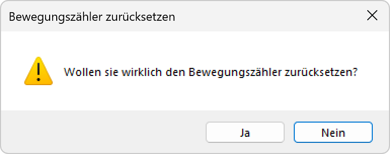

# Bewegungszähler zurücksetzen

**Bewegungszähler zurücksetzen**

Verwalten und zurücksetzen Sie die integrierten Bewegungszähler für eine präzise Überwachung und Analyse von Bewegungsmustern. Diese Funktion ermöglicht es, Bewegungsdaten zu sammeln, auszuwerten und bei Bedarf zu löschen, um neue Messzyklen zu starten.

## Hauptbereiche

### 1. Zählerstand-Anzeige

- Aktuelle Anzeige der erfassten Bewegungsereignisse
- Übersicht über die Zählerstände aller Bewegungssensoren
- Zeitstempel der letzten Bewegungserkennung

### 2. Zurücksetz-Funktionen

- Manuelle und automatische Zurücksetzungsoptionen
- Selektive oder globale Zähler-Zurücksetzung
- Konfiguration von Zurücksetz-Intervallen

## Bewegungszähler-Funktionen

### Grundlegende Zählfunktionen

- **Bewegungserkennung**: Erfassung und Zählung einzelner Bewegungsereignisse
- **Zeitstempel**: Protokollierung der genauen Zeit jeder Bewegung
- **Kumulierte Zählung**: Summierung aller Bewegungen über definierte Zeiträume
- **Sensorspezifische Zählung**: Separate Zähler für jeden Bewegungssensor

### Erweiterte Analysefunktionen

- **Bewegungsfrequenz**: Berechnung der Bewegungen pro Zeiteinheit
- **Aktivitätsmuster**: Erkennung wiederkehrender Aktivitätsmuster
- **Spitzenzeiten**: Identifikation von Zeiten mit höchster Aktivität
- **Langzeittrends**: Analyse langfristiger Bewegungstrends

## Zurücksetz-Optionen

### Manuelle Zurücksetzung

- **Sofortige Zurücksetzung**: Direktes Löschen aller Zählerstände
- **Selektive Zurücksetzung**: Zurücksetzen einzelner Sensor-Zähler
- **Benutzerbestätigung**: Sicherheitsabfrage vor Zurücksetzung
- **Backup vor Zurücksetzung**: Automatische Datensicherung

### Automatische Zurücksetzung

- **Zeitgesteuerte Zurücksetzung**: Automatisches Zurücksetzen zu festgelegten Zeiten
- **Intervall-basierte Zurücksetzung**: Regelmäßige Zurücksetzung nach definierten Zeiträumen
- **Ereignis-basierte Zurücksetzung**: Zurücksetzung bei bestimmten Ereignissen
- **Kapazitäts-basierte Zurücksetzung**: Zurücksetzung bei Erreichen maximaler Zählwerte

### Zurücksetz-Intervalle

- **Täglich**: Zurücksetzung jeden Tag um Mitternacht
- **Wöchentlich**: Wöchentliche Zurücksetzung (z.B. montags)
- **Monatlich**: Monatliche Zurücksetzung am Monatsanfang
- **Benutzerdefiniert**: Individuelle Zurücksetz-Zeitpunkte

## Datenauswertung und -analyse

### Statistiken

- **Gesamtzahl Bewegungen**: Kumulative Bewegungsereignisse seit letzter Zurücksetzung
- **Durchschnittliche Aktivität**: Mittlere Bewegungen pro Stunde/Tag
- **Maximale Aktivität**: Höchste registrierte Bewegungsfrequenz
- **Aktivste Zeiten**: Zeiträume mit der höchsten Bewegungsaktivität

### Trendanalyse

- **Aktivitätsverlauf**: Grafische Darstellung der Bewegungsaktivität über Zeit
- **Vergleichsanalyse**: Vergleich verschiedener Zeiträume
- **Saisonale Muster**: Erkennung jahreszeitlicher Aktivitätsschwankungen
- **Anomalieerkennung**: Identifikation ungewöhnlicher Aktivitätsmuster

### Berichtsfunktionen

- **Aktivitätsberichte**: Detaillierte Berichte über Bewegungsaktivitäten
- **Zusammenfassungen**: Kompakte Übersichten über Bewegungsdaten
- **Export-Funktionen**: Datenexport für externe Analyse
- **Historische Daten**: Archivierung und Abruf vergangener Bewegungsdaten

## Anwendungsszenarien

### Nutzungsanalyse

- **Raumnutzung**: Analyse der tatsächlichen Raumnutzung
- **Verkehrsfrequenz**: Messung der Personenfrequenz in verschiedenen Bereichen
- **Nutzungsmuster**: Identifikation typischer Nutzungszeiten
- **Kapazitätsplanung**: Optimierung der Raumkapazitäten

### Energiemanagement

- **Beleuchtungsoptimierung**: Anpassung der Beleuchtung an tatsächliche Nutzung
- **Energieeinsparung**: Identifikation von Energiesparpotenzialen
- **Lastverteilung**: Optimierung der elektrischen Last
- **Effizienzsteigerung**: Verbesserung der Gesamteffizienz

### Sicherheitsüberwachung

- **Unbefugte Zugriffe**: Erkennung ungewöhnlicher Aktivitätsmuster
- **Sicherheitsrunden**: Überwachung von Sicherheitspatrouillen
- **Notfallsituationen**: Analyse von Evakuierungsverhalten
- **Zugangskontrolle**: Überwachung von Zugangs- und Bewegungsmustern

### Wartung und Service

- **Wartungsplanung**: Optimierung von Wartungsintervallen basierend auf Nutzung
- **Sensor-Performance**: Überwachung der Sensorfunktionalität
- **Kalibrierungszyklen**: Bestimmung optimaler Kalibrierungsintervalle
- **Lebensdaueranalyse**: Bewertung der Sensor-Lebensdauer

## Technische Aspekte

### Datenformat

- **Zählerformat**: 32-Bit-Zähler für hohe Kapazität
- **Zeitstempel**: Präzise Zeiterfassung mit Millisekunden-Genauigkeit
- **Datenintegrität**: Prüfsummen zur Sicherstellung der Datenintegrität
- **Komprimierung**: Effiziente Datenkomprimierung für Speicheroptimierung

### Speicherverwaltung

- **Lokaler Speicher**: Zwischenspeicherung auf dem Gerät
- **Zentraler Speicher**: Übertragung an zentrale Datenbank
- **Backup-Strategien**: Redundante Datenspeicherung
- **Archivierung**: Langzeitspeicherung historischer Daten

### Kommunikation

- **Echtzeitdaten**: Live-Übertragung aktueller Zählerstände
- **Batch-Übertragung**: Periodische Übertragung gesammelter Daten
- **Kompression**: Datenreduzierung für effiziente Übertragung
- **Fehlerbehandlung**: Robuste Kommunikation mit Wiederholung bei Fehlern

## Wartung und Kalibrierung

### Zähler-Wartung

- **Genauigkeitsprüfung**: Regelmäßige Überprüfung der Zählgenauigkeit
- **Kalibrierung**: Anpassung der Zähler an Referenzwerte
- **Funktionstest**: Periodische Tests der Zählfunktionalität
- **Firmware-Updates**: Aktualisierung der Zähler-Software

### Datenvalidierung

- **Plausibilitätsprüfung**: Überprüfung der Zähldaten auf Konsistenz
- **Anomalieerkennung**: Identifikation unplausibler Zählwerte
- **Korrekturverfahren**: Methoden zur Datenkorrektur
- **Qualitätssicherung**: Sicherstellung hoher Datenqualität

## Vorteile der Bewegungszähler

### Betriebsoptimierung

- **Datenbasierte Entscheidungen**: Fundierte Entscheidungen basierend auf realen Daten
- **Effizienzsteigerung**: Optimierung von Betriebsabläufen
- **Ressourcenplanung**: Bessere Planung von Personal und Ressourcen
- **Kosteneinsparung**: Reduzierung von Betriebskosten

### Analytische Vorteile

- **Objektive Messungen**: Präzise und objektive Aktivitätsmessungen
- **Langzeittrends**: Erkennung langfristiger Veränderungen
- **Vergleichsmöglichkeiten**: Vergleich verschiedener Bereiche und Zeiträume
- **Prognosefähigkeit**: Vorhersage zukünftiger Aktivitätsmuster

### Systemvorteile

- **Automatisierung**: Vollautomatische Datenerfassung und -auswertung
- **Integration**: Nahtlose Integration in bestehende Systeme
- **Skalierbarkeit**: Erweiterbarkeit für große Installationen
- **Zuverlässigkeit**: Robuste und zuverlässige Datenerfassung

Die Bewegungszähler-Funktion bietet eine umfassende Lösung für die Analyse und Optimierung von Bewegungsmustern und ermöglicht eine datengestützte Verbesserung der Beleuchtungssteuerung und Raumnutzung.