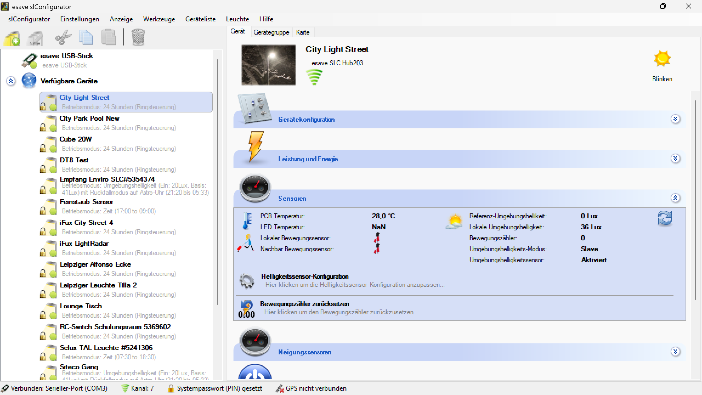

# Sensoren

**Sensoren**

Verwalten und konfigurieren Sie die verschiedenen Sensoren Ihrer Beleuchtungsanlage für eine intelligente und adaptive Beleuchtungssteuerung. Diese Funktion ermöglicht die automatische Erkennung, Konfiguration und Optimierung aller angeschlossenen Sensortypen.

## Hauptbereiche

### 1. Sensor-Erkennung

- Automatische Erkennung kompatibler Sensoren beim Systemstart
- Dynamische Erstellung neuer Abschnitte für erkannte Sensoren
- Anzeige von Sensorinformationen und aktuellen Messwerten

### 2. Sensor-Konfiguration

- Detaillierte Konfigurationsoptionen für jeden Sensortyp
- Anpassung der Sensorparameter an spezifische Anforderungen
- Kalibrierung und Feinabstimmung der Sensorfunktionen

## Unterstützte Sensortypen

### Bewegungssensoren

- **PIR-Sensoren**: Passive Infrarot-Bewegungsmelder für Personenerkennung
- **Radar-Sensoren**: Hochfrequenz-Bewegungsdetektoren für präzise Erkennung
- **Ultraschall-Sensoren**: Schallbasierte Bewegungserkennung
- **Kombinierte Sensoren**: Mehrtechnologie-Sensoren für optimale Erkennung

### Lichtsensoren

- **Umgebungslichtsensoren**: Messung der natürlichen Beleuchtungsstärke
- **Farbtemperatur-Sensoren**: Erkennung der Lichtfarbe für adaptive Steuerung
- **Spektralsensoren**: Detaillierte Analyse des Lichtspektrums
- **Luxmeter**: Präzise Messung der Beleuchtungsstärke

### Präsenzsensoren

- **Mikrowellen-Sensoren**: Erkennung kleinster Bewegungen
- **Kamera-basierte Sensoren**: Intelligente Bildauswertung für Anwesenheitserkennung
- **Wärmebildsensoren**: Thermische Personenerkennung
- **Multisensor-Arrays**: Kombinierte Erfassung verschiedener Parameter

### Umweltsensoren

- **Temperatursensoren**: Messung der Umgebungstemperatur
- **Feuchtigkeitssensoren**: Überwachung der Luftfeuchtigkeit
- **Luftqualitätssensoren**: Messung von CO2 und anderen Luftparametern
- **Geräuschsensoren**: Akustische Umgebungsanalyse

## Sensor-Konfiguration

### Grundeinstellungen

- **Empfindlichkeit**: Anpassung der Sensorempfindlichkeit an Umgebungsbedingungen
- **Erfassungsbereich**: Definition des Überwachungsbereichs
- **Reaktionszeit**: Einstellung der Ansprechzeit des Sensors
- **Nachlaufzeit**: Konfiguration der Verzögerung nach Signalerkennung

### Erweiterte Einstellungen

- **Filterung**: Eliminierung von Störsignalen und Fehlalarmen
- **Kalibrierung**: Anpassung an spezifische Umgebungsbedingungen
- **Schwellenwerte**: Definition von Auslöseschwellen
- **Hysterese**: Vermeidung von Signalflackern durch Hysterese-Einstellungen

### Spezielle Konfigurationen

- **Tageslichtabhängigkeit**: Anpassung der Sensoraktivität an Tageslicht
- **Zeitfenster**: Beschränkung der Sensoraktivität auf bestimmte Zeiten
- **Richtungsfilter**: Erkennung nur aus bestimmten Richtungen
- **Geschwindigkeitsfilter**: Unterscheidung zwischen schnellen und langsamen Bewegungen

## Automatische Sensor-Erkennung

### Erkennungsprozess

1. **Systemstart**: Automatische Suche nach kompatiblen Sensoren
2. **Identifikation**: Erkennung des Sensortyps und der Spezifikationen
3. **Konfiguration**: Automatische Erstellung der Grundkonfiguration
4. **Integration**: Einbindung in die Beleuchtungssteuerung
5. **Validierung**: Überprüfung der korrekten Funktion

### Unterstützte Schnittstellen

- **Analoge Eingänge**: 0-10V, 4-20mA Signale
- **Digitale Eingänge**: Schaltsignale und Impulse
- **I2C-Bus**: Digitale Sensorkommunikation
- **SPI-Schnittstelle**: Hochgeschwindigkeits-Datenübertragung
- **RS485/Modbus**: Industrielle Kommunikationsprotokolle
- **Wireless**: Funk-basierte Sensoren (Zigbee, LoRa, etc.)

## Sensor-Anwendungen

### Bürogebäude

- **Arbeitsplatzbeleuchtung**: Anwesenheitserkennung für individuelle Arbeitsplätze
- **Besprechungsräume**: Automatische Beleuchtungssteuerung bei Raumbelegung
- **Flure**: Bewegungsgesteuerte Beleuchtung für Verkehrswege
- **Tageslichtregelung**: Automatische Anpassung an natürliches Licht

### Industrielle Anwendungen

- **Produktionshallen**: Arbeitsplatzspezifische Beleuchtungssteuerung
- **Lagerbereiche**: Bedarfsgesteuerte Beleuchtung für Lagerumschlag
- **Sicherheitszonen**: Erweiterte Sensorik für kritische Bereiche
- **Energiemanagement**: Optimierung des Energieverbrauchs

### Einzelhandel

- **Verkaufsflächen**: Kundenfrequenz-basierte Beleuchtungssteuerung
- **Schaufenster**: Tageslichtabhängige Präsentationsbeleuchtung
- **Lager**: Bewegungsgesteuerte Arbeitsplatzbeleuchtung
- **Sicherheit**: Überwachung und Notfallbeleuchtung

### Öffentliche Gebäude

- **Verwaltungsräume**: Energieeffiziente Beleuchtungssteuerung
- **Publikumsbereiche**: Anpassung an Besucherfrequenz
- **Veranstaltungsräume**: Flexible Beleuchtungsszenarien
- **Außenbereiche**: Wetterabhängige Beleuchtungssteuerung

## Sensor-Wartung und Kalibrierung

### Wartungsmaßnahmen

- **Regelmäßige Reinigung**: Sauberkeit der Sensoroberflächen
- **Funktionsprüfung**: Periodische Überprüfung der Sensorfunktion
- **Kalibrierung**: Anpassung an veränderte Umgebungsbedingungen
- **Firmware-Updates**: Aktualisierung der Sensorsoftware

### Kalibrierungsverfahren

- **Automatische Kalibrierung**: Selbstständige Anpassung der Sensoren
- **Manuelle Kalibrierung**: Benutzergesteuerte Kalibrierung
- **Referenzmessungen**: Vergleich mit bekannten Referenzwerten
- **Feldkalibrierung**: Anpassung unter realen Betriebsbedingungen

### Diagnose und Fehlerbehebung

- **Statusüberwachung**: Kontinuierliche Überwachung der Sensorfunktion
- **Fehlerdiagnose**: Identifikation von Sensorproblemen
- **Alarmierung**: Benachrichtigung bei Sensorausfällen
- **Ersatzstrategien**: Fallback-Verhalten bei Sensorausfall

## Sensor-Integration

### Systemintegration

- **Beleuchtungssteuerung**: Direkte Integration in die Beleuchtungslogik
- **Gebäudeautomation**: Anbindung an übergeordnete Systeme
- **Energiemanagement**: Integration in Energiemanagementsysteme
- **Sicherheitssysteme**: Verbindung mit Sicherheits- und Alarmanlagen

### Datenverarbeitung

- **Signalfilterung**: Eliminierung von Störsignalen
- **Datenanalyse**: Auswertung von Sensortrends
- **Mustererkennung**: Identifikation wiederkehrender Muster
- **Predictive Analytics**: Vorhersage von Sensorbedürfnissen

## Vorteile der Sensor-Integration

### Automatisierung

- **Hands-free Betrieb**: Vollautomatische Beleuchtungssteuerung
- **Adaptive Steuerung**: Anpassung an wechselnde Bedingungen
- **Intelligente Reaktion**: Lernfähige Sensorik
- **Optimierte Performance**: Kontinuierliche Verbesserung

### Energieeffizienz

- **Bedarfsgerechte Beleuchtung**: Beleuchtung nur bei Bedarf
- **Tageslichtnutzung**: Optimale Nutzung natürlichen Lichts
- **Standby-Reduzierung**: Minimierung von Leerlaufzeiten
- **Lastoptimierung**: Intelligente Lastverteilung

### Komfort und Sicherheit

- **Benutzerkomfort**: Automatische Anpassung an Benutzerbedürfnisse
- **Sicherheitsbeleuchtung**: Zuverlässige Notfallbeleuchtung
- **Wohlbefinden**: Optimale Beleuchtung für Gesundheit und Produktivität
- **Sicherheit**: Erhöhte Sicherheit durch intelligente Überwachung

## Zukunftsperspektiven

### Technologische Entwicklungen

- **KI-Integration**: Maschinelles Lernen für intelligente Sensorik
- **IoT-Vernetzung**: Vernetzte Sensoren für Smart Buildings
- **Edge Computing**: Lokale Datenverarbeitung für schnelle Reaktion
- **5G-Konnektivität**: Hochgeschwindigkeits-Datenübertragung

### Neue Sensortypen

- **Biometrische Sensoren**: Erkennung von Vitalparametern
- **Gesichtserkennung**: Personalisierte Beleuchtungssteuerung
- **Emotionserkennung**: Stimmungsabhängige Beleuchtung
- **Umweltanalytik**: Erweiterte Umweltüberwachung

Die Sensor-Integration bietet eine umfassende Lösung für intelligente Beleuchtungssteuerung und ermöglicht eine optimale Balance zwischen Komfort, Effizienz und Sicherheit durch adaptive und lernfähige Sensorik.