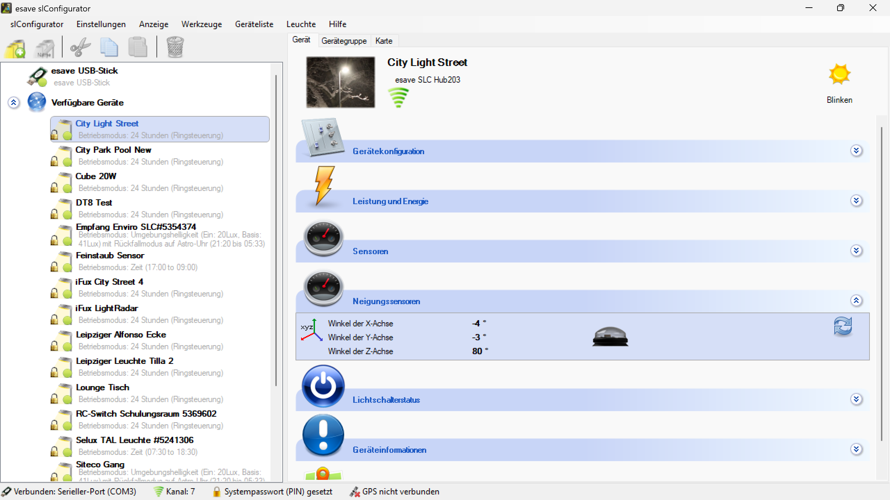

# Neigungssensor

**Neigungssensor**

Konfigurieren und überwachen Sie den integrierten Neigungssensor für die Erkennung von Änderungen der Geräteposition und -ausrichtung. Diese Funktion ermöglicht es, automatische Reaktionen auf Bewegungen, Erschütterungen oder Manipulationen des Beleuchtungsgeräts zu implementieren.

## Hauptbereiche

### 1. Sensor-Konfiguration

- Zentrale Einstellungen für den Neigungssensor
- Konfiguration der Empfindlichkeit und Triggerschwellen
- Anpassung der Reaktionsparameter an spezifische Anforderungen

### 2. Status-Überwachung

- Echtzeitanzeige der aktuellen Neigungswerte
- Visualisierung der Sensorausrichtung und -position
- Historische Daten und Ereignisprotokollierung

## Neigungssensor-Funktionen

### Grundlegende Erkennung

- **Neigungswinkel-Messung**: Präzise Erfassung von Neigungswinkeln in allen Achsen
- **Orientierungserkennung**: Bestimmung der räumlichen Ausrichtung des Geräts
- **Bewegungsdetektion**: Erkennung von Positionsänderungen und Bewegungen
- **Erschütterungserkennung**: Registrierung von Vibrationen und Stößen

### Erweiterte Funktionen

- **Kalibrierung**: Anpassung des Sensors an die Installationsposition
- **Empfindlichkeitseinstellung**: Feinabstimmung der Auslöseschwellen
- **Filterung**: Eliminierung von Störsignalen und Fehlalarmen
- **Hysterese**: Vermeidung von Signalflackern bei Grenzwerten

## Konfigurationsoptionen

### Empfindlichkeitseinstellungen

- **Neigungsempfindlichkeit**: Einstellung der minimalen Neigungsänderung für Auslösung
- **Bewegungsempfindlichkeit**: Konfiguration der Bewegungserkennungsschwelle
- **Erschütterungsempfindlichkeit**: Anpassung der Vibrationsdetektionsschwelle
- **Zeitfilter**: Definition der Mindestdauer für gültige Signale

### Auslöse-Parameter

- **Triggerschwellen**: Definition der Grenzwerte für verschiedene Ereignistypen
- **Reaktionszeit**: Einstellung der Ansprechzeit des Sensors
- **Nachlaufzeit**: Konfiguration der Verzögerung nach Ereigniserkennung
- **Wiederherstellungszeit**: Zeitspanne bis zur Normalisierung nach einem Ereignis

### Alarmierungsoptionen

- **Sofortalarme**: Unmittelbare Benachrichtigung bei kritischen Ereignissen
- **Verzögerte Alarme**: Zeitverzögerte Alarmierung zur Vermeidung von Fehlalarmen
- **Eskalationsebenen**: Gestufte Alarmierung je nach Ereignisschwere
- **Stille Überwachung**: Protokollierung ohne aktive Alarmierung

## Anwendungsszenarien

### Diebstahlschutz

- **Manipulationserkennung**: Erkennung von Versuchen, das Gerät zu entfernen oder zu bewegen
- **Vandalismus-Schutz**: Registrierung von Beschädigungsversuchen
- **Unbefugte Zugriffe**: Überwachung von unauthorisierten Gerätebewegungen
- **Sicherheitsalarmierung**: Automatische Benachrichtigung bei Sicherheitsereignissen

### Wartung und Service

- **Installationsvalidierung**: Überprüfung der korrekten Geräteausrichtung
- **Wartungsplanung**: Erkennung von Verschleiß oder mechanischen Problemen
- **Qualitätskontrolle**: Überwachung der Gerätestabilität
- **Präventive Wartung**: Frühzeitige Erkennung von Problemen

### Umweltüberwachung

- **Wettermonitoring**: Erkennung von windbedingte Bewegungen
- **Strukturüberwachung**: Monitoring von Gebäudebewegungen
- **Erdbebenerkennung**: Registrierung seismischer Aktivitäten
- **Schwingungsanalyse**: Überwachung von Maschinenvibratione

### Betriebsoptimierung

- **Ausrichtungskorrektur**: Automatische Anpassung bei Positionsänderungen
- **Leistungsoptimierung**: Optimierung basierend auf Geräteneigung
- **Energiemanagement**: Anpassung der Energieverteilung an die Position
- **Automatische Kalibrierung**: Selbstständige Rekalibrierung bei Bedarf

## Technische Spezifikationen

### Sensor-Eigenschaften

- **Messbereich**: ±90° in allen Achsen (X, Y, Z)
- **Auflösung**: 0.1° Genauigkeit
- **Reaktionszeit**: < 100ms
- **Betriebstemperatur**: -40°C bis +85°C
- **Vibrationsfestigkeit**: IEC 60068-2-6 konform
- **Schutzklasse**: IP65 oder höher

### Kalibrierung

- **Werkskalibration**: Präzise Kalibrierung unter Laborbedingungen
- **Feldkalibrierung**: Anpassung an Installationsbedingungen
- **Automatische Nullpunkt-Justierung**: Selbstständige Kalibrierung
- **Temperaturkompensation**: Automatische Korrektur temperaturbedingter Drift

## Sicherheitsfunktionen

### Manipulationsschutz

- **Tamper-Erkennung**: Sofortige Erkennung von Manipulationsversuchen
- **Bewegungsprotokollierung**: Detaillierte Aufzeichnung aller Bewegungen
- **Forensische Daten**: Speicherung von Ereignisdaten für Nachforschungen
- **Backup-Systeme**: Redundante Überwachung kritischer Parameter

### Alarmintegration

- **Sicherheitssysteme**: Integration in bestehende Alarmanlagen
- **Überwachungszentralen**: Anbindung an Sicherheitsleitstellen
- **Mobile Benachrichtigungen**: Sofortige Alarme auf mobile Geräte
- **Eskalationsverfahren**: Automatische Weiterleitung bei kritischen Ereignissen

## Wartung und Diagnose

### Selbstdiagnose

- **Funktionsprüfung**: Regelmäßige Selbsttests des Sensors
- **Kalibrierungsstatus**: Überwachung der Kalibrierungsgenauigkeit
- **Temperaturmonitoring**: Überwachung der Betriebstemperatur
- **Alterungsüberwachung**: Erkennung von Sensor-Degradation

### Wartungsmaßnahmen

- **Regelmäßige Kalibrierung**: Periodische Rekalibrierung des Sensors
- **Reinigung**: Schutz vor Verschmutzung und Korrosion
- **Firmware-Updates**: Aktualisierung der Sensor-Software
- **Präventive Wartung**: Vorbeugende Instandhaltungsmaßnahmen

### Troubleshooting

- **Fehlerdiagnose**: Systematische Problemidentifikation
- **Kalibrierfehler**: Behebung von Kalibrierungsproblemen
- **Signalstörungen**: Eliminierung von Interferenzen
- **Hardwaredefekte**: Erkennung und Behebung von Hardwareproblemen

## Integration und Kommunikation

### Systemintegration

- **Beleuchtungssteuerung**: Direkte Integration in die Beleuchtungslogik
- **Gebäudeautomation**: Anbindung an Gebäudemanagementsysteme
- **Sicherheitssysteme**: Integration in Sicherheits- und Überwachungsanlagen
- **IoT-Plattformen**: Vernetzung mit Internet-of-Things-Systemen

### Kommunikationsprotokolle

- **Lokale Kommunikation**: Direkte Verbindung zu Beleuchtungscontrollern
- **Netzwerkprotokolle**: TCP/IP, UDP, Modbus, BACnet
- **Wireless-Technologien**: WiFi, Bluetooth, Zigbee, LoRaWAN
- **Cloud-Konnektivität**: Verbindung zu Cloud-basierten Überwachungsplattformen

## Vorteile des Neigungssensors

### Sicherheitsvorteile

- **Diebstahlschutz**: Effektiver Schutz vor Gerätediebstahl
- **Vandalismus-Erkennung**: Frühzeitige Erkennung von Beschädigungsversuchen
- **Sicherheitsmonitoring**: Kontinuierliche Überwachung der Gerätesicherheit
- **Forensische Unterstützung**: Detaillierte Ereignisprotokollierung

### Betriebsvorteile

- **Automatische Überwachung**: Kontinuierliche Überwachung ohne manuellen Aufwand
- **Präventive Wartung**: Frühzeitige Erkennung von Wartungsbedarfen
- **Qualitätssicherung**: Überwachung der Installationsqualität
- **Betriebsoptimierung**: Optimierung basierend auf Positionsdaten

### Wirtschaftliche Vorteile

- **Kosteneinsparung**: Reduzierung von Diebstahl- und Vandalismus-Schäden
- **Wartungseffizienz**: Optimierte Wartungsplanung
- **Versicherungsvorteile**: Mögliche Reduzierung von Versicherungsprämien
- **Lebensdauerverlängerung**: Schutz vor vorzeitiger Beschädigung

## Zukunftsperspektiven

### Technologische Entwicklungen

- **KI-Integration**: Maschinelles Lernen für intelligente Mustererkennung
- **Sensor-Fusion**: Kombination mit anderen Sensortechnologien
- **Edge Computing**: Lokale Datenverarbeitung für schnellere Reaktionen
- **Predictive Analytics**: Vorhersage von Wartungsbedarfen

### Erweiterte Funktionen

- **Gestensteuerung**: Steuerung durch Gerätebewegungen
- **Adaptive Kalibrierung**: Selbstlernende Kalibrierungsalgorithmen
- **Umgebungsadaption**: Anpassung an verschiedene Umgebungsbedingungen
- **Multi-Parameter-Überwachung**: Simultane Überwachung mehrerer physikalischer Parameter

Der Neigungssensor bietet eine umfassende Lösung für die Überwachung und den Schutz von Beleuchtungsgeräten und ermöglicht eine intelligente, proaktive Wartung und Sicherheitsüberwachung für professionelle Beleuchtungsinstallationen.