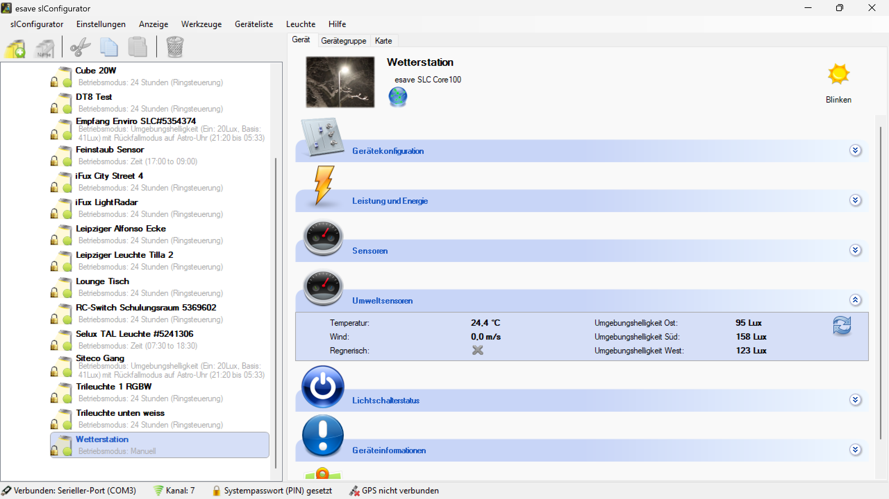

# Umweltsensoren

**Umweltsensoren**

Überwachen und analysieren Sie Umweltparameter mit integrierten Sensoren für eine intelligente und umweltadaptive Beleuchtungssteuerung. Diese Funktion ermöglicht es, die Beleuchtung basierend auf Umgebungsbedingungen zu optimieren und gleichzeitig wertvolle Daten über das Raumklima zu sammeln.

## Hauptbereiche

### 1. Sensor-Dashboard

- Übersichtliche Anzeige aller verfügbaren Umweltsensoren
- Echtzeitanzeige der aktuellen Messwerte
- Grafische Darstellung von Trends und Verläufen

### 2. Sensor-Konfiguration

- Detaillierte Einstellungen für jeden Sensortyp
- Kalibrierung und Schwellenwert-Definition
- Alarmierung und Benachrichtigungsoptionen

## Verfügbare Umweltsensoren

### Temperatursensoren

- **Lufttemperatur**: Messung der Umgebungstemperatur für Komfortoptimierung
- **Oberflächentemperatur**: Überwachung der Gerätetemperatur
- **Temperaturdifferenzen**: Erkennung von Temperaturgradienten
- **Temperaturtrends**: Analyse von Temperaturveränderungen über Zeit

### Feuchtigkeitssensoren

- **Relative Luftfeuchtigkeit**: Messung der Luftfeuchtigkeit für Komfortbewertung
- **Absolute Feuchtigkeit**: Berechnung des absoluten Wassergehalts der Luft
- **Taupunkt**: Bestimmung des Taupunkts zur Kondensationsvermeidung
- **Feuchtigkeitstrends**: Überwachung von Feuchtigkeitsveränderungen

### Luftqualitätssensoren

- **CO2-Konzentration**: Messung der Kohlendioxidkonzentration
- **VOC-Sensoren**: Erkennung flüchtiger organischer Verbindungen
- **Partikelzähler**: Messung von Feinstaub und Luftpartikeln
- **Luftqualitätsindex**: Berechnung eines Gesamtluftqualitätsindex

### Drucksensoren

- **Luftdruck**: Messung des atmosphärischen Drucks
- **Druckveränderungen**: Erkennung von Wetteränderungen
- **Höhenmessung**: Barometrische Höhenbestimmung
- **Drucktrends**: Analyse von Druckveränderungen

### Geräuschsensoren

- **Schallpegel**: Messung des Umgebungsgeräuschpegels
- **Frequenzanalyse**: Analyse verschiedener Frequenzbereiche
- **Lärmspitzen**: Erkennung von Geräuschspitzen
- **Akustische Muster**: Identifikation wiederkehrender Geräuschmuster

## Sensor-Konfiguration

### Allgemeine Einstellungen

- **Messintervall**: Einstellung der Messfrequenz für jeden Sensor
- **Datenglättung**: Filterung von Messwerten zur Rauschreduzierung
- **Kalibrierung**: Anpassung der Sensoren an Referenzwerte
- **Genauigkeitseinstellung**: Konfiguration der Messgenauigkeit

### Schwellenwerte und Alarme

- **Obere Grenzwerte**: Definition maximaler akzeptabler Werte
- **Untere Grenzwerte**: Definition minimaler akzeptabler Werte
- **Hysterese**: Vermeidung von Alarmflackern bei Grenzwerten
- **Alarmverzögerung**: Zeitverzögerung vor Alarmauslösung

### Benachrichtigungsoptionen

- **Sofortalarme**: Unmittelbare Benachrichtigung bei kritischen Werten
- **Trendalarme**: Warnung bei ungünstigen Entwicklungstrends
- **Wartungsalarme**: Erinnerungen für Sensorkalibrierung und -wartung
- **Systemintegration**: Weiterleitung an übergeordnete Managementsysteme

## Beleuchtungssteuerung basierend auf Umweltdaten

### Temperaturabhängige Steuerung

- **Wärmeentwicklung**: Anpassung der Beleuchtung zur Temperaturkontrolle
- **Komfortoptimierung**: Beleuchtungsintensität basierend auf Raumtemperatur
- **Energieeffizienz**: Reduzierung der Wärmelast durch LED-Dimmung
- **Saisonale Anpassung**: Automatische Anpassung an Jahreszeiten

### Feuchtigkeitsbasierte Steuerung

- **Kondensationsvermeidung**: Beleuchtungssteuerung zur Feuchtigkeitskontrolle
- **Komfortbeleuchtung**: Anpassung an optimale Luftfeuchtigkeitswerte
- **Schimmelprävention**: Beleuchtungsunterstützung für Entfeuchtung
- **Pflanzenbeleuchtung**: Spezielle Steuerung für Gewächshaus-Anwendungen

### Luftqualitätsabhängige Steuerung

- **CO2-Responsive Beleuchtung**: Beleuchtungsanpassung bei hoher CO2-Konzentration
- **Luftreinigungsunterstützung**: Koordination mit Luftreinigungssystemen
- **Komfortoptimierung**: Beleuchtung zur Verbesserung des Raumklimas
- **Gesundheitsförderung**: Beleuchtung zur Unterstützung der Luftqualität

## Anwendungsszenarien

### Bürogebäude

- **Arbeitsplatzkomfort**: Optimale Umgebungsbedingungen für Produktivität
- **Energiemanagement**: Koordinierte Steuerung von Beleuchtung und HLK
- **Gesundheitsüberwachung**: Überwachung der Raumluftqualität
- **Compliance**: Einhaltung von Arbeitsplatzrichtlinien

### Industrielle Anwendungen

- **Produktionsklima**: Überwachung kritischer Umgebungsparameter
- **Sicherheitsüberwachung**: Erkennung gefährlicher Umweltbedingungen
- **Qualitätskontrolle**: Umweltdatenlogging für Produktqualität
- **Energieoptimierung**: Koordinierte Steuerung aller Systeme

### Gesundheitswesen

- **Patientenkomfort**: Optimale Umgebungsbedingungen für Genesung
- **Hygienekontrolle**: Überwachung von Luftqualität und Feuchtigkeit
- **Infektionsprävention**: Luftqualitätsmanagement
- **Therapieunterstützung**: Umweltoptimierung für spezielle Therapien

### Bildungseinrichtungen

- **Lernumgebung**: Optimale Bedingungen für Konzentration und Lernen
- **Gesundheitsschutz**: Überwachung der Luftqualität in Klassenräumen
- **Energieeffizienz**: Koordinierte Gebäudesteuerung
- **Komfortoptimierung**: Angenehme Umgebung für Schüler und Lehrer

### Einzelhandel

- **Kundenkomfort**: Angenehme Einkaufsatmosphäre
- **Produktschutz**: Umweltüberwachung für empfindliche Waren
- **Energiemanagement**: Optimierung der Betriebskosten
- **Saisonale Anpassung**: Anpassung an wechselnde Wetterbedingungen

## Datenanalyse und Reporting

### Echtzeitüberwachung

- **Live-Dashboard**: Aktuelle Anzeige aller Sensorwerte
- **Trendgrafiken**: Grafische Darstellung von Messwertverläufen
- **Alarmstatus**: Übersicht über aktuelle Alarme und Warnungen
- **Systemstatus**: Anzeige der Sensorfunktionalität

### Historische Datenanalyse

- **Langzeittrends**: Analyse von Umweltveränderungen über Monate/Jahre
- **Saisonale Muster**: Erkennung jahreszeitlicher Schwankungen
- **Korrelationsanalyse**: Zusammenhänge zwischen verschiedenen Parametern
- **Benchmarking**: Vergleich mit Referenzwerten und Standards

### Berichtsfunktionen

- **Umweltberichte**: Detaillierte Berichte über Umweltbedingungen
- **Compliance-Berichte**: Nachweise für Richtlinienkonformität
- **Energieberichte**: Korrelation zwischen Umwelt und Energieverbrauch
- **Wartungsberichte**: Dokumentation von Sensor-Wartungsaktivitäten

## Wartung und Kalibrierung

### Präventive Wartung

- **Kalibrierungszyklen**: Regelmäßige Überprüfung der Sensorgenauigkeit
- **Reinigungsintervalle**: Wartung der Sensoroberflächen
- **Funktionsprüfung**: Periodische Tests aller Sensorfunktionen
- **Firmware-Updates**: Aktualisierung der Sensor-Software

### Kalibrierungsverfahren

- **Referenzkalibrierung**: Vergleich mit kalibrierten Referenzgeräten
- **Mehrstufige Kalibrierung**: Kalibrierung bei verschiedenen Messwerten
- **Automatische Kalibrierung**: Selbstständige Sensorkalibrierung
- **Feldkalibrierung**: Kalibrierung unter realen Betriebsbedingungen

### Qualitätssicherung

- **Messwertvalidierung**: Plausibilitätsprüfung der Sensordaten
- **Redundanzprüfung**: Vergleich mit anderen Sensoren
- **Driftüberwachung**: Erkennung von Sensordrift
- **Fehlerdiagnose**: Systematische Problemidentifikation

## Vorteile der Umweltsensorik

### Komfort und Gesundheit

- **Optimales Raumklima**: Perfekte Umgebungsbedingungen für Nutzer
- **Gesundheitsschutz**: Frühzeitige Erkennung ungesunder Bedingungen
- **Wohlbefinden**: Verbesserung des allgemeinen Wohlbefindens
- **Produktivitätssteigerung**: Optimale Arbeitsbedingungen

### Energieeffizienz

- **Bedarfsgerechte Steuerung**: Beleuchtung nur bei optimalen Bedingungen
- **Systemintegration**: Koordinierte Steuerung aller Gebäudesysteme
- **Energieeinsparung**: Reduzierung des Gesamtenergieverbrauchs
- **Lastoptimierung**: Intelligente Verteilung der Energielasten

### Betriebsvorteile

- **Predictive Maintenance**: Vorhersage von Wartungsbedarfen
- **Automatisierung**: Vollautomatische Umweltüberwachung
- **Dokumentation**: Vollständige Protokollierung aller Umweltdaten
- **Compliance**: Einhaltung gesetzlicher Vorschriften

Die Umweltsensorik bietet eine umfassende Lösung für die intelligente Überwachung und Steuerung von Umweltparametern und ermöglicht eine optimale Balance zwischen Komfort, Gesundheit, Energieeffizienz und Betriebssicherheit.