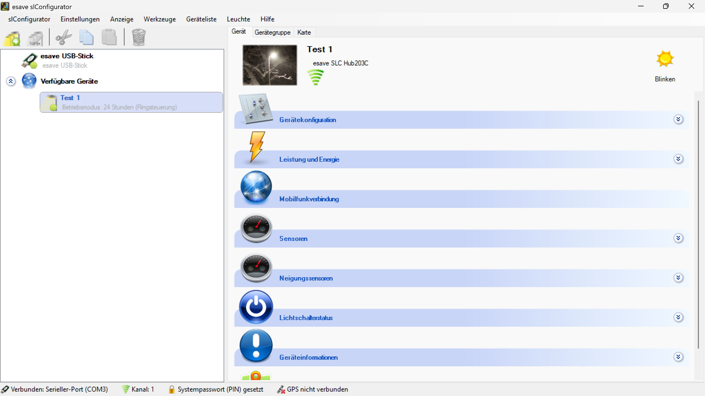

# Geräte einstellungen

  

*Haben Sie ein Gerät ausgewählt, erscheinen rechts die konfigurations Sektionen. Je nach Gerät das Sie konfigurieren sind verschiedene module nicht vorhanden.*  

[Namen Ändern](./1-namen-aendern/)

---

[Gerätekonfiguration](./2-geraetekonfiguration/)

---

[Leistung und Energie](./3-leistung-und-energie/)

---

[Mobilfunkverbindung](./4-mobilfunkverbindung/)

---

[Externe Eingänge](./5-externe-eingaenge/)

---

[Sensoren](./6-sensoren/)

---

[Neigungssensor](./7-neigungssensor/)

---

[Umweltsensoren](./8-umweltsensoren/)

---

[Umweltsensor Daten](./9-umweltsensordaten/)

---

[Radar Bewegungsmelder](./10-radar-bewegungsmelder/)

---

[Geräteinformationen](./11-geraeteinformationen/)

---

[Karte und GPS](./12-karte-und-gps/)

---

[Stromzähler](./14-stromzaehler/)

---

[Lichtschalterstatus](./15-lichtschalterstatus/)

---