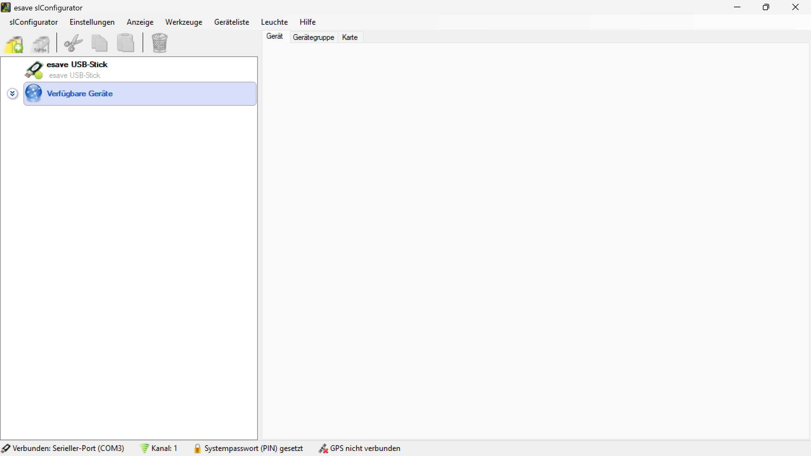
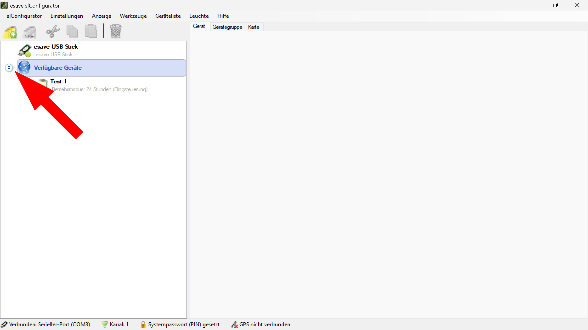
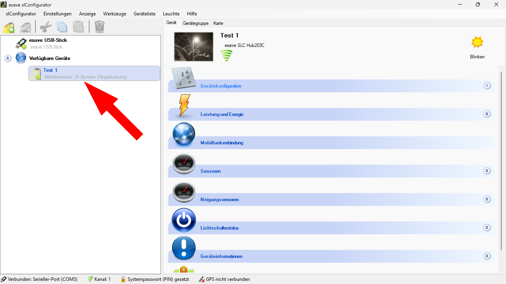

# Verfügbare geräte  

*Hier werden Ihnen die verfügbaren Geräte in einer Liste angezeigt.*  

*Klicken Sie auf das Symbol mit den zwei Pfeilen um die Geräte anzuzeigen oder auszublenden.*  
 

*Wählen Sie das zu konfigurierende Gerät aus der Liste aus.*