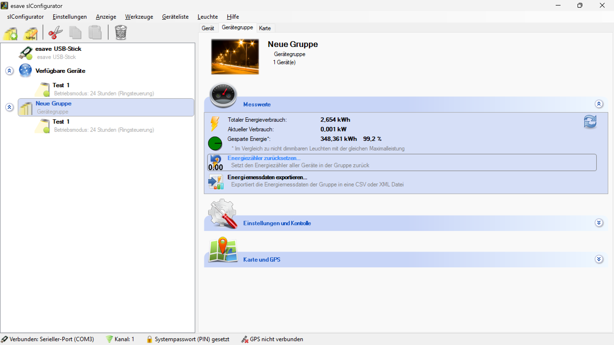

# Energiezähler Zurücksetzen

*Energiezähler zurücksetzen - Setzt den Energiezähler aller Geräte in der Gruppe zurück*

*Bestätigung Leistungszähler zurücksetzen - Sind sie sicher, dass sie den Leistungs- und Betriebszeitzähler zurücksetzen wollen?*

**Gruppen-Energiezähler Management**

Zentrale Zurücksetzung der Energiezähler für alle Geräte innerhalb einer Gruppe mit Sicherheitsbestätigung, Datenerhaltung und systematischer Verarbeitung.

## Hauptbereiche

### 1. Energieverbrauchsanzeige
- Totaler Energieverbrauch der Gerätegruppe
- Aktueller Verbrauch in Echtzeit
- Gesparte Energie im Vergleich zu herkömmlichen Systemen
- Historische Verbrauchsdaten

### 2. Zähler-Zurücksetzung
- Systemweite Zurücksetzung aller Energiezähler
- Sicherheitsbestätigung vor Ausführung
- Batch-Verarbeitung für alle Gruppengeräte
- Protokollierung der Zurücksetzungsaktivitäten

### 3. Datenexport
- Export der Energiemessdaten vor Zurücksetzung
- CSV- und XML-Formatunterstützung
- Historische Datenarchivierung
- Backup-Funktionalität

### 4. Bestätigungsprozess
- Sicherheitsabfrage vor kritischen Operationen
- Warnhinweise bei Datenverlust
- Benutzerverifizierung
- Rollback-Mechanismen

## Energieverbrauchsübersicht

### Hauptmetriken
- **Totaler Energieverbrauch**: Kumulierter Gesamtverbrauch (z.B. 2.654 kWh)
- **Aktueller Verbrauch**: Momentaner Leistungsverbrauch (z.B. 0.001 kW)
- **Gesparte Energie**: Energieeinsparung gegenüber konventionellen Systemen (z.B. 348.361 kWh)
- **Effizienz-Prozentsatz**: Energieeffizienz-Bewertung (z.B. 99.2%)

### Verbrauchsanalyse
- **Trends**: Langfristige Verbrauchstrends und Muster
- **Spitzenwerte**: Identifikation von Verbrauchsspitzen
- **Durchschnittswerte**: Berechnung durchschnittlicher Verbrauchswerte
- **Vergleichsanalyse**: Gegenüberstellung mit Referenzsystemen

### Echtzeit-Monitoring
- **Live-Daten**: Kontinuierliche Aktualisierung der Verbrauchswerte
- **Alarme**: Warnungen bei ungewöhnlichen Verbrauchsmustern
- **Threshold-Überwachung**: Überwachung definierter Grenzwerte
- **Performance-Indikatoren**: Visuelle Darstellung der Systemleistung

## Zurücksetzungsprozess

### Schritt 1: Funktion aktivieren
- **Funktion**: "Energiezähler zurücksetzen..." in der Messwerte-Sektion
- **Beschreibung**: "Setzt den Energiezähler aller Geräte in der Gruppe zurück"
- **Hervorhebung**: Funktion wird blau hervorgehoben bei Auswahl
- **Gruppenbezug**: Bezieht sich auf die ausgewählte Gerätegruppe

### Schritt 2: Sicherheitsbestätigung
- **Dialog-Titel**: "Bestätigung Leistungszähler zurücksetzen"
- **Warnung**: Gelbes Warnsymbol für kritische Operation
- **Sicherheitsabfrage**: "Sind sie sicher, dass sie den Leistungs- und Betriebszeitzähler zurücksetzen wollen?"
- **Bestätigungsoptionen**: "Ja" oder "Nein" für finale Entscheidung

### Schritt 3: Verarbeitung
- **Batch-Verarbeitung**: Simultane Zurücksetzung aller Gruppengeräte
- **Fortschrittsanzeige**: Echtzeit-Status der Zurücksetzung
- **Fehlerbehandlung**: Robuste Behandlung von Verarbeitungsfehlern
- **Erfolgsmeldung**: Bestätigung der erfolgreichen Zurücksetzung

## Datenmanagement

### Backup-Strategien
- **Automatisches Backup**: Sicherung vor Zurücksetzung
- **Manuelle Backups**: Benutzergesteuerte Datensicherung
- **Versionsverwaltung**: Historische Datenversionen
- **Wiederherstellungsoptionen**: Rekonstruktion verlorener Daten

### Export-Funktionalitäten
- **Vor-Zurücksetzung-Export**: Automatische Datensicherung
- **Format-Optionen**: CSV, XML, JSON Exportformate
- **Filterung**: Selektive Datenexporte
- **Zeitraum-Auswahl**: Spezifische Zeiträume exportieren

### Archivierung
- **Langzeitspeicherung**: Dauerhafte Archivierung historischer Daten
- **Komprimierung**: Effiziente Speichernutzung
- **Indizierung**: Schnelle Datensuche und -zugriff
- **Compliance**: Erfüllung regulatorischer Anforderungen

## Sicherheitsmaßnahmen

### Zugriffskontrollen
- **Benutzerauthentifizierung**: Sichere Anmeldung für kritische Operationen
- **Rollenbasierte Berechtigungen**: Eingeschränkter Zugriff auf Zurücksetzungsfunktionen
- **Audit-Trail**: Vollständige Protokollierung aller Zurücksetzungsaktivitäten
- **Vier-Augen-Prinzip**: Optionale Mehrfachbestätigung für kritische Operationen

### Datenschutz
- **Verschlüsselung**: Sichere Speicherung der Verbrauchsdaten
- **Anonymisierung**: Schutz sensibler Verbrauchsinformationen
- **Zugriffsprotokolle**: Überwachung der Datenzugriffe
- **Compliance**: Einhaltung von Datenschutzbestimmungen

### Fehlerbehandlung
- **Rollback-Mechanismen**: Wiederherstellung bei fehlerhaften Zurücksetzungen
- **Validation**: Überprüfung der Datenintegrität
- **Notfall-Prozeduren**: Verfahren bei Systemausfällen
- **Recovery-Optionen**: Wiederherstellung beschädigter Daten

## Technische Implementierung

### Zähler-Architektur
- **Hardware-Zähler**: Integrierte Energiemessung in den Geräten
- **Software-Zähler**: Zusätzliche Berechnungsebene für Aggregation
- **Kalibration**: Regelmäßige Kalibrierung der Messgeräte
- **Synchronisation**: Zeitgenaue Messdatenerfassung

### Datenverarbeitung
- **Aggregation**: Zusammenfassung von Einzelmessungen
- **Normalisierung**: Standardisierung der Messdaten
- **Validierung**: Überprüfung der Datenplausibilität
- **Transformation**: Umwandlung in verschiedene Einheiten

### Kommunikation
- **Batch-Kommandos**: Effiziente Gruppenkommunikation
- **Synchronisation**: Koordinierte Zurücksetzung aller Geräte
- **Fehlerbehandlung**: Robuste Kommunikation bei Ausfällen
- **Status-Reporting**: Kontinuierliche Statusmeldungen

## Anwendungsszenarien

### Regelmäßige Wartung
- **Periodische Zurücksetzung**: Planmäßige Zurücksetzung nach Wartungszyklen
- **Saisonale Resets**: Zurücksetzung zu bestimmten Zeitpunkten
- **Audit-Vorbereitung**: Zurücksetzung vor Compliance-Prüfungen
- **Baseline-Erstellung**: Neue Referenzwerte für Vergleiche

### Systemoptimierung
- **Performance-Bewertung**: Messung der Systemleistung über definierte Zeiträume
- **Effizienz-Analyse**: Bewertung von Optimierungsmaßnahmen
- **Vergleichsstudien**: Vorher-Nachher-Vergleiche
- **Benchmark-Erstellung**: Referenzwerte für Systemvergleiche

### Problembehebung
- **Fehlerdiagnose**: Zurücksetzung zur Isolierung von Problemen
- **Systemreinigung**: Beseitigung korrupter Daten
- **Neustart**: Frischer Start nach Systemänderungen
- **Kalibrierung**: Zurücksetzung für Neukalibrierung

### Compliance
- **Regulatorische Anforderungen**: Erfüllung gesetzlicher Berichtspflichten
- **Audit-Unterstützung**: Vorbereitung auf Compliance-Prüfungen
- **Dokumentation**: Nachweis ordnungsgemäßer Datenführung
- **Zertifizierung**: Unterstützung bei Zertifizierungsverfahren

## Monitoring und Berichterstattung

### Echtzeit-Überwachung
- **Live-Dashboard**: Kontinuierliche Anzeige der Verbrauchswerte
- **Trend-Analyse**: Erkennung von Verbrauchsmustern
- **Anomalie-Erkennung**: Automatische Identifikation ungewöhnlicher Werte
- **Predictive Analytics**: Vorhersage zukünftiger Verbrauchstrends

### Berichterstellung
- **Automatische Berichte**: Regelmäßige Generierung von Verbrauchsberichten
- **Benutzerdefinierte Berichte**: Individuelle Berichtsanpassung
- **Grafische Darstellung**: Visuelle Aufbereitung der Daten
- **Export-Optionen**: Verschiedene Ausgabeformate

### Historische Analyse
- **Langzeit-Trends**: Analyse von Verbrauchsmustern über längere Zeiträume
- **Saisonale Variation**: Erkennung saisonaler Verbrauchsmuster
- **Effizienz-Trends**: Bewertung der Energieeffizienz-Entwicklung
- **Kosteneinsparungen**: Berechnung der realisierten Einsparungen

## Qualitätssicherung

### Datenvalidierung
- **Plausibilitätsprüfung**: Überprüfung der Messwerte auf Plausibilität
- **Konsistenz-Checks**: Validierung der Datenkonsistenz
- **Outlier-Erkennung**: Identifikation statistischer Ausreißer
- **Korrektur-Mechanismen**: Automatische Korrektur fehlerhafter Daten

### Kalibrierung
- **Regelmäßige Kalibrierung**: Planmäßige Kalibrierung der Messgeräte
- **Referenz-Standards**: Verwendung zertifizierter Referenzwerte
- **Drift-Kompensation**: Korrektur altersbedingter Messabweichungen
- **Dokumentation**: Vollständige Kalibrierungsdokumentation

### Genauigkeit
- **Messgenauigkeit**: Spezifikation der Messgenauigkeit
- **Fehlertoleranz**: Definition akzeptabler Abweichungen
- **Unsicherheitsanalyse**: Bewertung der Messunsicherheit
- **Validierung**: Regelmäßige Validierung der Messgenauigkeit

## Best Practices

### Vor der Zurücksetzung
- **Datenbackup**: Vollständige Sicherung aller Verbrauchsdaten
- **Dokumentation**: Aufzeichnung des aktuellen Systemzustands
- **Planung**: Terminierung der Zurücksetzung außerhalb kritischer Zeiten
- **Benachrichtigung**: Information aller relevanten Stakeholder

### Während der Zurücksetzung
- **Überwachung**: Kontinuierliche Beobachtung des Zurücksetzungsprozesses
- **Stabilität**: Sicherstellung stabiler Systembedingungen
- **Dokumentation**: Protokollierung aller Aktivitäten
- **Bereitschaft**: Vorbereitung auf mögliche Probleme

### Nach der Zurücksetzung
- **Validierung**: Überprüfung der erfolgreichen Zurücksetzung
- **Funktionstest**: Test der Messfunktionalität
- **Dokumentation**: Aktualisierung der Systemdokumentation
- **Monitoring**: Überwachung der neuen Messwerte

## Vorteile der Gruppen-Energiezähler-Zurücksetzung

### Effizienz
- **Batch-Verarbeitung**: Simultane Zurücksetzung aller Gruppengeräte
- **Zeitersparnis**: Reduzierte Bearbeitungszeit durch Automatisierung
- **Zentrale Verwaltung**: Einheitliche Kontrolle aller Energiezähler
- **Skalierbarkeit**: Effiziente Verarbeitung großer Gerätemengen

### Sicherheit
- **Bestätigungsprozess**: Mehrfache Sicherheitsabfragen
- **Backup-Integration**: Automatische Datensicherung
- **Audit-Trail**: Vollständige Nachverfolgbarkeit
- **Rollback-Mechanismen**: Wiederherstellung bei Problemen

### Datenintegrität
- **Konsistente Zurücksetzung**: Einheitliche Zurücksetzung aller Geräte
- **Validation**: Überprüfung der Datenintegrität
- **Synchronisation**: Zeitgenaue Koordination
- **Fehlerbehandlung**: Robuste Behandlung von Ausnahmen

### Compliance
- **Regulatorische Unterstützung**: Erfüllung gesetzlicher Anforderungen
- **Dokumentation**: Vollständige Protokollierung aller Aktivitäten
- **Audit-Vorbereitung**: Unterstützung bei Compliance-Prüfungen
- **Transparenz**: Nachvollziehbare Prozesse

> ## ℹ️ Energiezähler Zurücksetzen
>
> **Zentrale Zurücksetzung der Gruppen-Energiezähler**
>
> Setzt den Energiezähler aller Geräte in der Gruppe zurück. Gruppeneinstellungen werden automatisch auf alle Leuchten innerhalb der Gruppe übertragen.
>
> ### Hauptfunktionen:
> - **Energieverbrauchsübersicht**: Totaler Verbrauch, aktueller Verbrauch und Energieeinsparungen
> - **Sicherheitsbestätigung**: Warnung und Bestätigung vor kritischen Operationen
> - **Batch-Verarbeitung**: Simultane Zurücksetzung aller Gruppengeräte
> - **Datenbackup**: Automatische Sicherung vor Zurücksetzung
> - **Audit-Trail**: Vollständige Protokollierung aller Zurücksetzungsaktivitäten

*Die Energiezähler-Zurücksetzung ermöglicht eine sichere, effiziente und nachverfolgbare Zurücksetzung aller Energiezähler in einer Gerätegruppe mit umfassenden Sicherheitsmaßnahmen und Datenerhaltung.*