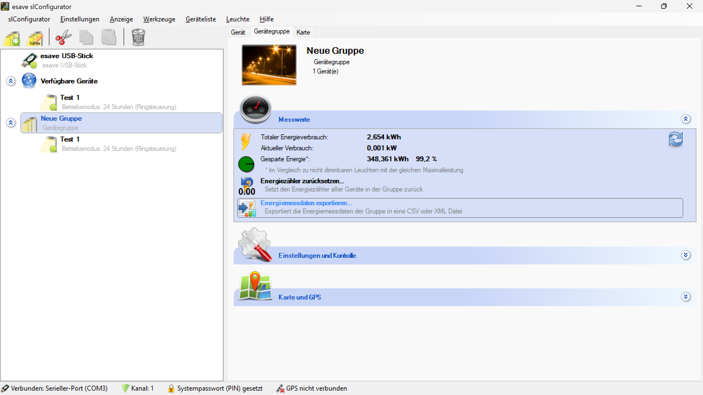

# Energiemessdaten Exportieren

*Energiemessdaten exportieren - Exportiert die Energiemessdaten der Gruppe in eine CSV oder XML Datei*

*Gruppen-Energiedaten exportieren - Umfangreiche Konfiguration für den Export von Energiemessdaten mit Format- und Spaltenauswahl*

**Gruppen-Energiedaten Export-Management**

Umfassende Export-Funktionalität für Energiemessdaten mit konfigurierbaren Formaten, selektiven Spalten und erweiterten Optionen für Datenanalyse und Berichterstattung.

## Hauptbereiche

### 1. Export-Formate
- CSV (Excel) Format für Tabellenkalkulationen
- XML Format für strukturierte Datenverarbeitung
- Konfigurierbare Trennzeichen und Formatierungen
- Kompatibilität mit verschiedenen Analysewerkzeugen

### 2. Datenauswahl
- Selektive Spaltenauswahl für angepasste Exporte
- Gruppen- und gerätespezifische Filterung
- Zeitraum-basierte Datenexporte
- Hierarchische Datenstrukturierung

### 3. Konfigurationsoptionen
- Spaltenüberschriften und Trennzeichen
- Dateinamen und Speicherort-Optionen
- Automatische Dateierstellung nach Export
- Vorschau-Funktionalität

### 4. Datenvalidierung
- Vollständigkeitsprüfung der Exportdaten
- Konsistenz-Checks vor Export
- Fehlerbehandlung bei unvollständigen Daten
- Qualitätssicherung der exportierten Daten

## Export-Formate

### CSV (Excel) Format
- **Tabellenkalkulationskompatibilität**: Direkter Import in Excel, LibreOffice Calc
- **Universelle Lesbarkeit**: Standardformat für Datenanalyse
- **Konfigurierbare Trennzeichen**: Anpassung an regionale Standards
- **Einfache Weiterverarbeitung**: Kompatibel mit Business Intelligence Tools

### XML Format
- **Strukturierte Daten**: Hierarchische Datenorganisation
- **Maschinenlesbar**: Automatische Verarbeitung durch Software
- **Schema-Validation**: Validierung der Datenstruktur
- **Interoperabilität**: Standardisierter Datenaustausch

### Format-Spezifikationen
- **Zeichencodierung**: UTF-8 für internationale Kompatibilität
- **Datentypen**: Automatische Typerkennung und -konvertierung
- **Null-Werte**: Konsistente Behandlung fehlender Daten
- **Formatierung**: Anpassbare Zahlen- und Datumsformate

## Datenauswahl-Optionen

### Untergruppen-Export
- **Untergruppen exportieren**: Checkbox für hierarchische Datenstruktur
- **Gruppenname Einrückung**: Visuelle Strukturierung der Hierarchie
- **Voller Gruppenname**: Komplette Pfadangabe für eindeutige Identifikation
- **Trennzeichen**: Konfigurierbare Trennzeichen für Gruppenpfade

### Einzelgeräte-Export
- **Einzelne Geräte exportieren**: Checkbox für gerätespezifische Daten
- **Gerätenamenpräfix**: Anpassbare Präfixe für Gerätenamen
- **Gerätehierarchie**: Strukturierte Darstellung der Gerätezuordnung
- **Geräte-Filterung**: Selektive Auswahl spezifischer Geräte

### Spaltenauswahl
- **Energieverbrauch [kWh]**: Kumulierter Energieverbrauch
- **Aktuelle Leistungsaufnahme [kW]**: Momentane Leistungswerte
- **Gesparte Energie [kWh]**: Energieeinsparungen gegenüber konventionellen Systemen
- **Gesparte Energie [%]**: Prozentuale Energieeinsparung
- **Datensatztyp**: Kategorisierung der Datentypen
- **Bewegungszähler**: Aktivitätsdaten und Bewegungserkennung

## Erweiterte Spaltenoptionen

### Gruppenspezifische Spalten
- **Anzahl Geräte**: Anzahl der Geräte in der Gruppe
- **Gerätetyp**: Kategorisierung der Gerätetypen
- **Geräteposition**: Geografische oder logische Positionsangaben

### Gerätespezifische Spalten
- **Adresse (Eindeutige ID)**: Eindeutige Gerätekennzeichnung
- **Betriebszeit [h]**: Kumulative Betriebsstunden
- **LED Betriebszeit [h]**: Spezifische LED-Betriebsdauer
- **Geräteposition**: Positionsangaben der einzelnen Geräte

### Zeitbasierte Spalten
- **Zeitstempel**: Datum und Uhrzeit der Messung
- **Messzeitraum**: Zeitraum der Datenerfassung
- **Saisonale Markierung**: Kennzeichnung saisonaler Perioden
- **Tageszeitbasierte Gruppierung**: Analyse nach Tageszeiten

## Export-Optionen

### Spaltenüberschriften
- **Spaltenüberschriften exportieren**: Checkbox für Header-Zeilen
- **Spaltennamen**: Anpassbare Bezeichnungen für Spalten
- **Mehrsprachige Überschriften**: Lokalisierte Spaltennamen
- **Beschreibende Header**: Erweiterte Spaltenbezeichnungen

### Trennzeichen-Konfiguration
- **Spaltentrennzeichen**: Auswahl verschiedener Trennzeichen
- **Semikolon (;)**: Standard für europäische Systeme
- **Komma (,)**: Standard für angloamerikanische Systeme
- **Tabulator**: Für spezielle Anwendungen

### Datei-Optionen
- **Datei nach dem Export öffnen**: Automatische Dateierstellung
- **Speicherort**: Konfigurierbare Speicherpfade
- **Dateinamen**: Automatische oder manuelle Namensvergabe
- **Überschreiben**: Behandlung existierender Dateien

## Datenvorschau

### Tabellenvorschau
- **Echtzeitvorschau**: Sofortige Anzeige der Exportdaten
- **Spaltenformatierung**: Visuelle Darstellung der Datenstruktur
- **Datenvalidierung**: Überprüfung der Datenkonsistenz
- **Statistiken**: Zusammenfassung der zu exportierenden Daten

### Beispieldaten
- **Gerätedaten**: Beispiel: "Empfang Enviro SLC#5354374"
- **Adressdaten**: Beispiel: "00075070"
- **Betriebszeiten**: Beispiel: "2223,5 h"
- **Verbrauchsdaten**: Beispiel: "34,735 kWh"

### Hierarchische Darstellung
- **Gruppenhierarchie**: Strukturierte Darstellung der Gerätegruppen
- **Gerätezuordnung**: Eindeutige Zuordnung zu Gruppen
- **Datentyp-Kennzeichnung**: Unterscheidung zwischen Gruppen- und Gerätedaten
- **Expandierbare Ansicht**: Detailansicht der Hierarchie

## Technische Implementierung

### Datenextraktion
- **Datenbankabfragen**: Effiziente Extraktion aus Messdatenbanken
- **Aggregationslogik**: Berechnung von Gruppenwerten
- **Zeitraumfilterung**: Selektive Datenextraktion nach Zeiträumen
- **Plausibilitätsprüfung**: Validierung der extrahierten Daten

### Formatkonvertierung
- **CSV-Generator**: Effiziente CSV-Datei-Erstellung
- **XML-Serialisierung**: Strukturierte XML-Ausgabe
- **Encoding-Behandlung**: Korrekte Zeichencodierung
- **Datentyp-Konvertierung**: Anpassung an Zielformate

### Performance-Optimierung
- **Streaming-Export**: Effiziente Verarbeitung großer Datenmengen
- **Caching**: Zwischenspeicherung für wiederkehrende Exporte
- **Parallelverarbeitung**: Gleichzeitige Verarbeitung mehrerer Datenströme
- **Speicher-Management**: Optimale Ressourcennutzung

## Qualitätssicherung

### Datenvalidierung
- **Vollständigkeitsprüfung**: Überprüfung auf fehlende Daten
- **Konsistenz-Checks**: Validierung der Datenintegrität
- **Plausibilitätsprüfung**: Überprüfung unrealistischer Werte
- **Duplikat-Erkennung**: Identifikation doppelter Datensätze

### Fehlerbehandlung
- **Robuste Verarbeitung**: Behandlung fehlerhafter Daten
- **Fehlerprotokollierung**: Systematische Dokumentation von Problemen
- **Fallback-Mechanismen**: Alternative Verarbeitungswege
- **Benutzerbenachrichtigung**: Informative Fehlermeldungen

### Audit-Funktionen
- **Export-Protokollierung**: Vollständige Aufzeichnung aller Exporte
- **Benutzer-Tracking**: Nachverfolgung der Export-Aktivitäten
- **Zeitstempel**: Genaue Zeitangaben für alle Operationen
- **Versionierung**: Nachverfolgung von Datenversionen

## Anwendungsszenarien

### Energiemanagement
- **Verbrauchsanalyse**: Detaillierte Analyse der Energieverbräuche
- **Effizienz-Bewertung**: Bewertung der Energieeffizienz
- **Kostenberechnung**: Berechnung der Energiekosten
- **Trend-Analyse**: Langfristige Verbrauchstrends

### Berichterstattung
- **Compliance-Berichte**: Erfüllung regulatorischer Anforderungen
- **Management-Berichte**: Zusammenfassungen für Führungskräfte
- **Technische Berichte**: Detaillierte technische Analysen
- **Audit-Berichte**: Vorbereitung auf Compliance-Prüfungen

### Systemoptimierung
- **Performance-Analyse**: Bewertung der Systemleistung
- **Wartungsplanung**: Datenbasierte Wartungsstrategien
- **Kapazitätsplanung**: Vorhersage zukünftiger Anforderungen
- **Fehleranalyse**: Identifikation systemischer Probleme

### Forschung und Entwicklung
- **Datenanalyse**: Wissenschaftliche Auswertung der Messdaten
- **Produktentwicklung**: Datenbasierte Produktverbesserungen
- **Benchmark-Studien**: Vergleiche mit Referenzsystemen
- **Modellierung**: Erstellung von Vorhersagemodellen

## Integration und Kompatibilität

### Business Intelligence
- **Dashboard-Integration**: Einbindung in BI-Dashboards
- **Reporting-Tools**: Kompatibilität mit Berichtssystemen
- **Datenvisualisierung**: Unterstützung für Visualisierungstools
- **Automatisierung**: Automatische Datenaktualisierung

### Datenbanken
- **Datenbankimport**: Direkte Importfunktionen
- **ETL-Prozesse**: Extract, Transform, Load Workflows
- **Data Warehousing**: Integration in Data Warehouse Systeme
- **Realtime-Sync**: Echtzeit-Datenabgleich

### Cloud-Services
- **Cloud-Export**: Direkter Export in Cloud-Speicher
- **API-Integration**: Programmable Schnittstellen
- **Webhook-Support**: Automatische Benachrichtigungen
- **Microservices**: Modulare Servicearchitektur

## Sicherheitsaspekte

### Datenschutz
- **Datenverschlüsselung**: Sichere Übertragung und Speicherung
- **Zugriffskontrolle**: Beschränkung auf autorisierte Benutzer
- **Anonymisierung**: Schutz sensibler Daten
- **Compliance**: Einhaltung von Datenschutzbestimmungen

### Audit-Sicherheit
- **Manipulationsschutz**: Schutz vor unbefugten Änderungen
- **Digitale Signaturen**: Authentizitätsnachweis
- **Versionskontrolle**: Nachverfolgung von Änderungen
- **Backup-Strategien**: Sicherung kritischer Daten

### Netzwerksicherheit
- **Sichere Übertragung**: Verschlüsselte Datenübertragung
- **Firewall-Integration**: Schutz vor unbefugtem Zugriff
- **Intrusion Detection**: Erkennung von Sicherheitsverletzungen
- **Monitoring**: Überwachung der Export-Aktivitäten

## Best Practices

### Export-Planung
- **Datenstruktur**: Klare Definition der Exportstruktur
- **Zeitplanung**: Terminierung der Exporte außerhalb kritischer Zeiten
- **Ressourcenplanung**: Berücksichtigung der Systemlast
- **Dokumentation**: Vollständige Dokumentation der Export-Konfiguration

### Datenqualität
- **Validierung**: Regelmäßige Überprüfung der Datenqualität
- **Bereinigung**: Entfernung fehlerhafter oder redundanter Daten
- **Standardisierung**: Einheitliche Datenformate und -strukturen
- **Monitoring**: Kontinuierliche Überwachung der Datenqualität

### Performance
- **Optimierung**: Regelmäßige Optimierung der Export-Prozesse
- **Caching**: Intelligente Zwischenspeicherung häufig verwendeter Daten
- **Batch-Processing**: Effiziente Verarbeitung großer Datenmengen
- **Monitoring**: Überwachung der Export-Performance

## Vorteile des Energiedaten-Exports

### Flexibilität
- **Anpassbare Formate**: Unterstützung verschiedener Dateiformate
- **Selektive Datenauswahl**: Maßgeschneiderte Exporte
- **Konfigurierbare Optionen**: Anpassung an spezifische Anforderungen
- **Skalierbare Verarbeitung**: Effiziente Behandlung verschiedener Datenmengen

### Analyse-Unterstützung
- **Detaillierte Daten**: Umfassende Energieverbrauchsinformationen
- **Hierarchische Struktur**: Strukturierte Darstellung der Gerätehierarchie
- **Zeitbasierte Analyse**: Unterstützung für Trendanalysen
- **Vergleichsdaten**: Energieeinsparungen und Effizienzmetriken

### Integration
- **Standard-Formate**: Kompatibilität mit gängigen Analysewerkzeugen
- **Automatisierung**: Programmable Export-Funktionen
- **Echtzeitdaten**: Aktuelle Messwerte und Verbrauchsdaten
- **Skalierbarkeit**: Anpassung an wachsende Systemanforderungen

### Compliance
- **Audit-Unterstützung**: Vollständige Dokumentation aller Exporte
- **Regulatorische Compliance**: Erfüllung gesetzlicher Anforderungen
- **Transparenz**: Nachvollziehbare Datenverarbeitung
- **Qualitätssicherung**: Umfassende Validierung der Exportdaten

> ## ℹ️ Energiemessdaten Exportieren
>
> **Umfassende Export-Funktionalität für Energiemessdaten**
>
> Exportiert die Energiemessdaten der Gruppe in eine CSV oder XML Datei. Gruppeneinstellungen werden automatisch auf alle Leuchten innerhalb der Gruppe übertragen.
>
> ### Hauptfunktionen:
> - **Format-Auswahl**: CSV (Excel) und XML Export-Formate
> - **Spalten-Konfiguration**: Selektive Auswahl von Energieverbrauch, Betriebszeiten und Gerätedaten
> - **Hierarchische Daten**: Export von Gruppen- und Einzelgerätedaten
> - **Vorschau-Funktion**: Echtzeit-Vorschau der zu exportierenden Daten
> - **Erweiterte Optionen**: Spaltenüberschriften, Trennzeichen und automatische Dateierstellung

*Der Energiemessdaten-Export ermöglicht eine umfassende, konfigurierbare und professionelle Extraktion von Energieverbrauchsdaten für Analyse, Berichterstattung und Compliance-Zwecke.*