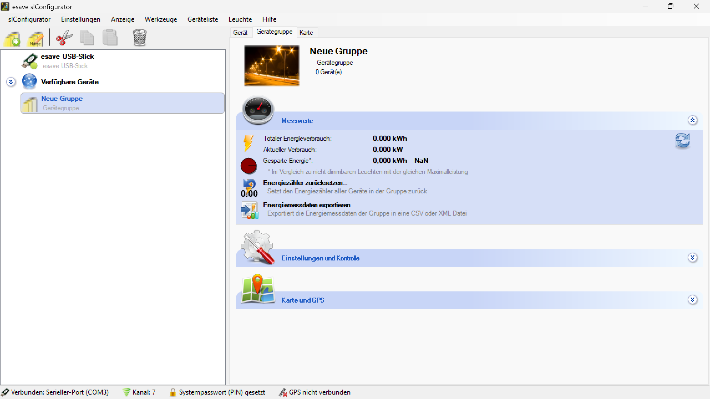

# Messwerte

**Messwerte**

Überwachen und analysieren Sie umfassende Messdaten von Gerätegruppen für eine zentrale Übersicht über die Leistung und den Status aller gruppierten Beleuchtungsgeräte. Diese Funktion ermöglicht eine effiziente Verwaltung großer Beleuchtungsanlagen durch konsolidierte Messwerteerfassung und -auswertung.

> **ℹ️ Hinweis**  
> Gruppeneinstellungen werden automatisch auf alle Leuchten innerhalb der Gruppe übertragen.

## Hauptbereiche

### 1. Zentrale Datenerfassung

- Konsolidierte Erfassung aller Messwerte von gruppierten Geräten
- Echtzeitüberwachung von Leistungsparametern und Umgebungsdaten
- Automatische Datensammlung und -synchronisation

### 2. Gruppen-Analytics

- Statistische Auswertung und Trendanalyse für Gerätegruppen
- Vergleichsanalysen zwischen verschiedenen Gruppen
- Performance-Benchmarking und Optimierungsempfehlungen

## Messwerte-Kategorien

### Elektrische Parameter

- **Leistungsaufnahme**: Aktuelle und durchschnittliche Stromaufnahme der Gruppe
- **Spannung**: Versorgungsspannung aller Geräte in der Gruppe
- **Stromstärke**: Gesamtstromverbrauch und individuelle Gerätewerte
- **Leistungsfaktor**: Effizienz der Energienutzung auf Gruppenebene

### Lichttechnische Werte

- **Helligkeit**: Durchschnittliche und individuelle Helligkeitswerte
- **Lichtverteilung**: Homogenität der Beleuchtung in der Gruppe
- **Farbtemperatur**: Aktuelle und gewünschte Farbtemperaturwerte
- **Lichtausbeute**: Effizienz der Lichtgenerierung pro Watt

### Umgebungsparameter

- **Temperatur**: Betriebs- und Umgebungstemperaturen
- **Luftfeuchtigkeit**: Relative Feuchtigkeitswerte
- **Luftqualität**: CO₂-Konzentration und Luftreinheit
- **Bewegungserkennung**: Aktivitäts- und Anwesenheitsdaten

### Betriebsdaten

- **Betriebsstunden**: Kumulierte Betriebszeit aller Gruppengeräte
- **Schaltzyklen**: Anzahl der Ein-/Ausschaltzyklen
- **Dimmzyklen**: Häufigkeit von Helligkeitsänderungen
- **Wartungsintervalle**: Verbleibende Zeit bis zur nächsten Wartung

## Datenvisualisierung

### Echtzeit-Dashboard

- **Live-Anzeige**: Aktuelle Messwerte aller Gruppenparameter
- **Status-Indikatoren**: Visuelle Zustandsanzeige für alle Geräte
- **Trend-Grafiken**: Kurzfristige Entwicklungen der Messwerte
- **Alarm-Übersicht**: Zentrale Anzeige aller aktiven Alarme

### Historische Datenansicht

- **Zeitreihen-Diagramme**: Langfristige Entwicklung der Messwerte
- **Vergleichsansichten**: Parallel-Darstellung verschiedener Zeiträume
- **Korrelationsanalyse**: Zusammenhänge zwischen verschiedenen Parametern
- **Seasonal Patterns**: Jahreszeitliche Schwankungen und Muster

### Gruppenvergleiche

- **Performance-Vergleich**: Leistungsvergleich zwischen Gerätegruppen
- **Effizienz-Ranking**: Bewertung der Energieeffizienz verschiedener Gruppen
- **Benchmark-Analyse**: Vergleich mit Referenzwerten und Best Practices
- **Anomalie-Erkennung**: Identifikation abweichender Gruppenwerte

## Statistische Auswertungen

### Deskriptive Statistik

- **Mittelwerte**: Durchschnittswerte aller Messparameter
- **Median-Werte**: Robuste zentrale Tendenz der Messdaten
- **Standardabweichung**: Variabilität der Messwerte innerhalb der Gruppe
- **Quantile**: Verteilungsanalyse der Messdaten

### Trendanalyse

- **Regression**: Mathematische Modellierung von Trends
- **Vorhersagen**: Prognose zukünftiger Entwicklungen
- **Saisonalität**: Erkennung wiederkehrender Muster
- **Change Point Detection**: Identifikation signifikanter Änderungen

### Korrelationsanalyse

- **Parameter-Korrelationen**: Zusammenhänge zwischen Messwerten
- **Ursache-Wirkungs-Beziehungen**: Kausalitätsanalyse
- **Multivariate Analyse**: Komplexe Zusammenhänge zwischen mehreren Variablen
- **Faktorenanalyse**: Identifikation zugrunde liegender Faktoren

## Überwachung und Alarme

### Schwellenwert-Überwachung

- **Obere Grenzwerte**: Maximale zulässige Werte für alle Parameter
- **Untere Grenzwerte**: Minimale erforderliche Werte
- **Toleranzbereiche**: Akzeptable Schwankungsbereiche
- **Dynamische Schwellen**: Adaptive Grenzwerte basierend auf historischen Daten

### Alarm-Management

- **Prioritätsstufen**: Klassifizierung von Alarmen nach Dringlichkeit
- **Eskalationsverfahren**: Automatische Weiterleitung kritischer Alarme
- **Alarm-Protokollierung**: Vollständige Dokumentation aller Ereignisse
- **Benachrichtigungssysteme**: Multiple Kanäle für Alarmweiterleitung

### Präventive Überwachung

- **Predictive Analytics**: Vorhersage potentieller Probleme
- **Anomalie-Erkennung**: Automatische Identifikation ungewöhnlicher Muster
- **Verschlechterungstrends**: Früherkennung von Leistungsabfall
- **Wartungsempfehlungen**: Datenbasierte Wartungsplanung

## Energiemanagement

### Verbrauchsanalyse

- **Gruppenverbrauch**: Gesamtenergieverbrauch der Gerätegruppe
- **Verbrauchsverteilung**: Analyse der Verbrauchsanteile einzelner Geräte
- **Peak-Demand**: Identifikation von Lastspitzen
- **Load Factor**: Bewertung der Lastverteilung

### Effizienzoptimierung

- **Efficiency Monitoring**: Kontinuierliche Effizienzüberwachung
- **Optimierungspotentiale**: Identifikation von Verbesserungsmöglichkeiten
- **Benchmarking**: Vergleich mit Effizienzstandards
- **ROI-Berechnung**: Bewertung von Optimierungsmaßnahmen

### Kostenanalyse

- **Energiekosten**: Berechnung der Energiekosten pro Gruppe
- **Kostentreiber**: Identifikation der größten Kostenfaktoren
- **Einsparpotentiale**: Quantifizierung möglicher Kosteneinsparungen
- **Budget-Tracking**: Überwachung von Energiebudgets

## Anwendungsszenarien

### Bürogebäude

- **Stockwerks-Gruppen**: Überwachung einzelner Gebäudeebenen
- **Abteilungs-Bereiche**: Messwerte spezifischer Organisationseinheiten
- **Gemeinschaftsflächen**: Monitoring von Fluren, Lobbys und Besprechungsräumen
- **Außenbereiche**: Überwachung der Gebäudeaußenbeleuchtung

### Industrielle Anlagen

- **Produktionshallen**: Monitoring verschiedener Fertigungsbereiche
- **Lager-Zonen**: Überwachung unterschiedlicher Lagerbereiche
- **Maschinenbereiche**: Gruppenweise Überwachung von Arbeitsplätzen
- **Sicherheitszonen**: Spezielle Überwachung kritischer Bereiche

### Einzelhandel

- **Verkaufsflächen**: Messwerte verschiedener Verkaufsbereiche
- **Warenbereiche**: Produktspezifische Beleuchtungsüberwachung
- **Kassen-Zonen**: Arbeitsplatzspezifische Datenerfassung
- **Lager-Bereiche**: Überwachung der Lagerbeleuchtung

### Öffentliche Einrichtungen

- **Schulbereiche**: Klassenraum- und Fachbereichs-Gruppen
- **Krankenhaus-Stationen**: Abteilungsweise Beleuchtungsüberwachung
- **Verwaltungsbereiche**: Behördenspezifische Gruppenüberwachung
- **Bibliotheks-Zonen**: Bereichsspezifische Datenerfassung

## Wartung und Instandhaltung

### Zustandsüberwachung

- **Health Monitoring**: Kontinuierliche Gesundheitsüberwachung der Gruppe
- **Degradation Analysis**: Analyse der Leistungsverschlechterung
- **Failure Prediction**: Vorhersage von Geräteausfällen
- **Maintenance Scheduling**: Optimierte Wartungsplanung

### Gruppenwartung

- **Simultane Wartung**: Koordinierte Wartung aller Gruppengeräte
- **Wartungseffizienz**: Optimierung der Wartungsabläufe
- **Ersatzteil-Management**: Gruppenbezogene Ersatzteilplanung
- **Wartungsprotokollierung**: Vollständige Dokumentation aller Aktivitäten

### Lebensdauermanagement

- **Lebensdauer-Tracking**: Überwachung der Gerätelebensdauer
- **Replacement Planning**: Planung von Geräteerneuerungen
- **Lifecycle Costs**: Analyse der Lebenszykluskosten
- **Upgrade-Empfehlungen**: Vorschläge für Systemupgrades

## Datenexport und Integration

### Export-Funktionen

- **CSV-Export**: Tabellarische Datenexporte für Analysen
- **PDF-Berichte**: Formatierte Berichte für Präsentationen
- **XML/JSON**: Strukturierte Daten für Systemintegrationen
- **Real-time Streams**: Live-Datenstreams für externe Systeme

### System-Integration

- **BMS-Integration**: Anbindung an Gebäudemanagementsysteme
- **ERP-Schnittstellen**: Integration in Unternehmenssoftware
- **Cloud-Plattformen**: Upload zu Cloud-basierten Analysediensten
- **API-Zugriff**: Programmatischer Zugriff auf Messdaten

### Datenqualität

- **Validierung**: Automatische Überprüfung der Datenqualität
- **Plausibilitätsprüfung**: Logik-Checks für Messwerte
- **Fehlerkorrektur**: Automatische Korrektur offensichtlicher Fehler
- **Datenbereinigung**: Filterung und Aufbereitung der Rohdaten

## Berichtswesen

### Automatisierte Berichte

- **Tagesberichte**: Automatische tägliche Gruppenzusammenfassungen
- **Wochenberichte**: Wöchentliche Trend- und Übersichtsberichte
- **Monatsberichte**: Detaillierte monatliche Analyseberichte
- **Jahresberichte**: Umfassende jährliche Leistungsauswertungen

### Management-Dashboards

- **Executive Summary**: Kompakte Führungskräfte-Übersichten
- **KPI-Dashboards**: Schlüsselkennzahlen für das Management
- **Performance Scorecards**: Bewertungssysteme für Gruppenleistung
- **ROI-Berichte**: Return-on-Investment-Analysen

### Compliance-Berichte

- **Energieeffizienz**: Nachweise für Energieeffizienz-Vorschriften
- **Umweltberichte**: CO₂-Bilanzen und Nachhaltigkeitsnachweise
- **Audit-Berichte**: Dokumentation für Systemaudits
- **Regulatory Compliance**: Einhaltung gesetzlicher Vorschriften

## Vorteile der Gruppen-Messwerte

### Betriebsvorteile

- **Zentrale Übersicht**: Konsolidierte Sicht auf alle Gruppendaten
- **Effizienzsteigerung**: Optimierte Verwaltung großer Anlagenteile
- **Proaktive Wartung**: Vorausschauende Instandhaltung durch Datenanalyse
- **Automatisierung**: Reduzierung manueller Überwachungsaufgaben

### Kostenvorteile

- **Optimierte Ressourcennutzung**: Effiziente Nutzung von Personal und Material
- **Energieeinsparungen**: Identifikation und Realisierung von Einsparpotentialen
- **Wartungsoptimierung**: Kosteneinsparungen durch optimierte Wartungszyklen
- **Investitionsplanung**: Datenbasierte Entscheidungen für Neuinvestitionen

### Strategische Vorteile

- **Datenbasierte Entscheidungen**: Fundierte Managemententscheidungen
- **Benchmark-Analysen**: Vergleichsmöglichkeiten für kontinuierliche Verbesserung
- **Skalierbarkeit**: Einfache Erweiterung der Überwachung auf neue Bereiche
- **Compliance**: Erfüllung regulatorischer Anforderungen

## Zukunftsperspektiven

### Technologische Entwicklungen

- **Machine Learning**: KI-basierte Muster- und Anomalieerkennung
- **Digital Twins**: Digitale Zwillinge für Gerätegruppen
- **Predictive Analytics**: Erweiterte Vorhersagefähigkeiten
- **Edge Computing**: Lokale Datenverarbeitung für Echtzeitanalysen

### Erweiterte Funktionen

- **Adaptive Gruppierung**: Dynamische Anpassung von Gerätegruppen
- **Cross-Group Analytics**: Gruppenübergreifende Analysen
- **Autonomous Optimization**: Selbstoptimierende Gruppenkonfigurationen
- **Integrated Ecosystem**: Vollständige Integration in Smart Building-Ökosysteme

Die Gruppen-Messwerte-Funktion bietet eine umfassende Lösung für die zentrale Überwachung und Analyse von Beleuchtungsgeräte-Gruppen und ermöglicht eine effiziente, datengestützte Verwaltung großer Beleuchtungsanlagen mit optimaler Performance und Kosteneffizienz.