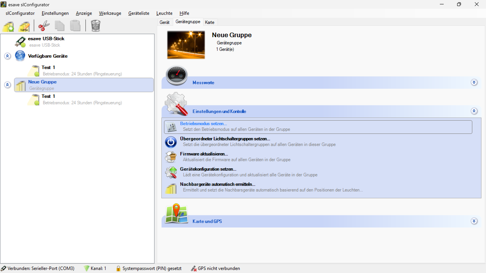
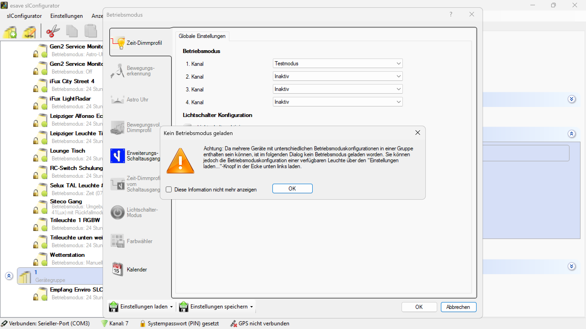
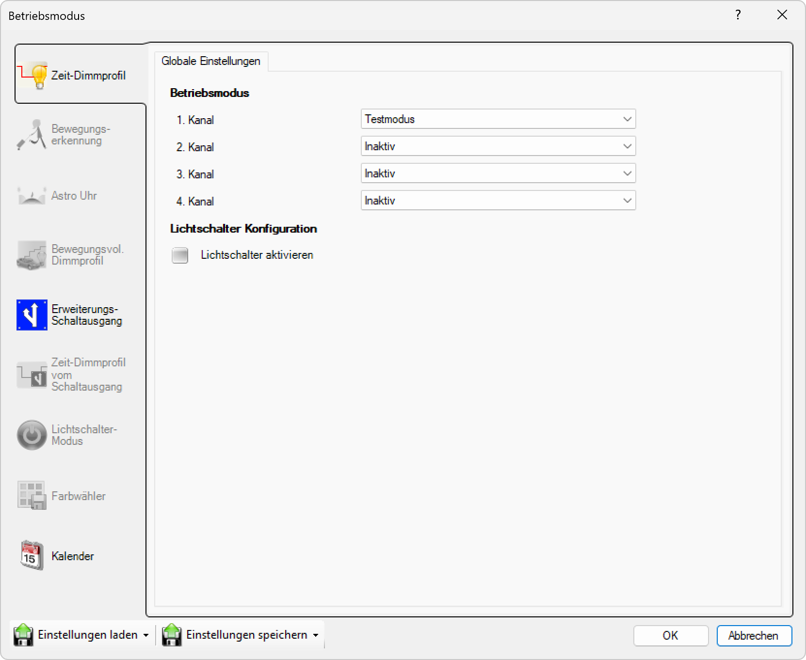

# Betriebsmodus Setzen

*Setzt den Betriebsmodus auf allen Geräten in der Gruppe*

*Achtung: Da mehrere Geräte mit unterschiedlichen Betriebsmoduskonfigurationen in einer Gruppe enthalten sein können, ist im folgenden die Betriebsmodus geladen worden.*

*Konfiguration des Betriebsmodus für alle Gruppengeräte mit verfügbaren Optionen*

**Gruppen-Betriebsmodus Konfiguration**

Zentrale Konfiguration des Betriebsmodus für alle Geräte innerhalb einer Gruppe mit einheitlicher Parameterverteilung und konsistenter Systemkonfiguration.

## Hauptbereiche

### 1. Betriebsmodus-Auswahl
- Kanalbasierte Betriebsmodus-Konfiguration
- Dropdown-Auswahl für verschiedene Betriebsmodi
- Mehrkanalige Gerätekonfiguration

### 2. Lichtschalter-Konfiguration
- Lichtschalter-Aktivierung per Checkbox
- Integration mit externen Schaltsystemen
- Hierarchische Steuerungsoptionen

### 3. Konsistenz-Warnung
- Warnung bei unterschiedlichen Gerätekonfigurationen
- Automatische Konfigurationsharmonisierung
- Benutzergeführte Konfliktlösung

### 4. Batch-Anwendung
- Simultane Konfiguration aller Gruppengeräte
- Einheitliche Parameterverteilung
- Automatische Synchronisation

## Gruppenstatus und Warnung

### Konfigurationskonflikte
- **Warnung**: "Achtung: Da mehrere Geräte mit unterschiedlichen Betriebsmoduskonfigurationen in einer Gruppe enthalten sein können, ist im folgenden die Betriebsmodus geladen worden."
- **Harmonisierung**: Automatische Vereinheitlichung unterschiedlicher Konfigurationen
- **Konsistenz-Prüfung**: Validierung der Gruppenkonfiguration
- **Benutzerführung**: Klare Kommunikation über Konfigurationsänderungen

### Konfigurationsstatus
- **Neue Gruppe**: Anzeige der aktuellen Gruppenkonfiguration
- **Gerätezahl**: "1 Gerät(e)" zeigt Gruppengröße
- **Gruppenidentifikation**: Eindeutige Gruppenzuordnung
- **Konsistenz-Überwachung**: Kontinuierliche Konfigurationskontrolle

## Betriebsmodus-Konfiguration

### Kanalbasierte Konfiguration
- **1. Kanal**: Testmodus (Dropdown-Auswahl)
- **2. Kanal**: Inaktiv (Dropdown-Auswahl)
- **3. Kanal**: Inaktiv (Dropdown-Auswahl)
- **4. Kanal**: Inaktiv (Dropdown-Auswahl)

### Verfügbare Betriebsmodi
- **Testmodus**: Spezielle Konfiguration für Testzwecke
- **Inaktiv**: Deaktivierte Kanäle ohne Funktionalität
- **Weitere Modi**: Abhängig von Gerätekonfiguration und -fähigkeiten
- **Benutzerdefiniert**: Anpassbare Betriebsmodi

### Kanal-Management
- **Mehrkanalige Geräte**: Separate Konfiguration pro Kanal
- **Flexible Zuordnung**: Verschiedene Modi pro Kanal
- **Skalierbare Konfiguration**: Anpassung an Gerätekomplexität
- **Konsistente Anwendung**: Einheitliche Konfiguration aller Gruppengeräte

## Lichtschalter-Konfiguration

### Lichtschalter-Aktivierung
- **Checkbox**: "Lichtschalter aktivieren"
- **Standardzustand**: Deaktiviert bei Ersteinrichtung
- **Integration**: Verbindung mit externen Schaltsystemen
- **Hierarchie**: Übergeordnete Steuerungsstrukturen

### Schalter-Integration
- **Externe Schalter**: Verbindung mit physischen Schaltern
- **Logische Verknüpfung**: Intelligente Schalter-Geräte-Zuordnung
- **Redundante Steuerung**: Mehrfache Steuerungsoptionen
- **Automatische Erkennung**: Intelligente Schalter-Konfiguration

### Steuerungslogik
- **Szenarien-basierte Steuerung**: Verschiedene Schaltszenarien
- **Zeit-basierte Steuerung**: Automatische Steuerung nach Zeitplänen
- **Ereignis-basierte Steuerung**: Reaktion auf externe Ereignisse
- **Adaptive Steuerung**: Lernende Steuerungsalgorithmen

## Globale Einstellungen

### Konfigurationsbereiche
- **Zeit-Dimmprofil**: Zeitbasierte Helligkeitssteuerung
- **Bewegungserkennung**: Sensor-basierte Aktivierung
- **Astro Uhr**: Astronomische Zeitsteuerung
- **Bewegungsvoll. Dimmprofil**: Vollständige Bewegungsprofil-Konfiguration

### Erweiterte Funktionen
- **Erweiterungs-Schaltausgang**: Zusätzliche Ausgänge
- **Zeit-Dimmprofil vom Schaltausgang**: Schaltausgang-basierte Steuerung
- **Lichtschalter-Modus**: Spezieller Schaltermodus
- **Farbwähler**: Farbkonfiguration für RGB-Geräte

### Systemintegration
- **Kalender**: Kalenderbasierte Steuerung
- **Wetter-Integration**: Wetterabhängige Anpassungen
- **Automatische Synchronisation**: Selbstständige Parameterabgleichung
- **Konsistenz-Sicherung**: Einheitliche Konfiguration aller Geräte

## Konfigurationsprozess

### Konfigurationsladen
- **Automatisches Laden**: Automatische Konfigurationsharmonisierung
- **Konsistenz-Prüfung**: Validierung der Gruppenkonfiguration
- **Konfliktlösung**: Behandlung unterschiedlicher Gerätekonfigurationen
- **Benutzerführung**: Klare Kommunikation über Konfigurationsänderungen

### Parameterverteilung
- **Batch-Anwendung**: Simultane Konfiguration aller Gruppengeräte
- **Automatische Synchronisation**: Selbstständige Parameterabgleichung
- **Fehlerbehandlung**: Robuste Behandlung von Konfigurationsfehlern
- **Status-Monitoring**: Überwachung der Konfigurationsstatus

### Validierung
- **Erfolgs-Verifikation**: Bestätigung der erfolgreichen Konfiguration
- **Integritäts-Prüfung**: Validierung der Parameterkonsistenz
- **Performance-Monitoring**: Überwachung der Konfigurationsleistung
- **Fehler-Reporting**: Detaillierte Rückmeldung bei Problemen

## Anwendungsszenarien

### Testumgebungen
- **Testmodus**: Spezielle Konfiguration für Gerätetests
- **Entwicklungsumgebung**: Anpassungen für Entwicklungszwecke
- **Qualitätssicherung**: Systematische Geräteverifizierung
- **Debugging**: Fehlerdiagnose und Problemlösung

### Produktivbetrieb
- **Normalbetrieb**: Standardkonfiguration für regulären Betrieb
- **Energiesparmodus**: Reduzierte Leistung für Effizienz
- **Sicherheitsmodus**: Erhöhte Sicherheitsparameter
- **Wartungsmodus**: Spezielle Konfiguration für Wartungsarbeiten

### Spezialkonfigurationen
- **Saisonale Anpassung**: Konfiguration für verschiedene Jahreszeiten
- **Ereignis-basierte Modi**: Spezielle Modi für besondere Ereignisse
- **Notfallmodus**: Konfiguration für Notfallsituationen
- **Demonstrations-Modi**: Spezielle Konfiguration für Vorführungen

## Technische Aspekte

### Konfigurationsverwaltung
- **Template-basierte Konfiguration**: Wiederverwendbare Konfigurationsvorlagen
- **Versionskontrolle**: Verfolgung von Konfigurationsänderungen
- **Rollback-Mechanismen**: Wiederherstellung vorheriger Konfigurationen
- **Audit-Trail**: Vollständige Protokollierung aller Änderungen

### Kommunikation
- **Broadcast-Mechanismen**: Effiziente Gruppenkommandos
- **Zuverlässige Übertragung**: Robuste Datenübertragung
- **Fehlerbehandlung**: Behandlung von Kommunikationsfehlern
- **Optimierte Protokolle**: Effiziente Bandbreitennutzung

### Synchronisation
- **Atomare Operationen**: Unteilbare Konfigurationsoperationen
- **Transaktionale Sicherheit**: Konsistente Datenübertragung
- **Konsistenz-Prüfung**: Validierung der Synchronisationsqualität
- **Conflict-Resolution**: Intelligente Konfliktlösung

## Gerätekompatibilität

### Gerätespezifische Anpassungen
- **Mehrkanalige Geräte**: Separate Konfiguration pro Kanal
- **Einkanalige Geräte**: Vereinfachte Konfiguration
- **Spezialgeräte**: Anpassung an spezielle Funktionalitäten
- **Legacy-Geräte**: Kompatibilität mit älteren Geräteversionen

### Automatische Erkennung
- **Gerätefähigkeiten**: Automatische Erkennung verfügbarer Modi
- **Konfigurationsanpassung**: Anpassung an Gerätespezifikationen
- **Kompatibilitäts-Check**: Validierung der Gerätekonfiguration
- **Dynamische Anpassung**: Reaktion auf Gerätewechsel

### Skalierbarkeit
- **Große Gruppen**: Effiziente Verarbeitung großer Gerätemengen
- **Heterogene Gruppen**: Verarbeitung verschiedener Gerätetypen
- **Dynamische Erweiterung**: Einfache Integration neuer Geräte
- **Performance-Optimierung**: Optimierte Konfigurationsprozesse

## Sicherheitsaspekte

### Konfigurationssicherheit
- **Validierung**: Umfassende Überprüfung aller Konfigurationsparameter
- **Konsistenz-Prüfung**: Sicherstellung der Systemintegrität
- **Rollback-Mechanismen**: Wiederherstellung bei Konfigurationsproblemen
- **Audit-Trail**: Vollständige Protokollierung aller Änderungen

### Zugriffskontrolle
- **Berechtigungsmanagement**: Kontrolle über Konfigurationszugriff
- **Rollenbasierte Zugriffe**: Differenzierte Zugriffsrechte
- **Sichere Übertragung**: Verschlüsselte Konfigurationsdaten
- **Authentifizierung**: Sichere Benutzerauthentifizierung

### Systemstabilität
- **Fehlerbehandlung**: Robuste Behandlung von Konfigurationsfehlern
- **Graceful Degradation**: Stabile Funktion auch bei Teilausfällen
- **Monitoring**: Kontinuierliche Überwachung der Systemstabilität
- **Notfall-Verfahren**: Verfahren für kritische Situationen

## Vorteile der Gruppen-Betriebsmodus-Konfiguration

### Effizienz
- **Batch-Konfiguration**: Simultane Konfiguration aller Gruppengeräte
- **Zeitersparnis**: Reduzierte Konfigurationszeit durch Automatisierung
- **Skalierbare Verwaltung**: Effiziente Verwaltung großer Gerätemengen
- **Automatisierte Prozesse**: Selbstständige Parameterverteilung

### Konsistenz
- **Einheitliche Konfiguration**: Identische Parameter für alle Geräte
- **Konfliktvermeidung**: Eliminierung von Konfigurationskonflikten
- **Standardisierung**: Konsistente Systemkonfiguration
- **Qualitätssicherung**: Einheitliche Qualitätsstandards

### Flexibilität
- **Anpassbare Modi**: Verschiedene Betriebsmodi für verschiedene Szenarien
- **Dynamische Konfiguration**: Flexible Anpassung an veränderte Anforderungen
- **Gerätespezifische Anpassungen**: Optimierung für verschiedene Gerätetypen
- **Erweiterbare Architektur**: Einfache Integration neuer Funktionalitäten

### Benutzerfreundlichkeit
- **Intuitive Bedienung**: Einfache Konfiguration über Dropdown-Menüs
- **Automatische Harmonisierung**: Selbstständige Konfliktlösung
- **Klare Rückmeldung**: Transparente Darstellung der Konfiguration
- **Fehlerprävention**: Validierung zur Vermeidung von Konfigurationsfehlern

## Best Practices

### Konfigurationsstrategie
- **Logische Gruppierung**: Sinnvolle Gerätegruppierung nach Funktionalität
- **Konsistente Modi**: Einheitliche Betriebsmodi innerhalb der Gruppe
- **Dokumentation**: Aufzeichnung aller Konfigurationsänderungen
- **Regelmäßige Validierung**: Überprüfung der Konfigurationskonsistenz

### Betriebsmanagement
- **Planmäßige Konfiguration**: Systematische Konfigurationszyklen
- **Monitoring**: Kontinuierliche Überwachung der Betriebsmodi
- **Backup-Strategien**: Regelmäßige Sicherung der Konfigurationen
- **Fehlerbehandlung**: Systematische Behandlung von Konfigurationsproblemen

### Wartung
- **Vorbeugende Wartung**: Proaktive Konfigurationspflege
- **Performance-Monitoring**: Überwachung der Konfigurationsleistung
- **Kapazitätsplanung**: Vorausschauende Konfigurationsplanung
- **Kontinuierliche Verbesserung**: Regelmäßige Optimierung der Konfigurationen

> ## ℹ️ Gruppen-Betriebsmodus Konfiguration
>
> **Zentrale Betriebsmodus-Verwaltung mit automatischer Harmonisierung**
>
> Setzt den Betriebsmodus auf allen Geräten in der Gruppe. Bei unterschiedlichen Gerätekonfigurationen wird automatisch eine harmonisierte Konfiguration geladen und zur Bearbeitung bereitgestellt.
>
> ### Hauptfunktionen:
> - **Kanalbasierte Konfiguration**: Separate Betriebsmodi für verschiedene Kanäle
> - **Automatische Harmonisierung**: Konfliktlösung bei unterschiedlichen Konfigurationen
> - **Lichtschalter-Integration**: Aktivierung externer Schaltsysteme
> - **Batch-Anwendung**: Simultane Konfiguration aller Gruppengeräte
> - **Konsistenz-Sicherung**: Einheitliche Parameterverteilung

*Die Gruppen-Betriebsmodus-Konfiguration ermöglicht eine effiziente, konsistente und benutzerfreundliche Verwaltung von Betriebsmodi für alle Geräte einer Gruppe mit automatischer Konfigurationsharmonisierung.*  