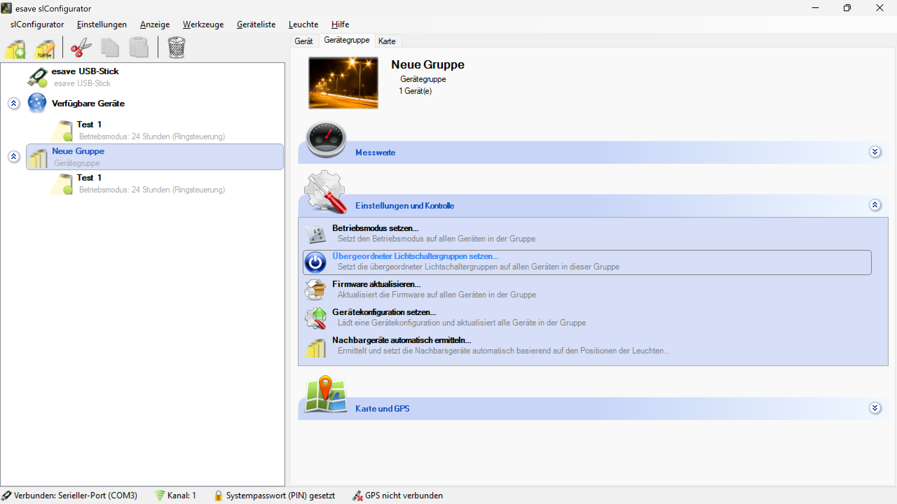
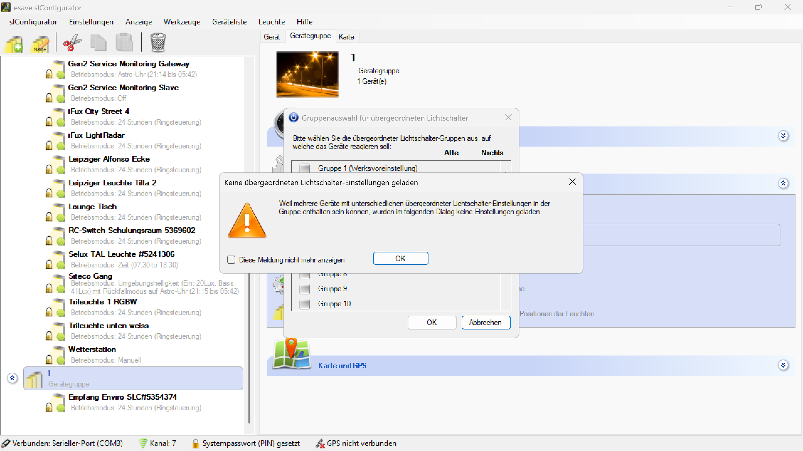
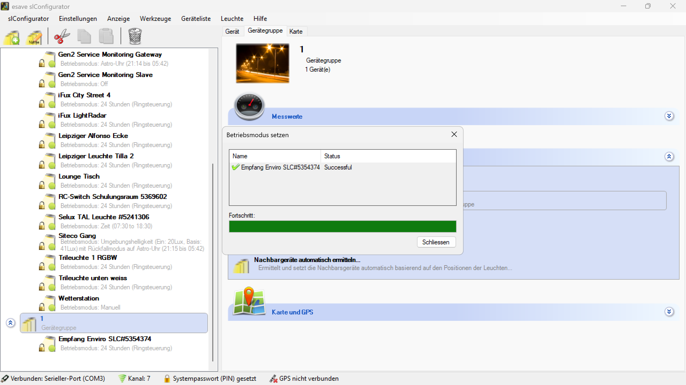

# Übergeordneter Lichtschaltergruppen Setzen

*Setzt die übergeordneten Lichtschaltergruppen auf allen Geräten in dieser Gruppe*

*Bitte wählen Sie die übergeordneter Lichtschalter-Gruppen aus, auf welche das Gerät reagieren soll.*

*Betriebsmodus setzen - Successful completion für alle Gruppengeräte*

**Übergeordnete Lichtschaltergruppen-Konfiguration**

Zentrale Konfiguration der übergeordneten Lichtschaltergruppen für alle Geräte innerhalb einer Gruppe mit hierarchischer Steuerungsintegration und automatischer Parameterverteilung.

## Hauptbereiche

### 1. Lichtschaltergruppen-Auswahl
- Interaktive Auswahl verfügbarer Lichtschaltergruppen
- Flexible Zuordnung zu übergeordneten Steuerungsebenen
- Checkbox-basierte Multi-Selektion

### 2. Konfigurationskonflikte
- Automatische Erkennung unterschiedlicher Konfigurationen
- Warnung bei inkonsistenten Einstellungen
- Benutzergeführte Konfliktlösung

### 3. Batch-Anwendung
- Simultane Konfiguration aller Gruppengeräte
- Fortschrittsüberwachung der Konfiguration
- Erfolgsvalidierung pro Gerät

### 4. Hierarchische Integration
- Übergeordnete Steuerungsstrukturen
- Logische Schalter-Geräte-Verknüpfungen
- Zentrale Schalterzuordnung

## Lichtschaltergruppen-Auswahl

### Gruppenauswahl-Dialog
- **Dialog-Titel**: "Gruppenauswahl für übergeordneten Lichtschalter"
- **Auswahlmodus**: "Alle" / "Nichts" Toggle-Buttons
- **Gruppenliste**: Verfügbare Lichtschaltergruppen mit Checkboxen
- **Flexible Selektion**: Individuelle Auswahl oder Batch-Selektion

### Verfügbare Gruppen
- **Gruppe 1**: Werksvoreinstellung
- **Gruppe 8**: Erweiterte Gruppenkonfiguration
- **Gruppe 9**: Zusätzliche Steuerungsoptionen
- **Gruppe 10**: Spezielle Anwendungsfälle
- **Weitere Gruppen**: Skalierbare Gruppenerweiterung

### Auswahlmechanismus
- **Checkbox-Interface**: Intuitive Mehrfachauswahl
- **Alle/Nichts**: Schnelle Gesamtauswahl oder -deaktivierung
- **Individuelle Auswahl**: Präzise Gruppenzuordnung
- **Validierung**: Überprüfung der Auswahlkonsistenz

## Konfigurationskonflikte

### Konfliktwarnung
- **Warnung**: "Keine übergeordneten Lichtschalter-Einstellungen geladen"
- **Grund**: "Weil mehrere Geräte mit unterschiedlichen übergeordneter Lichtschalter-Einstellungen in der Gruppe enthalten sein können, wurden im folgenden Dialog keine Einstellungen geladen."
- **Lösung**: Benutzergeführte Konfigurationserstellung
- **Konsistenz**: Sicherstellung einheitlicher Konfiguration

### Automatische Erkennung
- **Gerätescanning**: Automatische Erkennung unterschiedlicher Konfigurationen
- **Konfliktidentifikation**: Identifikation inkonsistenter Einstellungen
- **Warnsystem**: Proaktive Benutzerbenachrichtigung
- **Harmonisierung**: Vorschläge für einheitliche Konfiguration

### Benutzerführung
- **Klare Kommunikation**: Verständliche Erklärung der Konflikte
- **Lösungsoptionen**: Verschiedene Ansätze zur Konfliktlösung
- **Validierung**: Überprüfung der Benutzereingaben
- **Bestätigung**: Sicherstellung der gewünschten Konfiguration

## Batch-Anwendung

### Konfigurationsprozess
- **Prozess-Titel**: "Betriebsmodus setzen"
- **Geräte-Liste**: Tabellarische Darstellung aller Gruppengeräte
- **Status-Spalten**: Name und Status für jedes Gerät
- **Fortschrittsbalken**: Visuelle Fortschrittsanzeige

### Geräte-Status
- **Name**: Eindeutige Geräteidentifikation
- **Status**: Aktueller Konfigurationsstatus
- **Erfolg**: "Successful" für erfolgreich konfigurierte Geräte
- **Fehler**: Detaillierte Fehlermeldungen bei Problemen

### Fortschrittsüberwachung
- **Grüner Fortschrittsbalken**: Visuelle Fortschrittsanzeige
- **Prozentuale Anzeige**: Numerische Fortschrittsinformation
- **Echtzeit-Updates**: Kontinuierliche Statusaktualisierung
- **Abschluss-Indikator**: Vollständige Konfiguration aller Geräte

## Hierarchische Steuerungsintegration

### Übergeordnete Strukturen
- **Hierarchieebenen**: Mehrschichtige Steuerungsarchitektur
- **Schaltergruppen**: Logische Zusammenfassung von Schaltern
- **Gerätezuordnung**: Flexible Zuordnung zu übergeordneten Gruppen
- **Zentrale Steuerung**: Einheitliche Kontrolle über mehrere Ebenen

### Schalter-Logik
- **Reaktionsverhalten**: Gerätereaktionen auf Schaltersignale
- **Prioritätssystem**: Behandlung konkurrierender Schaltsignale
- **Override-Mechanismen**: Übersteuerung bei Konflikten
- **Failsafe-Verhalten**: Sicherheitsverhalten bei Ausfällen

### Kommunikationsprotokoll
- **Broadcast-Mechanismen**: Effiziente Gruppenkommandos
- **Hierarchische Übertragung**: Strukturierte Befehlsverteilung
- **Acknowledgment-System**: Bestätigung der Befehlsausführung
- **Fehlerbehandlung**: Robuste Behandlung von Kommunikationsfehlern

## Konfigurationsverwaltung

### Template-System
- **Vordefinierte Konfigurationen**: Wiederverwendbare Konfigurationsvorlagen
- **Benutzerdefinierte Templates**: Anpassbare Konfigurationsmuster
- **Versionskontrolle**: Verfolgung von Konfigurationsänderungen
- **Rollback-Mechanismen**: Wiederherstellung vorheriger Konfigurationen

### Validierung
- **Konsistenz-Prüfung**: Überprüfung der Konfigurationskonsistenz
- **Kompatibilitäts-Check**: Validierung der Gerätekompatibilität
- **Konflikterkennung**: Identifikation potentieller Probleme
- **Automatische Korrektur**: Intelligente Konfliktlösung

### Dokumentation
- **Audit-Trail**: Vollständige Protokollierung aller Änderungen
- **Konfigurationshistorie**: Chronologische Aufzeichnung
- **Benutzer-Tracking**: Verfolgung der Konfigurationsverantwortlichen
- **Compliance-Reporting**: Erfüllung regulatorischer Anforderungen

## Anwendungsszenarien

### Bürogebäude
- **Stockwerks-Steuerung**: Übergeordnete Schalter für ganze Stockwerke
- **Abteilungs-Gruppierung**: Logische Zuordnung nach Organisationsstrukturen
- **Sicherheitsintegration**: Verbindung mit Sicherheitssystemen
- **Energiemanagement**: Zentrale Energieoptimierung

### Industrieanlagen
- **Produktionsbereich-Steuerung**: Übergeordnete Steuerung von Produktionsbereichen
- **Schicht-basierte Steuerung**: Anpassung an Schichtbetrieb
- **Notfall-Steuerung**: Spezielle Steuerung für Notfallsituationen
- **Wartungsintegration**: Koordination mit Wartungssystemen

### Straßenbeleuchtung
- **Straßenabschnitt-Steuerung**: Übergeordnete Steuerung ganzer Straßenabschnitte
- **Zeitplan-Integration**: Koordination mit Beleuchtungszeitplänen
- **Verkehrsintegration**: Anpassung an Verkehrssteuerung
- **Kommunale Verwaltung**: Integration in städtische Systeme

### Außenbeleuchtung
- **Bereichs-Steuerung**: Übergeordnete Steuerung von Außenbereichen
- **Sicherheits-Integration**: Verbindung mit Sicherheitssystemen
- **Wetterabhängige Steuerung**: Anpassung an Wetterbedingungen
- **Ereignis-basierte Steuerung**: Spezielle Steuerung für Ereignisse

## Technische Aspekte

### Kommunikationsarchitektur
- **Hierarchische Protokolle**: Strukturierte Kommunikation zwischen Ebenen
- **Broadcast-Mechanismen**: Effiziente Gruppenkommandos
- **Unicast-Kommunikation**: Direkte Geräteansprache
- **Multicast-Gruppen**: Selektive Gruppenkommunikation

### Skalierbarkeit
- **Große Installationen**: Effiziente Verarbeitung großer Gerätemengen
- **Hierarchische Skalierung**: Mehrstufige Systemarchitektur
- **Dynamische Erweiterung**: Flexible Systemerweiterung
- **Performance-Optimierung**: Optimierte Kommunikationsalgorithmen

### Zuverlässigkeit
- **Redundante Kommunikation**: Mehrfache Kommunikationswege
- **Fehlertoleranz**: Robustes Verhalten bei Teilausfällen
- **Recovery-Mechanismen**: Automatische Wiederherstellung
- **Monitoring**: Kontinuierliche Systemüberwachung

## Sicherheitsaspekte

### Zugriffskontrolle
- **Berechtigungsmanagement**: Kontrolle über Konfigurationszugriff
- **Rollenbasierte Zugriffe**: Differenzierte Zugriffsrechte
- **Audit-Trail**: Vollständige Protokollierung aller Zugriffe
- **Sichere Authentifizierung**: Robuste Benutzerauthentifizierung

### Datenintegrität
- **Verschlüsselte Übertragung**: Sichere Datenübertragung
- **Integritätsprüfung**: Validierung der Datenintegrität
- **Backup-Mechanismen**: Regelmäßige Datensicherung
- **Wiederherstellungsverfahren**: Verfahren für Datenwiederherstellung

### Systemsicherheit
- **Firewall-Integration**: Schutz vor externen Bedrohungen
- **Intrusion Detection**: Erkennung von Sicherheitsverletzungen
- **Secure Boot**: Sichere Systeminitialisierung
- **Regular Updates**: Regelmäßige Sicherheitsupdates

## Vorteile der übergeordneten Lichtschaltergruppen-Konfiguration

### Zentrale Kontrolle
- **Einheitliche Steuerung**: Zentrale Kontrolle über alle Gruppengeräte
- **Hierarchische Organisation**: Strukturierte Steuerungsarchitektur
- **Skalierbare Verwaltung**: Effiziente Verwaltung großer Systeme
- **Konsistente Konfiguration**: Einheitliche Parameterverteilung

### Flexibilität
- **Anpassbare Hierarchien**: Flexible Organisationsstrukturen
- **Dynamische Zuordnung**: Veränderbare Schalter-Geräte-Zuordnungen
- **Erweiterbare Architektur**: Einfache Systemerweiterung
- **Modulare Konfiguration**: Flexible Konfigurationsoptionen

### Effizienz
- **Batch-Konfiguration**: Simultane Konfiguration aller Geräte
- **Automatisierte Prozesse**: Reduzierter manueller Aufwand
- **Optimierte Kommunikation**: Effiziente Datenübertragung
- **Schnelle Reaktionszeiten**: Minimale Latenzzeiten

### Benutzerfreundlichkeit
- **Intuitive Bedienung**: Einfache Checkbox-basierte Auswahl
- **Klare Rückmeldung**: Transparente Darstellung der Konfiguration
- **Fehlerprävention**: Validierung zur Vermeidung von Konfigurationsfehlern
- **Automatische Konfliktlösung**: Intelligente Behandlung von Inkonsistenzen

## Best Practices

### Konfigurationsstrategie
- **Logische Gruppierung**: Sinnvolle Schaltergruppen-Bildung
- **Hierarchische Planung**: Durchdachte Steuerungsstrukturen
- **Konsistente Benennung**: Eindeutige Gruppennamen
- **Dokumentation**: Umfassende Konfigurationsdokumentation

### Betriebsmanagement
- **Regelmäßige Validierung**: Überprüfung der Konfigurationskonsistenz
- **Monitoring**: Kontinuierliche Überwachung der Systemleistung
- **Backup-Strategien**: Regelmäßige Sicherung der Konfigurationen
- **Update-Management**: Systematische Aktualisierung der Konfigurationen

### Wartung
- **Präventive Wartung**: Proaktive Systemwartung
- **Fehlerdiagnose**: Systematische Problemidentifikation
- **Performance-Optimierung**: Kontinuierliche Leistungsverbesserung
- **Kapazitätsplanung**: Vorausschauende Systemplanung

### Sicherheit
- **Zugriffskontrolle**: Strenge Kontrolle über Konfigurationszugriffe
- **Verschlüsselung**: Sichere Datenübertragung
- **Audit-Trail**: Vollständige Protokollierung aller Aktivitäten
- **Regular Updates**: Regelmäßige Sicherheitsupdates

> ## ℹ️ Übergeordnete Lichtschaltergruppen-Konfiguration
>
> **Hierarchische Steuerungsintegration mit automatischer Parameterverteilung**
>
> Setzt die übergeordneten Lichtschaltergruppen auf allen Geräten in der Gruppe. Bei unterschiedlichen Gerätekonfigurationen wird eine benutzergeführte Konfigurationserstellung angeboten.
>
> ### Hauptfunktionen:
> - **Hierarchische Steuerung**: Integration in übergeordnete Steuerungsstrukturen
> - **Flexible Gruppenzuordnung**: Checkbox-basierte Multi-Selektion
> - **Konfliktlösung**: Automatische Erkennung und Behandlung von Inkonsistenzen
> - **Batch-Anwendung**: Simultane Konfiguration aller Gruppengeräte
> - **Fortschrittsüberwachung**: Echtzeit-Status der Konfiguration

*Die übergeordnete Lichtschaltergruppen-Konfiguration ermöglicht eine hierarchische, flexible und benutzerfreundliche Integration von Beleuchtungsgruppen in übergeordnete Steuerungsstrukturen mit automatischer Parameterverteilung und Konfliktlösung.*  