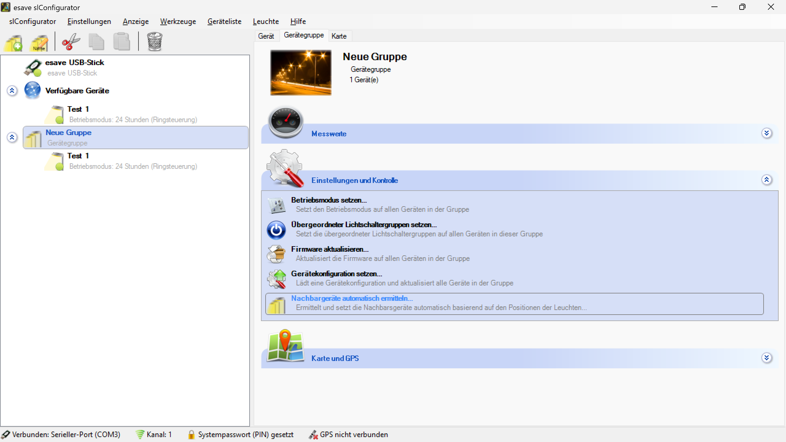
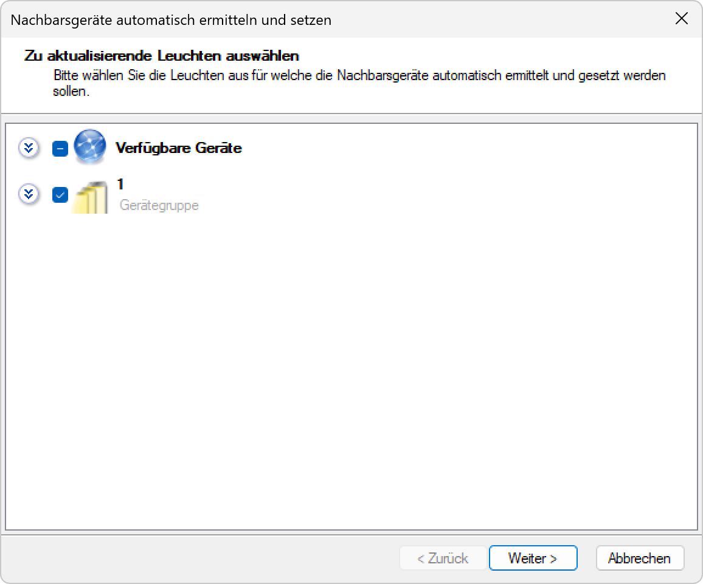
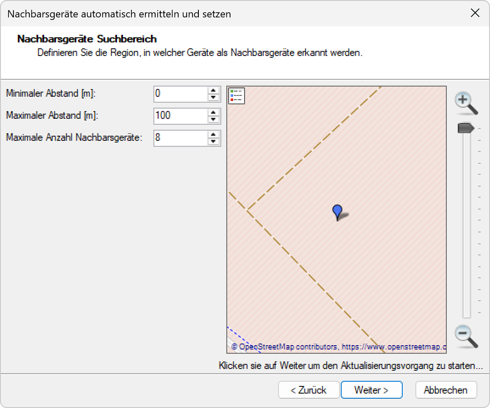
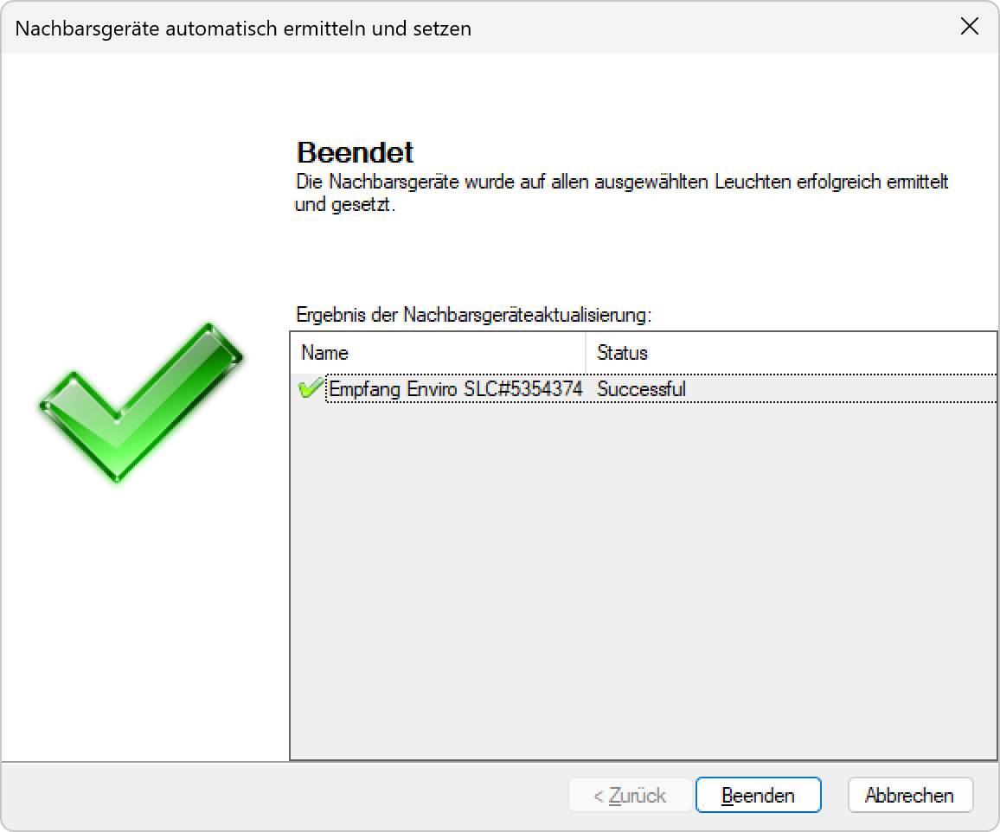

# Nachbargeräte automatisch ermitteln

*Ermittelt und setzt die Nachbargeräte automatisch basierend auf den Positionen der Leuchten*

*Zu aktualisierende Leuchten auswählen - Bitte wählen Sie die Leuchten aus für welche die Nachbarsgeräte automatisch ermittelt und gesetzt werden sollen*

*Nachbarsgeräte Suchbereich - Definieren Sie die Region, in welcher Geräte als Nachbarsgeräte erkannt werden*

*Beendet - Die Nachbarsgeräte wurde auf allen ausgewählten Leuchten erfolgreich ermittelt und gesetzt*

**Automatische Nachbargeräte-Ermittlung**

Intelligente Nachbarschaftsanalyse für Beleuchtungsgeräte mit positionsbasierter Ermittlung, konfigurierbaren Suchparametern und automatischer Konfiguration.

## Hauptbereiche

### 1. Geräteauswahl
- Selektive Auswahl der zu bearbeitenden Geräte
- Gruppenbezogene Verarbeitung
- Hierarchische Geräteverwaltung

### 2. Suchbereich-Konfiguration
- Definierbare Suchregionen
- Abstandsparameter und Limits
- Geografische Einschränkungen

### 3. Automatische Ermittlung
- Positionsbasierte Nachbarschaftsberechnung
- Intelligente Algorithmen für optimale Zuordnung
- Echtzeit-Verarbeitung

### 4. Ergebnisvalidierung
- Überprüfung der ermittelten Nachbarschaften
- Statusberichterstattung
- Erfolgsvalidierung

## Ermittlungsprozess

### Schritt 1: Funktion aktivieren
- **Funktion**: "Nachbargeräte automatisch ermitteln..." in der Gruppenkonfiguration
- **Beschreibung**: "Ermittelt und setzt die Nachbargeräte automatisch basierend auf den Positionen der Leuchten"
- **Hervorhebung**: Funktion wird blau hervorgehoben bei Auswahl
- **Gruppenbezug**: Bezieht sich auf die ausgewählte Gerätegruppe

### Schritt 2: Geräteauswahl
- **Dialog-Titel**: "Nachbargeräte automatisch ermitteln und setzen"
- **Auswahl-Modus**: "Zu aktualisierende Leuchten auswählen"
- **Anweisung**: "Bitte wählen Sie die Leuchten aus für welche die Nachbarsgeräte automatisch ermittelt und gesetzt werden sollen"
- **Hierarchie**: Verfügbare Geräte > Gerätegruppe mit Checkbox-Auswahl

### Schritt 3: Suchbereich-Definition
- **Bereich-Titel**: "Nachbarsgeräte Suchbereich"
- **Beschreibung**: "Definieren Sie die Region, in welcher Geräte als Nachbarsgeräte erkannt werden"
- **Parameter-Konfiguration**: Minimaler/Maximaler Abstand und Anzahl-Limits
- **Geografische Visualisierung**: Kartenbasierte Darstellung der Suchregion

### Schritt 4: Erfolgsbestätigung
- **Status**: "Beendet"
- **Meldung**: "Die Nachbarsgeräte wurde auf allen ausgewählten Leuchten erfolgreich ermittelt und gesetzt"
- **Ergebnis-Tabelle**: Detaillierte Auflistung der verarbeiteten Geräte
- **Erfolgsstatus**: "Successful" für jeden Verarbeitungsvorgang

## Suchparameter-Konfiguration

### Abstandsparameter
- **Minimaler Abstand**: Untere Grenze für Nachbarschaftserkennung (Standard: 0m)
- **Maximaler Abstand**: Obere Grenze für Nachbarschaftserkennung (Standard: 100m)
- **Einheit**: Meterangabe für präzise Distanzmessung
- **Anpassbarkeit**: Benutzerdefinierte Werte über Spinner-Kontrollen

### Anzahl-Limits
- **Maximale Anzahl Nachbarsgeräte**: Begrenzung der erkannten Nachbarn (Standard: 8)
- **Skalierbarkeit**: Anpassung an verschiedene Netzwerkgrößen
- **Performance-Optimierung**: Vermeidung von Überlastung
- **Qualitätssteuerung**: Fokus auf relevante Nachbarschaften

### Geografische Einschränkungen
- **Suchregion**: Definierte geografische Begrenzung
- **Kartenbasierte Auswahl**: Visuelle Auswahl der Suchbereiche
- **Zoom-Funktionalität**: Detaillierte Bereichsauswahl
- **Koordinaten-System**: Präzise Positionsangaben

## Kartendarstellung

### Visualisierung
- **Kartenintegration**: OpenStreetMap-basierte Darstellung
- **Geräte-Marker**: Blauer Marker für Leuchtenpositionen
- **Suchbereich**: Visualisierung der konfigurierten Suchregion
- **Interaktivität**: Zoom-, Pan- und Selektionsfunktionen

### Navigation
- **Zoom-Kontrollen**: Plus/Minus-Schaltflächen für Vergrößerung/Verkleinerung
- **Layering**: Verschiedene Darstellungsebenen
- **Koordinaten-Anzeige**: Präzise Positionsangaben
- **Maßstab**: Skalierungsindikator für Entfernungen

### Toolbar-Funktionen
- **Organisieren**: Sortierung und Anordnung der Kartenelemente
- **Neuer Ordner**: Strukturierung der Geräteorganisation
- **Ansichtsmodi**: Verschiedene Darstellungsoptionen
- **Suchfunktion**: Schnelles Auffinden spezifischer Bereiche

## Automatische Algorithmen

### Positionsbasierte Berechnung
- **Distanzberechnung**: Euklidische Distanz zwischen Geräten
- **Triangulation**: Optimale Nachbarschaftsbeziehungen
- **Clusterbildung**: Gruppierung benachbarter Geräte
- **Topologie-Analyse**: Netzwerkstruktur-Optimierung

### Intelligente Filterung
- **Relevanz-Bewertung**: Bewertung der Nachbarschafts-Qualität
- **Redundanz-Eliminierung**: Vermeidung unnötiger Verbindungen
- **Prioritäts-Ranking**: Sortierung nach Wichtigkeit
- **Adaptive Anpassung**: Dynamische Optimierung basierend auf Netzwerkänderungen

### Optimierungsstrategien
- **Lastverteilung**: Gleichmäßige Verteilung der Nachbarschaften
- **Fehlertoleranz**: Robuste Berechnung bei fehlenden Daten
- **Skalierbarkeit**: Effiziente Verarbeitung großer Netzwerke
- **Konsistenz**: Stabile Nachbarschaftsbeziehungen

## Ergebnisverarbeitung

### Statusüberwachung
- **Echtzeit-Feedback**: Kontinuierliche Fortschrittsanzeige
- **Gerätestatus**: Individuelle Verarbeitungsbestätigung
- **Fehlerbehandlung**: Robuste Behandlung von Verarbeitungsfehlern
- **Abschlussmeldung**: Bestätigung der erfolgreichen Verarbeitung

### Erfolgsdokumentation
- **Verarbeitungs-Log**: Detaillierte Aufzeichnung aller Aktivitäten
- **Status-Tabelle**: Übersichtliche Darstellung der Ergebnisse
- **Geräte-Mapping**: Zuordnung von Geräten zu Nachbarschaften
- **Zeitstempel**: Chronologische Dokumentation

### Validierung
- **Plausibilitätsprüfung**: Überprüfung der ermittelten Nachbarschaften
- **Konsistenz-Check**: Validierung der Netzwerkintegrität
- **Qualitätssicherung**: Bewertung der Ergebnisqualität
- **Rollback-Möglichkeit**: Wiederherstellung bei Problemen

## Anwendungsszenarien

### Netzwerk-Initialisierung
- **Ersteinrichtung**: Automatische Konfiguration neuer Netzwerke
- **Massenbereitstellung**: Effiziente Einrichtung großer Installationen
- **Standardisierung**: Einheitliche Nachbarschaftskonfiguration
- **Zeitersparnis**: Automatisierte Alternative zur manuellen Konfiguration

### Netzwerk-Wartung
- **Rekonfiguration**: Anpassung nach Netzwerkänderungen
- **Optimierung**: Verbesserung bestehender Nachbarschaften
- **Fehlerkorrektur**: Behebung von Konfigurationsproblemen
- **Performance-Tuning**: Optimierung der Netzwerkleistung

### Systemerweiterung
- **Geräte-Integration**: Einbindung neuer Geräte in bestehende Netzwerke
- **Skalierung**: Anpassung an wachsende Netzwerkgrößen
- **Migration**: Übertragung von Konfigurationen
- **Modernisierung**: Upgrade bestehender Installationen

### Troubleshooting
- **Diagnose**: Identifikation von Netzwerkproblemen
- **Reparatur**: Korrektur fehlerhafter Nachbarschaften
- **Validierung**: Überprüfung der Netzwerkintegrität
- **Dokumentation**: Nachvollziehbare Problemlösung

## Technische Implementierung

### Positionsverarbeitung
- **GPS-Koordinaten**: Präzise Positionsbestimmung
- **Coordinate-Systeme**: Unterstützung verschiedener Referenzsysteme
- **Transformation**: Konvertierung zwischen Koordinatensystemen
- **Genauigkeit**: Hochpräzise Positionsberechnung

### Algorithmus-Engine
- **Distanzberechnung**: Optimierte Algorithmen für Entfernungsbestimmung
- **Nachbarschafts-Algorithmen**: Intelligente Zuordnungsverfahren
- **Graph-Algorithmen**: Netzwerkstruktur-Optimierung
- **Heuristiken**: Effiziente Näherungsverfahren

### Datenstrukturen
- **Spatial-Indexing**: Effiziente räumliche Datenorganisation
- **Neighbor-Lists**: Optimierte Nachbarschaftsverwaltung
- **Caching**: Performance-Optimierung durch Zwischenspeicherung
- **Persistenz**: Dauerhafte Speicherung der Konfigurationen

## Qualitätssicherung

### Validierungsprozesse
- **Eingabevalidierung**: Überprüfung der Suchparameter
- **Positionsvalidierung**: Validierung der Gerätekoordinaten
- **Ergebnisvalidierung**: Überprüfung der ermittelten Nachbarschaften
- **Konsistenzprüfung**: Validierung der Netzwerkintegrität

### Fehlerbehandlung
- **Robuste Verarbeitung**: Behandlung von Ausnahmesituationen
- **Fallback-Mechanismen**: Alternative Verarbeitungswege
- **Fehlerprotokollierung**: Systematische Dokumentation von Problemen
- **Recovery-Verfahren**: Wiederherstellung bei Fehlern

### Performance-Optimierung
- **Algorithmus-Optimierung**: Effiziente Verarbeitungsverfahren
- **Speicher-Management**: Optimale Ressourcennutzung
- **Parallelverarbeitung**: Gleichzeitige Verarbeitung mehrerer Geräte
- **Caching-Strategien**: Intelligente Zwischenspeicherung

## Sicherheitsaspekte

### Datenintegrität
- **Positionsdaten**: Sichere Verarbeitung von Koordinaten
- **Konfigurationsdaten**: Schutz vor Manipulation
- **Backup-Strategien**: Sicherung vor Änderungen
- **Rollback-Mechanismen**: Wiederherstellung bei Problemen

### Zugriffskontrolle
- **Authentifizierung**: Sichere Benutzeranmeldung
- **Autorisierung**: Kontrolle der Funktionszugriffe
- **Audit-Trail**: Vollständige Protokollierung aller Aktivitäten
- **Compliance**: Einhaltung von Sicherheitsrichtlinien

### Netzwerksicherheit
- **Verschlüsselung**: Sichere Datenübertragung
- **Zertifikate**: Authentifizierung der Geräte
- **Firewall-Integration**: Schutz vor unbefugtem Zugriff
- **Monitoring**: Überwachung der Netzwerkaktivitäten

## Best Practices

### Vor der Ermittlung
- **Positionsdaten**: Überprüfung der Gerätekoordinaten
- **Netzwerkstatus**: Validierung der Geräteerreichbarkeit
- **Parameter-Konfiguration**: Anpassung der Suchparameter
- **Backup**: Sicherung der aktuellen Konfiguration

### Während der Ermittlung
- **Überwachung**: Kontinuierliche Beobachtung des Fortschritts
- **Stabilität**: Sicherstellung stabiler Netzwerkverbindungen
- **Keine Störungen**: Vermeidung von Systemänderungen
- **Bereitschaft**: Vorbereitung auf mögliche Probleme

### Nach der Ermittlung
- **Validierung**: Überprüfung der ermittelten Nachbarschaften
- **Funktionstest**: Test der Netzwerkfunktionalität
- **Dokumentation**: Aufzeichnung der Konfigurationsänderungen
- **Monitoring**: Überwachung der Netzwerkleistung

## Vorteile der automatischen Ermittlung

### Effizienz
- **Zeitersparnis**: Automatisierte Alternative zur manuellen Konfiguration
- **Skalierbarkeit**: Effiziente Verarbeitung großer Netzwerke
- **Konsistenz**: Einheitliche Konfiguration aller Geräte
- **Fehlerreduktion**: Minimierung manueller Konfigurationsfehler

### Intelligenz
- **Positionsbasiert**: Optimale Nachbarschaften basierend auf räumlicher Nähe
- **Adaptive Algorithmen**: Anpassung an verschiedene Netzwerktopologien
- **Qualitätssicherung**: Intelligente Filterung und Optimierung
- **Lernfähigkeit**: Kontinuierliche Verbesserung der Algorithmen

### Benutzerfreundlichkeit
- **Intuitive Bedienung**: Einfache Parameterkonfiguration
- **Visuelle Darstellung**: Kartenbasierte Benutzeroberfläche
- **Klare Rückmeldung**: Transparente Fortschrittsanzeige
- **Automatisierung**: Minimaler manueller Aufwand

### Zuverlässigkeit
- **Robuste Algorithmen**: Stabile Verarbeitung auch bei problematischen Daten
- **Fehlerbehandlung**: Umfassende Behandlung von Ausnahmesituationen
- **Validierung**: Mehrfache Überprüfung der Ergebnisse
- **Rollback-Mechanismen**: Sichere Wiederherstellung bei Problemen

> ## ℹ️ Automatische Nachbargeräte-Ermittlung
>
> **Intelligente Nachbarschaftsanalyse mit positionsbasierter Berechnung**
>
> Ermittelt und setzt die Nachbargeräte automatisch basierend auf den Positionen der Leuchten. Der Prozess umfasst die Auswahl der zu bearbeitenden Geräte, die Konfiguration der Suchparameter und die automatische Berechnung optimaler Nachbarschaften.
>
> ### Hauptfunktionen:
> - **Geräteauswahl**: Selektive Bearbeitung spezifischer Geräte
> - **Suchbereich-Konfiguration**: Anpassbare Parameter für Distanz und Anzahl
> - **Kartenbasierte Darstellung**: Visuelle Konfiguration der Suchregionen
> - **Intelligente Algorithmen**: Optimale Nachbarschaftsberechnung
> - **Automatische Validierung**: Überprüfung und Bestätigung der Ergebnisse

*Die automatische Nachbargeräte-Ermittlung ermöglicht eine effiziente, intelligente und benutzerfreundliche Konfiguration von Nachbarschaftsbeziehungen in Beleuchtungsnetzwerken mit positionsbasierten Algorithmen und automatischer Validierung.*