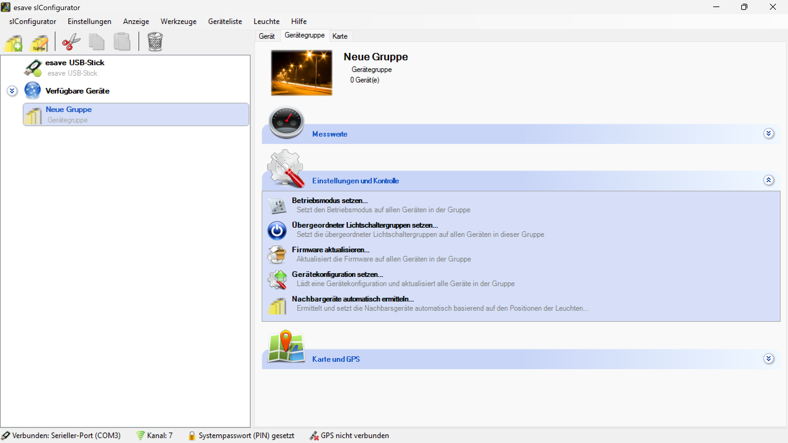

# Einstellungen und Kontrolle

  
*Zentrale Konfigurationsoberfläche für Gruppeneinstellungen und Batch-Operationen*

**Gruppen-Einstellungen und Kontrolle**

Zentrale Verwaltungsoberfläche für die simultane Konfiguration und Kontrolle aller Geräte innerhalb einer Gerätegruppe mit automatischer Parameterverteilung.

## Hauptbereiche

### 1. Betriebsmodus-Verwaltung
- Einheitliche Betriebsmodus-Konfiguration für alle Gruppengeräte
- Zentrale Steuerung der Gerätebetriebsarten
- Automatische Synchronisation aller Geräte

### 2. Lichtschalter-Integration
- Konfiguration übergeordneter Lichtschaltergruppen
- Hierarchische Steuerungsstrukturen
- Zentrale Schaltzuordnung

### 3. Firmware-Management
- Simultane Firmware-Aktualisierung aller Gruppengeräte
- Konsistente Versionsverteilung
- Zentrale Update-Verwaltung

### 4. Gerätekonfiguration
- Einheitliche Parameterkonfiguration
- Automatische Einstellungsübertragung
- Konsistente Systemkonfiguration

### 5. Topologie-Management
- Automatische Nachbargeräteerkennung
- Netzwerk-Topologie-Optimierung
- Intelligente Geräteverwaltung

## Verfügbare Funktionen

### Betriebsmodus setzen
- **Funktion**: "Setzt den Betriebsmodus auf allen Geräten in der Gruppe"
- **Anwendung**: Einheitliche Betriebsart für alle Gruppengeräte
- **Automatisierung**: Sofortige Übertragung auf alle Geräte
- **Konsistenz**: Eliminierung von Konfigurationskonflikten

### Übergeordneter Lichtschaltergruppen setzen
- **Funktion**: "Setzt die übergeordneter Lichtschaltergruppen auf allen Geräten in dieser Gruppe"
- **Anwendung**: Hierarchische Steuerungsintegration
- **Zentralisierung**: Einheitliche Schalterzuordnung
- **Flexibilität**: Anpassbare Steuerungsstrukturen

### Firmware aktualisieren
- **Funktion**: "Aktualisiert die Firmware auf allen Geräten in der Gruppe"
- **Anwendung**: Simultane Firmware-Updates
- **Effizienz**: Batch-Verarbeitung für große Gerätemengen
- **Konsistenz**: Einheitliche Firmware-Versionen

### Gerätekonfiguration setzen
- **Funktion**: "Lädt eine Gerätekonfiguration und aktualisiert alle Geräte in der Gruppe"
- **Anwendung**: Einheitliche Parameterkonfiguration
- **Skalierbarkeit**: Effiziente Massenkonfiguration
- **Standardisierung**: Konsistente Geräteeinstellungen

### Nachbargeräte automatisch ermitteln
- **Funktion**: "Ermittelt und setzt die Nachbarsgeräte automatisch basierend auf den Positionen der Leuchten..."
- **Anwendung**: Intelligente Topologie-Erkennung
- **Automatisierung**: Selbstständige Netzwerk-Optimierung
- **Optimierung**: Verbesserte Kommunikationsstrukturen

## Automatische Parameterverteilung

### Übertragungsmechanismus
- **Sofortige Anwendung**: Direkte Übertragung nach Konfiguration
- **Broadcast-Funktionalität**: Gleichzeitige Verteilung an alle Gruppengeräte
- **Konsistenz-Prüfung**: Validierung der erfolgreichen Übertragung
- **Fehlerbehandlung**: Robuste Behandlung von Übertragungsfehlern

### Synchronisation
- **Automatische Synchronisation**: Selbstständige Parameterabgleichung
- **Konsistenz-Sicherung**: Einheitliche Konfiguration aller Geräte
- **Status-Monitoring**: Überwachung der Synchronisationsstatus
- **Conflict-Resolution**: Behandlung von Konfigurationskonflikten

### Validierung
- **Erfolgs-Verifikation**: Bestätigung der erfolgreichen Übertragung
- **Integritäts-Prüfung**: Validierung der Parameterintegration
- **Performance-Monitoring**: Überwachung der Übertragungsleistung
- **Fehler-Reporting**: Detaillierte Rückmeldung bei Problemen

## Betriebsmodus-Verwaltung

### Zentrale Konfiguration
- **Einheitliche Einstellung**: Alle Gruppengeräte erhalten denselben Betriebsmodus
- **Batch-Verarbeitung**: Simultane Konfiguration aller Geräte
- **Automatische Anwendung**: Sofortige Aktivierung nach Konfiguration
- **Konsistenz-Sicherung**: Vermeidung unterschiedlicher Betriebsmodi

### Betriebsmodus-Optionen
- **Standardbetrieb**: Normale Beleuchtungsfunktionalität
- **Energiesparmodus**: Reduzierte Leistung für Effizienz
- **Wartungsmodus**: Spezielle Konfiguration für Wartungsarbeiten
- **Sicherheitsmodus**: Erhöhte Sicherheitsparameter

### Anwendungsszenarien
- **Tageszeit-Anpassung**: Verschiedene Modi für Tag/Nacht
- **Saisonale Anpassung**: Anpassung an Jahreszeiten
- **Ereignis-basierte Steuerung**: Spezielle Modi für Ereignisse
- **Wartungszyklen**: Anpassung für Wartungsintervalle

## Lichtschalter-Integration

### Hierarchische Steuerung
- **Übergeordnete Gruppen**: Integration in höhere Steuerungsebenen
- **Zentrale Schaltzuordnung**: Einheitliche Schalterzuordnung
- **Logische Verknüpfung**: Intelligente Schalter-Geräte-Verbindungen
- **Flexible Hierarchien**: Anpassbare Steuerungsstrukturen

### Schaltergruppen-Konfiguration
- **Automatische Zuordnung**: Intelligente Schalter-Geräte-Zuordnung
- **Manuelle Konfiguration**: Benutzerdefinierte Zuordnungen
- **Redundanz-Sicherung**: Mehrfache Steuerungsoptionen
- **Failover-Mechanismen**: Ausfallsichere Steuerung

### Steuerungslogik
- **Szenarien-basierte Steuerung**: Verschiedene Steuerungsszenarien
- **Zeit-basierte Steuerung**: Automatische Steuerung nach Zeitplänen
- **Ereignis-basierte Steuerung**: Reaktion auf externe Ereignisse
- **Adaptive Steuerung**: Lernende Steuerungsalgorithmen

## Firmware-Management

### Batch-Updates
- **Simultane Aktualisierung**: Gleichzeitige Updates aller Gruppengeräte
- **Konsistente Versionen**: Einheitliche Firmware-Stände
- **Optimierte Übertragung**: Effiziente Update-Verteilung
- **Fehlerbehandlung**: Robuste Behandlung von Update-Problemen

### Update-Strategien
- **Vollständige Updates**: Komplette Firmware-Neuinstallation
- **Inkrementelle Updates**: Nur Änderungen werden übertragen
- **Rollback-Fähigkeit**: Rückkehr zu vorherigen Versionen
- **Staged Updates**: Schrittweise Aktualisierung

### Validierung
- **Integritäts-Prüfung**: Überprüfung der Update-Integrität
- **Kompatibilitäts-Check**: Validierung der Hardware-Kompatibilität
- **Funktions-Test**: Überprüfung nach Update-Abschluss
- **Performance-Analyse**: Bewertung der Update-Auswirkungen

## Gerätekonfiguration

### Konfigurationsverwaltung
- **Template-basierte Konfiguration**: Wiederverwendbare Konfigurationsvorlagen
- **Batch-Konfiguration**: Simultane Konfiguration aller Geräte
- **Konsistenz-Sicherung**: Einheitliche Parameterverteilung
- **Validierung**: Überprüfung der Konfigurationskorrektheit

### Konfigurationsoptionen
- **Grundeinstellungen**: Basis-Geräteparameter
- **Erweiterte Einstellungen**: Spezielle Konfigurationsoptionen
- **Sicherheitsparameter**: Sicherheitsbezogene Konfiguration
- **Performance-Optimierung**: Leistungsoptimierte Einstellungen

### Anwendung und Übertragung
- **Sofortige Anwendung**: Direkte Aktivierung nach Konfiguration
- **Schrittweise Verteilung**: Kontrollierte Parameterübertragung
- **Fehlerbehandlung**: Behandlung von Konfigurationsfehlern
- **Status-Monitoring**: Überwachung der Konfigurationsstatus

## Topologie-Management

### Automatische Erkennung
- **Positionsbasierte Erkennung**: Basierend auf Leuchtenpositionen
- **Intelligente Algorithmen**: Automatische Nachbarschaftserkennung
- **Netzwerk-Optimierung**: Optimierte Kommunikationsstrukturen
- **Kontinuierliche Überwachung**: Dynamische Topologie-Anpassung

### Nachbargeräte-Verwaltung
- **Automatische Zuordnung**: Intelligente Nachbarschaftszuordnung
- **Manuelle Konfiguration**: Benutzerdefinierte Zuordnungen
- **Redundanz-Sicherung**: Mehrfache Kommunikationswege
- **Optimierte Routing**: Effiziente Datenübertragung

### Netzwerk-Topologie
- **Mesh-Netzwerke**: Vermaschte Kommunikationsstrukturen
- **Hierarchische Strukturen**: Ebenenbasierte Organisation
- **Redundante Pfade**: Ausfallsichere Kommunikation
- **Adaptive Routing**: Dynamische Routenanpassung

## Anwendungsszenarien

### Große Installationen
- **Straßenbeleuchtung**: Zentrale Verwaltung ganzer Straßenabschnitte
- **Industrieanlagen**: Einheitliche Konfiguration von Produktionsbereichen
- **Bürogebäude**: Koordinierte Steuerung mehrerer Stockwerke
- **Außenanlagen**: Zentrale Verwaltung von Außenbeleuchtung

### Wartung und Updates
- **Planmäßige Wartung**: Systematische Wartungszyklen
- **Sicherheitsupdates**: Dringende Sicherheitsaktualisierungen
- **Feature-Updates**: Installation neuer Funktionalitäten
- **Konfigurationsänderungen**: Anpassung an neue Anforderungen

### Betriebsoptimierung
- **Energiemanagement**: Zentrale Energieoptimierung
- **Performance-Tuning**: Leistungsoptimierung aller Geräte
- **Kapazitätsplanung**: Systematische Ressourcenplanung
- **Compliance-Management**: Einhaltung regulatorischer Anforderungen

## Vorteile der zentralen Kontrolle

### Effizienz
- **Zeitersparnis**: Simultane Konfiguration statt einzelner Geräte
- **Reduzierter Aufwand**: Minimaler manueller Konfigurationsaufwand
- **Automatisierte Prozesse**: Selbstständige Parameterverteilung
- **Skalierbare Verwaltung**: Effiziente Verwaltung großer Systeme

### Konsistenz
- **Einheitliche Konfiguration**: Identische Parameter für alle Geräte
- **Vermeidung von Konflikten**: Eliminierung von Konfigurationskonflikten
- **Standardisierung**: Konsistente Systemkonfiguration
- **Qualitätssicherung**: Einheitliche Qualitätsstandards

### Wartungsfreundlichkeit
- **Zentrale Verwaltung**: Einheitliche Verwaltungsschnittstelle
- **Batch-Operationen**: Effiziente Wartungsverfahren
- **Automatisierte Updates**: Selbstständige Systemaktualisierung
- **Vereinfachte Diagnose**: Zentrale Problemerkennung

### Flexibilität
- **Anpassbare Konfiguration**: Flexible Parameteranpassung
- **Skalierbare Architektur**: Wachstum ohne Strukturänderungen
- **Modulare Erweiterung**: Einfache Systemerweiterung
- **Dynamische Anpassung**: Reaktion auf veränderte Anforderungen

## Technische Aspekte

### Kommunikationsprotokoll
- **Broadcast-Mechanismen**: Effiziente Gruppenkommandos
- **Zuverlässige Übertragung**: Robuste Datenübertragung
- **Fehlerbehandlung**: Behandlung von Kommunikationsfehlern
- **Optimierte Protokolle**: Effiziente Bandbreitennutzung

### Synchronisation
- **Atomare Operationen**: Unteilbare Konfigurationsoperationen
- **Transaktionale Sicherheit**: Konsistente Datenübertragung
- **Rollback-Mechanismen**: Wiederherstellung bei Fehlern
- **Konsistenz-Prüfung**: Validierung der Synchronisationsqualität

### Skalierbarkeit
- **Performance-Optimierung**: Effiziente Verarbeitung großer Gruppen
- **Ressourcen-Management**: Optimierte Systemressourcennutzung
- **Lastverteilung**: Intelligente Verteilung der Kommunikationslast
- **Speicher-Effizienz**: Optimierte Datenstrukturen

## Best Practices

### Gruppenkonfiguration
- **Logische Gruppierung**: Sinnvolle Gerätegruppen bilden
- **Ausgewogene Größe**: Optimale Gruppengröße für Effizienz
- **Konsistente Parameter**: Einheitliche Konfiguration innerhalb der Gruppe
- **Regelmäßige Validierung**: Überprüfung der Gruppenkonsistenz

### Betriebsmanagement
- **Planmäßige Updates**: Systematische Aktualisierungszyklen
- **Monitoring**: Kontinuierliche Überwachung der Gruppenstatus
- **Dokumentation**: Aufzeichnung aller Konfigurationsänderungen
- **Backup-Strategien**: Regelmäßige Sicherung der Konfigurationen

### Wartung
- **Vorbeugende Wartung**: Proaktive Systemwartung
- **Fehlerbehandlung**: Systematische Problembehandlung
- **Performance-Monitoring**: Überwachung der Systemleistung
- **Kapazitätsplanung**: Vorausschauende Ressourcenplanung

> ## ℹ️ Gruppen-Einstellungen und Kontrolle
>
> **Zentrale Konfiguration mit automatischer Parameterverteilung**
>
> Gruppeneinstellungen werden automatisch auf alle Leuchten innerhalb der Gruppe übertragen. Die zentrale Kontrolloberfläche ermöglicht die effiziente Verwaltung großer Gerätemengen durch Batch-Operationen.
>
> ### Hauptfunktionen:
> - **Betriebsmodus setzen**: Einheitlicher Betriebsmodus für alle Gruppengeräte
> - **Lichtschaltergruppen**: Hierarchische Steuerungsintegration
> - **Firmware aktualisieren**: Simultane Updates aller Geräte
> - **Gerätekonfiguration**: Einheitliche Parameterkonfiguration
> - **Nachbargeräte ermitteln**: Automatische Topologie-Optimierung

*Die Gruppen-Einstellungen und Kontrolle ermöglichen eine effiziente, konsistente und benutzerfreundliche Verwaltung von Beleuchtungsgruppen mit automatischer Parameterverteilung und zentraler Konfigurationskontrolle.*  