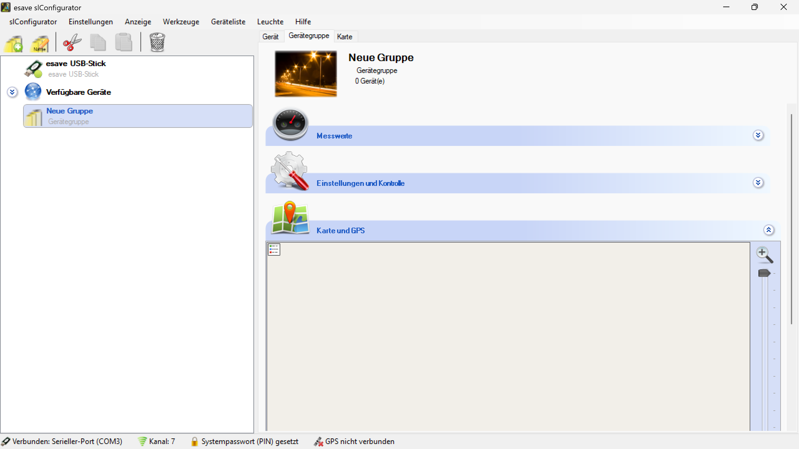

# Karte und GPS

*Karte und GPS - Geografische Visualisierung und Positionsverwaltung der Gerätegruppe*

**Geografische Gerätegruppen-Verwaltung**

Interaktive Kartendarstellung und GPS-basierte Positionsverwaltung für Beleuchtungsgeräte mit geografischer Visualisierung, Koordinaten-Management und räumlicher Analyse.

## Hauptbereiche

### 1. Kartendarstellung
- Interaktive Kartenvisualisierung der Gerätegruppe
- OpenStreetMap-Integration für geografische Referenz
- Zoom- und Navigationsfunktionen
- Verschiedene Kartenebenen und Ansichtsmodi

### 2. GPS-Positionierung
- Präzise Koordinatenerfassung der Geräte
- Automatische Positionsbestimmung
- Manuelle Positionskorrekturen
- Koordinaten-Export und -Import

### 3. Räumliche Analyse
- Abstandsmessungen zwischen Geräten
- Flächenberechnungen und Gebietsanalysen
- Optimale Positionierungsvorschläge
- Netzwerk-Topologie-Visualisierung

### 4. Positionsverwaltung
- Zentrale Koordinatenverwaltung
- Batch-Positionierung für Gerätegruppen
- Historische Positionsdaten
- Positionsvalidierung und -korrektur

## Kartenfunktionalitäten

### Interaktive Navigation
- **Zoom-Kontrollen**: Stufenlose Vergrößerung und Verkleinerung der Kartenansicht
- **Pan-Funktion**: Verschieben der Kartenansicht durch Drag & Drop
- **Vollbild-Modus**: Maximierte Kartendarstellung für detaillierte Analyse
- **Minimap**: Übersichtskarte für schnelle Navigation

### Kartenebenen
- **Straßenkarte**: Detaillierte Straßen- und Gebäudedarstellung
- **Satellitenbild**: Luftbildaufnahmen für präzise Positionierung
- **Hybridansicht**: Kombination aus Straßenkarte und Satellitenbild
- **Topographische Karte**: Höhenlinien und Geländedarstellung

### Visualisierungsoptionen
- **Geräte-Marker**: Eindeutige Symbole für verschiedene Gerätetypen
- **Gruppenbereich**: Visuelle Darstellung des Gruppenabdeckungsbereichs
- **Verbindungslinien**: Netzwerktopologie zwischen Geräten
- **Statusanzeigen**: Farbcodierte Darstellung des Gerätestatus

## GPS-Integration

### Positionserfassung
- **Automatische GPS-Lokalisierung**: Kontinuierliche Positionsbestimmung
- **Manuelle Koordinateneingabe**: Präzise Eingabe von Längen- und Breitengraden
- **Adressbasierte Positionierung**: Umwandlung von Adressen in Koordinaten
- **Referenzpunkt-System**: Relative Positionierung zu bekannten Punkten

### Koordinatenformate
- **Dezimalgrad**: Standard GPS-Format (DD.DDDDDD)
- **Grad-Minuten-Sekunden**: Traditionelles Format (DD°MM'SS.SS")
- **UTM-Koordinaten**: Universal Transverse Mercator Projektion
- **Lokale Koordinatensysteme**: Anpassung an regionale Standards

### Genauigkeitsmanagement
- **Präzisionsgrad**: Konfigurierbare Genauigkeitsanforderungen
- **Fehlertoleranz**: Acceptable Abweichungen definieren
- **Kalibrierung**: Regelmäßige Positionsvalidierung
- **Korrekturverfahren**: Automatische und manuelle Positionskorrekturen

## Geräte-Positionierung

### Einzelgeräte-Positionierung
- **Drag & Drop**: Intuitive Positionierung durch Verschieben auf der Karte
- **Koordinaten-Input**: Direkte Eingabe von GPS-Koordinaten
- **Adress-Suche**: Positionierung über Adresseingabe
- **Snap-to-Grid**: Ausrichtung an Rasterpunkten für präzise Positionierung

### Gruppen-Positionierung
- **Batch-Positionierung**: Simultane Positionierung mehrerer Geräte
- **Geometrische Anordnung**: Automatische Anordnung in Mustern
- **Relative Positionierung**: Positionierung relativ zu anderen Geräten
- **Template-basiert**: Verwendung vordefinierter Anordnungsmuster

### Positionsvalidierung
- **Plausibilitätsprüfung**: Überprüfung der Positionslogik
- **Kollisionserkennung**: Erkennung überlappender Positionen
- **Abstandsvalidierung**: Überprüfung minimaler und maximaler Abstände
- **Accessibility-Check**: Prüfung der Erreichbarkeit von Positionen

## Räumliche Analyse-Tools

### Abstandsmessungen
- **Punkt-zu-Punkt**: Direkte Entfernungsmessung zwischen Geräten
- **Luftlinie vs. Wegstrecke**: Unterscheidung zwischen direkter und tatsächlicher Entfernung
- **Batch-Messungen**: Simultane Messung mehrerer Abstände
- **Statistiken**: Durchschnittliche, minimale und maximale Abstände

### Flächenberechnungen
- **Abdeckungsbereich**: Berechnung der von Geräten abgedeckten Fläche
- **Überlappungsanalyse**: Identifikation von Überschneidungsbereichen
- **Optimierungsvorschläge**: Empfehlungen für verbesserte Flächennutzung
- **Effizienzmetriken**: Bewertung der räumlichen Effizienz

### Netzwerk-Topologie
- **Verbindungsmatrix**: Darstellung der Gerätekonnektivität
- **Signalstärke-Mapping**: Visualisierung der Verbindungsqualität
- **Redundanz-Analyse**: Identifikation kritischer Verbindungen
- **Netzwerk-Optimierung**: Vorschläge zur Verbesserung der Topologie

## Datenmanagement

### Koordinaten-Export
- **CSV-Export**: Tabellarische Darstellung aller Koordinaten
- **KML-Format**: Google Earth-kompatibles Format
- **GPX-Format**: GPS-Exchange-Format für Navigation
- **JSON-Export**: Strukturierte Datenübertragung

### Koordinaten-Import
- **Batch-Import**: Massenimport von Koordinaten
- **Formatvalidierung**: Überprüfung der Importdaten
- **Fehlerbehandlung**: Robuste Verarbeitung fehlerhafter Daten
- **Mappingtools**: Zuordnung von Koordinaten zu Geräten

### Backup und Wiederherstellung
- **Positions-Backup**: Automatische Sicherung der Positionsdaten
- **Versionsverwaltung**: Historische Positionsdaten
- **Wiederherstellungsoptionen**: Rückkehr zu früheren Positionen
- **Synchronisation**: Abgleich zwischen verschiedenen Systemen

## Anwendungsszenarien

### Installationsplanung
- **Standortanalyse**: Optimale Positionierung neuer Geräte
- **Abdeckungsplanung**: Sicherstellung vollständiger Flächenabdeckung
- **Kostenoptimierung**: Minimierung der Installationskosten
- **Machbarkeitsstudien**: Bewertung geplanter Installationen

### Wartungsmanagement
- **Wartungsrouten**: Optimierte Routen für Wartungsteams
- **Zugänglichkeitsanalyse**: Bewertung der Erreichbarkeit von Geräten
- **Ersatzteillogistik**: Effiziente Verteilung von Ersatzteilen
- **Notfallresponse**: Schnelle Lokalisierung problematischer Geräte

### Systemoptimierung
- **Performance-Analyse**: Bewertung der räumlichen Effizienz
- **Netzwerk-Optimierung**: Verbesserung der Konnektivität
- **Energieeffizienz**: Optimierung des Energieverbrauchs
- **Skalierungsplanung**: Vorbereitung auf Systemerweiterungen

### Compliance und Dokumentation
- **Regulatorische Anforderungen**: Erfüllung gesetzlicher Vorschriften
- **Audit-Vorbereitung**: Dokumentation für Compliance-Prüfungen
- **Berichterstattung**: Generierung von Positionsberichten
- **Zertifizierungen**: Unterstützung bei Zertifizierungsverfahren

## Technische Implementierung

### Kartenintegration
- **OpenStreetMap-API**: Integration der Open-Source-Kartendienste
- **Tile-Server**: Effiziente Kartenkachel-Verwaltung
- **Caching-Mechanismen**: Lokale Zwischenspeicherung von Kartendaten
- **Offline-Modus**: Funktionalität ohne Internetverbindung

### GPS-Technologie
- **Multi-GNSS-Unterstützung**: GPS, GLONASS, Galileo, BeiDou
- **Differential GPS**: Verbesserte Genauigkeit durch Referenzstationen
- **Real-Time Kinematic**: Zentimetergenauigkeit für präzise Anwendungen
- **Assisted GPS**: Schnellere Positionsbestimmung durch Netzwerkunterstützung

### Datenverarbeitung
- **Spatial-Datenbanken**: Effiziente Speicherung geografischer Daten
- **GIS-Algorithmen**: Geografische Informationssystem-Funktionen
- **Coordinate-Transformationen**: Umrechnung zwischen Koordinatensystemen
- **Interpolation**: Schätzung von Zwischenwerten

## Benutzeroberfläche

### Kartensteuerung
- **Intuitive Navigation**: Benutzerfreundliche Karteninteraktion
- **Kontextmenüs**: Schnellzugriff auf Funktionen
- **Toolbar**: Übersichtliche Anordnung der Werkzeuge
- **Status-Anzeigen**: Kontinuierliche Information über Systemzustand

### Geräteverwaltung
- **Geräte-Panel**: Übersichtliche Darstellung aller Geräte
- **Eigenschaften-Dialog**: Detaillierte Geräteinformationen
- **Batch-Operationen**: Effiziente Verwaltung mehrerer Geräte
- **Suchfunktionen**: Schnelles Auffinden spezifischer Geräte

### Visualisierungsoptionen
- **Layer-Kontrolle**: Verwaltung verschiedener Kartenebenen
- **Symbolbibliothek**: Anpassbare Geräte-Symbole
- **Farbschemas**: Verschiedene Darstellungsoptionen
- **Transparenz**: Anpassbare Sichtbarkeit von Elementen

## Sicherheitsaspekte

### Positionsdaten-Schutz
- **Datenverschlüsselung**: Sichere Speicherung von Koordinaten
- **Zugriffskontrolle**: Beschränkung auf autorisierte Benutzer
- **Anonymisierung**: Schutz sensibler Positionsdaten
- **Audit-Trail**: Vollständige Protokollierung aller Positionsänderungen

### Netzwerksicherheit
- **Sichere Verbindungen**: Verschlüsselte Datenübertragung
- **Authentifizierung**: Sichere Geräteidentifikation
- **Firewall-Integration**: Schutz vor unbefugtem Zugriff
- **Intrusion Detection**: Erkennung von Sicherheitsverletzungen

### Compliance
- **Datenschutz**: Einhaltung von Datenschutzbestimmungen
- **Geolocation-Richtlinien**: Compliance mit regionalen Vorschriften
- **Audit-Funktionen**: Unterstützung bei Compliance-Prüfungen
- **Dokumentation**: Vollständige Sicherheitsdokumentation

## Best Practices

### Positionierungsgenauigkeit
- **Referenzpunkte**: Verwendung bekannter Referenzpunkte
- **Mehrfachmessungen**: Wiederholte Messungen für höhere Genauigkeit
- **Kalibrierung**: Regelmäßige Systemkalibrierung
- **Fehlerkorrektur**: Systematische Korrektur von Positionsfehlern

### Kartenwartung
- **Regelmäßige Updates**: Aktualisierung der Kartendaten
- **Datenvalidierung**: Überprüfung der Kartengenauigkeit
- **Backup-Strategien**: Sicherung kritischer Kartendaten
- **Performance-Monitoring**: Überwachung der Kartendarstellung

### Benutzerschulung
- **Funktionstraining**: Schulung in Kartenfunktionen
- **Sicherheitsschulung**: Bewusstsein für Sicherheitsaspekte
- **Best-Practice-Dokumentation**: Leitfäden für optimale Nutzung
- **Troubleshooting**: Problemlösungsstrategien

## Vorteile der Karte-und-GPS-Integration

### Visualisierung
- **Geografische Übersicht**: Klare räumliche Darstellung des Netzwerks
- **Intuitive Bedienung**: Benutzerfreundliche Karteninteraktion
- **Kontextuelle Information**: Geografische Bezüge für besseres Verständnis
- **Echtzeit-Updates**: Kontinuierliche Aktualisierung der Darstellung

### Effizienz
- **Planungsoptimierung**: Verbesserte Installationsplanung
- **Wartungseffizienz**: Optimierte Wartungsrouten
- **Ressourcennutzung**: Effiziente Nutzung verfügbarer Ressourcen
- **Zeitersparnis**: Schnellere Orientierung und Navigation

### Genauigkeit
- **Präzise Positionierung**: Zentimetergenaue Gerätepositionierung
- **Validierung**: Mehrfache Überprüfung der Positionen
- **Fehlerreduktion**: Minimierung von Positionierungsfehlern
- **Konsistenz**: Einheitliche Positionsdaten im gesamten System

### Skalierbarkeit
- **Große Netzwerke**: Effiziente Verwaltung umfangreicher Installationen
- **Flexible Erweiterung**: Einfache Integration neuer Geräte
- **Performance**: Optimierte Darstellung auch bei vielen Geräten
- **Zukunftssicherheit**: Anpassung an wachsende Anforderungen

> ## ℹ️ Karte und GPS
>
> **Geografische Visualisierung und Positionsverwaltung**
>
> Interaktive Kartendarstellung und GPS-basierte Positionsverwaltung für Beleuchtungsgeräte. Gruppeneinstellungen werden automatisch auf alle Leuchten innerhalb der Gruppe übertragen.
>
> ### Hauptfunktionen:
> - **Interaktive Karte**: OpenStreetMap-basierte Visualisierung mit Zoom und Navigation
> - **GPS-Positionierung**: Präzise Koordinatenerfassung und -verwaltung
> - **Räumliche Analyse**: Abstandsmessungen und Flächenberechnungen
> - **Positionsverwaltung**: Zentrale Koordinatenverwaltung mit Batch-Operationen
> - **Datenmanagement**: Export/Import von Koordinaten in verschiedenen Formaten

*Die Karte-und-GPS-Integration ermöglicht eine umfassende geografische Verwaltung von Beleuchtungsgeräten mit präziser Positionierung, interaktiver Visualisierung und effizienten Planungstools.*