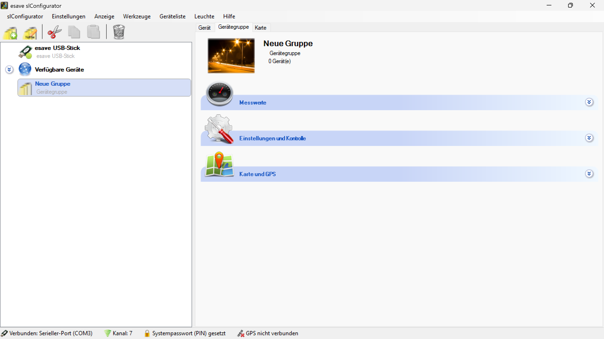
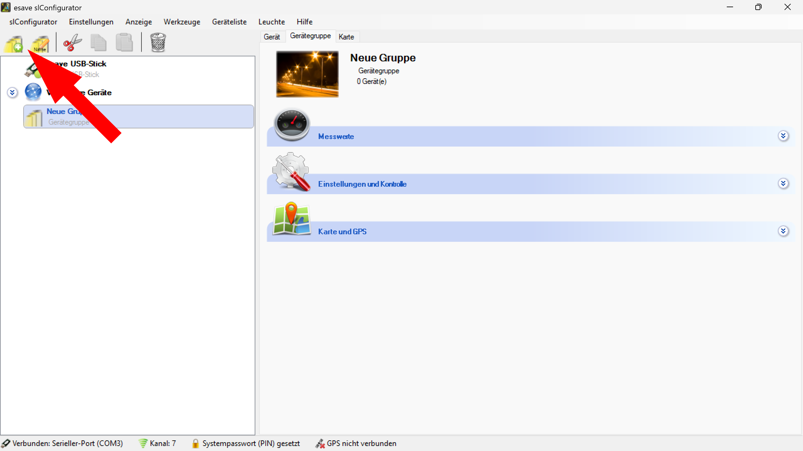

# Gerätegruppe

  
*In einem größeren System können mehrere Leuchten innerhalb einer Standardgruppe unübersichtlich werden. Um dies zu vermeiden, können die Leuchten in verschiedenen Gruppen organisiert werden.*

  
*Eine neue Gruppe kann über das Symbol in der oberen linken Ecke der SL-Configurator Software erstellt werden.*

**Gerätegruppen-Verwaltung**

Hierarchische Organisation und zentrale Verwaltung von Beleuchtungsgeräten in logischen Gruppen für verbesserte Übersichtlichkeit und effiziente Systemkonfiguration.

## Hauptbereiche

### 1. Gruppenerstellung
- Neue Gerätegruppen über Toolbar-Symbol erstellen
- Strukturierte Organisation großer Gerätemengen
- Flexible Gruppenhierarchie

### 2. Geräte-Zuordnung
- Drag & Drop-Funktionalität für Gerätezuordnung
- Visuelle Geräteverwaltung
- Dynamische Gruppenzusammenstellung

### 3. Gruppenkonfiguration
- Zentrale Einstellungen für alle Gruppengeräte
- Automatische Parameterverteilung
- Konsistente Systemkonfiguration

### 4. Batch-Operationen
- Simultane Konfiguration mehrerer Geräte
- Effiziente Wartung und Updates
- Einheitliche Betriebsparameter

## Gruppen-Erstellung

### Neue Gruppe erstellen
- **Toolbar-Symbol**: Gruppe-Symbol in der oberen linken Ecke
- **Automatische Benennung**: "Neue Gruppe" als Standard-Bezeichnung
- **Geräte-Kategorie**: Automatische Kategorisierung als "Gerätegruppe"
- **Leer-Initialisierung**: "0 Gerät(e)" bei Erstellung

### Gruppen-Hierarchie
- **Verfügbare Geräte**: Globale Geräteliste als Basis
- **Strukturierte Organisation**: Logische Aufteilung nach Bereichen
- **Flexible Benennung**: Anpassbare Gruppennamen
- **Visuelle Unterscheidung**: Eindeutige Gruppen-Icons

### Navigationsbereich
- **Linke Sidebar**: Hierarchische Darstellung aller Gruppen
- **esave USB-Stick**: Hardware-Verbindung anzeigen
- **Verfügbare Geräte**: Globale Geräteübersicht
- **Neue Gruppe**: Erstellte Gruppen mit Geräteanzahl

## Geräte-Zuordnung

### Drag & Drop-Funktionalität
- **Intuitive Bedienung**: Einfaches Ziehen von Geräten zwischen Gruppen
- **Visuelle Rückmeldung**: Sofortige Anzeige der Zuordnungsänderungen
- **Flexible Umgruppierung**: Beliebige Verschiebung zwischen Gruppen
- **Batch-Auswahl**: Mehrere Geräte gleichzeitig verschieben

### Geräteverwaltung
- **Ausgangsposition**: Geräte starten in "Verfügbare Geräte"
- **Zielgruppe**: Verschiebung in spezifische Gerätegruppen
- **Dynamische Zählung**: Automatische Aktualisierung der Geräteanzahl
- **Konsistenz-Prüfung**: Validierung der Gruppenzuordnung

### Visuelle Darstellung
- **Geräte-Icons**: Eindeutige Symbole für verschiedene Gerätetypen
- **Gruppen-Status**: Anzeige der Geräteanzahl pro Gruppe
- **Aktuelle Auswahl**: Hervorhebung der ausgewählten Gruppe
- **Verfügbarkeits-Indikator**: Status der Geräteverbindung

## Gruppenkonfiguration

### Zentrale Einstellungen
- **Betriebsmodus setzen**: Einheitlicher Betriebsmodus für alle Gruppengeräte
- **Lichtschaltergruppen**: Übergeordnete Lichtschalter-Zuordnung
- **Firmware aktualisieren**: Simultane Firmware-Updates
- **Gerätekonfiguration**: Einheitliche Geräteparameter

### Erweiterte Funktionen
- **Nachbargeräte ermitteln**: Automatische Topologie-Erkennung
- **Leistungsprofil setzen**: Energiemanagement-Konfiguration
- **Batch-Operationen**: Effiziente Massenkonfiguration
- **Konsistenz-Sicherung**: Einheitliche Parameterverteilung

### Automatische Übertragung
- **Sofortige Anwendung**: Direkte Übertragung auf alle Gruppengeräte
- **Konsistenz-Prüfung**: Validierung der erfolgreichen Übertragung
- **Fehlerbehandlung**: Behandlung von Übertragungsfehlern
- **Status-Monitoring**: Überwachung der Konfigurationsstatus

## Detailbereiche

### Gruppen-Übersicht
- **Neue Gruppe**: Beispiel-Gruppe mit Street-Light-Symbolik
- **Gerätegruppe**: Kategorisierung als Gerätegruppe
- **Geräte-Zähler**: "0 Gerät(e)" zeigt aktuelle Gruppengröße
- **Bild-Assoziation**: Straßenbeleuchtungs-Bild für visuelle Identifikation

### Funktionsbereiche
- **Messwerte**: Monitoring-Bereich für Systemüberwachung
- **Einstellungen und Kontrolle**: Zentrale Konfigurationsoberfläche
- **Karte und GPS**: Geografische Geräteverwaltung
- **Detailansicht**: Erweiterte Informationen und Einstellungen

### Interface-Elemente
- **Tab-Navigation**: Gerät, Gerätegruppe, Karte für verschiedene Ansichten
- **Toolbar-Icons**: Schnellzugriff auf wichtige Funktionen
- **Status-Bar**: Verbindungsstatus und Systemparameter
- **Menü-Struktur**: Hierarchische Navigation durch Funktionen

## Konfigurationsmöglichkeiten

### Betriebsmodus-Verwaltung
- **Einheitlicher Modus**: Alle Gruppengeräte erhalten denselben Betriebsmodus
- **Konsistente Konfiguration**: Vermeidung von Konfigurationskonflikten
- **Zentrale Steuerung**: Einfache Verwaltung komplexer Systeme
- **Automatische Synchronisation**: Sofortige Übertragung auf alle Geräte

### Lichtschalter-Integration
- **Übergeordnete Gruppen**: Zuordnung zu höheren Steuerungsebenen
- **Logische Verknüpfung**: Verbindung mit externen Schaltsystemen
- **Hierarchische Steuerung**: Mehrstufige Kontrollstrukturen
- **Flexible Zuordnung**: Anpassbare Schalter-Geräte-Verknüpfungen

### Firmware-Management
- **Batch-Updates**: Simultane Aktualisierung aller Gruppengeräte
- **Konsistente Versionen**: Einheitliche Firmware-Stände
- **Zentrale Verwaltung**: Vereinfachte Update-Prozesse
- **Fehlerbehandlung**: Robuste Behandlung von Update-Problemen

## Anwendungsszenarien

### Große Installationen
- **Straßenbeleuchtung**: Aufteilung nach Straßenabschnitten
- **Industrieanlagen**: Gruppierung nach Produktionsbereichen
- **Bürogebäude**: Organisation nach Stockwerken oder Abteilungen
- **Außenbeleuchtung**: Strukturierung nach Funktionsbereichen

### Projektmanagement
- **Phasenweise Installation**: Gruppierung nach Installationsphasen
- **Wartungsgruppen**: Organisation nach Wartungsintervallen
- **Verantwortlichkeiten**: Zuordnung nach Zuständigkeitsbereichen
- **Test-Gruppen**: Separate Gruppen für Testzwecke

### Betriebsoptimierung
- **Energiemanagement**: Gruppierung nach Energieverbrauch
- **Zeitsteuerung**: Organisation nach Betriebszeiten
- **Sicherheitszonen**: Aufteilung nach Sicherheitsanforderungen
- **Wartungszyklen**: Gruppierung nach Wartungsintervallen

### Systemerweiterung
- **Skalierbarkeit**: Einfache Integration neuer Geräte
- **Modularität**: Flexible Systemarchitektur
- **Zukunftssicherheit**: Vorbereitung für Systemwachstum
- **Kompatibilität**: Integration verschiedener Gerätetypen

## Vorteile der Gruppenverwaltung

### Übersichtlichkeit
- **Strukturierte Darstellung**: Logische Organisation großer Gerätemengen
- **Hierarchische Navigation**: Intuitive Systemnavigation
- **Visuelle Unterscheidung**: Klare Gruppentrennung
- **Skalierbare Darstellung**: Effizienz auch bei großen Systemen

### Effizienz
- **Batch-Operationen**: Simultane Konfiguration mehrerer Geräte
- **Zentrale Verwaltung**: Reduzierte Konfigurationszeit
- **Automatische Übertragung**: Minimaler manueller Aufwand
- **Konsistente Konfiguration**: Vermeidung von Fehlkonfigurationen

### Wartungsfreundlichkeit
- **Strukturierte Wartung**: Systematische Gerätewartung
- **Gruppierte Updates**: Effiziente Firmware-Aktualisierung
- **Einheitliche Parameter**: Konsistente Systemkonfiguration
- **Fehlerdiagnose**: Vereinfachte Problemidentifikation

### Flexibilität
- **Dynamische Umgruppierung**: Anpassung an veränderte Anforderungen
- **Flexible Hierarchien**: Verschiedene Organisationsstrukturen
- **Skalierbare Architektur**: Wachstum ohne Strukturänderungen
- **Modulare Erweiterung**: Einfache Systemerweiterung

## Technische Aspekte

### Gruppenverwaltung
- **Hierarchische Strukturen**: Effiziente Datenorganisation
- **Konsistenz-Mechanismen**: Sicherstellung der Datenintegrität
- **Synchronisation**: Automatische Parameterabgleichung
- **Backup-Mechanismen**: Sicherung von Gruppenkonfigurationen

### Kommunikation
- **Broadcast-Mechanismen**: Effiziente Gruppenkommandos
- **Fehlerbehandlung**: Robuste Kommunikation mit Gruppengeräten
- **Status-Monitoring**: Überwachung der Geräteverfügbarkeit
- **Optimierte Protokolle**: Effiziente Datenübertragung

### Skalierbarkeit
- **Performance-Optimierung**: Effiziente Verarbeitung großer Gruppen
- **Speicher-Management**: Optimierte Ressourcennutzung
- **Lastverteilung**: Intelligente Kommunikationssteuerung
- **Modularität**: Flexible Systemarchitektur

## Best Practices

### Gruppenstruktur
- **Logische Organisation**: Gruppierung nach funktionalen Bereichen
- **Sinnvolle Benennung**: Aussagekräftige Gruppennamen
- **Ausgewogene Größe**: Optimale Gruppengröße für Effizienz
- **Hierarchische Planung**: Durchdachte Strukturierung

### Konfiguration
- **Konsistente Parameter**: Einheitliche Gerätekonfiguration
- **Dokumentation**: Aufzeichnung der Gruppenkonfiguration
- **Regelmäßige Validierung**: Überprüfung der Gruppenkonsistenz
- **Backup-Strategie**: Sicherung der Gruppenkonfigurationen

### Wartung
- **Planmäßige Updates**: Regelmäßige Firmware-Aktualisierungen
- **Monitoring**: Kontinuierliche Überwachung der Gruppenstatus
- **Fehlerbehandlung**: Systematische Problembehandlung
- **Dokumentation**: Aufzeichnung aller Wartungsaktivitäten

> ## ℹ️ Gerätegruppen-Verwaltung
>
> **Hierarchische Organisation für effiziente Systemverwaltung**
>
> In größeren Systemen können mehrere Leuchten innerhalb einer Standardgruppe unübersichtlich werden. Die Gruppenfunktion ermöglicht die logische Organisation von Geräten für verbesserte Übersichtlichkeit und zentrale Verwaltung.
>
> ### Hauptfunktionen:
> - **Drag & Drop**: Intuitive Gerätezuordnung zwischen Gruppen
> - **Zentrale Konfiguration**: Automatische Übertragung auf alle Gruppengeräte
> - **Batch-Operationen**: Simultane Konfiguration mehrerer Geräte
> - **Hierarchische Struktur**: Flexible Organisation nach Anforderungen
> - **Konsistente Verwaltung**: Einheitliche Parameter für alle Gruppengeräte

*Die Gerätegruppen-Verwaltung ermöglicht eine strukturierte, effiziente und benutzerfreundliche Organisation von Beleuchtungssystemen mit automatischer Parameterverteilung und zentraler Konfigurationsverwaltung.*  