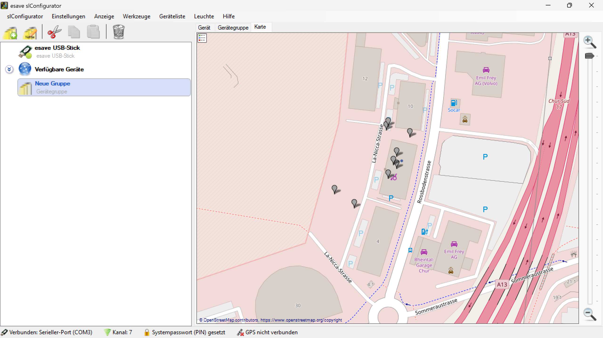

# Karte

*Karte - Zeigt die verfügbaren Geräte auf einer Karte an*

**Geografische Gerätevisualisierung**

Interaktive Kartendarstellung aller verfügbaren Beleuchtungsgeräte mit OpenStreetMap-Integration, präziser Positionierung und umfassenden Navigationsfunktionen.

## Hauptbereiche

### 1. Interaktive Kartendarstellung
- OpenStreetMap-basierte Visualisierung
- Echtzeit-Gerätepositionierung
- Verschiedene Kartenebenen und Ansichtsmodi
- Zoom- und Navigationsfunktionen

### 2. Geräte-Markierung
- Eindeutige Symbole für verschiedene Gerätetypen
- Farbcodierte Statusanzeigen
- Hierarchische Gruppierungen
- Interaktive Marker mit Detailinformationen

### 3. Räumliche Navigation
- Stufenlose Zoom-Funktionen
- Pan- und Scroll-Navigation
- Vollbild-Modus für detaillierte Analyse
- Minimap für Übersichtsdarstellung

### 4. Geografische Analyse
- Abstandsmessungen zwischen Geräten
- Flächenberechnungen
- Topologische Netzwerkanalyse
- Positionsbasierte Optimierung

## Kartenfunktionalitäten

### OpenStreetMap-Integration
- **Straßenkarten**: Detaillierte Straßen- und Wegedarstellung
- **Gebäude**: Strukturierte Darstellung von Gebäuden und Infrastruktur
- **Landschaftsmerkmale**: Geografische Orientierungspunkte
- **Öffentliche Einrichtungen**: Parkplätze, Geschäfte und Services

### Geräte-Visualisierung
- **Leuchtenpositionen**: Präzise Darstellung aller Beleuchtungsgeräte
- **Geräte-Marker**: Graue Markierungen für Standardgeräte
- **Spezialgeräte**: Farbige Markierungen für besondere Gerätetypen
- **Statusanzeigen**: Visuelle Darstellung des Betriebsstatus

### Interaktive Elemente
- **Zoom-Kontrollen**: Plus/Minus-Schaltflächen für Vergrößerung/Verkleinerung
- **Marker-Interaktion**: Klickbare Geräte-Symbole
- **Kontextmenüs**: Rechtklick-Menüs für erweiterte Funktionen
- **Tooltip-Informationen**: Hover-Effekte mit Geräteinformationen

## Gerätetypen und Markierungen

### Standard-Beleuchtungsgeräte
- **Straßenleuchten**: Graue Marker entlang der Straßen
- **Parkplatzbeleuchtung**: Positionierung auf Parkflächen
- **Wegbeleuchtung**: Marker entlang von Fußwegen
- **Platzbeleuchtung**: Verteilung auf öffentlichen Plätzen

### Spezialgeräte
- **Steuerungsgeräte**: Besondere Markierungen für Kontrolleinheiten
- **Sensoren**: Farbige Marker für Umgebungssensoren
- **Kommunikationsgeräte**: Netzwerk-Infrastruktur-Marker
- **Notbeleuchtung**: Spezielle Kennzeichnung für Notfallsysteme

### Statusanzeigen
- **Betriebsbereit**: Normale Markierungsfarbe
- **Wartung erforderlich**: Warnfarben für Wartungsbedarfe
- **Offline**: Graue oder durchgestrichene Markierungen
- **Alarm**: Rote Markierungen für kritische Zustände

## Navigations- und Zoom-Funktionen

### Zoom-Kontrollen
- **Vergrößerung**: Plus-Schaltfläche für detaillierte Ansicht
- **Verkleinerung**: Minus-Schaltfläche für Übersichtsdarstellung
- **Zoom-Level**: Stufenlose Anpassung der Darstellungsebene
- **Fit-to-View**: Automatische Anpassung an alle Geräte

### Pan-Navigation
- **Drag & Drop**: Verschieben der Kartenansicht
- **Tastaturnavigation**: Pfeiltasten für präzise Bewegung
- **Scroll-Funktion**: Mausrad für Zoom-Interaktion
- **Touch-Gesten**: Unterstützung für Touch-Displays

### Orientierungshilfen
- **Kompass**: Nordausrichtung und Himmelsrichtungen
- **Maßstab**: Entfernungsangaben für Größenverhältnisse
- **Koordinaten**: GPS-Koordinaten für präzise Positionierung
- **Adressanzeige**: Straßennamen und Hausnummern

## Geografische Referenzpunkte

### Straßeninfrastruktur
- **Le Noirfonds**: Straßenbezeichnungen für Orientierung
- **Rossenrainstrasse**: Hauptverkehrsstraßen
- **Sommeraustrasse**: Wohnstraßen und Nebenstraßen
- **Verkehrsführung**: Einbahnstraßen und Verkehrsrichtungen

### Gebäude und Einrichtungen
- **Emil Frey AG**: Geschäftsgebäude und Autohäuser
- **Rheintal Garage**: Werkstätten und Servicebetriebe
- **Parkplätze**: Bezeichnete Parkflächen (P)
- **Öffentliche Einrichtungen**: Community-Services

### Topografische Merkmale
- **Höhenlinien**: Geländedarstellung
- **Wasserwege**: Flüsse und Gewässer
- **Grünflächen**: Parks und Erholungsgebiete
- **Industriegebiete**: Gewerbliche Nutzung

## Technische Kartenintegration

### OpenStreetMap-Technologie
- **Tile-Server**: Effiziente Kartenkachel-Verwaltung
- **Vektor-Daten**: Skalierbare Kartendarstellung
- **Echtzeit-Updates**: Kontinuierliche Kartenaktualisierung
- **Offline-Modus**: Lokale Kartenspeicherung

### Geolocation-Services
- **GPS-Integration**: Präzise Koordinatenbestimmung
- **Adress-Geocoding**: Umwandlung von Adressen in Koordinaten
- **Reverse-Geocoding**: Koordinaten zu Adressinformationen
- **Routing-Services**: Wegberechnung zwischen Punkten

### Performanz-Optimierung
- **Lazy Loading**: Bedarfsgerechte Datenladung
- **Caching**: Lokale Zwischenspeicherung
- **Komprimierung**: Effiziente Datenübertragung
- **Progressive Loading**: Stufenweise Detaildarstellung

## Anwendungsszenarien

### Systemübersicht
- **Gesamtdarstellung**: Vollständige Visualisierung aller Geräte
- **Verteilungsanalyse**: Bewertung der Geräteverteilung
- **Abdeckungsbereich**: Analyse der Beleuchtungsabdeckung
- **Netzwerk-Topologie**: Verständnis der Systemarchitektur

### Wartungsplanung
- **Wartungsrouten**: Optimale Routen für Wartungsteams
- **Zugänglichkeit**: Bewertung der Erreichbarkeit
- **Logistik**: Planung von Materialverteilung
- **Zeitoptimierung**: Effiziente Tourenplanung

### Installationsplanung
- **Standortanalyse**: Bewertung potenzieller Installationsorte
- **Abstandsoptimierung**: Optimale Geräteabstände
- **Infrastruktur**: Berücksichtigung vorhandener Infrastruktur
- **Regulatorische Compliance**: Einhaltung von Vorschriften

### Betriebsmonitoring
- **Echtzeitüberwachung**: Kontinuierliche Statusverfolgung
- **Störungslokalisation**: Schnelle Identifikation von Problemen
- **Performance-Bewertung**: Analyse der Systemleistung
- **Predictive Maintenance**: Vorhersage von Wartungsbedarfen

## Benutzerinteraktion

### Geräte-Auswahl
- **Einzelauswahl**: Klick auf einzelne Geräte
- **Mehrfachauswahl**: Bereichsauswahl mit Gummiband
- **Filterung**: Anzeige spezifischer Gerätetypen
- **Suchfunktion**: Suche nach Geräten oder Adressen

### Informationsanzeige
- **Popup-Fenster**: Detailinformationen bei Klick
- **Tooltip**: Kurzinformationen beim Hover
- **Seitenleiste**: Erweiterte Geräteinformationen
- **Statusleiste**: Systeminformationen

### Kontextmenüs
- **Gerätekonfiguration**: Direktzugriff auf Einstellungen
- **Wartungsoptionen**: Wartungsaktivitäten planen
- **Datenexport**: Export von Gerätedaten
- **Berichtsgenerierung**: Erstellung von Berichten

## Datenmanagement

### Positionsdaten
- **GPS-Koordinaten**: Präzise Gerätepositionierung
- **Adressinformationen**: Straßenadressen und Hausnummern
- **Höhenangaben**: Elevation und Geländehöhe
- **Orientierung**: Ausrichtung der Geräte

### Gerätedaten
- **Identifikation**: Eindeutige Geräte-IDs
- **Typisierung**: Gerätekategorien und -spezifikationen
- **Statusdaten**: Betriebszustand und Gesundheit
- **Konfiguration**: Aktuelle Einstellungen

### Historische Daten
- **Positionshistorie**: Änderungen der Gerätepositionen
- **Statusverlauf**: Entwicklung des Gerätestatus
- **Wartungshistorie**: Durchgeführte Wartungsaktivitäten
- **Performance-Daten**: Langzeit-Leistungsdaten

## Sicherheit und Datenschutz

### Positionsdatenschutz
- **Datenverschlüsselung**: Sichere Speicherung von Koordinaten
- **Zugriffskontrolle**: Beschränkung auf autorisierte Benutzer
- **Anonymisierung**: Schutz sensibler Standortdaten
- **Compliance**: Einhaltung von Datenschutzbestimmungen

### Kartensicherheit
- **Sichere Verbindungen**: Verschlüsselte Kartenübertragung
- **Authentifizierung**: Sichere Benutzeranmeldung
- **Audit-Trail**: Protokollierung aller Kartenaktivitäten
- **Backup-Strategien**: Sicherung kritischer Kartendaten

### Netzwerksicherheit
- **Firewall-Integration**: Schutz vor unbefugtem Zugriff
- **Intrusion Detection**: Erkennung von Sicherheitsverletzungen
- **Monitoring**: Überwachung der Kartennutzung
- **Incident Response**: Reaktion auf Sicherheitsvorfälle

## Performance und Skalierbarkeit

### Rendering-Optimierung
- **Effiziente Darstellung**: Optimierte Marker-Rendering
- **Level-of-Detail**: Detailgrad basierend auf Zoom-Level
- **Clustering**: Gruppierung bei hoher Gerätedichte
- **Viewport-Culling**: Darstellung nur sichtbarer Elemente

### Datenverarbeitung
- **Streaming**: Kontinuierliche Datenaktualisierung
- **Batch-Processing**: Effiziente Massenverarbeitung
- **Caching-Strategien**: Intelligente Zwischenspeicherung
- **Compression**: Optimierte Datenübertragung

### Skalierungsstrategien
- **Horizontale Skalierung**: Verteilung auf mehrere Server
- **Load Balancing**: Gleichmäßige Lastverteilung
- **Database Partitioning**: Effiziente Datenbank-Segmentierung
- **CDN-Integration**: Globale Inhaltsverteilung

## Integration und Erweiterbarkeit

### API-Schnittstellen
- **REST-APIs**: Standardisierte Datenschnittstellen
- **WebSocket**: Echtzeit-Datenübertragung
- **GraphQL**: Flexible Datenabfragen
- **Webhook-Support**: Ereignisbasierte Benachrichtigungen

### Plugin-System
- **Erweiterungsmodule**: Anpassbare Funktionalitäten
- **Custom Marker**: Benutzerdefinierte Geräte-Symbole
- **Themenwechsel**: Anpassbare Kartenstile
- **Datenquellen**: Integration externer Datenquellen

### Drittanbieter-Integration
- **GIS-Systeme**: Integration in Geoinformationssysteme
- **CAD-Software**: Verbindung zu Planungssoftware
- **IoT-Plattformen**: Anbindung an IoT-Ökosysteme
- **Business Intelligence**: Integration in BI-Dashboards

## Wartung und Support

### Systemwartung
- **Regelmäßige Updates**: Kartenaktualisierungen
- **Performance-Monitoring**: Kontinuierliche Leistungsüberwachung
- **Backup-Verfahren**: Regelmäßige Datensicherung
- **Disaster Recovery**: Notfallwiederherstellung

### Benutzersupport
- **Dokumentation**: Umfassende Benutzerhandbücher
- **Tutorials**: Schritt-für-Schritt-Anleitungen
- **Support-Portal**: Zentrale Anlaufstelle für Fragen
- **Community-Forum**: Benutzeraustausch und Erfahrungsaustausch

### Qualitätssicherung
- **Automatisierte Tests**: Kontinuierliche Funktionsprüfung
- **Benutzer-Feedback**: Sammlung von Verbesserungsvorschlägen
- **Bug-Tracking**: Systematische Fehlerverfolgung
- **Release-Management**: Kontrollierte Versionsverwaltung

## Zukunftsentwicklung

### Technologische Trends
- **Augmented Reality**: AR-Überlagerungen auf Kartendaten
- **Machine Learning**: KI-basierte Optimierungsvorschläge
- **Edge Computing**: Lokale Datenverarbeitung
- **5G-Integration**: Hochgeschwindigkeits-Datenübertragung

### Funktionserweiterungen
- **Predictive Analytics**: Vorhersagemodelle für Wartung
- **Automated Planning**: KI-gestützte Installationsplanung
- **Real-time Collaboration**: Gemeinsame Kartenbearbeitung
- **Mobile Applications**: Erweiterte mobile Funktionalitäten

### Nachhaltigkeit
- **Energieeffizienz**: Optimierung des Energieverbrauchs
- **Green IT**: Umweltfreundliche Technologien
- **Circular Economy**: Nachhaltige Ressourcennutzung
- **Carbon Footprint**: Reduzierung der CO2-Bilanz

*Die Kartenfunktionalität ermöglicht eine umfassende geografische Visualisierung und Verwaltung aller Beleuchtungsgeräte mit interaktiver OpenStreetMap-Integration, präziser Positionierung und erweiterten Analysefunktionen für optimale Systemübersicht und effiziente Betriebsführung.*