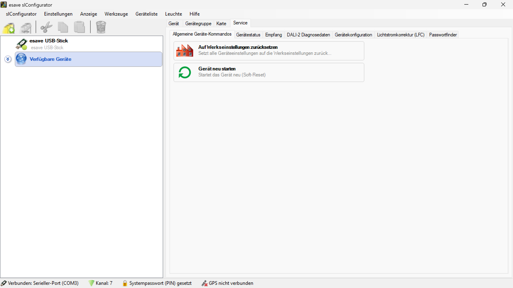

# Allgemeine Gerätebefehle
  

Unter den allgemeinen Gerätebefehlen gibt es die folgenden Befehle:
Auf Werkseinstellungen zurücksetzen:
Setzt alle Geräteeinstellungen auf die Werkseinstellungen zurück
Gerät neu starten:
Führt einen Soft- Reset durch und das Gerät startet neu