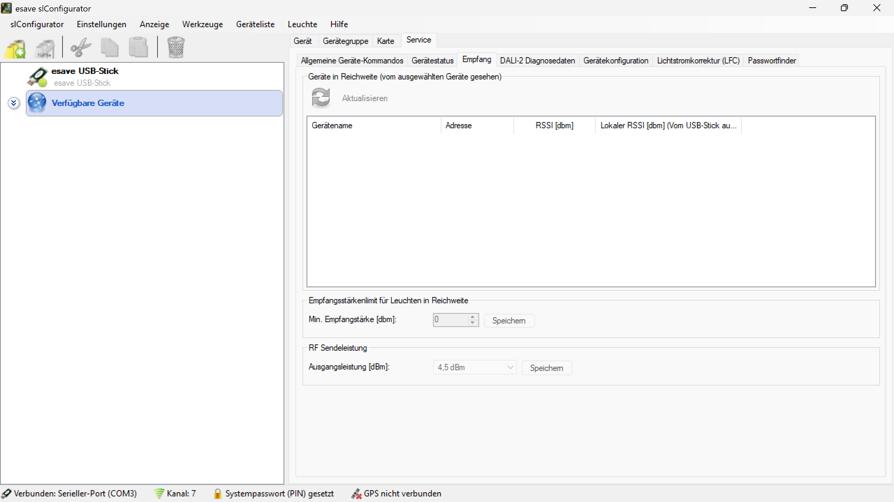

# Empfang

*Im Fenster Empfang werden alle Leuchten angezeigt, welche mit der aktuell ausgewählten Leuchte kommunizieren können. Die entsprechenden Farben zeigen die jeweilige Empfangsstärke an*

**Netzwerk-Empfangsstärke und Kommunikationsdiagnose**

Umfassende Analyse der Funkverbindungen zwischen Leuchten mit detaillierter RSSI-Messung, Reichweiten-Visualisierung und RF-Sendeleistungsoptimierung für optimale Netzwerkperformance.

## Hauptbereiche

### 1. Geräte-Reichweiten-Analyse
- Übersicht aller kommunikationsfähigen Geräte
- RSSI-Werte für jede Verbindung
- Lokale Empfangsstärken-Messung
- Bidirektionale Kommunikationsprüfung

### 2. Empfangsstärken-Konfiguration
- Minimale Empfangsstärke-Schwellenwerte
- Automatische Reichweiten-Filterung
- Qualitätskriterien für Verbindungen
- Dynamische Netzwerk-Optimierung

### 3. RF-Sendeleistung
- Ausgangsleistungs-Einstellungen
- Sendeleistungs-Optimierung
- Energieeffizienz-Balance
- Störungsminimierung

### 4. Live-Monitoring
- Echtzeit-Aktualisierung der Messwerte
- Kontinuierliche Netzwerk-Überwachung
- Automatische Verbindungsqualitäts-Bewertung
- Dynamische Reichweiten-Anpassung

## Geräte-Reichweiten-Übersicht

### Reichweiten-Tabelle
- **Gerätename**: Eindeutige Identifikation der Kommunikationspartner
- **Adresse**: Netzwerk-Adressen der erreichbaren Geräte
- **RSSI [dBm]**: Empfangsstärke in Dezibel-Milliwatt
- **Lokaler RSSI [dBm]**: Rückkanal-Empfangsstärke vom USB-Stick

### Kommunikations-Matrix
- **Bidirektionale Messungen**: Hin- und Rückkanal-Qualität
- **Asymmetrische Verbindungen**: Unterschiedliche Richtungs-Qualitäten
- **Verbindungsqualität**: Gesamtbewertung der Kommunikation
- **Reichweiten-Klassifizierung**: Qualitätsstufen der Verbindungen

### Netzwerk-Topologie
- **Mesh-Netzwerk-Struktur**: Vermaschte Verbindungsarchitektur
- **Routing-Pfade**: Optimale Kommunikationswege
- **Redundanz-Analyse**: Alternative Verbindungsmöglichkeiten
- **Network-Health**: Gesamtnetzwerk-Gesundheitsstatus

### Aktualisierungsfunktion
- **Manuelle Aktualisierung**: Sofortige Reichweiten-Neumessung
- **Periodische Updates**: Regelmäßige automatische Messungen
- **Event-basierte Updates**: Aktualisierung bei Netzwerkänderungen
- **Selective Refresh**: Gezielte Einzelgeräte-Aktualisierung

## RSSI-Empfangsstärke-Analyse

### RSSI-Messwerte
- **Dezibel-Milliwatt [dBm]**: Logarithmische Leistungsmessung
- **Signalstärke-Klassifizierung**: Qualitätskategorien der Verbindungen
- **Dynamikbereich**: Messbereich von starken bis schwachen Signalen
- **Auflösung**: Präzision der Empfangsstärke-Messung

### Signalqualitäts-Bewertung
- **Exzellent**: > -50 dBm (sehr starkes Signal)
- **Gut**: -50 bis -70 dBm (stabiles Signal)
- **Akzeptabel**: -70 bis -85 dBm (verwendbares Signal)
- **Schwach**: -85 bis -95 dBm (grenzwertige Verbindung)
- **Kritisch**: < -95 dBm (instabile Verbindung)

### Farbkodierung
- **Grün**: Optimale Empfangsstärke
- **Gelb**: Gute bis akzeptable Verbindung
- **Orange**: Schwache aber verwendbare Verbindung
- **Rot**: Kritische oder instabile Verbindung
- **Grau**: Keine Verbindung oder Timeout

### Interferenz-Analyse
- **Störsignal-Erkennung**: Identifikation von Funkstörungen
- **Kanal-Qualität**: Bewertung der Funkkanal-Sauberkeit
- **Noise-Floor**: Grundrauschen-Messung
- **Signal-to-Noise-Ratio**: Verhältnis von Nutzsignal zu Rauschen

## Empfangsstärken-Limit-Konfiguration

### Minimale Empfangsstärke
- **Schwellenwert-Einstellung**: Konfigurierbare Mindestqualität
- **Standard-Wert**: Werksseitige Empfehlung (z.B. 0 dBm)
- **Anpassbare Grenzwerte**: Umgebungsabhängige Optimierung
- **Qualitäts-Filter**: Automatische Ausblendung schwacher Verbindungen

### Reichweiten-Filterung
- **Automatische Filterung**: Ausblendung von Geräten unter Schwellenwert
- **Dynamische Anpassung**: Adaptive Schwellenwert-Justierung
- **Netzwerk-Optimierung**: Fokussierung auf stabile Verbindungen
- **Performance-Verbesserung**: Reduzierung von Kommunikations-Overhead

### Konfigurationsspeicherung
- **Persistente Einstellungen**: Dauerhafte Speicherung der Konfiguration
- **Profil-Management**: Verschiedene Konfigurationsprofile
- **Backup und Restore**: Sicherung und Wiederherstellung von Einstellungen
- **Synchronisation**: Abgleich zwischen verschiedenen Geräten

## RF-Sendeleistungs-Management

### Ausgangsleistung
- **Leistungsbereich**: Konfigurierbare Sendeleistung (z.B. 4.5 dBm)
- **Adaptive Leistung**: Automatische Anpassung an Umgebung
- **Energieeffizienz**: Optimierung von Leistung vs. Reichweite
- **Regulatorische Compliance**: Einhaltung von Sendeleistungs-Vorschriften

### Sendeleistungs-Optimierung
- **Automatische Kalibrierung**: Selbstoptimierung der Sendeleistung
- **Umgebungsanpassung**: Anpassung an Installationsumgebung
- **Interferenz-Minimierung**: Reduzierung von Funkstörungen
- **Netzwerk-Balancing**: Ausgewogene Leistungsverteilung

### Leistungsprofile
- **Niedrig**: Energiesparend für dichte Installationen
- **Standard**: Ausgewogene Leistung für normale Anwendungen
- **Hoch**: Maximale Reichweite für weitläufige Installationen
- **Adaptiv**: Automatische Anpassung an Netzwerk-Bedingungen

### Sendeleistungs-Speicherung
- **Konfigurationsspeicherung**: Dauerhafte Leistungseinstellungen
- **Profil-Verwaltung**: Verschiedene Leistungsprofile
- **Zentrale Konfiguration**: Einheitliche Leistungseinstellungen
- **Remote-Konfiguration**: Fernsteuerung der Sendeleistung

## Netzwerk-Diagnose

### Verbindungsqualitäts-Analyse
- **Link-Quality-Index**: Gesamtbewertung der Verbindungsqualität
- **Packet-Loss-Rate**: Paketverlust-Statistiken
- **Latenz-Messung**: Kommunikations-Verzögerungen
- **Throughput-Analyse**: Datenübertragungsraten

### Netzwerk-Performance
- **Routing-Effizienz**: Optimale Pfad-Findung
- **Load-Balancing**: Lastverteilung im Netzwerk
- **Congestion-Control**: Überlastungs-Management
- **QoS-Überwachung**: Quality-of-Service-Monitoring

### Störungsanalyse
- **Interferenz-Quellen**: Identifikation von Störungen
- **Frequency-Hopping**: Dynamische Kanalwechsel
- **Adaptive-Channel-Selection**: Intelligente Kanalwahl
- **Coexistence-Management**: Koexistenz mit anderen Funksystemen

### Netzwerk-Topologie-Überwachung
- **Mesh-Struktur-Analyse**: Vermaschungs-Qualität
- **Critical-Path-Identification**: Kritische Kommunikationspfade
- **Redundancy-Assessment**: Redundanz-Bewertung
- **Single-Point-of-Failure**: Identifikation kritischer Knoten

## Anwendungsszenarien

### Netzwerk-Planung
- **Site-Survey**: Standort-Analyse für optimale Platzierung
- **Coverage-Planning**: Abdeckungsplanung für Installationen
- **Capacity-Planning**: Kapazitätsplanung für Netzwerk-Erweiterungen
- **Performance-Optimization**: Leistungsoptimierung bestehender Netzwerke

### Installation und Inbetriebnahme
- **Initial-Setup**: Erstinstallation und Grundkonfiguration
- **Range-Testing**: Reichweiten-Tests während Installation
- **Performance-Validation**: Leistungsvalidierung nach Installation
- **Optimization**: Feinabstimmung der Netzwerk-Parameter

### Wartung und Troubleshooting
- **Regelmäßige Checks**: Routinemäßige Netzwerk-Überprüfungen
- **Problem-Diagnosis**: Systematische Fehlerbehebung
- **Performance-Monitoring**: Kontinuierliche Leistungsüberwachung
- **Preventive-Maintenance**: Präventive Wartungsmaßnahmen

### Netzwerk-Erweiterung
- **Expansion-Planning**: Planung von Netzwerk-Erweiterungen
- **Integration-Testing**: Test neuer Geräte im bestehenden Netzwerk
- **Migration-Support**: Unterstützung bei Netzwerk-Migrationen
- **Scalability-Analysis**: Skalierbarkeits-Analyse

## Technische Implementierung

### RF-Technologie
- **Funkprotokoll**: Spezifische Funkprotokoll-Implementation
- **Modulation**: Digitale Modulationsverfahren
- **Error-Correction**: Fehlerkorrektur-Mechanismen
- **Encryption**: Verschlüsselung der Funkübertragung

### Messmethodik
- **RSSI-Kalibrierung**: Kalibrierung der Empfangsstärke-Messung
- **Averaging-Algorithms**: Mittelwertbildungs-Algorithmen
- **Filter-Algorithms**: Filtermethoden für stabile Messwerte
- **Temporal-Analysis**: Zeitbasierte Signalanalyse

### Datenverarbeitung
- **Real-Time-Processing**: Echtzeit-Datenverarbeitung
- **Statistical-Analysis**: Statistische Datenauswertung
- **Trend-Analysis**: Trend-Erkennung in Messdaten
- **Pattern-Recognition**: Muster-Erkennung in Netzwerk-Verhalten

### System-Integration
- **API-Integration**: Programmatische Schnittstellen
- **Database-Integration**: Datenbankanbindung für Messdaten
- **Monitoring-Integration**: Integration in Überwachungssysteme
- **Reporting-Integration**: Berichtswesen-Anbindung

## Qualitätssicherung

### Messgenauigkeit
- **Kalibrierung**: Regelmäßige Kalibrierung der Messgeräte
- **Validation**: Validierung der Messergebnisse
- **Traceability**: Rückverfolgbarkeit der Messungen
- **Uncertainty-Analysis**: Messunsicherheits-Analyse

### Datenqualität
- **Data-Validation**: Validierung der Messdaten
- **Plausibility-Checks**: Plausibilitätsprüfungen
- **Error-Detection**: Fehlererkennung in Messdaten
- **Data-Cleansing**: Datenbereinigung

### Systemzuverlässigkeit
- **Redundant-Measurements**: Redundante Messungen
- **Fault-Tolerance**: Fehlertoleranz-Mechanismen
- **Backup-Systems**: Backup-Systeme für kritische Funktionen
- **Recovery-Procedures**: Wiederherstellungsverfahren

## Sicherheitsaspekte

### Funkübertragung
- **Encryption**: Verschlüsselung der Funkdaten
- **Authentication**: Authentifizierung der Kommunikationspartner
- **Key-Management**: Schlüssel-Management für sichere Kommunikation
- **Intrusion-Detection**: Erkennung von Kommunikations-Angriffen

### Datenschutz
- **Privacy-Protection**: Schutz sensibler Daten
- **Access-Control**: Zugriffskontrolle auf Empfangsdaten
- **Data-Anonymization**: Anonymisierung von Messdaten
- **Compliance**: Einhaltung von Datenschutz-Vorschriften

### Netzwerk-Sicherheit
- **Secure-Protocols**: Sichere Kommunikationsprotokolle
- **Network-Segmentation**: Netzwerk-Segmentierung
- **Monitoring**: Überwachung der Netzwerk-Sicherheit
- **Incident-Response**: Reaktion auf Sicherheitsvorfälle

## Performance-Optimierung

### Netzwerk-Tuning
- **Parameter-Optimization**: Optimierung der Netzwerk-Parameter
- **Load-Balancing**: Lastausgleich im Netzwerk
- **Traffic-Shaping**: Verkehrs-Formung
- **QoS-Implementation**: Quality-of-Service-Implementierung

### Ressourcen-Management
- **Bandwidth-Management**: Bandbreiten-Management
- **Power-Management**: Energie-Management
- **Memory-Management**: Speicher-Management
- **Processing-Optimization**: Verarbeitungs-Optimierung

### Adaptive Algorithmen
- **Self-Optimization**: Selbstoptimierung der Netzwerk-Parameter
- **Machine-Learning**: Maschinelles Lernen für Netzwerk-Optimierung
- **Predictive-Analytics**: Vorhersagende Analytik
- **Autonomous-Management**: Autonomes Netzwerk-Management

## Best Practices

### Netzwerk-Design
- **Optimal-Placement**: Optimale Geräte-Platzierung
- **Redundancy-Planning**: Redundanz-Planung
- **Scalability-Considerations**: Skalierbarkeits-Überlegungen
- **Future-Proofing**: Zukunftssichere Netzwerk-Architektur

### Monitoring-Strategien
- **Continuous-Monitoring**: Kontinuierliche Überwachung
- **Proactive-Alerting**: Proaktive Alarmierung
- **Trend-Analysis**: Trend-Analyse
- **Predictive-Maintenance**: Vorhersagende Wartung

### Troubleshooting
- **Systematic-Approach**: Systematisches Vorgehen
- **Root-Cause-Analysis**: Ursachen-Analyse
- **Documentation**: Dokumentation
- **Knowledge-Sharing**: Wissensaustausch

### Documentation
- **Network-Documentation**: Netzwerk-Dokumentation
- **Configuration-Management**: Konfigurations-Management
- **Change-Management**: Änderungs-Management
- **Version-Control**: Versionskontrolle

## Vorteile der Empfangsstärke-Analyse

### Netzwerk-Optimierung
- **Verbesserte Kommunikation**: Optimierung der Gerätekommunikation
- **Erhöhte Zuverlässigkeit**: Stabilere Netzwerkverbindungen
- **Reduzierte Ausfälle**: Minimierung von Kommunikationsausfällen
- **Optimale Abdeckung**: Maximierung der Netzwerk-Abdeckung

### Energie-Effizienz
- **Optimierte Sendeleistung**: Energieeffiziente Leistungseinstellungen
- **Verlängerte Batterie-Lebensdauer**: Längere Betriebszeiten
- **Reduzierter Energieverbrauch**: Minimierung des Stromverbrauchs
- **Umweltfreundlich**: Nachhaltige Energienutzung

### Wartung und Support
- **Proaktive Wartung**: Frühzeitige Problemerkennung
- **Effiziente Diagnose**: Schnelle Problemidentifikation
- **Reduzierte Wartungskosten**: Kosteneinsparungen bei der Wartung
- **Verbesserte Servicequalität**: Höhere Kundenzufriedenheit

### Planungssicherheit
- **Fundierte Entscheidungen**: Datenbasierte Netzwerk-Planung
- **Risikominimierung**: Reduzierung von Planungsrisiken
- **Kostenoptimierung**: Optimale Ressourcennutzung
- **Zukunftssicherheit**: Nachhaltige Netzwerk-Investitionen

> ## ℹ️ Empfang
>
> **Netzwerk-Empfangsstärke und Kommunikationsdiagnose für optimale Funkverbindungen**
>
> Im Fenster Empfang werden alle Leuchten angezeigt, welche mit der aktuell ausgewählten Leuchte kommunizieren können. Die entsprechenden Farben zeigen die jeweilige Empfangsstärke an:
>
> ### Hauptfunktionen:
> - **Geräte-Reichweiten**: Übersicht aller kommunikationsfähigen Geräte mit RSSI-Werten
> - **Empfangsstärken-Limit**: Konfigurierbare Mindestqualität (Min. Empfangsstärke [dBm])
> - **RF-Sendeleistung**: Ausgangsleistungs-Einstellungen (z.B. 4.5 dBm)
> - **Live-Aktualisierung**: Echtzeit-Überwachung der Netzwerk-Qualität
> - **Farbkodierung**: Visuelle Darstellung der Verbindungsqualität

*Die Empfangsstärke-Analyse ermöglicht umfassende Netzwerk-Diagnose und -Optimierung mit detaillierter RSSI-Messung, konfigurierbaren Qualitätsschwellenwerten und adaptiver Sendeleistungs-Kontrolle für maximale Kommunikationseffizienz.*