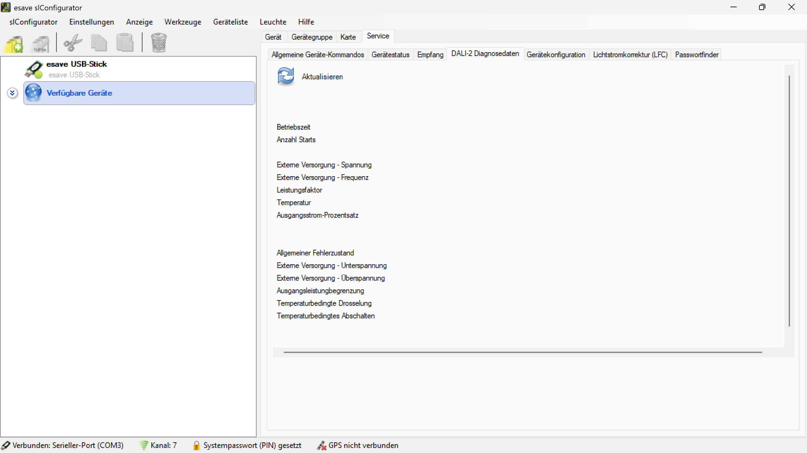

# DALI-2 Diagnosedaten

*DALI-2 Diagnosedaten bieten umfassende Einblicke in Betriebsparameter, Versorgungsdaten und Fehlerzustände der LED-Beleuchtungssysteme*

**Umfassende DALI-2 Systemdiagnose und Betriebsüberwachung**

Detaillierte Analyse der DALI-2 Protokoll-spezifischen Diagnosedaten mit umfassender Überwachung von Betriebszeiten, Versorgungsparametern, Leistungsfaktoren und Fehlerzuständen für optimale Systemperformance.

## Hauptbereiche

### 1. Betriebszeit-Monitoring
- Akkumulierte Betriebsstunden-Erfassung
- Start-Zyklen-Zählung
- Lebensdauer-Tracking
- Wartungsintervall-Berechnung

### 2. Versorgungsdiagnose
- Externe Versorgungsspannung und -frequenz
- Leistungsfaktor-Überwachung
- Temperatur-Monitoring
- Ausgangsstrom-Prozentsatz

### 3. Fehlerzustände-Analyse
- Allgemeine Fehlerstatus-Überwachung
- Versorgungsfehler-Erkennung
- Leistungsbegrenzung-Indikation
- Temperaturschwellenwert-Überwachung

### 4. Live-Diagnose
- Echtzeit-Datenaktualisierung
- Kontinuierliche Systemüberwachung
- Automatische Fehlerbenachrichtigung
- Trend-Analyse und Vorhersagen

## Betriebszeit-Überwachung

### Betriebszeit-Erfassung
- **Akkumulierte Betriebsstunden**: Gesamte Betriebszeit seit Inbetriebnahme
- **Betriebszeit-Intervalle**: Tägliche, wöchentliche und monatliche Statistiken
- **Kontinuierliche Zeiterfassung**: Lückenlose Dokumentation aller Betriebsphasen
- **Präzise Messung**: Hochauflösende Zeitmessung für genaue Lebensdauer-Berechnungen

### Start-Zyklen-Monitoring
- **Anzahl Starts**: Zählung aller Einschaltvorgänge
- **Start-Frequenz-Analyse**: Bewertung der Schaltzyklen-Häufigkeit
- **Verschleiß-Indikator**: Einschätzung der mechanischen und elektrischen Belastung
- **Wartungsplanung**: Datenbasierte Wartungsintervall-Bestimmung

### Lebensdauer-Tracking
- **Prognostizierte Lebensdauer**: Berechnung der erwarteten Betriebsdauer
- **Degradations-Analyse**: Überwachung der Leistungsabnahme über Zeit
- **Ersatzteil-Planung**: Vorhersage von Austauschbedarfen
- **Effizienz-Trends**: Langzeit-Effizienzentwicklung

### Wartungsintervall-Optimierung
- **Adaptive Wartung**: Bedarfsgerechte Wartungszyklen
- **Predictive Maintenance**: Vorhersagende Wartungsplanung
- **Kosteneinsparung**: Optimierung der Wartungskosten
- **Verfügbarkeitsmaximierung**: Minimierung ungeplanter Ausfälle

## Externe Versorgung - Spannungsdiagnose

### Spannungsüberwachung
- **Versorgungsspannung**: Kontinuierliche Überwachung der Eingangsspannung
- **Spannungsstabilität**: Bewertung der Spannungsqualität
- **Spannungsschwankungen**: Erkennung von Über- und Unterspannungen
- **Netzqualität**: Analyse der Stromversorgungsqualität

### Spannungsqualitäts-Analyse
- **Effektivwert (RMS)**: Präzise RMS-Spannungsmessung
- **Spitzenspannung**: Peak-Spannungswerte
- **THD-Analyse**: Total Harmonic Distortion der Spannung
- **Flicker-Erkennung**: Spannungsflicker-Überwachung

### Versorgungsstörungen
- **Unterspannung**: Erkennung kritischer Unterspannungen
- **Überspannung**: Schutz vor Überspannungsschäden
- **Spannungsausfälle**: Dokumentation von Stromausfällen
- **Wiedereinschaltverhalten**: Analyse des Verhaltens nach Störungen

## Externe Versorgung - Frequenzdiagnose

### Frequenzüberwachung
- **Netzfrequenz**: Kontinuierliche Überwachung der Versorgungsfrequenz
- **Frequenzstabilität**: Bewertung der Frequenzkonstanz
- **Frequenzabweichungen**: Erkennung von Frequenzschwankungen
- **Synchronisation**: Überwachung der Netz-Synchronisation

### Frequenzqualität
- **Nominalfrequenz**: Überwachung der Standard-Netzfrequenz (50/60 Hz)
- **Frequenz-Toleranz**: Bewertung zulässiger Abweichungen
- **Frequenz-Jitter**: Hochfrequente Frequenzschwankungen
- **Harmonische Analyse**: Frequenz-Harmonische Überwachung

### Netzstabilität
- **Frequenz-Drift**: Langzeit-Frequenzentwicklung
- **Synchronisations-Verlust**: Erkennung von Sync-Problemen
- **Netz-Isolation**: Insel-Netz-Erkennung
- **Grid-Code-Compliance**: Erfüllung von Netzanschluss-Richtlinien

## Leistungsfaktor-Analyse

### Power Factor Monitoring
- **Leistungsfaktor**: Kontinuierliche PF-Überwachung
- **Cos-Phi-Werte**: Phasenverschiebungs-Analyse
- **Blindleistung**: Reaktive Leistungskomponente
- **Wirkleistung**: Tatsächlich verbrauchte Leistung

### Leistungsqualität
- **Leistungsfaktor-Optimierung**: Verbesserung der Energieeffizienz
- **THD-Strom**: Total Harmonic Distortion des Stroms
- **Crest-Factor**: Scheitelwert-Faktor
- **Effizienz-Bewertung**: Gesamteffizienz-Analyse

### Energiemanagement
- **Energieverbrauch-Optimierung**: Effizienzsteigerung
- **Lastfaktor-Analyse**: Optimale Lastverteilung
- **Energiekosten-Reduktion**: Kosteneinsparung durch PF-Optimierung
- **Green-Building-Compliance**: Nachhaltigkeit-Standards

## Temperatur-Monitoring

### Temperaturüberwachung
- **Betriebstemperatur**: Kontinuierliche Temperaturerfassung
- **Temperatur-Trends**: Entwicklung über Zeit
- **Thermal-Management**: Wärmemanagement-Strategien
- **Kühlungs-Effizienz**: Bewertung der Kühlung

### Temperaturbereiche
- **Normalbetrieb**: Optimale Betriebstemperatur-Bereiche
- **Warnschwellen**: Frühe Temperatur-Warnungen
- **Kritische Temperaturen**: Schutz vor Überhitzung
- **Kälteschutz**: Schutz vor zu niedrigen Temperaturen

### Thermal-Analyse
- **Hotspot-Erkennung**: Identifikation kritischer Bereiche
- **Thermal-Cycling**: Analyse von Temperaturzyklen
- **Lebensdauer-Impact**: Temperatur-Einfluss auf Lebensdauer
- **Effizienz-Korrelation**: Temperatur-Effizienz-Zusammenhang

## Ausgangsstrom-Analyse

### Strom-Monitoring
- **Ausgangsstrom-Prozentsatz**: Relative Strombelastung
- **Strom-Effizienz**: Bewertung der Stromnutzung
- **Last-Variationen**: Dynamische Lastveränderungen
- **Stromqualität**: Analyse der Stromkurve

### Load-Management
- **Optimale Lastverteilung**: Gleichmäßige Stromverteilung
- **Überlast-Schutz**: Schutz vor Stromüberlastung
- **Unterlast-Erkennung**: Identifikation von Minderlasten
- **Adaptive Steuerung**: Intelligente Lastanpassung

### Effizienz-Optimierung
- **Stromverbrauch-Minimierung**: Reduktion des Energieverbrauchs
- **Dimming-Effizienz**: Optimierung bei verschiedenen Helligkeiten
- **Standby-Verbrauch**: Minimierung des Leerlaufverbrauchs
- **Dynamic-Range**: Optimaler Betriebsbereich

## Fehlerzustände-Diagnose

### Allgemeiner Fehlerzustand
- **Systemfehler-Überwachung**: Kontinuierliche Fehlerüberwachung
- **Fehlerklassifizierung**: Kategorisierung verschiedener Fehlertypen
- **Fehlerhistorie**: Dokumentation aller aufgetretenen Fehler
- **Fehleranalyse**: Detaillierte Ursachenforschung

### Externe Versorgung - Unterspannung
- **Unterspannungs-Erkennung**: Frühzeitige Erkennung kritischer Spannungen
- **Schutzmaßnahmen**: Automatische Schutzfunktionen
- **Spannungsqualität**: Bewertung der Versorgungsqualität
- **Backup-Strategien**: Alternative Versorgungsmöglichkeiten

### Externe Versorgung - Überspannung
- **Überspannungs-Schutz**: Schutz vor Spannungsspitzen
- **Surge-Protection**: Überspannungsableiter-Funktionen
- **Spannungsbegrenzung**: Aktive Spannungsregelung
- **Geräteschutz**: Schutz der elektronischen Komponenten

### Ausgangsleistungsbegrenzung
- **Leistungslimitierung**: Automatische Leistungsbegrenzung
- **Thermal-Derating**: Temperaturbedingte Leistungsreduktion
- **Schutzfunktionen**: Überlastschutz-Mechanismen
- **Performance-Optimization**: Optimierung unter Begrenzungen

### Temperaturbedingte Drosselung
- **Thermal-Throttling**: Automatische Leistungsreduktion bei Überhitzung
- **Temperaturschwellen**: Konfigurierbare Schutztemperaturen
- **Kühlungsoptimierung**: Verbesserung der Wärmeabfuhr
- **Thermal-Recovery**: Wiederherstellung nach Abkühlung

### Temperaturbedingte Abschaltung
- **Notabschaltung**: Automatische Abschaltung bei kritischen Temperaturen
- **Überhitzungsschutz**: Schutz vor thermischen Schäden
- **Restart-Logik**: Automatische Wiedereinschaltung
- **Thermal-Monitoring**: Kontinuierliche Temperaturüberwachung

## Anwendungsszenarien

### Präventive Wartung
- **Condition-Monitoring**: Zustandsbasierte Wartung
- **Predictive-Analytics**: Vorhersagende Wartungsplanung
- **Optimierte Wartungszyklen**: Bedarfsgerechte Wartung
- **Kostenreduktion**: Minimierung der Wartungskosten

### Qualitätssicherung
- **Performance-Monitoring**: Kontinuierliche Leistungsüberwachung
- **Compliance-Checking**: Überprüfung von Standards
- **Effizienz-Optimierung**: Verbesserung der Systemeffizienz
- **Reliability-Assessment**: Zuverlässigkeitsbewertung

### Fehlerdiagnose
- **Root-Cause-Analysis**: Systematische Ursachenforschung
- **Troubleshooting**: Strukturierte Fehlerbehebung
- **Remote-Diagnosis**: Ferndiagnose-Möglichkeiten
- **Expert-Systems**: KI-unterstützte Diagnose

### System-Optimierung
- **Performance-Tuning**: Leistungsoptimierung
- **Efficiency-Improvement**: Effizienzsteigerung
- **Load-Optimization**: Lastoptimierung
- **Energy-Management**: Energiemanagement

## Technische Implementierung

### DALI-2 Protokoll
- **Protocol-Compliance**: DALI-2 Standard-Konformität
- **Command-Set**: Vollständiger DALI-2 Befehlssatz
- **Multi-Master**: Mehrfach-Master-Unterstützung
- **Bus-Diagnostics**: DALI-Bus-Diagnose

### Datenerfassung
- **Real-Time-Data**: Echtzeit-Datenerfassung
- **High-Resolution**: Hochauflösende Messungen
- **Continuous-Monitoring**: Kontinuierliche Überwachung
- **Data-Validation**: Datenvalidierung

### Datenverarbeitung
- **Statistical-Analysis**: Statistische Datenauswertung
- **Trend-Analysis**: Trend-Erkennung
- **Pattern-Recognition**: Muster-Erkennung
- **Machine-Learning**: KI-basierte Analyse

### Integration
- **BMS-Integration**: Gebäudemanagementsystem-Anbindung
- **IoT-Connectivity**: Internet-of-Things-Integration
- **Cloud-Services**: Cloud-basierte Dienste
- **API-Access**: Programmatische Schnittstellen

## Sicherheit und Compliance

### Datensicherheit
- **Encrypted-Communication**: Verschlüsselte Kommunikation
- **Secure-Storage**: Sichere Datenspeicherung
- **Access-Control**: Zugriffskontrolle
- **Audit-Trails**: Vollständige Protokollierung

### Standards-Compliance
- **DALI-2-Certification**: DALI-2-Zertifizierung
- **IEC-Standards**: Internationale Standards
- **Safety-Requirements**: Sicherheitsanforderungen
- **EMC-Compliance**: Elektromagnetische Verträglichkeit

### Quality-Assurance
- **Data-Integrity**: Datenintegrität
- **Measurement-Accuracy**: Messgenauigkeit
- **Calibration**: Kalibrierung
- **Validation**: Validierung

## Performance-Optimierung

### System-Performance
- **Response-Time**: Antwortzeiten
- **Throughput**: Durchsatz
- **Scalability**: Skalierbarkeit
- **Reliability**: Zuverlässigkeit

### Data-Management
- **Efficient-Storage**: Effiziente Speicherung
- **Data-Compression**: Datenkomprimierung
- **Archiving**: Archivierung
- **Backup-Strategies**: Backup-Strategien

### Network-Optimization
- **Bandwidth-Optimization**: Bandbreiten-Optimierung
- **Protocol-Efficiency**: Protokoll-Effizienz
- **Load-Balancing**: Lastverteilung
- **QoS-Management**: Quality-of-Service-Management

## Best Practices

### Monitoring-Strategy
- **Comprehensive-Coverage**: Umfassende Abdeckung
- **Proactive-Monitoring**: Proaktive Überwachung
- **Automated-Alerting**: Automatisierte Alarmierung
- **Continuous-Improvement**: Kontinuierliche Verbesserung

### Data-Analysis
- **Regular-Reviews**: Regelmäßige Überprüfungen
- **Trend-Analysis**: Trend-Analyse
- **Predictive-Modeling**: Vorhersagemodelle
- **Benchmarking**: Leistungsvergleiche

### Maintenance-Planning
- **Scheduled-Maintenance**: Geplante Wartung
- **Condition-Based**: Zustandsbasierte Wartung
- **Predictive-Maintenance**: Vorhersagende Wartung
- **Emergency-Response**: Notfall-Reaktion

### Documentation
- **Complete-Records**: Vollständige Aufzeichnungen
- **Change-Management**: Änderungsmanagement
- **Version-Control**: Versionskontrolle
- **Knowledge-Base**: Wissensdatenbank

## Vorteile der DALI-2 Diagnosedaten

### Systemzuverlässigkeit
- **Früherkennung**: Proaktive Problemidentifikation
- **Präventive Wartung**: Vermeidung ungeplanter Ausfälle
- **Verlängerte Lebensdauer**: Optimierung der Gerätelebensdauer
- **Höhere Verfügbarkeit**: Maximierung der Betriebszeit

### Energieeffizienz
- **Optimierte Performance**: Verbesserte Systemleistung
- **Energieeinsparung**: Reduzierung des Energieverbrauchs
- **Effizienz-Monitoring**: Kontinuierliche Effizienzüberwachung
- **Green-Building**: Nachhaltigkeit-Unterstützung

### Kostenreduzierung
- **Wartungsoptimierung**: Effiziente Wartungsplanung
- **Ausfallminimierung**: Reduzierung von Ausfallzeiten
- **Energiekostensenkung**: Niedrigere Betriebskosten
- **Lebensdauerverlängerung**: ROI-Optimierung

### Compliance und Qualität
- **Standards-Erfüllung**: Einhaltung von Normen
- **Qualitätssicherung**: Kontinuierliche Qualitätskontrolle
- **Dokumentation**: Vollständige Nachverfolgbarkeit
- **Zertifizierung**: Unterstützung von Zertifizierungsprozessen

> ## ℹ️ DALI-2 Diagnosedaten
>
> **Umfassende DALI-2 Systemdiagnose mit Betriebsparameter-Überwachung**
>
> Die DALI-2 Diagnosedaten bieten detaillierte Einblicke in alle kritischen Betriebsparameter:
>
> ### Hauptkategorien:
> - **Betriebszeit**: Betriebszeit-Monitoring und Anzahl Starts
> - **Externe Versorgung**: Spannungs- und Frequenzüberwachung
> - **Leistungsparameter**: Leistungsfaktor, Temperatur und Ausgangsstrom-Prozentsatz  
> - **Fehlerzustände**: Allgemeine Fehler, Versorgungsprobleme und Temperaturschwellenwerte
> - **Live-Aktualisierung**: Echtzeit-Überwachung aller Diagnoseparameter

*Die DALI-2 Diagnosedaten ermöglichen präventive Wartung, Effizienzoptimierung und zuverlässige Systemüberwachung durch kontinuierliches Monitoring aller kritischen Betriebsparameter und Fehlerzustände.*