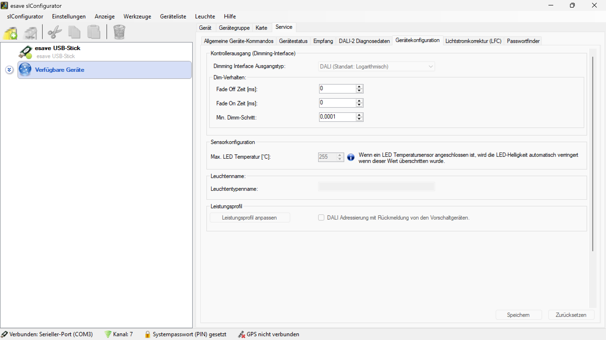

# Gerätekonfiguration

**Gerätekonfiguration**

Konfigurieren Sie die grundlegenden Parameter und Eigenschaften der Lichtsteuerungsgeräte im Servicemodus. Diese Einstellungen definieren die Kommunikationsschnittstelle, das Dimmverhalten und die Geräteeigenschaften für die optimale Funktion des SLC-Controllers.

## Hauptbereiche

### 1. Gerätekonfiguration

- Diese Seite ist Teil des Servicemodus-Menüs und ermöglicht die Konfiguration der grundlegenden Geräteparameter
- Wird zur Einstellung der Kommunikationsschnittstelle und des Dimm-Verhaltens verwendet

### 2. Konfigurationsoberfläche

- Der Hauptbereich zeigt die verfügbaren Geräteeinstellungen und Konfigurationsoptionen
- Ermöglicht die Anpassung der Kommunikationsparameter und Geräteeigenschaften

## Kontrollerausgang (Dimming-Interface)

### Dimming Interface Ausgangstyp

Der Dimming Interface Ausgangstyp gibt an, auf welche Art und Weise der SLC-Controller mit dem Treiber/Dimm-Level kommuniziert.

**Verfügbare Ausgangstypen:**
- **Aus**: Keine Dimmfunktion aktiv
- **Analog (0-10V)**: Standard-Analogsignal von 0V bis 10V
- **Analog Invertiert (10-0V)**: Invertiertes Analogsignal von 10V bis 0V
- **PWM**: Pulsweitenmodulation für digitale Dimmung
- **PWM Invertiert**: Invertierte Pulsweitenmodulation
- **DALI (Standard: Logarithmisch)**: DALI-Protokoll mit logarithmischer Dimm-Kurve
- **DALI (Linear)**: DALI-Protokoll mit linearer Dimm-Kurve

### Dimm-Verhalten

**Fade-Einstellungen:**
- **Fade Off Zeit [ms]**: Ausblendzeit in Millisekunden (0-65535)
- **Fade On Zeit [ms]**: Einblendzeit in Millisekunden (0-65535)
- **Min. Dimm-Schritt**: Minimaler Dimmschritt für feine Abstufungen (0.0001-100)

**Besonderheiten:**
- Bei DALI-Dimmschnittstelle wird für das Einblenden immer die Ausblendzeit verwendet
- Fade-Zeiten ermöglichen sanfte Übergänge zwischen Beleuchtungsleveln
- Der minimale Dimmschritt bestimmt die Feinheit der Dimmung

## Sensorkonfiguration

### LED-Temperatursensor

- **Max. LED Temperatur [°C]**: Maximale zulässige LED-Temperatur (Standard: 255°C)
- **Automatische Helligkeitsreduzierung**: Bei angeschlossenem LED-Temperatursensor wird die LED-Helligkeit automatisch verringert, wenn der Temperaturgrenzwert überschritten wird

## Geräteeigenschaften

### Geräteidentifikation

- **Leuchtenname**: Eindeutiger Name der Leuchte für die Identifikation
- **Leuchtentypenname**: Typbezeichnung der Leuchte für die SL-Control Webplattform
- Diese Namen dienen der eindeutigen Identifikation in der Netzwerkkonfiguration

### Leistungsprofil

**DALI2-Leistungsmessung:**
- **Automatische Erkennung**: DALI2-Treiber mit Wirkleistungsmessung werden automatisch erkannt
- **Direkte Übernahme**: Leistungsdaten werden direkt vom Treiber übernommen
- **Manuelle Deaktivierung**: Funktion kann über Checkbox deaktiviert werden
- **Fallback-Verhalten**: Bei Deaktivierung wird das definierte Leistungsprofil verwendet

**Leistungsprofil-Einstellungen:**
- **Leistungsprofil anpassen**: Button zur Anpassung des Stromverbrauchsprofils
- **DALI-Adressierung**: Checkbox für DALI-Adressierung mit Rückmeldung von Vorschaltgeräten

## Konfigurationsfunktionen

### Grundlegende Funktionen

- **Parameterkonfiguration**: Einstellung aller relevanten Geräteparameter
- **Kommunikationsschnittstelle**: Auswahl und Konfiguration der Dimmschnittstelle
- **Sensorintegration**: Einbindung von Temperatursensoren für Schutzfunktionen
- **Leistungsüberwachung**: Monitoring des Stromverbrauchs über DALI2-Treiber

### Erweiterte Funktionen

- **Adaptive Helligkeit**: Automatische Anpassung basierend auf Temperatur
- **Fade-Steuerung**: Sanfte Übergänge zwischen Beleuchtungsleveln
- **Geräteidentifikation**: Eindeutige Benennung für Netzwerkverwaltung
- **Profilverwaltung**: Speicherung und Anwendung von Leistungsprofilen

### Diagnose und Überwachung

- **Temperaturüberwachung**: Kontinuierliche Überwachung der LED-Temperatur
- **Leistungsmessung**: Echtzeiterfassung der Leistungsaufnahme
- **Kommunikationsdiagnose**: Überwachung der Dimmschnittstelle
- **Gerätestatus**: Anzeige des aktuellen Gerätezustands

## Anwendungsbereiche

### Innenbeleuchtung

- **Bürobeleuchtung**: Anpassung der Dimmkurven für Arbeitsplätze
- **Retail-Beleuchtung**: Optimierung für Präsentationszwecke
- **Bildungseinrichtungen**: Konfiguration für Unterrichtsräume
- **Gesundheitswesen**: Spezielle Einstellungen für medizinische Bereiche

### Industrielle Anwendungen

- **Hallenbeleuchtung**: Robuste Konfiguration für Produktionsbereiche
- **Lagerbeleuchtung**: Optimierung für Lagerhaltung
- **Werkstattbeleuchtung**: Anpassung für Arbeitsbereiche
- **Sicherheitsbeleuchtung**: Konfiguration für Notfallszenarien

### Spezialanwendungen

- **Kunstbeleuchtung**: Präzise Farbwiedergabe und Dimmung
- **Architekturbeleuchtung**: Akzentbeleuchtung für Gebäude
- **Veranstaltungsbeleuchtung**: Flexible Konfiguration für Events
- **Außenbeleuchtung**: Wetterbeständige Konfiguration

## Vorteile der Gerätekonfiguration

### Flexibilität

- **Universelle Schnittstellen**: Unterstützung verschiedener Dimmprotokolle
- **Anpassbare Parameter**: Individuelle Konfiguration für verschiedene Anforderungen
- **Skalierbare Lösung**: Einsatz in kleinen und großen Installationen
- **Zukunftssicher**: Erweiterbar für neue Technologien

### Effizienz

- **Optimierte Leistung**: Präzise Abstimmung auf Geräteeigenschaften
- **Energieeffizienz**: Optimaler Stromverbrauch durch korrekte Konfiguration
- **Wartungsfreundlich**: Einfache Diagnose und Fehlerbehebung
- **Langlebigkeit**: Schutz vor Überlastung durch Temperaturüberwachung

### Sicherheit

- **Temperaturschutz**: Automatische Reduzierung bei Überhitzung
- **Kommunikationssicherheit**: Zuverlässige Datenübertragung
- **Geräteschutz**: Schutz vor falschen Konfigurationen
- **Überwachung**: Kontinuierliche Statusüberwachung

Diese Gerätekonfiguration bietet eine professionelle Grundlage für die Einrichtung und Verwaltung von Lichtsteuerungsgeräten mit umfassenden Konfigurationsmöglichkeiten für verschiedene Anwendungsbereiche.

## Untere Bedienelemente

- **Speichern**: Alle Konfigurationsänderungen dauerhaft speichern
- **Zurücksetzen**: Alle Änderungen rückgängig machen und ursprüngliche Werte wiederherstellen