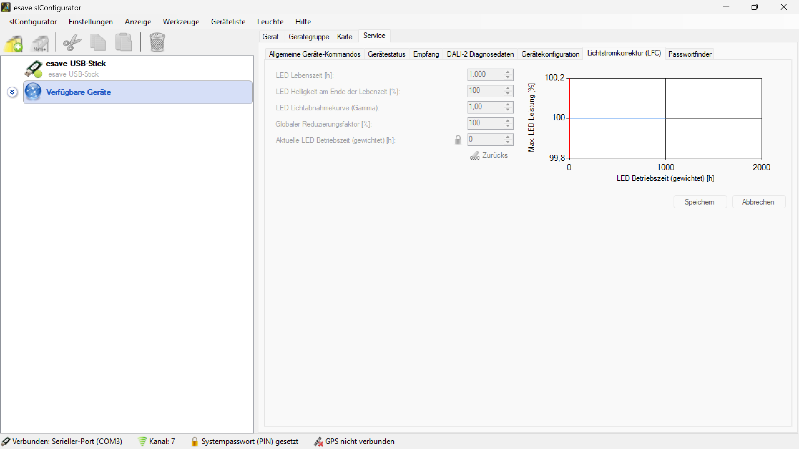

# Lichtstromkorrektur (LFC)

**Lichtstromkorrektur (LFC)**

Kompensieren Sie den altersbedingten Helligkeitsverlust von LED-Modulen durch intelligente Leistungsanpassung über die gesamte Lebensdauer. Diese Funktion ermöglicht es, die konstante Lichtleistung der Leuchte durch automatische Erhöhung der Anschlussleistung aufrechtzuerhalten.

## Hauptbereiche

### 1. Lichtstromkorrektur

- Diese Seite ist Teil des Servicemodus-Menüs für die Konfiguration der LED-Alterungskompensation
- Wird zur Einstellung der Parameter für die automatische Helligkeitskorrektur verwendet

### 2. Konfigurationsoberfläche

- Der linke Bereich zeigt die konfigurierbaren Parameter für die Lichtstromkorrektur
- Der rechte Bereich visualisiert die Lichtabnahmekurve über die Betriebszeit graphisch

## LED-Parameter

### Grundlegende Einstellungen

**LED Lebensdauer [h]:**
- Definiert die erwartete Lebensdauer des LED-Moduls in Betriebsstunden
- Standard: 1.000 Stunden (anpassbar je nach LED-Spezifikation)
- Herstellerabhängiger Wert basierend auf LED-Technologie und Qualität

**LED Helligkeit am Ende der Lebensdauer [%]:**
- Prozentuale Helligkeit, die am Ende der LED-Lebensdauer noch vorhanden ist
- Standard: 100% (anpassbar je nach LED-Degradationsverhalten)
- Typische Werte liegen zwischen 70-90% je nach LED-Qualität

**LED Lichtabnahmekurve (Gamma):**
- Definiert die mathematische Kurve der Lichtabnahme über die Zeit
- Standard: 1,00 (linearer Verlauf)
- Werte > 1: Stärkere Abnahme zu Beginn, dann flacher
- Werte < 1: Schwächere Abnahme zu Beginn, dann steiler

### Leistungssteuerung

**Globaler Reduktionsfaktor [%]:**
- Ermöglicht die prozentuale Reduzierung der Gesamtleistung
- Standard: 100% (volle Leistung)
- Kann zur Energieeinsparung oder Lebensdauerverlängerung reduziert werden

**Aktuelle LED Betriebszeit (gewichtet) [h]:**
- Zeigt die bereits aufgelaufenen Betriebsstunden des LED-Moduls
- Gewichtete Berechnung berücksichtigt unterschiedliche Betriebszustände
- Basis für die automatische Lichtstromkorrektur

## Visualisierung

### Lichtabnahmekurve

Die rechte Seite der Oberfläche zeigt eine graphische Darstellung der LED-Leistung über die Zeit:

**Achsenbeschriftung:**
- **X-Achse**: LED Betriebszeit (gewichtet) [h] von 0 bis 2000 Stunden
- **Y-Achse**: Max. LED Leistung [%] von 99,8% bis 100,2%

**Kurvenverlauf:**
- Zeigt die prognostizierte Lichtabnahme basierend auf den eingegebenen Parametern
- Ermöglicht die visuelle Überprüfung der Konfiguration
- Hilft bei der Optimierung der Korrekturparameter

## Funktionsprinzip

### Automatische Kompensation

- **Kontinuierliche Überwachung**: Erfassung der aktuellen Betriebszeit und Lichtleistung
- **Adaptive Anpassung**: Automatische Erhöhung der Anschlussleistung zur Kompensation
- **Konstante Helligkeit**: Aufrechterhaltung der gewünschten Lichtleistung über die gesamte Lebensdauer
- **Energieoptimierung**: Bedarfsgerechte Leistungsanpassung ohne Überkompensation

### Berechnung der Korrektur

Die Lichtstromkorrektur erfolgt basierend auf folgenden Faktoren:
- **Betriebszeit**: Aktuelle gewichtete Betriebsstunden
- **Alterungsmodell**: Mathematische Beschreibung der LED-Degradation
- **Zielwert**: Gewünschte konstante Lichtleistung
- **Kompensationsgrenze**: Maximale Leistungserhöhung zur Vermeidung von Überlastung

## Konfigurationsfunktionen

### Grundlegende Funktionen

- **Parametereingabe**: Eingabe herstellerspezifischer LED-Daten
- **Kurvenvisualisierung**: Graphische Darstellung der Lichtabnahme
- **Leistungssteuerung**: Globale Anpassung der Gesamtleistung
- **Betriebszeiterfassung**: Automatische Protokollierung der Nutzungszeit

### Erweiterte Funktionen

- **Predictive Maintenance**: Vorhersage des optimalen Wartungszeitpunkts
- **Energiemanagement**: Optimierung des Stromverbrauchs über die Lebensdauer
- **Performance-Monitoring**: Kontinuierliche Überwachung der LED-Leistung
- **Adaptive Algorithmen**: Selbstlernende Anpassung an reale Betriebsbedingungen

### Diagnose und Überwachung

- **Degradationsanalyse**: Bewertung der tatsächlichen LED-Alterung
- **Leistungshistorie**: Protokollierung der Kompensationsmaßnahmen
- **Effizienzmonitoring**: Überwachung der Energieeffizienz
- **Wartungsplanung**: Rechtzeitige Erkennung des LED-Austauschbedarfs

## Anwendungsbereiche

### Hochwertige Innenbeleuchtung

- **Museen und Galerien**: Konstante Beleuchtung für Kunstwerke und Exponate
- **Einzelhandel**: Gleichbleibende Produktpräsentation über Jahre
- **Bürobeleuchtung**: Konsistente Arbeitsplatzbeleuchtung für Komfort
- **Medizinische Einrichtungen**: Präzise Beleuchtung für medizinische Anwendungen

### Kritische Anwendungen

- **Operationssäle**: Konstante Lichtverhältnisse für chirurgische Eingriffe
- **Labore**: Gleichbleibende Beleuchtung für wissenschaftliche Arbeiten
- **Qualitätskontrolle**: Konsistente Beleuchtung für Prüfverfahren
- **Fertigungsstraßen**: Zuverlässige Arbeitsplatzbeleuchtung

### Langzeitinstallationen

- **Tunnel und Unterführungen**: Wartungsarme Beleuchtung mit konstanter Leistung
- **Industriehallen**: Gleichbleibende Beleuchtung für Produktionsprozesse
- **Parkgaragen**: Konsistente Sicherheitsbeleuchtung
- **Öffentliche Gebäude**: Wartungsoptimierte Beleuchtungslösungen

### Energiekritische Bereiche

- **Rechenzentren**: Effiziente Beleuchtung mit predictive Maintenance
- **Produktionsstätten**: Energieoptimierte Beleuchtung mit Lebensdauermaximierung
- **Hotels**: Konsistente Gästebeleuchtung bei optimierten Betriebskosten
- **Bildungseinrichtungen**: Langfristig stabile Lernumgebung

## Vorteile der Lichtstromkorrektur

### Konstante Lichtqualität

- **Gleichbleibende Helligkeit**: Konstante Beleuchtungsstärke über die gesamte LED-Lebensdauer
- **Vorhersagbare Leistung**: Planbare Lichtverhältnisse für kritische Anwendungen
- **Qualitätssicherung**: Vermeidung von Helligkeitsunterschieden zwischen neuen und alten LEDs
- **Nutzerkomfort**: Konsistente Beleuchtung ohne wahrnehmbare Degradation

### Wirtschaftlichkeit

- **Verlängerte Nutzungsdauer**: Maximale Ausnutzung der LED-Lebensdauer
- **Reduzierte Wartungskosten**: Weniger häufiger LED-Austausch erforderlich
- **Planbare Kosten**: Vorhersagbare Wartungsintervalle und Betriebskosten
- **ROI-Optimierung**: Maximaler Return on Investment durch verlängerte Nutzungszeit

### Energieeffizienz

- **Bedarfsgerechte Leistung**: Nur soviel Energie wie für konstante Helligkeit nötig
- **Vermeidung von Überdimensionierung**: Optimale Anfangsleistung ohne Reserven
- **Adaptive Steuerung**: Intelligente Anpassung an tatsächliche Degradation
- **Globale Leistungsregelung**: Zusätzliche Energieeinsparung durch Reduktionsfaktor

### Wartungsoptimierung

- **Predictive Maintenance**: Vorhersage des optimalen Wartungszeitpunkts
- **Wartungsplanung**: Koordinierte Austauschzyklen für Anlagengruppen
- **Betriebsüberwachung**: Kontinuierliche Statusüberwachung ohne manuellen Aufwand
- **Dokumentation**: Automatische Protokollierung für Wartungsnachweis

## Technische Spezifikationen

### Parameterbereich

- **LED Lebensdauer**: 100 - 100.000 Stunden
- **Endhelligkeitsfaktor**: 10% - 100%
- **Gamma-Wert**: 0,1 - 10,0
- **Reduktionsfaktor**: 1% - 100%
- **Kompensationsbereich**: Bis zu 200% der Anfangsleistung

### Genauigkeit

- **Betriebszeiterfassung**: ±1% Genauigkeit
- **Leistungsanpassung**: ±0,1% Auflösung
- **Helligkeitskonstanz**: ±2% über die gesamte Lebensdauer
- **Temperaturkompensation**: Automatische Berücksichtigung thermischer Einflüsse

Diese Lichtstromkorrektur bietet eine professionelle Lösung für die Aufrechterhaltung konstanter Lichtqualität über die gesamte LED-Lebensdauer mit optimaler Energieeffizienz und reduzierten Wartungskosten.

## Untere Bedienelemente

- **Zurück**: Button zur Rückkehr der Konfiguration auf vorherige Werte
- **Speichern**: Alle Konfigurationsänderungen dauerhaft speichern
- **Abbrechen**: Alle Änderungen verwerfen und Konfigurationsdialog schließen