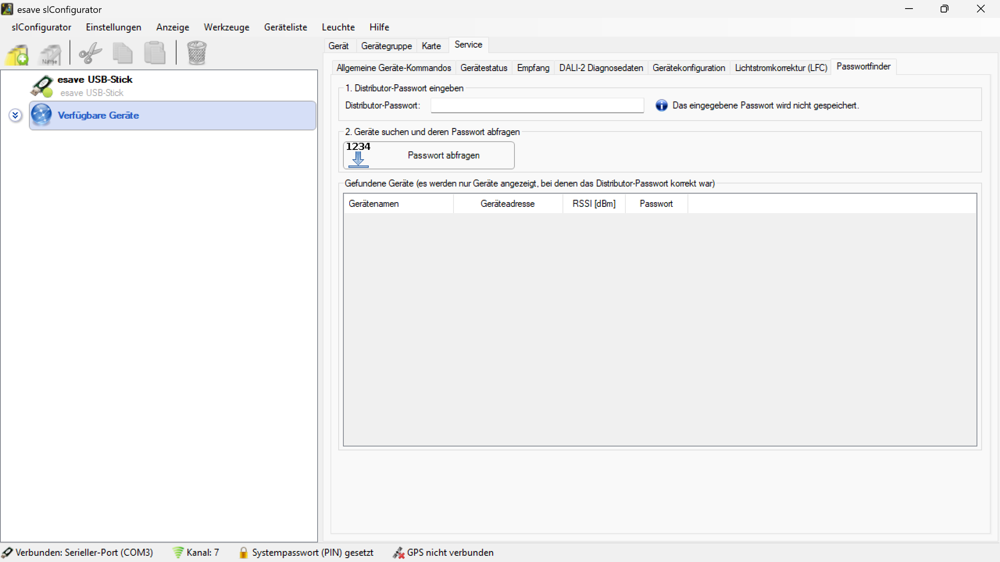

# Passwortfinder

**Passwortfinder**

Stellen Sie vergessene oder verlorene Gerätepasswörter wieder her und verwalten Sie Zugangsdaten für esave-Lichtsteuerungsgeräte. Diese spezialisierte Funktion ermöglicht autorisierten Distributoren den Zugang zu passwortgeschützten Geräten für Wartung und Konfiguration.

**Wichtiger Hinweis:** Diese Funktion ist ausschließlich für autorisierte esave Distributoren verfügbar und erfordert spezielle Zugangsberechtigung.

## Hauptbereiche

### 1. Passwortfinder

- Diese Seite ist Teil des Servicemodus-Menüs für die Passwort-Wiederherstellung
- Wird zur Suche und Wiederherstellung von Gerätepasswörtern verwendet
- Exklusiv für autorisierte esave Distributoren zugänglich

### 2. Benutzeroberfläche

- Zwei-Stufen-Prozess für sichere Passwort-Wiederherstellung
- Eingabebereich für Distributor-Passwort
- Suchfunktion für Geräte mit Ergebnisanzeige

## Funktionsweise

### Schritt 1: Distributor-Passwort eingeben

**Distributor-Passwort:**
- Eingabefeld für das autorisierte Distributor-Passwort
- Sicherheitshinweis: "Das eingegebene Passwort wird nicht gespeichert"
- Erforderlich für den Zugang zur Passwort-Suchfunktion

**Sicherheitsmerkmale:**
- Passwort wird nur temporär im Arbeitsspeicher gehalten
- Keine permanente Speicherung der Zugangsdaten
- Sichere Übertragung der Authentifizierungsdaten

### Schritt 2: Geräte suchen und deren Passwort abfragen

**Gerätesuchfeld:**
- Eingabefeld mit Beispielwert "1234" für die Geräte-ID
- "Passwort abfragen" Button zum Starten der Suche
- Automatische Suche nach Geräten im Netzwerk

**Suchergebnisse:**
- Tabelle mit gefundenen Geräten (nur Geräte mit korrektem Distributor-Passwort)
- Spalten: Gerätename, Geräteadresse, RSSI [dBm], Passwort
- Übersichtliche Darstellung aller verfügbaren Informationen

## Suchfunktionen

### Geräteidentifikation

- **Geräte-ID Eingabe**: Spezifische Suche nach einzelnen Geräten
- **Netzwerk-Scan**: Automatische Erkennung verfügbarer Geräte
- **Signalstärke-Anzeige**: RSSI-Werte zur Qualitätsbewertung der Verbindung
- **Adressauflösung**: Eindeutige Identifikation über Geräteadressen

### Ergebnisanzeige

- **Gerätename**: Benutzerfreundliche Bezeichnung des Geräts
- **Geräteadresse**: Technische Netzwerkadresse für eindeutige Identifikation
- **RSSI [dBm]**: Signalstärke für Verbindungsqualität
- **Passwort**: Das wiederhergestellte Gerätepasswort

## Sicherheitsaspekte

### Autorisierung

- **Distributor-Berechtigung**: Funktion nur für autorisierte esave Partner
- **Passwort-Authentifizierung**: Zweistufige Sicherheitsprüfung
- **Zugangskontrolle**: Beschränkung auf berechtigte Servicetechniker
- **Audit-Trail**: Protokollierung aller Zugriffe für Sicherheitszwecke

### Datenschutz

- **Temporäre Speicherung**: Keine dauerhafte Speicherung von Passwörtern
- **Sichere Übertragung**: Verschlüsselte Kommunikation mit Geräten
- **Minimale Datensammlung**: Nur notwendige Informationen werden abgerufen
- **Compliance**: Einhaltung von Datenschutzbestimmungen

### Missbrauchsschutz

- **Zugangsprotokollierung**: Dokumentation aller Passwort-Abfragen
- **Zeitbasierte Tokens**: Begrenzte Gültigkeitsdauer der Autorisierung
- **Gerätespezifische Berechtigung**: Zugang nur zu autorisierten Geräten
- **Überwachung**: Kontinuierliche Sicherheitsüberwachung

## Anwendungsbereiche

### Service und Wartung

- **Vergessene Passwörter**: Wiederherstellung bei verlorenen Zugangsdaten
- **Gerätetausch**: Passwort-Übertragung bei Hardware-Austausch
- **System-Updates**: Zugang für kritische Firmware-Updates
- **Notfall-Zugang**: Schnelle Wiederherstellung bei Systemausfällen

### Installationsmanagement

- **Erstinbetriebnahme**: Konfiguration neuer Geräte
- **Massendeployment**: Effiziente Verwaltung großer Installationen
- **Konfigurationsmigration**: Übertragung von Einstellungen zwischen Geräten
- **Backup und Recovery**: Sicherung und Wiederherstellung von Konfigurationen

### Technischer Support

- **Remote-Diagnose**: Fernzugriff für Problemdiagnose
- **Troubleshooting**: Zugang zur Fehlerbehebung
- **Konfigurationshilfe**: Unterstützung bei komplexen Einstellungen
- **Schulung und Training**: Demonstrationszwecke für Servicetechniker

## Berechtigungsmanagement

### Distributor-Ebenen

- **Autorisierte Partner**: Vollzugriff auf alle Passwort-Funktionen
- **Servicetechniker**: Eingeschränkter Zugang für spezielle Aufgaben
- **Temporäre Berechtigung**: Zeitlich begrenzte Zugänge für Projekte
- **Audit-Funktionen**: Überwachung und Protokollierung aller Aktivitäten

### Geräteberechtigung

- **Geräte-Whitelist**: Zugang nur zu autorisierten Geräten
- **Projektbasierte Berechtigung**: Zugang beschränkt auf spezifische Installationen
- **Geografische Einschränkung**: Regional begrenzte Zugriffsrechte
- **Zeitbasierte Limits**: Automatischer Ablauf von Berechtigungen

## Technische Spezifikationen

### Kommunikationsprotokoll

- **Verschlüsselung**: AES-256 für sichere Datenübertragung
- **Authentifizierung**: Mehrschichtige Sicherheitsprüfung
- **Timeout-Verhalten**: Automatische Sitzungsbeendigung nach Inaktivität
- **Fehlerbehandlung**: Robuste Behandlung von Kommunikationsfehlern

### Netzwerk-Anforderungen

- **Verbindungstypen**: Unterstützung verschiedener Netzwerk-Interfaces
- **Signalqualität**: Minimum RSSI-Werte für zuverlässige Kommunikation
- **Latenz-Toleranz**: Optimiert für verschiedene Netzwerk-Bedingungen
- **Failover-Mechanismen**: Automatische Wiederholung bei Verbindungsfehlern

## Vorteile des Passwortfinders

### Effizienz

- **Schnelle Wiederherstellung**: Minimale Ausfallzeiten bei Passwort-Problemen
- **Zentrale Verwaltung**: Einheitlicher Zugang zu allen autorisierten Geräten
- **Automatisierte Prozesse**: Reduzierter manueller Aufwand
- **Skalierbare Lösung**: Effizient für kleine und große Installationen

### Sicherheit

- **Kontrollierter Zugang**: Nur autorisierte Personen erhalten Zugriff
- **Audit-Funktionen**: Vollständige Nachverfolgbarkeit aller Aktionen
- **Sichere Kommunikation**: Verschlüsselte Datenübertragung
- **Compliance**: Einhaltung von Sicherheitsstandards

### Servicequalität

- **Professioneller Support**: Qualifizierte Unterstützung durch autorisierte Partner
- **Schnelle Problemlösung**: Minimale Wartezeiten bei Passwort-Problemen
- **Zuverlässige Funktion**: Bewährte Technologie für kritische Anwendungen
- **Kontinuierliche Verfügbarkeit**: 24/7 Zugang für Notfälle

Diese Passwortfinder-Funktion bietet autorisierten esave Distributoren eine sichere und effiziente Methode zur Wiederherstellung von Gerätepasswörtern und gewährleistet dabei höchste Sicherheitsstandards und Datenschutz.
