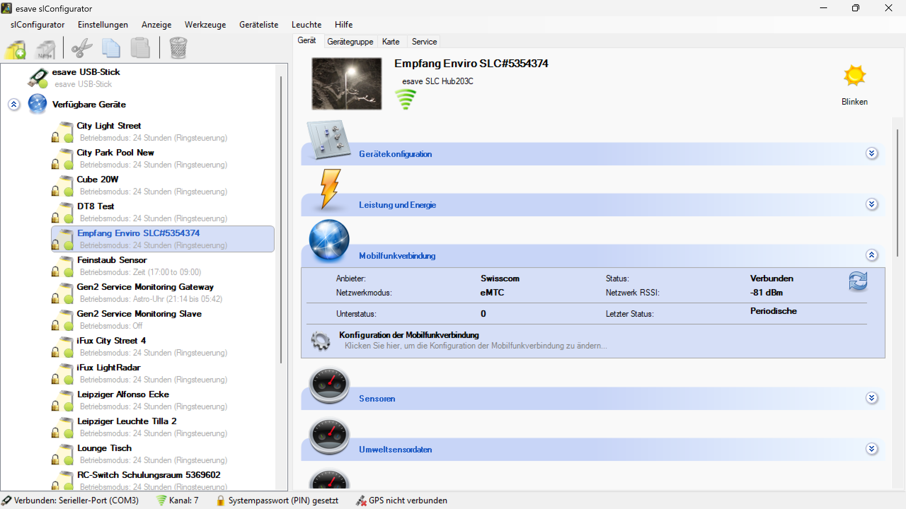
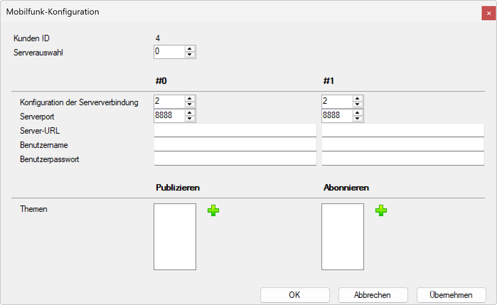

# Mobilfunkverbindung

**Mobilfunkverbindung**

Konfigurieren Sie die Mobilfunkverbindung für Remote-Überwachung und Cloud-basierte Dienste Ihrer Lichtsteuerungsgeräte. Diese Funktion ermöglicht die drahtlose Kommunikation über Mobilfunknetze für erweiterte IoT-Funktionalitäten und Fernwartung.

## Hauptbereiche

### 1. Mobilfunkverbindung-Übersicht

- Diese Seite zeigt den aktuellen Status der Mobilfunkverbindung im Hauptdashboard
- Anzeige von Anbieter, Netzwerkmodus, Status und Signalstärke
- Zugang zur detaillierten Mobilfunk-Konfiguration

### 2. Mobilfunk-Konfigurationsdialog

- Separater Konfigurationsdialog für detaillierte Einstellungen
- Duale Server-Konfiguration für Redundanz und Ausfallsicherheit
- Themen-Management für MQTT-Kommunikation

## Verbindungsstatus-Anzeige

### Aktueller Status

**Anbieter-Informationen:**
- **Anbieter**: Swisscom (Mobilfunkanbieter)
- **Netzwerkmodus**: eMTC (Enhanced Machine Type Communication)
- **Status**: Verbunden mit -81 dBm Signalstärke
- **Unterstatus**: 0 (Keine Fehler)
- **Letzter Status**: Periodische Statusaktualisierung

**Verbindungsqualität:**
- **Netzwerk RSSI**: -81 dBm (Gute Signalstärke)
- **Verbindungsstatus**: Erfolgreich etabliert
- **Übertragungsmodus**: Stabile eMTC-Verbindung

### Konfigurationszugang

**Konfiguration der Mobilfunkverbindung:**
- Link: "Klicken Sie hier, um die Konfiguration der Mobilfunkverbindung zu ändern..."
- Öffnet den detaillierten Konfigurationsdialog
- Ermöglicht Anpassung aller Verbindungsparameter

## Mobilfunk-Konfiguration

### Grundeinstellungen

**Kunden-ID:**
- Eindeutige Identifikation für Cloud-Services
- Erforderlich für die Zuordnung zu Kundenkonten
- Sicherheitsrelevante Kennung für Authentifizierung

**Serverauswahl:**
- Dropdown-Menü für verfügbare Server
- Standard: Server 0
- Ermöglicht Auswahl zwischen verschiedenen Cloud-Endpunkten

### Duale Server-Konfiguration

Die Konfiguration unterstützt zwei Server (#0 und #1) für Redundanz:

**Server #0 (Primärserver):**
- **Konfiguration der Serververbindung**: Typ 2 (MQTT/TLS)
- **Serverport**: 8888 (Standard MQTT-Port)
- **Server-URL**: Eingabefeld für den primären Cloud-Server
- **Benutzername**: Authentifizierung für Server-Zugang
- **Benutzerpasswort**: Sichere Passwort-Authentifizierung

**Server #1 (Backup-Server):**
- **Konfiguration der Serververbindung**: Typ 2 (MQTT/TLS)
- **Serverport**: 8888 (Standard MQTT-Port)
- **Server-URL**: Eingabefeld für den Backup-Cloud-Server
- **Benutzername**: Authentifizierung für Backup-Server
- **Benutzerpasswort**: Sichere Passwort-Authentifizierung

### MQTT-Themen-Management

**Publizieren (Outgoing Data):**
- **Themen**: Liste der Themen für ausgehende Daten
- **Plus-Button**: Hinzufügen neuer Publish-Themen
- **Konfigurierbare Topics**: Anpassbare MQTT-Themen für Datenübertragung

**Abonnieren (Incoming Data):**
- **Themen**: Liste der abonnierten Themen für eingehende Befehle
- **Plus-Button**: Hinzufügen neuer Subscribe-Themen
- **Command-Topics**: Empfang von Remote-Befehlen und Konfigurationen

## Verbindungstypen

### eMTC (Enhanced Machine Type Communication)

- **LTE-Cat-M1**: Optimiert für IoT-Geräte
- **Niedrige Latenz**: Schnelle Datenübertragung
- **Energieeffizient**: Verlängerte Batterie-/Betriebszeit
- **Hohe Reichweite**: Verbesserte Gebäudepenetration

### Alternative Verbindungstypen

- **NB-IoT**: Narrowband IoT für sehr niedrige Datenraten
- **2G/3G Fallback**: Rückfalloptionen für ältere Netzwerke
- **LTE-M**: Standard LTE für Machine-to-Machine Kommunikation

## Konfigurationsfunktionen

### Grundlegende Funktionen

- **Server-Management**: Konfiguration von primären und Backup-Servern
- **Authentifizierung**: Sichere Benutzer-/Passwort-Authentifizierung
- **Port-Konfiguration**: Anpassbare Netzwerk-Ports
- **URL-Management**: Flexible Server-URL-Konfiguration

### Erweiterte Funktionen

- **Dual-Server-Redundanz**: Automatischer Failover zwischen Servern
- **MQTT-Topic-Management**: Dynamische Themen-Konfiguration
- **TLS-Verschlüsselung**: Sichere Datenübertragung
- **Reconnect-Logic**: Automatische Wiederverbindung bei Unterbrechungen

### Überwachung und Diagnose

- **RSSI-Monitoring**: Kontinuierliche Signalstärke-Überwachung
- **Verbindungsstatus**: Echtzeitanzeige der Verbindungsqualität
- **Fehlerdiagnose**: Detaillierte Statusinformationen
- **Netzwerk-Analytics**: Überwachung der Datenübertragung

## Anwendungsbereiche

### Smart City Beleuchtung

- **Straßenbeleuchtung**: Remote-Überwachung und -Steuerung
- **Verkehrsleitsysteme**: Integration in Verkehrsmanagement
- **Notbeleuchtung**: Ferngesteuerte Notfallbeleuchtung
- **Umweltmonitoring**: Sensordatenübertragung zur Zentrale

### Industrielle IoT-Anwendungen

- **Fabrikbeleuchtung**: Zentrale Überwachung großer Anlagen
- **Lagerhaus-Management**: Intelligente Beleuchtungssteuerung
- **Sicherheitsbeleuchtung**: Remote-Monitoring für Sicherheitssysteme
- **Energiemanagement**: Verbrauchsüberwachung und -optimierung

### Kommerzielle Installationen

- **Einzelhandel**: Zentrale Steuerung von Filialen
- **Bürogebäude**: Gebäudeweites Beleuchtungsmanagement
- **Hotels**: Fernverwaltung der Beleuchtungsinfrastruktur
- **Bildungseinrichtungen**: Campus-weite Beleuchtungssteuerung

### Remote-Standorte

- **Abgelegene Installationen**: Mobilfunk als einzige Verbindungsoption
- **Baustellen**: Temporäre Beleuchtung mit Remote-Überwachung
- **Veranstaltungen**: Mobile Beleuchtungssteuerung
- **Notfall-Deployment**: Schnelle Einrichtung in Krisengebieten

## Sicherheitsaspekte

### Verbindungssicherheit

- **TLS-Verschlüsselung**: Ende-zu-Ende-Verschlüsselung aller Daten
- **Authentifizierung**: Starke Benutzer-/Passwort-Kombination
- **Zertifikat-Management**: PKI-basierte Sicherheit
- **VPN-Unterstützung**: Zusätzliche Netzwerk-Sicherheitsebene

### Datenschutz

- **Lokale Verarbeitung**: Minimierung übertragener Daten
- **Anonymisierung**: Schutz sensibler Informationen
- **Compliance**: Einhaltung von Datenschutzbestimmungen
- **Audit-Trail**: Vollständige Protokollierung aller Zugriffe

### Zugriffskontrolle

- **Rollenbasierte Berechtigungen**: Differenzierte Zugriffsrechte
- **Multi-Faktor-Authentifizierung**: Erhöhte Sicherheit
- **Session-Management**: Sichere Sitzungsverwaltung
- **Überwachung**: Kontinuierliche Sicherheitsüberwachung

## Technische Spezifikationen

### Mobilfunk-Standards

- **LTE Cat-M1/eMTC**: Bis zu 1 Mbps Download, 1 Mbps Upload
- **NB-IoT**: Bis zu 250 kbps Download, 250 kbps Upload
- **2G/3G Fallback**: Automatische Rückfalloption
- **Frequenzbänder**: Unterstützung globaler LTE-Bänder

### MQTT-Spezifikationen

- **MQTT Version**: 3.1.1 und 5.0 Unterstützung
- **QoS-Level**: 0, 1, und 2 für verschiedene Zuverlässigkeitsanforderungen
- **Retained Messages**: Persistente Nachrichten-Speicherung
- **Will/Testament**: Automatische Benachrichtigung bei Verbindungsabbruch

### Leistungsparameter

- **Verbindungsaufbau**: < 30 Sekunden
- **Datenlatenz**: < 1 Sekunde bei guter Signalstärke
- **Reconnect-Zeit**: < 60 Sekunden bei Verbindungsabbruch
- **Heartbeat-Intervall**: Konfigurierbar 30-300 Sekunden

## Vorteile der Mobilfunkverbindung

### Konnektivität

- **Globale Abdeckung**: Verfügbarkeit in den meisten Gebieten weltweit
- **Zuverlässigkeit**: Redundante Infrastruktur der Mobilfunkanbieter
- **Skalierbarkeit**: Einfache Erweiterung auf viele Geräte
- **Plug-and-Play**: Einfache Installation ohne Infrastruktur-Aufbau

### Flexibilität

- **Standortunabhängigkeit**: Keine feste Netzwerk-Infrastruktur erforderlich
- **Mobile Installationen**: Unterstützung temporärer und mobiler Anwendungen
- **Schnelle Bereitstellung**: Minimaler Installationsaufwand
- **Anbieter-Auswahl**: Flexibilität bei der Wahl des Mobilfunkanbieters

### Management-Vorteile

- **Zentrale Verwaltung**: Übergreifende Kontrolle aller Standorte
- **Remote-Wartung**: Reduzierte Vor-Ort-Besuche
- **Echtzeit-Monitoring**: Sofortige Benachrichtigung bei Problemen
- **Skalierbare Architektur**: Wachstum ohne Infrastruktur-Investitionen

### Kosteneffizienz

- **Niedrige CAPEX**: Minimale Anfangsinvestitionen
- **Vorhersagbare OPEX**: Planbare monatliche Mobilfunkkosten
- **Reduzierte Wartungskosten**: Weniger physische Wartung erforderlich
- **Energieeffizienz**: Optimiert für niedrigen Stromverbrauch

Diese Mobilfunkverbindung bietet eine professionelle und sichere Lösung für die Remote-Verwaltung von Lichtsteuerungsgeräten mit globaler Konnektivität und umfassenden Management-Funktionen.

## Untere Bedienelemente

- **OK**: Alle Konfigurationsänderungen bestätigen und anwenden
- **Abbrechen**: Alle Änderungen verwerfen und Konfigurationsdialog schließen
- **Übernehmen**: Änderungen anwenden ohne den Dialog zu schließen