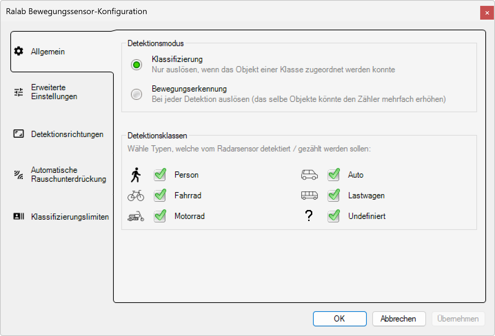

# Allgemein

**Allgemein - Radar-Bewegungssensor-Konfiguration**

Konfigurieren Sie die grundlegenden Parameter des Radar-Bewegungssensors für optimale Objekterkennung und -klassifizierung. Diese Einstellungen definieren die Detektionsmodi und bestimmen, welche Objekttypen erkannt und gezählt werden sollen.

*Der Servicemodus kann unter dem Menüpunkt Anzeige > Service Mode aktiviert werden.*

## Hauptbereiche

### 1. Konfigurationsnavigation

Die linke Navigationsleiste bietet Zugang zu allen Konfigurationsbereichen:
- **Allgemein**: Grundlegende Detektionseinstellungen (aktuell aktiv)
- **Erweiterte Einstellungen**: Spezialisierte Parameter für Experten
- **Detektionsrichtungen**: Richtungsabhängige Erkennungseinstellungen
- **Automatische Rauschunterdrückung**: Störungsfilterung und Umgebungsanpassung
- **Klassifizierungslimiten**: Schwellenwerte für Objektklassifizierung

### 2. Allgemeine Konfiguration

Der Hauptbereich zeigt die grundlegenden Detektionseinstellungen:
- **Detektionsmodus**: Auswahl zwischen Klassifizierung und Bewegungserkennung
- **Detektionsklassen**: Auswahl der zu erkennenden Objekttypen

## Detektionsmodus

### Klassifizierung (Empfohlen)

**Aktiviert:** ✅ Klassifizierung
- **Beschreibung**: "Nur auslösen, wenn das Objekt einer Klasse zugeordnet werden konnte"
- **Funktionsweise**: Intelligente Objekterkennung mit Typbestimmung
- **Vorteile**: Präzise Unterscheidung zwischen verschiedenen Objekttypen
- **Anwendung**: Optimiert für anspruchsvolle Beleuchtungssteuerung

**Eigenschaften der Klassifizierung:**
- **Intelligente Erkennung**: Algorithmus analysiert Objekteigenschaften
- **Falschauslösung-Reduzierung**: Minimiert ungewollte Aktivierungen
- **Energieeffizienz**: Beleuchtung nur bei klassifizierten Objekten
- **Datenqualität**: Hochwertige Statistiken durch präzise Klassifizierung

### Bewegungserkennung (Alternative)

**Deaktiviert:** ⭕ Bewegungserkennung
- **Beschreibung**: "Bei jeder Detektion auslösen (das selbe Objekte könnte den Zähler mehrfach erhöhen)"
- **Funktionsweise**: Einfache Bewegungserkennung ohne Klassifizierung
- **Nachteile**: Mögliche Mehrfachzählung desselben Objekts
- **Anwendung**: Für einfache Präsenzsteuerung ohne Typunterscheidung

**Eigenschaften der Bewegungserkennung:**
- **Schnelle Reaktion**: Sofortige Auslösung bei Bewegung
- **Einfache Logik**: Keine komplexe Objektanalyse
- **Mögliche Ungenauigkeiten**: Dieselben Objekte können mehrfach gezählt werden
- **Grundfunktion**: Basis-Bewegungsdetektion ohne Intelligenz

## Detektionsklassen

### Auswählbare Objekttypen

**Personen:**
- **Person**: ✅ Aktiviert
- **Symbol**: Fußgänger-Icon
- **Anwendung**: Erkennung von Fußgängern und Personen
- **Geschwindigkeitsbereich**: Typischerweise 1-8 km/h

**Fahrzeuge:**
- **Fahrrad**: ✅ Aktiviert
- **Symbol**: Fahrrad-Icon
- **Anwendung**: Erkennung von Fahrrädern und E-Bikes
- **Besonderheiten**: Mittlere Geschwindigkeit, charakteristische Bewegungsmuster

- **Motorrad**: ✅ Aktiviert
- **Symbol**: Motorrad-Icon
- **Anwendung**: Erkennung von Motorrädern und Rollern
- **Besonderheiten**: Höhere Geschwindigkeit, kompakte Fahrzeug-Signatur

- **Auto**: ✅ Aktiviert
- **Symbol**: PKW-Icon
- **Anwendung**: Erkennung von Personenkraftwagen
- **Besonderheiten**: Standard-Fahrzeuggröße, typische Fahrgeschwindigkeiten

- **Lastwagen**: ✅ Aktiviert
- **Symbol**: LKW-Icon
- **Anwendung**: Erkennung von LKW, Bussen und großen Fahrzeugen
- **Besonderheiten**: Große Radar-Signatur, langsame bis mittlere Geschwindigkeit

**Spezielle Kategorien:**
- **Undefiniert**: ✅ Aktiviert
- **Symbol**: Fragezeichen-Icon
- **Anwendung**: Objekte, die keiner spezifischen Klasse zugeordnet werden können
- **Nutzen**: Erfassung unbekannter oder seltener Objekttypen

### Konfigurationsstrategie

**Alle Klassen aktiviert (Standard):**
- **Umfassende Erfassung**: Alle Bewegungen werden kategorisiert erfasst
- **Vollständige Statistiken**: Detaillierte Aufschlüsselung nach Objekttypen
- **Flexible Auswertung**: Nachträgliche Filterung und Analyse möglich
- **Empfehlung**: Für die meisten Anwendungen optimal

**Selektive Aktivierung:**
- **Spezifische Anwendungen**: Nur relevante Objekttypen aktivieren
- **Reduzierte Datenmenge**: Fokus auf wichtige Erkennungen
- **Energie-Optimierung**: Beleuchtung nur für gewünschte Objekttypen
- **Beispiele**: Nur Personen für Fußgängerbereiche, nur Fahrzeuge für Straßen

## Konfigurationslogik

### Klassifizierungsprozess

**Radar-Signalanalyse:**
1. **Objekterfassung**: Radar erkennt bewegende Objekte
2. **Signaturanalyse**: Analyse von Größe, Geschwindigkeit und Bewegungsmuster
3. **Klassifizierung**: Zuordnung zu einer der definierten Objektklassen
4. **Auslösung**: Nur bei erfolgreicher Klassifizierung und aktivierter Klasse

**Entscheidungsbaum:**
- **Objekterkennung** → **Klassifizierungsalgorithmus** → **Klassenprüfung** → **Auslösung (wenn aktiviert)**
- **Unklassifizierte Objekte** → **"Undefiniert"-Kategorie** → **Auslösung (wenn "Undefiniert" aktiviert)**

### Optimierungsstrategien

**Für Fußgängerbereiche:**
- **Aktiviert**: Person, Fahrrad, Undefiniert
- **Deaktiviert**: Motorrad, Auto, Lastwagen
- **Vorteil**: Fokus auf relevante Objekte, weniger Störungen durch Straßenverkehr

**Für Straßenbeleuchtung:**
- **Aktiviert**: Alle Fahrzeugtypen, Person (für Fußgänger am Straßenrand)
- **Empfehlung**: Vollständige Aktivierung für umfassende Verkehrserfassung

**Für Parkplätze:**
- **Aktiviert**: Auto, Lastwagen, Person
- **Optional**: Motorrad, Fahrrad
- **Deaktiviert**: Eventuell Undefiniert (zur Störungsreduzierung)

## Anwendungsszenarien

### Stadtbeleuchtung

**Fußgängerzonen:**
- **Optimale Einstellung**: Klassifizierung aktiv, Person + Fahrrad + Undefiniert
- **Beleuchtungslogik**: Sanfte Beleuchtung für Fußgänger, helle Beleuchtung für Radfahrer
- **Energieeffizienz**: Keine Aktivierung durch vorbeifahrende Autos

**Verkehrsstraßen:**
- **Optimale Einstellung**: Klassifizierung aktiv, alle Fahrzeugtypen + Person
- **Beleuchtungslogik**: Verkehrsabhängige Beleuchtungssteuerung
- **Sicherheit**: Erhöhte Beleuchtung bei Fußgängern nahe der Fahrbahn

### Gewerbliche Anwendungen

**Firmenparkplätze:**
- **Optimale Einstellung**: Auto + Person + Lastwagen (für Lieferverkehr)
- **Beleuchtungslogik**: Arbeitsplatz-orientierte Beleuchtung
- **Sicherheit**: Personenerkennung für Sicherheitsbeleuchtung

**Fahrradwege:**
- **Optimale Einstellung**: Fahrrad + Person + Undefiniert
- **Beleuchtungslogik**: Radfahrer-optimierte Beleuchtung
- **Effizienz**: Keine Aktivierung durch Kraftfahrzeuge

## Technische Spezifikationen

### Klassifizierungsgenauigkeit

- **Person**: >95% Erkennungsrate bei normalen Bedingungen
- **Fahrrad**: >90% Unterscheidung von Fußgängern
- **Motorrad**: >85% Unterscheidung von Fahrrädern
- **Auto**: >95% Standard-PKW-Erkennung
- **Lastwagen**: >90% Großfahrzeug-Erkennung
- **Undefiniert**: Fallback für nicht klassifizierbare Objekte

### Performance-Parameter

- **Klassifizierungszeit**: <200ms nach Objekterkennung
- **Verarbeitungsrate**: Bis zu 50 Objekte pro Sekunde
- **Genauigkeit**: >90% korrekte Klassifizierung bei optimalen Bedingungen
- **Reaktionszeit**: <100ms von Erkennung bis Auslösung

## Vorteile der Allgemein-Konfiguration

### Flexibilität

- **Anpassbare Objektauswahl**: Individuelle Aktivierung von Objektklassen
- **Bedarfsgerechte Konfiguration**: Optimierung für spezifische Anwendungsfälle
- **Einfache Änderung**: Schnelle Anpassung ohne Hardware-Modifikation
- **Skalierbare Lösung**: Von einfacher bis komplexer Objekterkennung

### Effizienz

- **Energieoptimierung**: Beleuchtung nur für relevante Objekte
- **Störungsreduzierung**: Vermeidung ungewollter Auslösungen
- **Datenqualität**: Präzise Statistiken durch intelligente Klassifizierung
- **Wartungsreduzierung**: Weniger Fehlauslösungen bedeuten weniger Störungen

### Intelligenz

- **Objektspezifische Reaktion**: Unterschiedliche Beleuchtungsszenarien je Objekttyp
- **Lernfähigkeit**: Anpassung an lokale Gegebenheiten
- **Statistische Auswertung**: Detaillierte Verkehrs- und Nutzungsanalyse
- **Zukunftssicherheit**: Erweiterbar für neue Objekttypen

Diese Allgemein-Konfiguration bietet die Grundlage für eine intelligente und effiziente Radar-basierte Bewegungserkennung mit flexiblen Anpassungsmöglichkeiten für verschiedenste Anwendungsbereiche.

## Untere Bedienelemente

- **OK**: Alle Konfigurationsänderungen bestätigen und anwenden
- **Abbrechen**: Alle Änderungen verwerfen und Konfigurationsdialog schließen
- **Übernehmen**: Änderungen anwenden ohne den Dialog zu schließen
