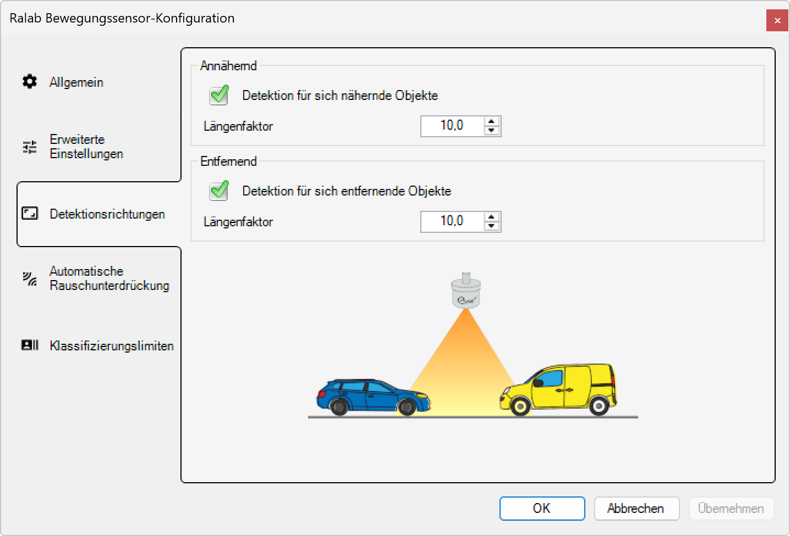

# Detektionsrichtungen

**Detektionsrichtungen - Radar-Bewegungssensor-Konfiguration**

Konfigurieren Sie richtungsabhängige Detektionsparameter für optimale Objekterkennung basierend auf Bewegungsrichtung. Diese Einstellungen ermöglichen die separate Anpassung der Erkennungsempfindlichkeit für sich nähernde und sich entfernende Objekte.

*Der Servicemodus kann unter dem Menüpunkt Anzeige > Service Mode aktiviert werden.*

## Hauptbereiche

### 1. Konfigurationsnavigation

Die linke Navigationsleiste bietet Zugang zu allen Konfigurationsbereichen:
- **Allgemein**: Grundlegende Detektionseinstellungen
- **Erweiterte Einstellungen**: Spezialisierte Parameter für Experten
- **Detektionsrichtungen**: Richtungsabhängige Erkennungseinstellungen (aktuell aktiv)
- **Automatische Rauschunterdrückung**: Störungsfilterung und Umgebungsanpassung
- **Klassifizierungslimiten**: Schwellenwerte für Objektklassifizierung

### 2. Richtungsbasierte Konfiguration

Der Hauptbereich zeigt die richtungsabhängigen Detektionseinstellungen:
- **Annähernd**: Konfiguration für sich nähernde Objekte
- **Entfernend**: Konfiguration für sich entfernende Objekte
- **Visualisierung**: Graphische Darstellung der Detektionsgeometrie

## Annähernde Objekte (Approaching)

### Detektion für sich nähernde Objekte

**Status:** ✅ Aktiviert - "Detektion für sich nähernde Objekte"
- **Funktionsweise**: Erkennung von Objekten, die sich dem Sensor nähern
- **Doppler-Effekt**: Positive Frequenzverschiebung bei Annäherung
- **Anwendung**: Vorwarnfunktion für herannahende Verkehrsteilnehmer
- **Beleuchtungslogik**: Vorzeitige Aktivierung der Beleuchtung

**Längenfaktor:** 10,0
- **Parameter**: Multiplikationsfaktor für die berechnete Objektlänge
- **Standardwert**: 10,0 (Standard-Empfindlichkeit)
- **Anpassungsbereich**: 0,1 - 50,0
- **Einstellung**: Über numerisches Eingabefeld mit Pfeil-Buttons

### Annäherungs-Eigenschaften

**Detektionslogik:**
- **Früherkennung**: Aktivierung bereits bei Annäherung
- **Präventive Beleuchtung**: Beleuchtung vor Erreichen des Zielbereichs
- **Sicherheitsoptimierung**: Verbesserte Sichtbarkeit für herannahende Objekte
- **Energieeffizienz**: Rechtzeitige aber nicht zu frühe Aktivierung

**Längenfaktor-Auswirkungen:**
- **Niedrige Werte (1,0-5,0)**: Konservative Erkennung, später Auslösezeitpunkt
- **Mittlere Werte (5,0-15,0)**: Ausgewogene Früherkennung
- **Hohe Werte (15,0-50,0)**: Sehr frühe Erkennung, große Detektionsdistanz

## Entfernende Objekte (Departing)

### Detektion für sich entfernende Objekte

**Status:** ✅ Aktiviert - "Detektion für sich entfernende Objekte"
- **Funktionsweise**: Erkennung von Objekten, die sich vom Sensor entfernen
- **Doppler-Effekt**: Negative Frequenzverschiebung bei Entfernung
- **Anwendung**: Nachlaufsteuerung für Beleuchtung
- **Beleuchtungslogik**: Verlängerte Beleuchtung nach Durchgang

**Längenfaktor:** 10,0
- **Parameter**: Multiplikationsfaktor für die berechnete Objektlänge
- **Standardwert**: 10,0 (identisch mit Annäherung)
- **Anpassungsbereich**: 0,1 - 50,0
- **Symmetrische Konfiguration**: Gleiche Empfindlichkeit wie Annäherung

### Entfernungs-Eigenschaften

**Detektionslogik:**
- **Nachlaufsteuerung**: Beleuchtung bleibt nach Durchgang aktiv
- **Sicherheitsnachlauf**: Verlängerte Sichtbarkeit bei Objektentfernung
- **Verkehrssicherheit**: Schutz für nachfolgende Verkehrsteilnehmer
- **Adaptive Steuerung**: Objektgrößen-abhängige Nachlaufzeit

**Längenfaktor-Strategien:**
- **Kurzer Nachlauf (1,0-5,0)**: Minimale Nachlaufzeit, energieeffizient
- **Standard-Nachlauf (5,0-15,0)**: Ausgewogene Nachlaufsteuerung
- **Langer Nachlauf (15,0-50,0)**: Verlängerte Beleuchtung für Sicherheit

## Visualisierung der Detektionsgeometrie

### Grafische Darstellung

Die untere Hälfte der Oberfläche zeigt eine schematische Darstellung:

**Radarsensor (Mitte):**
- **Position**: Zentral oben im orangefarbenen Detektionsbereich
- **Symbol**: Radar-Icon
- **Funktion**: 360°-Rundumerfassung mit Richtungserkennung

**Detektionsbereich:**
- **Form**: Kegelförmiger orangefarbener Bereich
- **Abdeckung**: Symmetrische Erfassung in beide Richtungen
- **Reichweite**: Abhängig von Installationshöhe und Konfiguration
- **Winkel**: Typisch 120° horizontaler Erfassungsbereich

**Fahrzeug-Beispiele:**
- **Blaues Auto (links)**: Sich näherndes Objekt (Approaching)
- **Gelber Transporter (rechts)**: Sich entfernendes Objekt (Departing)
- **Bewegungsrichtung**: Durch Fahrzeugausrichtung visualisiert
- **Größenvergleich**: Verschiedene Fahrzeugtypen und -größen

## Richtungsabhängige Konfigurationsstrategien

### Symmetrische Konfiguration (Standard)

**Gleiche Längenfaktoren (10,0 / 10,0):**
- **Anwendung**: Ausgewogene bidirektionale Verkehrserfassung
- **Vorteil**: Konsistente Erkennung in beide Richtungen
- **Beleuchtungsverhalten**: Gleichmäßige Aktivierung und Nachlauf
- **Empfehlung**: Standardkonfiguration für die meisten Anwendungen

### Asymmetrische Konfiguration

**Erhöhte Annäherungsempfindlichkeit:**
- **Konfiguration**: Annähernd 15,0 / Entfernend 5,0
- **Anwendung**: Priorität auf Früherkennung
- **Vorteil**: Maximale Sicherheit durch frühe Beleuchtungsaktivierung
- **Einsatzgebiet**: Gefährliche Kreuzungen, Unfallschwerpunkte

**Verlängerter Nachlauf:**
- **Konfiguration**: Annähernd 5,0 / Entfernend 20,0
- **Anwendung**: Priorität auf verlängerte Nachbeleuchtung
- **Vorteil**: Erhöhte Sicherheit für nachfolgende Verkehrsteilnehmer
- **Einsatzgebiet**: Autobahnausfahrten, Beschleunigungsspuren

**Energieoptimiert:**
- **Konfiguration**: Annähernd 8,0 / Entfernend 3,0
- **Anwendung**: Minimierung der Beleuchtungszeit
- **Vorteil**: Reduzierter Energieverbrauch
- **Einsatzgebiet**: Bereiche mit hohem Verkehrsaufkommen

## Anwendungsszenarien

### Verkehrskreuzungen

**Optimierte Einstellung:**
- **Annähernd**: 12,0 (frühe Erkennung für Sicherheit)
- **Entfernend**: 8,0 (moderater Nachlauf)
- **Beleuchtungslogik**: Kreuzung wird vor Ankunft ausgeleuchtet
- **Sicherheitsvorteil**: Bessere Sichtbarkeit für alle Verkehrsteilnehmer

### Fußgängerüberwege

**Optimierte Einstellung:**
- **Annähernd**: 15,0 (maximale Frühwarnung)
- **Entfernend**: 15,0 (verlängerte Sicherheitsbeleuchtung)
- **Beleuchtungslogik**: Lange Vorwarnzeit und Nachbeleuchtung
- **Sicherheitspriorität**: Schutz der vulnerablen Verkehrsteilnehmer

### Autobahnen

**Optimierte Einstellung:**
- **Annähernd**: 8,0 (moderate Früherkennung)
- **Entfernend**: 5,0 (kurzer Nachlauf)
- **Beleuchtungslogik**: Effiziente Beleuchtung bei hohen Geschwindigkeiten
- **Energieeffizienz**: Minimierte Beleuchtungszeit bei konstanter Verkehrsdichte

### Parkplätze

**Optimierte Einstellung:**
- **Annähernd**: 20,0 (sehr frühe Erkennung)
- **Entfernend**: 10,0 (moderater Nachlauf)
- **Beleuchtungslogik**: Parkplatz wird vor Ankunft ausgeleuchtet
- **Komfortvorteil**: Optimale Sicht beim Parken und Rangieren

## Technische Spezifikationen

### Richtungserkennung

- **Doppler-Genauigkeit**: ±0,1 km/h Geschwindigkeitsmessung
- **Richtungsauflösung**: 360° mit 1° Genauigkeit
- **Reaktionszeit**: <50ms für Richtungswechsel
- **Mindestgeschwindigkeit**: 0,5 km/h für zuverlässige Richtungserkennung

### Längenfaktor-Algorithmus

- **Berechnungsbasis**: Objektlänge × Längenfaktor = Detektionsdistanz
- **Auflösung**: 0,1 Schritte im Einstellbereich
- **Verarbeitungszeit**: <10ms für Längenfaktor-Anpassung
- **Kalibrierungsgenauigkeit**: ±2% der eingestellten Werte

### Geometrische Parameter

- **Erfassungswinkel**: 120° horizontal (±60° von Sensorachse)
- **Vertikaler Winkel**: Abhängig von Installationshöhe
- **Maximale Reichweite**: Längenfaktor × Objektlänge × Installationshöhe
- **Minimale Reichweite**: 2 m (unabhängig von Konfiguration)

## Vorteile der Richtungskonfiguration

### Flexibilität

- **Bidirektionale Optimierung**: Separate Anpassung für beide Bewegungsrichtungen
- **Anwendungsspezifische Konfiguration**: Optimierung für verschiedene Verkehrssituationen
- **Asymmetrische Steuerung**: Verschiedene Prioritäten für Annäherung und Entfernung
- **Skalierbare Parameter**: Weite Anpassungsbereiche für vielfältige Anforderungen

### Sicherheit

- **Frühwarnsystem**: Rechtzeitige Beleuchtungsaktivierung bei Annäherung
- **Nachlaufschutz**: Verlängerte Beleuchtung für nachfolgende Verkehrsteilnehmer
- **Richtungsabhängige Prioritäten**: Fokus auf kritische Bewegungsrichtungen
- **Verkehrssicherheit**: Optimierte Sichtbarkeit für alle Beteiligten

### Effizienz

- **Bedarfsgerechte Beleuchtung**: Aktivierung nur bei tatsächlicher Notwendigkeit
- **Energieoptimierung**: Anpassbare Beleuchtungsdauer je Richtung
- **Intelligente Steuerung**: Objektgrößen-abhängige Detektionsdistanz
- **Wartungsreduzierung**: Minimierte Verschleiß durch optimierte Zyklen

Diese Detektionsrichtungen-Konfiguration ermöglicht eine präzise, richtungsabhängige Anpassung der Radar-Bewegungserkennung für optimale Beleuchtungssteuerung mit erhöhter Sicherheit und Energieeffizienz.

## Untere Bedienelemente

- **OK**: Alle Konfigurationsänderungen bestätigen und anwenden
- **Abbrechen**: Alle Änderungen verwerfen und Konfigurationsdialog schließen
- **Übernehmen**: Änderungen anwenden ohne den Dialog zu schließen
