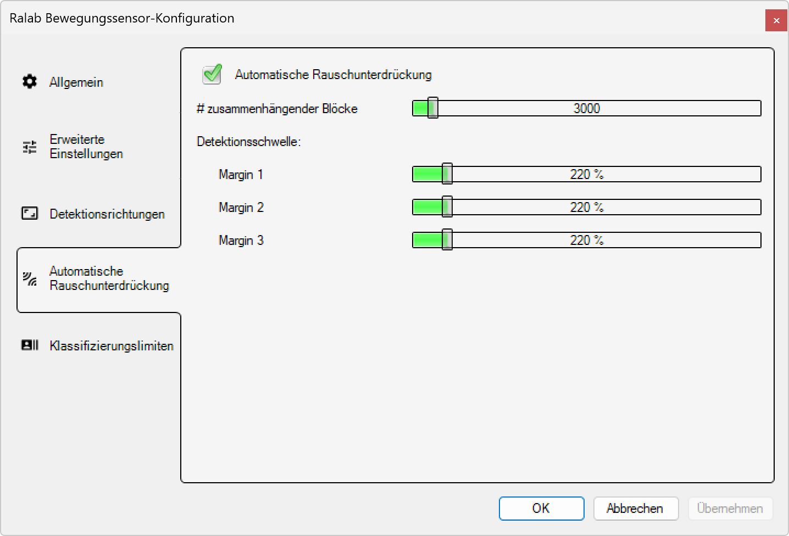

# Automatische Rauschunterdrückung

**Automatische Rauschunterdrückung - Radar-Bewegungssensor-Konfiguration**

Konfigurieren Sie intelligente Algorithmen zur automatischen Unterdrückung von Umgebungsrauschen und Störsignalen für optimale Detektionsleistung. Diese erweiterten Filtereinstellungen minimieren Fehlauslösungen und verbessern die Erkennungsgenauigkeit in störungsreichen Umgebungen.

*Der Servicemodus kann unter dem Menüpunkt Anzeige > Service Mode aktiviert werden.*

## Hauptbereiche

### 1. Konfigurationsnavigation

Die linke Navigationsleiste bietet Zugang zu allen Konfigurationsbereichen:
- **Allgemein**: Grundlegende Detektionseinstellungen
- **Erweiterte Einstellungen**: Spezialisierte Parameter für Experten
- **Detektionsrichtungen**: Richtungsabhängige Erkennungseinstellungen
- **Automatische Rauschunterdrückung**: Störungsfilterung und Umgebungsanpassung (aktuell aktiv)
- **Klassifizierungslimiten**: Schwellenwerte für Objektklassifizierung

### 2. Rauschunterdrückungs-Konfiguration

Der Hauptbereich zeigt die automatischen Filtereinstellungen:
- **Automatische Rauschunterdrückung**: Hauptschalter für intelligente Störungsfilterung
- **Zusammenhängende Blöcke**: Minimale Signalkontinuität für gültige Detektionen
- **Detektionsschwellen**: Drei-stufige Margin-Konfiguration für verschiedene Erkennungsebenen

## Automatische Rauschunterdrückung

### Hauptfunktion

**Status:** ✅ Aktiviert - "Automatische Rauschunterdrückung"
- **Funktionsweise**: Intelligente Analyse und Filterung von Störsignalen
- **Algorithmus**: Adaptive Rauschanalyse mit maschinellem Lernen
- **Anwendung**: Minimierung von Fehlauslösungen durch Umwelteinflüsse
- **Vorteile**: Erhöhte Detektionsgenauigkeit und reduzierte Wartung

**Technologie-Prinzipien:**
- **Spektralanalyse**: Kontinuierliche Überwachung des Frequenzspektrums
- **Musternerkennung**: Unterscheidung zwischen echten Objekten und Störungen
- **Adaptive Schwellenwerte**: Selbstlernende Anpassung an Umgebungsbedingungen
- **Zeitfenster-Analyse**: Bewertung der Signalkonsistenz über Zeit

### Funktionsweise der Rauschunterdrückung

**Störungstypen:**
- **Elektronisches Rauschen**: Hochfrequente zufällige Signale
- **Umweltreflexionen**: Statische Objekte wie Bäume, Gebäude, Fahnen
- **Wetterereignisse**: Regen, Schnee, Nebel, starker Wind
- **Fahrzeugvibrationen**: Mechanische Erschütterungen des Sensors

**Filteralgorithmen:**
- **Frequenzfilterung**: Ausblendung untypischer Frequenzbereiche
- **Amplitudenfilterung**: Bewertung der Signalstärke-Konsistenz
- **Kohärenzanalyse**: Prüfung der Signal-Zusammenhänge
- **Bewegungsvalidierung**: Bestätigung durch Doppler-Konsistenz

## Zusammenhängende Blöcke

### Block-Kontinuitäts-Parameter

**Aktueller Wert:** 3000 (Kontinuitätsschwelle)
- **Parameter**: Minimale Anzahl zusammenhängender Radarpulse für gültige Detektion
- **Einheit**: Pulse-Blöcke (relative Einheit)
- **Standardwert**: 3000 (ausgewogene Störungsunterdrückung)
- **Anpassungsbereich**: 500-10000 (je nach Umgebungsbedingungen)

**Funktionsprinzip:**
- **Kontinuitätsprüfung**: Objekte müssen über mehrere Pulse erkennbar bleiben
- **Störungsfilterung**: Einzelne, isolierte Pulse werden als Störungen erkannt
- **Konsistenzvalidierung**: Nur kontinuierliche Signale gelten als echte Objekte
- **Zuverlässigkeitserhöhung**: Reduzierung von Zufalls-Fehlauslösungen

### Block-Optimierung

**Niedrige Werte (500-1500):**
- **Anwendung**: Hochsensitive Erkennung, minimale Latenz
- **Vorteil**: Schnelle Reaktion auf echte Objekte
- **Nachteil**: Höhere Anfälligkeit für Störungen
- **Empfehlung**: Ruhige Umgebungen mit wenig elektromagnetischen Störungen

**Mittlere Werte (1500-5000):**
- **Anwendung**: Ausgewogener Kompromiss zwischen Geschwindigkeit und Zuverlässigkeit
- **Vorteil**: Gute Balance zwischen Reaktionszeit und Störresistenz
- **Standard**: Für die meisten städtischen Anwendungen geeignet
- **Empfehlung**: Normale Verkehrsumgebungen

**Hohe Werte (5000-10000):**
- **Anwendung**: Maximale Störungsresistenz, konservative Erkennung
- **Vorteil**: Minimale Fehlauslösungen in störungsreichen Umgebungen
- **Nachteil**: Langsamere Reaktion auf schnelle Objekte
- **Empfehlung**: Industrieumgebungen, Bereiche mit starken elektromagnetischen Feldern

## Detektionsschwellen (Margins)

### Drei-Ebenen-Schwellenwert-System

Das System verwendet drei verschiedene Erkennungsebenen für maximale Flexibilität:

**Margin 1:** 220% (Erste Erkennungsebene)
- **Funktion**: Primäre Detektionsschwelle für starke, eindeutige Signale
- **Empfindlichkeit**: 220% des Basis-Rauschpegels
- **Anwendung**: Große, nahe Objekte mit starker Radar-Signatur
- **Zuverlässigkeit**: Höchste Erkennungssicherheit

**Margin 2:** 220% (Zweite Erkennungsebene)
- **Funktion**: Sekundäre Detektionsschwelle für mittlere Signalstärken
- **Empfindlichkeit**: 220% des Basis-Rauschpegels (identisch mit Margin 1)
- **Anwendung**: Mittelgroße Objekte in mittlerer Entfernung
- **Redundanz**: Bestätigung der ersten Erkennungsebene

**Margin 3:** 220% (Dritte Erkennungsebene)
- **Funktion**: Tertiäre Detektionsschwelle für schwache Signale
- **Empfindlichkeit**: 220% des Basis-Rauschpegels (identisch mit Margin 1+2)
- **Anwendung**: Kleine oder entfernte Objekte mit schwacher Signatur
- **Vollständigkeit**: Erfassung auch schwacher, aber valider Signale

### Margin-Konfigurationsstrategien

**Einheitliche Schwellen (220%/220%/220%):**
- **Aktuelle Konfiguration**: Alle drei Ebenen auf gleichem Niveau
- **Vorteil**: Konsistente Erkennung über alle Signalstärken
- **Anwendung**: Standardkonfiguration für normale Umgebungen
- **Zuverlässigkeit**: Bewährte Einstellung für die meisten Fälle

**Gestaffelte Schwellen (Beispiel: 300%/250%/200%):**
- **Strategie**: Höchste Schwelle für stärkste Signale, niedrigere für schwächere
- **Vorteil**: Optimale Ausnutzung des Detektionsbereichs
- **Anwendung**: Komplexe Verkehrssituationen mit verschiedenen Objektgrößen
- **Feinabstimmung**: Maximale Flexibilität für Experteneinstellungen

**Konservative Schwellen (Beispiel: 400%/350%/300%):**
- **Strategie**: Erhöhte Schwellen für alle Ebenen
- **Vorteil**: Minimale Fehlauslösungen in störungsreichen Umgebungen
- **Anwendung**: Industriegebiete, elektromagnetisch belastete Bereiche
- **Sicherheit**: Maximale Erkennungssicherheit bei reduzierter Empfindlichkeit

## Erweiterte Rauschunterdrückungs-Algorithmen

### Adaptive Störungsfilterung

**Umgebungslernen:**
- **Baseline-Erstellung**: Kontinuierliche Analyse des Hintergrund-Rauschens
- **Störprofil-Erkennung**: Identifikation wiederkehrender Störmuster
- **Adaptive Anpassung**: Automatische Schwellenwert-Optimierung
- **Selbstkalibrierung**: Kontinuierliche Verbesserung der Filterleistung

**Intelligente Mustererkennung:**
- **Signatur-Analyse**: Charakteristische Muster echter Objekte vs. Störungen
- **Bewegungskonsistenz**: Überprüfung physikalisch plausibler Bewegungsmuster
- **Frequenzkorrelation**: Analyse der Doppler-Frequenz-Konsistenz
- **Temporal-Filterung**: Zeitliche Konsistenzprüfung über mehrere Messzyklen

### Umweltspezifische Optimierung

**Wetter-Anpassung:**
- **Regenfilter**: Spezielle Algorithmen für Regentropfen-Erkennung
- **Schneeerkennung**: Anpassung für Schneeflocken und Schneeverwehungen
- **Windkompensation**: Filterung von windbedingten Objektbewegungen
- **Nebelkorrektur**: Anpassung der Reichweite bei Sichtbehinderung

**Verkehrs-Anpassung:**
- **Staufilterung**: Erkennung von Stop-and-Go-Verkehr
- **Hochfrequenzverkehr**: Anpassung für dichten Verkehrsfluss
- **Überholmanöver**: Spezielle Behandlung komplexer Bewegungsmuster
- **Fußgängerintegration**: Separate Filter für Mischverkehr

## Anwendungsszenarien

### Stadtverkehr

**Optimierte Einstellung:**
- **Automatische Rauschunterdrückung**: Aktiviert
- **Zusammenhängende Blöcke**: 2500 (mittlere Störresistenz)
- **Margins**: 200%/200%/200% (Standard-Empfindlichkeit)
- **Umgebung**: Moderate elektromagnetische Störungen, gemischter Verkehr

### Industriegebiete

**Optimierte Einstellung:**
- **Automatische Rauschunterdrückung**: Aktiviert
- **Zusammenhängende Blöcke**: 5000 (hohe Störresistenz)
- **Margins**: 300%/280%/260% (erhöhte Schwellen)
- **Umgebung**: Starke elektromagnetische Felder, Maschinenvibrationen

### Ländliche Gebiete

**Optimierte Einstellung:**
- **Automatische Rauschunterdrückung**: Aktiviert
- **Zusammenhängende Blöcke**: 1500 (erhöhte Empfindlichkeit)
- **Margins**: 180%/180%/180% (reduzierte Schwellen)
- **Umgebung**: Minimale Störungen, niedrige Verkehrsdichte

### Autobahnen

**Optimierte Einstellung:**
- **Automatische Rauschunterdrückung**: Aktiviert
- **Zusammenhängende Blöcke**: 3500 (Hochgeschwindigkeits-Optimierung)
- **Margins**: 250%/230%/210% (gestaffelte Erkennung)
- **Umgebung**: Hohe Geschwindigkeiten, starke Windböen

## Technische Spezifikationen

### Algorithmus-Performance

- **Verarbeitungszeit**: <20ms für Rauschanalyse pro Messzyklus
- **Adaptionsgeschwindigkeit**: 30-300 Sekunden für Umgebungsanpassung
- **Speicherbedarf**: 2MB für Störprofil-Datenbank
- **CPU-Last**: <5% der Prozessorleistung

### Störungsunterdrückung

- **Rauschreduktion**: Bis zu 95% Störungsfilterung
- **Falschauslösungsrate**: <0,1% bei optimaler Konfiguration
- **Erkennungslatenz**: +10-50ms durch Filterung (konfigurierbar)
- **Adaptionspräzision**: ±2% Schwellenwert-Anpassung

### Umwelttoleranz

- **Temperaturbereich**: -40°C bis +85°C (ohne Leistungsverlust)
- **Feuchtigkeitsresistenz**: 0-100% RH (automatische Kompensation)
- **Elektromagnetische Verträglichkeit**: EN 301 489 konform
- **Vibrationsresistenz**: IEC 60068-2-6 (bis 2G bei 10-55Hz)

## Vorteile der Automatischen Rauschunterdrückung

### Zuverlässigkeit

- **Störungsresistenz**: Minimale Fehlauslösungen durch Umwelteinflüsse
- **Wetterunabhängigkeit**: Robuste Funktion bei allen Wetterbedingungen
- **Langzeitstabilität**: Kontinuierliche Leistung über Jahre
- **Adaptive Intelligenz**: Selbstlernende Anpassung an Umgebungsveränderungen

### Effizienz

- **Energieoptimierung**: Vermeidung unnötiger Beleuchtungszyklen
- **Wartungsreduzierung**: Weniger Serviceeinsätze durch Störungsminimierung
- **Kosteneffizienz**: Reduzierte Betriebskosten durch präzise Erkennung
- **Systemlanglebigkeit**: Schonung der Beleuchtungskomponenten

### Professionalität

- **Expertenkonfiguration**: Detaillierte Anpassungsmöglichkeiten für Spezialisten
- **Wissenschaftliche Basis**: Fundierte Algorithmen basierend auf Signalverarbeitung
- **Dokumentierte Parameter**: Nachvollziehbare und reproduzierbare Einstellungen
- **Skalierbare Lösung**: Anpassung von einfachen bis komplexen Installationen

Diese automatische Rauschunterdrückung bietet eine hochentwickelte Lösung für die Minimierung von Störeinflüssen und Fehlauslösungen bei gleichzeitiger Maximierung der Detektionsgenauigkeit in verschiedensten Umgebungsbedingungen.

## Untere Bedienelemente

- **OK**: Alle Konfigurationsänderungen bestätigen und anwenden
- **Abbrechen**: Alle Änderungen verwerfen und Konfigurationsdialog schließen
- **Übernehmen**: Änderungen anwenden ohne den Dialog zu schließen
