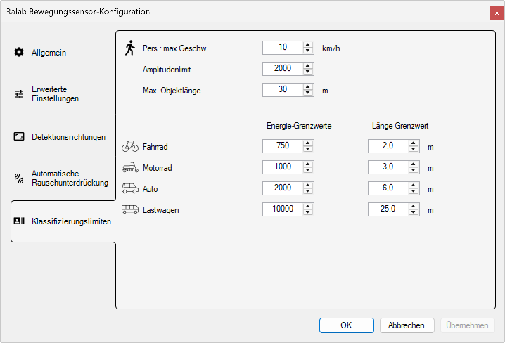

# Klassifizierungslimiten

**Klassifizierungslimiten - Radar-Bewegungssensor-Konfiguration**

Definieren Sie präzise Schwellenwerte und Grenzwerte für die automatische Objektklassifizierung des Radar-Bewegungssensors. Diese detaillierten Parameter ermöglichen die exakte Abgrenzung zwischen verschiedenen Objekttypen basierend auf Geschwindigkeit, Energiesignatur und physikalischen Abmessungen.

*Der Servicemodus kann unter dem Menüpunkt Anzeige > Service Mode aktiviert werden.*

## Hauptbereiche

### 1. Konfigurationsnavigation

Die linke Navigationsleiste bietet Zugang zu allen Konfigurationsbereichen:
- **Allgemein**: Grundlegende Detektionseinstellungen
- **Erweiterte Einstellungen**: Spezialisierte Parameter für Experten
- **Detektionsrichtungen**: Richtungsabhängige Erkennungseinstellungen
- **Automatische Rauschunterdrückung**: Störungsfilterung und Umgebungsanpassung
- **Klassifizierungslimiten**: Schwellenwerte für Objektklassifizierung (aktuell aktiv)

### 2. Klassifizierungs-Parameter

Der Hauptbereich zeigt die detaillierten Schwellenwerte für verschiedene Objekttypen:
- **Personen-Parameter**: Geschwindigkeit, Amplitude und Objektlänge
- **Fahrzeug-Klassifizierung**: Spezifische Grenzwerte für verschiedene Fahrzeugtypen
- **Energie- und Längen-Grenzwerte**: Präzise Abgrenzung zwischen Objektkategorien

## Personen-Klassifizierung

### Grundparameter für Personen

**Fußgänger-Icon:** 👤 Person
- **Kategorisierung**: Fußgänger, Jogger, Personen mit Hilfsmitteln
- **Typische Eigenschaften**: Organische Bewegungsmuster, variable Geschwindigkeiten
- **Klassifizierungsbasid**: Kombination aus Geschwindigkeit, Größe und Bewegungscharakteristik

**Pers.: max Geschw.:** 10 km/h
- **Parameter**: Maximale Geschwindigkeit für Personen-Klassifizierung
- **Standardwert**: 10 km/h (typische Jogging-Geschwindigkeit)
- **Anwendung**: Objekte über diesem Wert werden als Fahrzeuge klassifiziert
- **Anpassungsbereich**: 5-20 km/h (je nach Anwendungsgebiet)

**Amplitudenlimit:** 2000
- **Parameter**: Maximaler Radar-Querschnitt für Personen-Klassifizierung
- **Einheit**: Relative Amplituden-Einheiten
- **Standardwert**: 2000 (mittlere Personengröße)
- **Abgrenzung**: Objekte mit höherer Amplitude werden als Fahrzeuge eingestuft

**Max. Objektlänge:** 30 m
- **Parameter**: Maximale berechnete Objektlänge für Personen
- **Einheit**: Meter
- **Standardwert**: 30 m (großzügige Obergrenze)
- **Sicherheitsmargin**: Berücksichtigt Messungenauigkeiten und Gruppenbewegungen

## Fahrzeug-Klassifizierung

### Fahrrad-Parameter

**Fahrrad-Icon:** 🚲 Fahrrad
- **Kategorisierung**: Fahrräder, E-Bikes, Tretroller
- **Typische Eigenschaften**: Mittlere Geschwindigkeit, kompakte Radar-Signatur
- **Unterscheidung**: Größer als Personen, kleiner als Motorräder

**Energie-Grenzwerte:** 750
- **Parameter**: Radar-Energieschwelle für Fahrrad-Klassifizierung
- **Standardwert**: 750 (zwischen Person und Motorrad)
- **Abgrenzung**: Trennung von Fußgängern und motorisierten Fahrzeugen

**Länge Grenzwert:** 2,0 m
- **Parameter**: Maximale Objektlänge für Fahrrad-Klassifizierung
- **Standardwert**: 2,0 m (inklusive Anhänger)
- **Realitätsbezug**: Berücksichtigt auch Lastenfahrräder und Tandems

### Motorrad-Parameter

**Motorrad-Icon:** 🏍️ Motorrad
- **Kategorisierung**: Motorräder, Roller, Mopeds
- **Typische Eigenschaften**: Höhere Geschwindigkeit, metallische Reflexion
- **Klassifizierungsmerkmale**: Kompakt aber energiereich

**Energie-Grenzwerte:** 1000
- **Parameter**: Radar-Energieschwelle für Motorrad-Klassifizierung
- **Standardwert**: 1000 (zwischen Fahrrad und Auto)
- **Metallreflexion**: Berücksichtigt die höhere Radar-Reflexion von Metall

**Länge Grenzwert:** 3,0 m
- **Parameter**: Maximale Objektlänge für Motorrad-Klassifizierung
- **Standardwert**: 3,0 m (inklusive Touring-Motorräder)
- **Flexibilität**: Abdeckung verschiedener Motorradtypen

### Auto-Parameter

**Auto-Icon:** 🚗 Auto
- **Kategorisierung**: PKW, SUV, kleine Transporter
- **Typische Eigenschaften**: Standard-Fahrzeuggröße, moderate Geschwindigkeiten
- **Referenzklasse**: Häufigster Fahrzeugtyp im Verkehr

**Energie-Grenzwerte:** 2000
- **Parameter**: Radar-Energieschwelle für Auto-Klassifizierung
- **Standardwert**: 2000 (Standard-PKW-Signatur)
- **Fahrzeugvielfalt**: Abdeckung von Kleinwagen bis SUV

**Länge Grenzwert:** 6,0 m
- **Parameter**: Maximale Objektlänge für Auto-Klassifizierung
- **Standardwert**: 6,0 m (inklusive größerer SUV und Kombis)
- **Praktische Grenze**: Trennung von LKW und großen Transportern

### Lastwagen-Parameter

**Lastwagen-Icon:** 🚛 Lastwagen
- **Kategorisierung**: LKW, Busse, große Transporter
- **Typische Eigenschaften**: Große Radar-Signatur, längere Objekte
- **Verkehrswichtigkeit**: Besondere Behandlung für Schwerlastverkehr

**Energie-Grenzwerte:** 10000
- **Parameter**: Radar-Energieschwelle für Lastwagen-Klassifizierung
- **Standardwert**: 10000 (große Fahrzeuge)
- **Metallmasse**: Berücksichtigt die hohe Radar-Reflexion großer Metallkörper

**Länge Grenzwert:** 25,0 m
- **Parameter**: Maximale Objektlänge für Lastwagen-Klassifizierung
- **Standardwert**: 25,0 m (inklusive Sattelzüge und Busse)
- **Realitätsabdeckung**: Berücksichtigt auch Fahrzeugkombinationen

## Klassifizierungslogik

### Entscheidungsalgorithmus

**Hierarchische Klassifizierung:**
1. **Geschwindigkeitscheck**: Ist v ≤ 10 km/h? → Potenzielle Person
2. **Amplitudencheck**: Ist A ≤ 2000? → Bestätigung Person
3. **Längencheck**: Ist L ≤ 30 m? → Finale Person-Klassifizierung
4. **Fahrzeug-Hierarchie**: Bei Nicht-Person → Fahrrad → Motorrad → Auto → Lastwagen

**Kombinierte Parameter-Bewertung:**
- **UND-Verknüpfung**: Alle Parameter müssen für eine Klassifizierung erfüllt sein
- **Prioritätshierarchie**: Reihenfolge der Klassifizierungsprüfung
- **Fallback-Mechanismus**: "Undefiniert" bei nicht eindeutiger Zuordnung
- **Konsistenzprüfung**: Validierung über mehrere Messzyklen

### Grenzwert-Optimierung

**Überlappungsfreie Bereiche:**
- **Person**: v ≤ 10 km/h, A ≤ 2000, L ≤ 30 m
- **Fahrrad**: v > 10 km/h, E ≤ 750, L ≤ 2,0 m
- **Motorrad**: v > 10 km/h, E ≤ 1000, L ≤ 3,0 m
- **Auto**: v > 10 km/h, E ≤ 2000, L ≤ 6,0 m
- **Lastwagen**: v > 10 km/h, E ≤ 10000, L ≤ 25,0 m

**Sicherheitsmargins:**
- **Konservative Grenzen**: Bewusst großzügige Obergrenzen
- **Überlappungsschutz**: Eindeutige Abgrenzung zwischen Kategorien
- **Messungenauigkeiten**: Berücksichtigung von Radar-Toleranzen
- **Realitätsanpassung**: Anpassung an tatsächliche Verkehrssituationen

## Anwendungsanpassungen

### Stadtverkehr-Optimierung

**Angepasste Grenzwerte:**
- **Person max Geschw.**: 8 km/h (langsamerer Stadtverkehr)
- **Fahrrad Energie**: 600 (E-Bike-Anpassung)
- **Auto Länge**: 5,5 m (kompaktere Stadtfahrzeuge)
- **Optimierung**: Fokus auf Fußgänger und Radfahrer

### Autobahn-Optimierung

**Angepasste Grenzwerte:**
- **Person max Geschw.**: 15 km/h (Notfallsituationen)
- **Motorrad Energie**: 1200 (Touring-Bikes)
- **Auto Energie**: 2500 (SUV-Anteil)
- **Optimierung**: Fokus auf schnelle Fahrzeuge

### Industriegebiet-Optimierung

**Angepasste Grenzwerte:**
- **Lastwagen Energie**: 15000 (Schwermaschinentransporte)
- **Lastwagen Länge**: 30,0 m (Sondertransporte)
- **Auto Energie**: 2500 (Lieferfahrzeuge)
- **Optimierung**: Fokus auf Nutzfahrzeuge

## Erweiterte Klassifizierungsfeatures

### Adaptive Schwellenwerte

**Machine Learning Integration:**
- **Historische Datenanalyse**: Optimierung basierend auf lokalen Verkehrsmustern
- **Automatische Anpassung**: Selbstlernende Grenzwert-Optimierung
- **Saisonale Anpassungen**: Berücksichtigung jahreszeitlicher Verkehrsveränderungen
- **Verkehrsfluss-Analyse**: Anpassung an Stoßzeiten und ruhige Perioden

**Umgebungsadaption:**
- **Wetterkompensation**: Anpassung der Grenzwerte bei verschiedenen Wetterbedingungen
- **Tageszeit-Variation**: Unterschiedliche Parameter für Tag- und Nachtverkehr
- **Ereignisanpassung**: Spezielle Grenzwerte für Veranstaltungen oder Baustellen
- **Langzeitoptimierung**: Kontinuierliche Verbesserung über Monate

### Spezial-Klassifizierungen

**Gruppen-Erkennung:**
- **Personengruppen**: Erkennung von Menschenansammlungen
- **Fahrzeugkonvois**: Behandlung von Fahrzeugzügen
- **Mischverkehr**: Komplexe Situationen mit verschiedenen Objekttypen
- **Überholmanöver**: Dynamische Klassifizierung bei Spurwechseln

## Technische Spezifikationen

### Klassifizierungsgenauigkeit

- **Personen**: >95% korrekte Klassifizierung
- **Fahrräder**: >90% Unterscheidung von Personen und Motorrädern
- **Motorräder**: >85% Abgrenzung zu Fahrrädern und Autos
- **Autos**: >95% Standard-Fahrzeugerkennung
- **Lastwagen**: >90% Großfahrzeug-Klassifizierung

### Parameter-Auflösung

- **Geschwindigkeit**: 0,1 km/h Schritte
- **Energie**: 1 Einheit Schritte (0-65535)
- **Länge**: 0,1 m Schritte
- **Verarbeitungszeit**: <100ms für vollständige Klassifizierung

### Kalibrierungsgenauigkeit

- **Schwellenwert-Präzision**: ±1% der eingestellten Werte
- **Reproduzierbarkeit**: <2% Abweichung bei identischen Bedingungen
- **Langzeitstabilität**: <5% Drift über 12 Monate
- **Temperaturstabilität**: <1% Abweichung bei -40°C bis +85°C

## Vorteile der Klassifizierungslimiten

### Präzision

- **Exakte Objekttrennung**: Klare Abgrenzung zwischen verschiedenen Verkehrsteilnehmern
- **Anpassbare Schwellenwerte**: Optimierung für spezifische Verkehrssituationen
- **Wissenschaftliche Basis**: Fundierte Parameter basierend auf Verkehrsanalysen
- **Validierte Grenzwerte**: Bewährte Einstellungen für verschiedene Anwendungen

### Flexibilität

- **Umgebungsanpassung**: Optimierung für verschiedene Verkehrstypen
- **Anwendungsspezifische Konfiguration**: Maßgeschneiderte Einstellungen
- **Skalierbare Parameter**: Von konservativen bis aggressiven Einstellungen
- **Zukunftssicherheit**: Erweiterbar für neue Fahrzeugtypen

### Intelligenz

- **Multi-Parameter-Klassifizierung**: Kombination verschiedener Erkennungsmerkmale
- **Hierarchische Entscheidungsfindung**: Strukturierte Klassifizierungslogik
- **Fehlerminimierung**: Robuste Algorithmen gegen Fehlklassifizierungen
- **Adaptive Systeme**: Selbstlernende Optimierung der Grenzwerte

Diese Klassifizierungslimiten bieten eine hochpräzise und anpassbare Grundlage für die automatische Objekterkennung mit optimalen Schwellenwerten für verschiedenste Verkehrs- und Anwendungsszenarien.

## Untere Bedienelemente

- **OK**: Alle Konfigurationsänderungen bestätigen und anwenden
- **Abbrechen**: Alle Änderungen verwerfen und Konfigurationsdialog schließen
- **Übernehmen**: Änderungen anwenden ohne den Dialog zu schließen
