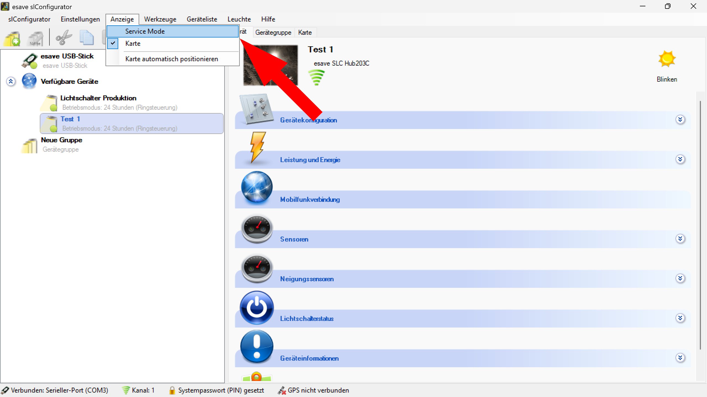
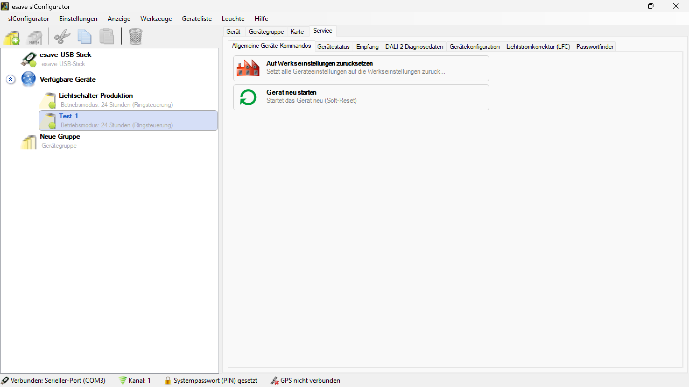

# Service Modus
  
*Der Servicemodus kann unter dem Menüpunkt Anzeige > Service Mode aktiviert werden.* 

  
*Es erscheint ein neuer Reiter **Service** rechts neben dem Reiter Karte.* 

> # ℹ  
>Der Servicemodus enthält erweiterte Einstellungen, die den Betrieb der Leuchte beeinflussen.