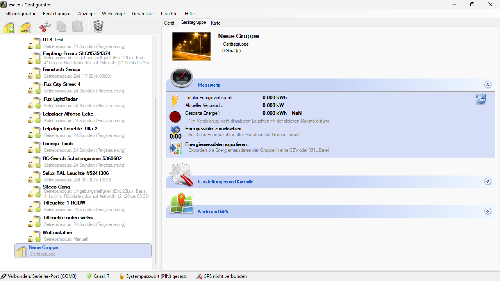
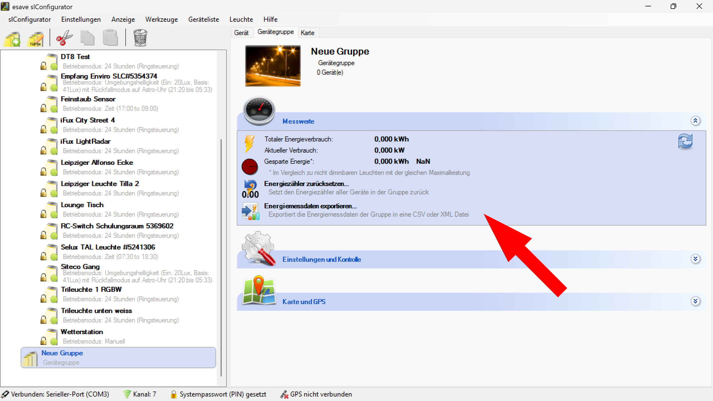
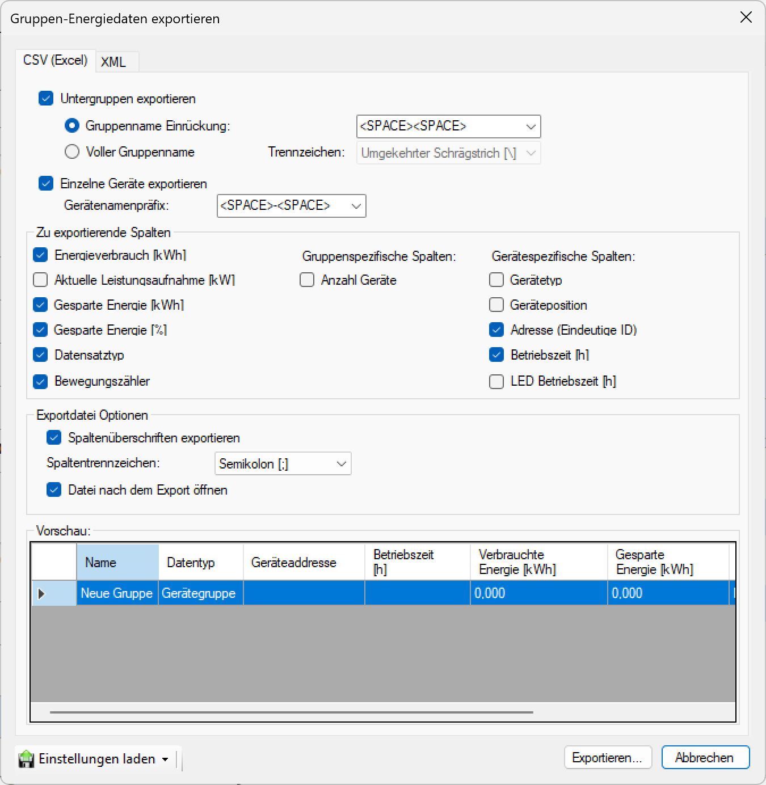

# Datenexport
  
*Alle Geräte- und Gerätegruppendaten können über die Exportfunktion im CSV- (Excel) und XML-Format exportiert werden.*

> # ℹ  
>So können Sie beispielsweise auslesen, wie lange die Leuchten in Betrieb waren oder wie viele Bewegungen gezählt wurden. Zusätzlich ist es möglich, den Energieverbrauch in Wattstunden (Wh) sowie die eingesparte Energie anzuzeigen.  

*Um Daten zu exportieren, wählen Sie eine Gruppe und klicken Sie im Bereich **Messwerte** auf `Daten exportieren`*

*Es erscheint ein Fenster Gruppenen-Ergiedaten exportieren mit verschiedenen Exportoptionen.*  

Das Tabellenformat wird im Vorschaubereich darunter angezeigt. Wählen Sie die gewünschten Optionen und klicken Sie unten rechts auf Exportieren... 